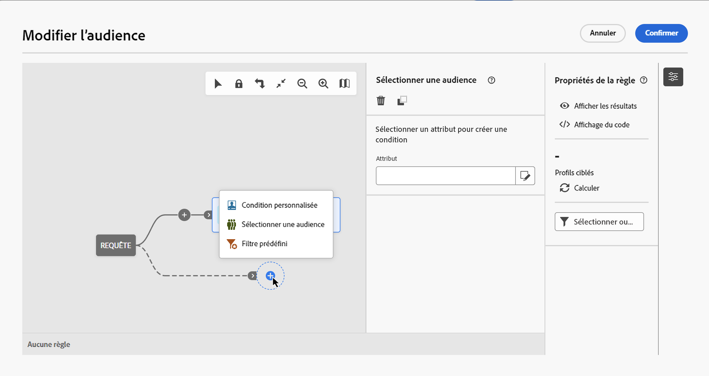
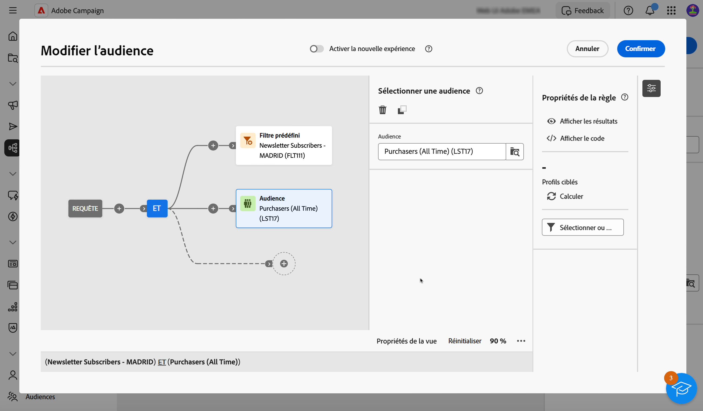

# Créer votre première requête {#build-query}

Pour commencer à créer une requête, accédez au concepteur de requête à partir de l’emplacement de votre choix, en fonction de l’action que vous souhaitez effectuer. Le concepteur de requête s’ouvre et affiche une zone de travail vierge. Cliquez sur le bouton **+** pour configurer le premier nœud de votre requête.

Vous pouvez ajouter deux types d’éléments :

* Les **composants de filtrage** (condition personnalisée, audience sélectionnée, filtre prédéfini) vous permettent de créer vos propres règles, de sélectionner une audience ou un filtre prédéfini pour affiner votre requête. [Découvrez comment utiliser les composants de filtrage](#filtering).

  Exemple :

  *Personnes destinataires qui se sont abonnées à la newsletter « Sports »*. *Personnes destinataires résidant à New York*, *Personnes destinataires résidant à San Francisco*.

* Les **opérateurs de groupe** (ET, OU, SAUF) vous permettent de regrouper les composants de filtrage dans le diagramme en fonction de vos besoins. [Découvrez comment utiliser les opérateurs](#filtering).

  Exemple :

  *Personnes destinataires qui se sont abonnées à la newsletter « Sports »**ET**qui vivent à New York **OU**à San Francisco*.

## Ajouter des composants de filtrage {#filtering}

Les composants de filtrage vous permettent d’affiner votre requête à l’aide des éléments suivants :

* **Conditions personnalisées** : filtrez votre requête en créant votre propre condition avec des attributs de la base de données et des expressions avancées.
* **Audiences** : filtrez votre requête à l’aide d’une audience existante.
* **Filtre prédéfini** : filtrez votre requête à l’aide de filtres prédéfinis existants.

### Configurer une condition personnalisée

>[!CONTEXTUALHELP]
>id="acw_orchestration_querymodeler_customcondition"
>title="Condition personnalisée"
>abstract="Condition personnalisée"

Pour filtrer votre requête à l’aide d’une condition personnalisée, procédez comme suit :

1. Cliquez sur le bouton **+** sur le nœud souhaité, puis sélectionnez **[!UICONTROL Condition personnalisée]**. Le volet des propriétés de condition personnalisée s’affiche sur le côté droit.

1. Dans le champ **Attribut**, sélectionnez l’attribut de la base de données que vous souhaitez utiliser pour créer votre condition. La liste des attributs comprend tous les attributs de votre base de données Campaign, y compris les attributs liés à votre table.

   

   >[!NOTE]
   >
   >Le bouton Modifier une expression permet d’utiliser l’éditeur d’expressions de Campaign Web pour définir manuellement une expression à l’aide de champs de la base de données et de fonctions d’assistance.

1. Sélectionnez l’opérateur à appliquer dans la liste déroulante. Différents opérateurs sont disponibles. Notez que les opérateurs disponibles dans la liste déroulante dépendent du type de données de l’attribut.

   +++Liste des opérateurs disponibles

   | Opérateur | Intérêt | Exemple |
   |  ---  |  ---  |  ---  |
   | Égal à | Obtenir un résultat rigoureusement identique à ce qui est entré dans la seconde colonne Valeur. | Nom (@lastName) égal à « Jones ». Ici ne seront renvoyées que les personnes destinataires dont le nom est « Jones ». |
   | Différent de | Obtenir un résultat différent de la valeur renseignée. | Langue (@language) différent de « Anglais ». |
   | Supérieur à | Obtenir un résultat supérieur à la valeur indiquée. | Âge (@age) supérieur à « 50 »</strong> pour renvoyer toutes les valeurs supérieures à « 50 », donc « 51 », « 52 », etc. |
   | Inférieur à | Obtenir un résultat inférieur à la valeur indiquée. | Date de création (@created) strictement plus tôt que « DaysAgo(100) »</strong> afin de retrouver toutes les personnes destinataires créées dans la base il y a moins de 100 jours. |
   | Supérieur ou égal à | Obtenir un résultat rigoureusement égal ou supérieur à la valeur renseignée. | Âge (@age) supérieur ou égal à « 30 »</strong>, afin de retrouver les personnes destinataires dont l’âge est de 30 ans et plus. |
   | Inférieur ou égal à | Obtenir un résultat rigoureusement égal ou inférieur à la valeur renseignée. | Âge (@age) inférieur ou égal à « 60 »</strong>, afin de retrouver les personnes destinataires dont l’âge est de 60 ans et moins. |
   | Compris dans | Obtenir les résultats compris dans les valeurs indiquées. Ces valeurs doivent toujours être séparées par une virgule. | Date de naissance (@birthDate) est compris dans « 12/10/1979,12/10/1984 ». Les personnes destinataires nées entre ces dates sont alors renvoyées. |
   | Pas dans | Le principe est le même qu’avec l’opérateur Compris dans. Ici, il s’agit d’exclure les personnes destinataires en fonction des valeurs indiquées. | La date de naissance (@birthDate) n’est pas incluse dans 12/10/1979,12/10/1984. Contrairement à l’exemple précédent, les personnes destinataires nées entre ces dates ne seront pas renvoyées. |
   | Est vide | Dans ce cas, le résultat recherché correspond à une valeur vide dans la seconde colonne Valeur. | Mobile (@mobilePhone) est vide afin de retrouver toutes les personnes destinataires ne disposant pas d’un numéro de téléphone mobile. |
   | N’est pas vide | Le principe est contraire à l’opérateur Est vide. Il n’est pas nécessaire de saisir de données dans la seconde colonne Valeur. | E-mail (@email) n’est pas vide. |
   | Commence par | Obtenir des résultats commençant par la valeur indiquée. | N° de compte (@account) commence par « 32010 ». |
   | Ne commence pas par | Obtenir des résultats qui ne commencent pas par la valeur renseignée. | N° de compte (@account) ne commence pas par « 20 ». |
   | Contient | Obtenir un résultat comportant au moins la valeur qui est renseignée. | Domaine d’e-mail (@domain) contient « mail »</strong>. Ici, tous les noms de domaine comportant la valeur « mail » seront renvoyés en résultat. Par conséquent, le nom de domaine « gmail.com » fera partie des résultats renvoyés. |
   | Ne contient pas | Ne pas obtenir de résultats contenant au moins la valeur renseignée. | Domaine d’e-mail (@domain) ne contient pas « vo »</strong>. Dans ce cas, les noms de domaine contenant la valeur « vo » ne seront pas renvoyés. Ainsi, le nom de domaine « voila.fr » ne sera pas renvoyé. |
   | Comme | « Comme » est quasiment identique à l’opérateur « Contient ». Il permet d’insérer un caractère de substitution « % » dans la valeur recherchée. | Nom (@lastName) comme « Jon%s ». Ici, le caractère de substitution sert de joker afin de retrouver le nom Jones dans le cas très hypothétique où l’opérateur aurait oublié quelle est la lettre située entre les lettre « n » et « s ». |
   | Pas comme | « Comme » est quasiment identique à l’opérateur « Contient ». Il permet d’insérer un caractère de substitution « % » dans la valeur recherchée. | Nom (@lastName) pas comme « Smi%h ». Ici, les personnes destinataires dont le nom est « Smi%h » ne seront pas renvoyées. |

+++

1. Dans le champ **Valeur**, définissez la valeur attendue. Vous pouvez également utiliser l’éditeur d’expression de Campaign Web pour définir manuellement une expression à l’aide de champs de la base de données et de fonctions d’assistance. Pour ce faire, cliquez sur le bouton **Modifier une expression**.

   *Exemple de requête renvoyant tous les profils âgés de 21 ans ou plus :*

   

**Conditions personnalisées sur les tables distantes (liens 1-1 et 1-N)**

Les conditions personnalisées vous permettent d’interroger des tables distantes liées à la table Personnes destinataires.

Pour un **lien 1-1** avec une autre ressource de la base de données, sélectionnez directement une valeur de la table ciblée.

+++Exemple de requête

Ici, la requête cible les personnes destinataires dont le pays ou la région est inclus(e) dans des valeurs données (uk et us).

+++

Pour un **lien 1-N** avec une autre ressource de la base de données, vous pouvez définir des sous-conditions sur les champs de cette seconde ressource.

Vous pouvez par exemple sélectionner l’opérateur Existe sur les achats de profils pour cibler tous les profils pour lesquels des achats existent. Une fois cette opération terminée, ajoutez une condition personnalisée sur la transition sortante et créez un filtre en fonction de vos besoins.

+++Exemple de requête

Ici, la requête cible les personnes destinataires ayant effectué des achats liés au produit BrewMaster, pour un montant total d’au moins 100 $.

+++

### Sélectionner une audience

>[!CONTEXTUALHELP]
>id="acw_orchestration_querymodeler_selectaudience"
>title="Sélectionner une audience"
>abstract="Sélectionner une audience"

Pour filtrer votre requête à l’aide d’une audience existante, procédez comme suit :

1. Cliquez sur le bouton **+** sur le nœud souhaité, puis choisissez **[!UICONTROL Sélectionner une audience]**.

1. Le volet de propriétés **Sélectionner une audience** s’ouvre sur le côté droit. Sélectionnez l’audience à utiliser pour filtrer votre requête.

   *Exemple de requête renvoyant tous les profils appartenant à l’audience « Festivaliers » :*

   

### Utiliser un filtre prédéfini

>[!CONTEXTUALHELP]
>id="acw_orchestration_querymodeler_predefinedfilter"
>title="Filtre prédéfini"
>abstract="Filtre prédéfini"

Pour filtrer votre requête à l’aide d’un filtre prédéfini, procédez comme suit :

1. Cliquez sur le bouton **+** sur le nœud souhaité, puis sélectionnez **[!UICONTROL Filtre prédéfini]**.

1. Le volet Propriétés **Filtre prédéfini** s’ouvre sur le côté droit. Sélectionnez un filtre prédéfini dans la liste des filtres personnalisés ou dans les favoris.

   *Exemple de requête renvoyant tous les profils correspondant au filtre prédéfini « Clients inactifs » :*

   

## Combiner des composants de filtrage avec des opérateurs {#operators}

>[!CONTEXTUALHELP]
>id="acw_orchestration_querymodeler_group"
>title="Groupe"
>abstract="Groupe"

Chaque fois que vous ajoutez un nouveau composant de filtrage à votre requête, il est automatiquement lié à l’autre composant par un opérateur ET. Cela signifie que les résultats des deux composants de filtrage sont combinés dans les résultats de la requête.

Dans cet exemple, nous avons ajouté de nouveaux composants de filtrage de type audience sur la seconde transition. Le composant est lié à la condition de type de filtre prédéfinie avec un opérateur ET, ce qui signifie que les résultats de la requête incluent les personnes destinataires ciblées par le filtre prédéfini « Madrilènes » ET appartenant à l’audience « Chasseurs de remises ».

Pour changer l’opérateur utilisé pour relier les conditions de filtrage, cliquez dessus et sélectionnez-en un autre dans le volet Groupe qui s’ouvre sur la droite.

Les opérateurs disponibles sont les suivants :

* **ET (Intersection)** : combine les résultats correspondant à tous les composants de filtrage dans les transitions sortantes.
* **OU (Union)** : inclut des résultats correspondant à au moins un des composants de filtrage dans les transitions sortantes.
* **SAUF (Exclusion)** : exclut les résultats correspondant à tous les composants de filtrage dans la transition sortante.

## Vérifier et valider votre requête

>[!CONTEXTUALHELP]
>id="acw_orchestration_querymodeler_ruleproperties"
>title="Propriétés de la règle"
>abstract="Propriétés de la règle"

Une fois que vous avez créé votre requête dans la zone de travail, vous pouvez la vérifier à l’aide du volet **Propriétés des règles** situé sur le côté droit. Les opérations disponibles sont les suivantes :

* **Afficher les résultats** : affiche les données issues de votre requête.
* **Affichage du code** : affiche une version basée sur le code de la requête en SQL.
* **Calculer** : met à jour et affiche le nombre d’enregistrements ciblés par votre requête.
* **Sélectionner ou enregistrer un filtre** : choisissez un filtre prédéfini existant à utiliser dans la zone de travail ou enregistrez votre requête en tant que filtre prédéfini pour une réutilisation ultérieure. [Découvrez comment utiliser des filtres prédéfinis](../get-started/predefined-filters.md).

  >[!IMPORTANT]
  >
  >Sélectionnez un filtre prédéfini dans le volet Propriétés de la règle pour remplacer la requête qui a été créée dans la zone de travail par le filtre sélectionné.
