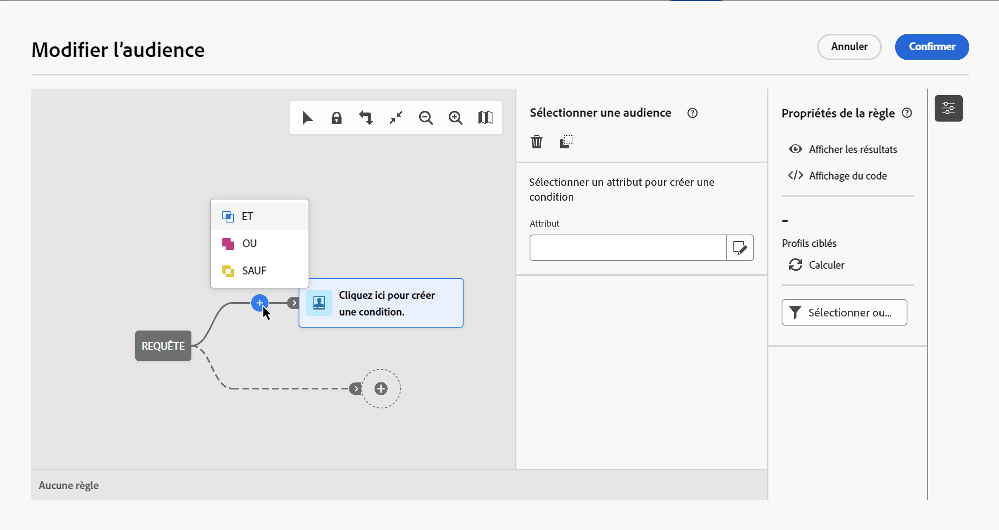
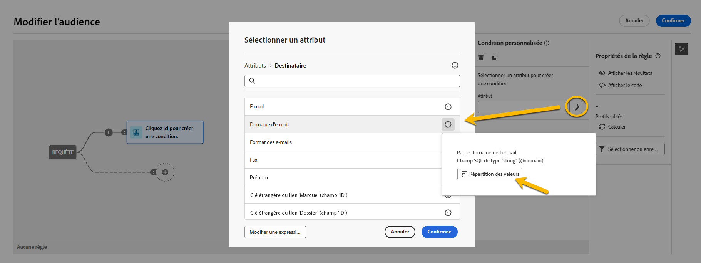
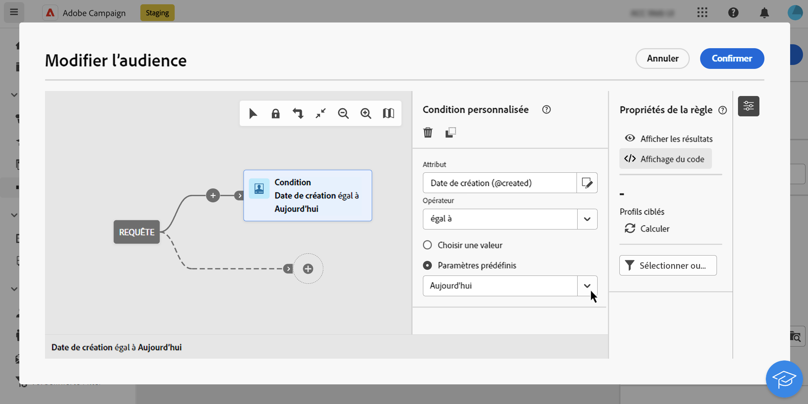

# Créer votre première requête {#build-query}

Pour commencer à créer une requête, accédez au concepteur de requête à partir de l’emplacement de votre choix, en fonction de l’action que vous souhaitez effectuer. Query Modeler s’ouvre avec une zone de travail vide. Cliquez sur le bouton **+** pour configurer le premier nœud de votre requête.

Vous pouvez ajouter deux types d’éléments :

* **Composants de filtrage** (condition personnalisée, Sélectionner une audience, filtre prédéfini) vous permettent de créer vos propres règles, de sélectionner une audience ou d’utiliser un filtre prédéfini pour affiner votre requête. Ils sont ajoutés au début de votre requête et sur les transitions en pointillés. [Découvrir comment utiliser les composants de filtrage](#filtering)

  Exemple : *Destinataires abonnés à la newsletter &#39;Sports&#39;*, *Destinataires résidant à New York*, *Destinataires résidant à San Francisco*

  {zoomable="yes"}

* **Les opérateurs de groupe** (AND, OR, EXCEPT) permettent de regrouper des composants de filtrage dans le diagramme. Ils sont ajoutés sur les transitions existantes avant un composant de filtrage. [Découvrir comment utiliser les opérateurs](#filtering)

  Example : *personnes destinataires qui se sont abonnées à la newsletter « Sports »**ET**qui vivent à New York **OU**à San Francisco*.

  {zoomable="yes"}

## Répartition des valeurs dans une requête {#distribution-values-query}

La répartition des valeurs affiche le pourcentage de chaque valeur d’un champ dans une table, en fonction des paramètres de requête actuels. Connaître la distribution des valeurs dans une requête permet d’affiner la segmentation.

Pour accéder à cette option, dans votre requête, cliquez sur le bouton de sélection d’attribut comme illustré ci-dessous. Cliquez ensuite sur l’icône **[!UICONTROL Informations]** en regard de l’attribut sélectionné. Vous pouvez accéder au bouton **[!UICONTROL Répartition des valeurs]**.

{zoomable="yes"}

>[!NOTE]
>
>* Pour les champs comportant de nombreuses valeurs, seules les vingt premières valeurs sont affichées. Dans ce cas, une notification **[!UICONTROL Chargement partiel]** vous avertit.
>* L’option **[!UICONTROL Répartition des valeurs]** est accessible dans chaque sélecteur d’attributs. [Découvrir comment sélectionner des attributs](../get-started/attributes.md)
>* Vous pouvez ajouter des conditions sur les résultats à l’aide des **[!Afiltres avancés]**. [En savoir plus ici](../get-started/work-with-folders.md#filter-the-values).

## Ajouter des composants de filtrage {#filtering}

Les composants de filtrage vous permettent d’affiner votre requête à l’aide des éléments suivants :

* **[Conditions personnalisées](#custom-condition)** : filtrez votre requête en créant votre propre condition avec des attributs de la base de données et des expressions avancées.
* **[Audiences](#audiences)** : filtrez votre requête à l’aide d’une audience existante.
* **[Filtre prédéfini](#predefined-filters)** : filtrez votre requête à l’aide de filtres prédéfinis existants.

### Configurer une condition personnalisée {#custom-condition}

>[!CONTEXTUALHELP]
>id="acw_orchestration_querymodeler_customcondition"
>title="Condition personnalisée"
>abstract="Les conditions personnalisées sont des composants de filtrage qui vous permettent de filtrer votre requête en créant votre propre condition avec des attributs de la base de données et des expressions avancées."

Pour filtrer votre requête à l’aide d’une condition personnalisée, procédez comme suit :

1. Cliquez sur le bouton **+** sur le nœud souhaité, puis sélectionnez **[!UICONTROL Condition personnalisée]**. Le volet des propriétés de condition personnalisée s’ouvre sur le côté droit.

1. Dans le champ **Attribut**, sélectionnez l’attribut de la base de données que vous souhaitez utiliser pour créer votre condition. La liste des attributs comprend tous les attributs de votre base de données Campaign, y compris les attributs des tables liées. [Découvrir comment sélectionner des attributs et les ajouter aux favoris](../get-started/attributes.md)

   {zoomable="yes"}

   >[!NOTE]
   >
   >Le bouton **Modifier l&#39;expression** permet d&#39;utiliser l&#39;éditeur d&#39;expression Web de Campaign pour définir manuellement une expression à l&#39;aide des champs de la base de données et des fonctions d&#39;assistance. [Découvrez comment modifier des expressions](expression-editor.md)

1. Sélectionnez l’opérateur à appliquer dans la liste déroulante. Différents opérateurs sont disponibles. Notez que les opérateurs disponibles dans la liste déroulante dépendent du type de données de l’attribut.

   +++Liste des opérateurs disponibles

   | Opérateur | Intérêt | Exemple |
   |---|---|---|
   | Égal à | Obtenir un résultat rigoureusement identique à ce qui est entré dans la seconde colonne Valeur. | Le nom (@lastName) égal à « Jones » renvoie uniquement les destinataires dont le nom est Jones. |
   | Différent de | Obtenir un résultat différent de la valeur renseignée. | Langue (@language) différente de &#39;Anglais&#39;. |
   | Supérieur à | Obtenir un résultat supérieur à la valeur indiquée. | L’âge (@age) supérieur à 50 renvoie toutes les valeurs supérieures à « 50 », telles que « 51 » et « 52 ». |
   | Inférieur à | Obtenir un résultat inférieur à la valeur indiquée. | La date de création (@created) avant &#39;DaysAgo(100)&#39; renvoie tous les destinataires créés il y a moins de 100 jours. |
   | Supérieur ou égal à | Obtenir un résultat rigoureusement égal ou supérieur à la valeur renseignée. | L’âge (@age) supérieur ou égal à « 30 » renvoie tous les destinataires âgés de 30 ans ou plus. |
   | Inférieur ou égal à | Obtenir un résultat rigoureusement égal ou inférieur à la valeur renseignée. | L’âge (@age) inférieur ou égal à « 60 » renvoie tous les destinataires âgés de 60 ans ou moins. |
   | Compris dans | Obtenir les résultats compris dans les valeurs indiquées. Ces valeurs doivent être séparées par une virgule. | La date de naissance (@birthDate) est incluse dans « 12/10/1979,12/10/1984 » renverra les destinataires nés entre ces dates. |
   | Pas dans | Fonctionne comme si était inclus dans l’opérateur . Ici, les destinataires sont exclus en fonction des valeurs saisies. | La date de naissance (@birthDate) n’est pas incluse dans 12/10/1979,12/10/1984. Les destinataires nés dans ces dates ne seront pas renvoyés. |
   | Est vide | Renvoie les résultats correspondant à une valeur vide dans la deuxième colonne Valeur . | Mobile (@mobilePhone) est vide afin de retrouver toutes les personnes destinataires ne disposant pas d’un numéro de téléphone mobile. |
   | N’est pas vide | Le principe est contraire à l’opérateur Est vide. Il n’est pas nécessaire de saisir de données dans la seconde colonne Valeur. | E-mail (@email) n’est pas vide. |
   | Commence par | Renvoie les résultats commençant par la valeur saisie. | N° de compte (@account) commence par « 32010 ». |
   | Ne commence pas par | Renvoie les résultats ne commençant pas par la valeur saisie. | Le compte # (@account) ne commence pas par &#39;20&#39;. |
   | Contient | Renvoie les résultats contenant au moins la valeur saisie. | Le domaine d&#39;e-mail (@domain) contient &#39;mail&#39; renverra tous les noms de domaine contenant &#39;mail&#39;, tels que &#39;gmail.com&#39;. |
   | Ne contient pas | Ne pas obtenir de résultats contenant au moins la valeur renseignée. | Le domaine d&#39;e-mail (@domain) ne contient pas &#39;vo&#39;. Les noms de domaine contenant &#39;vo&#39;, tels que &#39;voila.fr&#39;, n&#39;apparaîtront pas dans les résultats. |
   | Comme | De la même manière que l&#39;opérateur Contient , il permet d&#39;insérer un caractère générique % dans la valeur. | Nom (@lastName) comme « Jon%s ». Le caractère générique agit comme un « joker » pour trouver des noms tels que « Jones ». |
   | Pas comme | De la même manière que l&#39;opérateur Contient , il permet d&#39;insérer un caractère générique % dans la valeur. | Nom (@lastName) pas comme « Smi%h ». Les destinataires dont le nom est « Smith » ne seront pas renvoyés. |

+++

1. Dans le champ **Valeur**, définissez la valeur attendue. Vous pouvez également utiliser l&#39;éditeur d&#39;expression Web de Campaign pour définir manuellement une expression à l&#39;aide des champs de la base de données et des fonctions d&#39;assistance. Pour ce faire, cliquez sur le bouton **Modifier une expression**. [Découvrez comment modifier des expressions](expression-editor.md)

   *Exemple de requête renvoyant tous les profils âgés de 21 ans ou plus :*

   {zoomable="yes"}

   Pour les attributs de type date, des valeurs prédéfinies sont disponibles à l’aide de l’option **[!UICONTROL Préréglages]**.

   {zoomable="yes"}

#### Conditions personnalisées sur les tables liées (liens 1-1 et 1-N){#links}

Les conditions personnalisées vous permettent d’interroger des tables liées à la table actuellement utilisée par votre règle. Cela inclut les tables avec un lien de cardinalité 1-1 ou les tables de collection (lien 1-N).

Pour un **lien 1-1**, accédez à la table liée, sélectionnez l’attribut souhaité et définissez la valeur attendue.

Vous pouvez également sélectionner directement un lien de table dans le sélecteur de **Valeur** et confirmer. Dans ce cas, les valeurs disponibles pour la table sélectionnée doivent être sélectionnées à l’aide d’un sélecteur dédié, comme illustré dans l’exemple ci-dessous.

+++Exemple de requête

Ici, la requête cible les marques dont le libellé est « running ».

1. Naviguez dans la table **Marque** et sélectionnez l’attribut **Libellé**.

   {zoomable="yes"}{width="85%" align="center"}

1. Définissez la valeur attendue de l’attribut.

   {zoomable="yes"}{width="85%" align="center"}

Voici un exemple de requête dans laquelle un lien de table a été directement sélectionné. Les valeurs disponibles pour cette table doivent être sélectionnées avec un sélecteur dédié.

{zoomable="yes"}{width="85%" align="center"}

+++

Pour un **lien 1-N**, vous pouvez définir des sous-conditions afin d’affiner votre requête, comme illustré dans l’exemple ci-dessous.

+++Exemple de requête

Ici, la requête cible les personnes destinataires ayant effectué des achats liés au produit BrewMaster, pour un montant total d’au moins 100 $.

1. Sélectionnez le tableau **Achats** et confirmez.

   {zoomable="yes"}{width="50%" align="center"}

1. Une transition sortante est ajoutée, vous permettant ainsi de créer des sous-conditions.

   {zoomable="yes"}{width="85%" align="center"}

1. Sélectionnez l’attribut **Prix** et ciblez les achats de 1 000 $ ou plus.

   {zoomable="yes"}{width="85%" align="center"}

1. Ajoutez des sous-conditions adaptées à vos besoins. Ici, nous avons ajouté une condition pour cibler les profils ayant acheté un produit BrewMaster.

   {zoomable="yes"}{width="85%" align="center"}

+++

#### Utiliser des données agrégées {#aggregate}

Les conditions personnalisées vous permettent d’effectuer des opérations d’agrégat. Pour cela, vous devez sélectionner directement un attribut dans un tableau de collection :

1. Naviguez dans le tableau de collection souhaité et sélectionnez l’attribut sur lequel vous souhaitez effectuer une opération d’agrégat.

   {zoomable="yes"}{width="85%" align="center"}

1. Dans le volet des propriétés, activez l’option **Données agrégées** et sélectionnez la fonction d’agrégat souhaitée.

   {zoomable="yes"}{width="85%" align="center"}

### Sélectionner une audience {#audiences}

>[!CONTEXTUALHELP]
>id="acw_orchestration_querymodeler_selectaudience"
>title="Sélectionner une audience"
>abstract="En utilisant l’option **Sélectionner l’audience**, vous pouvez choisir l’audience que vous souhaitez utiliser pour filtrer votre requête."

Pour filtrer votre requête à l’aide d’une audience existante, procédez comme suit :

1. Cliquez sur le bouton **+** sur le nœud souhaité, puis choisissez **[!UICONTROL Sélectionner une audience]**.

1. Le volet de propriétés **Sélectionner une audience** s’ouvre sur le côté droit. Sélectionnez l’audience à utiliser pour filtrer votre requête.

   *Exemple de requête renvoyant tous les profils appartenant à l’audience « Festivaliers » :*

   {zoomable="yes"}

### Utiliser un filtre prédéfini {#predefined-filters}

>[!CONTEXTUALHELP]
>id="acw_orchestration_querymodeler_predefinedfilter"
>title="Filtre prédéfini"
>abstract="En utilisant l’option **Filtre prédéfini** vous pouvez sélectionner un filtre prédéfini dans la liste des filtres personnalisés ou parmi les favoris."

Pour filtrer votre requête à l’aide d’un filtre prédéfini, procédez comme suit :

1. Cliquez sur le bouton **+** sur le nœud souhaité, puis sélectionnez **[!UICONTROL Filtre prédéfini]**.

1. Le volet Propriétés **Filtre prédéfini** s’ouvre sur le côté droit. Sélectionnez un filtre prédéfini dans la liste des filtres personnalisés ou dans les favoris.

   *Exemple de requête renvoyant tous les profils correspondant au filtre prédéfini « Clients inactifs » :*

   {zoomable="yes"}

### Copier-coller des composants {#copy}

Le concepteur de requête vous permet de copier un ou plusieurs composants de filtrage et de les coller à la fin d’une transition. Cette opération peut être exécutée dans la zone de travail de la requête actuelle ou dans n’importe quelle zone de travail de votre instance.

>[!NOTE]
>
>La sélection copiée est conservée tant que vous travaillez dans votre instance. Si vous vous déconnectez et vous reconnectez, votre sélection ne sera plus disponible pour le collage.

Pour copier-coller des composants de filtrage, procédez comme suit :

1. Sélectionnez le composant de filtrage à copier en cliquant dessus dans la zone de travail de la requête. Pour sélectionner plusieurs composants, utilisez l’outil de sélection multiple disponible dans la barre d’outils située dans le coin supérieur droit de la zone de travail.

1. Cliquez sur le bouton **[!UICONTROL Copier]** dans le volet des propriétés du composant ou dans le ruban bleu situé en bas de l’écran si vous avez sélectionné plusieurs composants.

   | Copier un seul composant | Copier plusieurs composants |
   |  ---  |  ---  |
   | {zoomable="yes"}{width="200" align="center" zoomable="yes"} | {zoomable="yes"}{width="200" align="center" zoomable="yes"} |

1. Pour coller le ou les composants, cliquez sur le bouton + situé à la fin de la transition souhaitée et sélectionnez **Coller n éléments**.

   {zoomable="yes"}

## Combiner des composants de filtrage avec des opérateurs {#operators}

>[!CONTEXTUALHELP]
>id="acw_orchestration_querymodeler_group"
>title="Groupe"
>abstract="Dans ce volet, vous pouvez modifier l’opérateur utilisé pour relier les conditions de filtrage."

Chaque fois que vous ajoutez un nouveau composant de filtrage à votre requête, il est automatiquement lié à l’autre composant par un opérateur **ET**. Cela signifie que les résultats des deux composants de filtrage sont combinés.

Dans cet exemple, nous avons ajouté de nouveaux composants de filtrage de type audience sur la seconde transition. Le composant est lié à la condition de filtre prédéfinie avec un opérateur **ET**, ce qui signifie que les résultats de la requête incluent les personnes destinataires ciblées par le filtre prédéfini « Madrilènes » ET appartenant à l’audience « Chasseurs et chasseuses de remises ».

{zoomable="yes"}

Pour changer l’opérateur utilisé pour relier les conditions de filtrage, cliquez dessus et sélectionnez-en un autre dans le volet **Groupe** qui s’ouvre sur la droite.

Les opérateurs disponibles sont les suivants :

* **ET (Intersection)** : combine les résultats correspondant à tous les composants de filtrage dans les transitions sortantes.
* **OU (Union)** : inclut des résultats correspondant à au moins un des composants de filtrage dans les transitions sortantes.
* **SAUF (Exclusion)** : exclut les résultats correspondant à tous les composants de filtrage dans la transition sortante.

{zoomable="yes"}

En outre, vous pouvez créer des groupes intermédiaires de composants en cliquant sur le bouton **+** sur une transition. Vous pouvez ainsi ajouter un opérateur à cet emplacement spécifique pour regrouper plusieurs composants et affiner votre requête.

Dans l’exemple ci-dessous, nous avons créé un groupe intermédiaire pour inclure les résultats des audiences « VIP à récompenser » ou « Super VIP ».

{zoomable="yes"}

## Vérifier et valider votre requête

>[!CONTEXTUALHELP]
>id="acw_orchestration_querymodeler_ruleproperties"
>title="Propriétés de la règle"
>abstract="Une fois que vous avez créé votre requête dans la zone de travail, vous pouvez la vérifier à l’aide du volet **Propriétés des règles** situé sur le côté droit. Ce volet permet d’afficher les données obtenues, de récupérer une version de code SQL de la requête et de vérifier le nombre d’enregistrements ciblés. Utilisez le bouton **Sélectionner ou enregistrer un filtre** pour enregistrer votre requête en tant que filtre prédéfini ou remplacer le contenu de la zone de travail par un filtre existant."

Une fois que vous avez créé votre requête dans la zone de travail, vous pouvez la vérifier à l’aide du volet **Propriétés des règles** situé à droite. Ce dernier s’affiche lors de la création d’une requête pour créer une audience. Les opérations disponibles sont les suivantes :

* **Afficher les résultats** : affiche les données issues de votre requête.
* **Affichage du code** : affiche une version basée sur le code de la requête en SQL.
* **Calculer** : met à jour et affiche le nombre d’enregistrements ciblés par votre requête.
* **Sélectionner ou enregistrer un filtre** : choisissez un filtre prédéfini existant à utiliser dans la zone de travail ou enregistrez votre requête en tant que filtre prédéfini pour une réutilisation ultérieure. [Découvrez comment utiliser des filtres prédéfinis](../get-started/predefined-filters.md).

  >[!IMPORTANT]
  >
  >Sélectionnez un filtre prédéfini dans le volet Propriétés de la règle pour remplacer la requête qui a été créée dans la zone de travail par le filtre sélectionné.

Lorsque votre requête est prête, cliquez sur le bouton **[!UICONTROL Confirmer]** dans le coin supérieur droit pour effectuer l’enregistrement.

Vous pouvez modifier votre requête à tout moment en l’ouvrant. Gardez à l’esprit que lors de l’ouverture d’une requête existante, elle s’affiche dans une vue simplifiée sans la visibilité des boutons **+**. Pour ajouter de nouveaux éléments à la requête, sélectionnez un composant ou un opérateur dans la zone de travail afin d’afficher les boutons **+**.

{zoomable="yes"}

