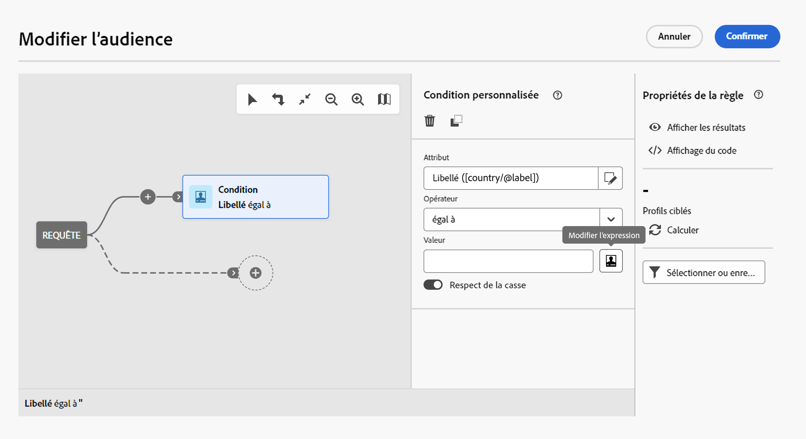

# Editer les expressions {#expression}

La modification d’une expression implique la saisie manuelle de conditions pour former une règle. Ce mode permet d&#39;utiliser des fonctions avancées. Ces fonctions permettent de manipuler les valeurs utilisées afin de réaliser des requêtes spécifiques : manipulation de dates, de chaînes, de champs numériques, tris, etc.

Ces opérations sont disponibles à partir du bouton Editer l’expression du créateur de requêtes , disponible pour les champs Attribut et Valeur lors de la configuration d’une condition personnalisée.



L’éditeur d’expression fournit :

* un champ de saisie, dans lequel l&#39;expression est définie
* La liste des champs disponibles qui peuvent être utilisés dans l&#39;expression et qui correspondent à la dimension de ciblage de la requête.
* la liste des fonctions disponibles, triées par catégorie.

Editez l&#39;expression en saisissant une expression directement dans le champ de saisie ou en utilisant la liste des champs et fonctions disponibles. Pour ce faire, placez le curseur dans votre inexpression à l’endroit où vous souhaitez ajouter l’élément et double-cliquez sur le champ ou l’expression de votre choix.

Il est possible d&#39;utiliser les variables d&#39;événements des workflows pour créer une expression. Voir à ce sujet xxxx.

## Syntaxe des expressions  {#expression-syntax}

### Syntaxe standard {#standard-syntax}

Les expressions standard sont composées d&#39;une ou plusieurs conditions, respectant les éléments de syntaxe suivants :

* Chaque condition est de la forme **&lt;valeur1> &lt;opérateur de comparaison> &lt;valeur2>** où :

   * **&lt;valeur1>** est un champ ou une fonction. Par exemple **@created** pour la date de création d&#39;un profil ou **Year(@created)** pour l&#39;année de création d&#39;un profil.
   * **&lt;comparison operator=&quot;&quot;>** est l&#39;un des opérateurs listés dans la section Opérateurs de comparaison . Cet opérateur définit la méthode de comparaison entre **&lt;valeur1>** et **&lt;valeur2>**.
   * **&lt;valeur2>** est un champ, une fonction ou une valeur saisie manuellement.

  >[!NOTE]
  >
  >Le type de données de **&lt;valeur1>** et de **&lt;valeur2>** doit être identique. Par exemple, si **&lt;valeur1>** est une date, alors **&lt;valeur2>** doit également être une date.

* Si vous souhaitez utiliser plusieurs conditions, elles peuvent être combinées à l&#39;aide d&#39;opérateurs logiques.

   * **[!UICONTROL AND]** : intersection des deux conditions
   * **[!UICONTROL OR]** : union des deux conditions.

Par exemple :

```
Year(@created) = Year(GetDate()) AND Month(@created) = Month(GetDate())
```

Dans cet exemple sont ciblés les profils dont la date de création correspond au mois et à l&#39;année courants.

### Syntaxe JavaScript   {#javascript-syntax}

Lors de la définition des conditions de visibilité d&#39;un bloc de type texte de l&#39;éditeur de contenus HTML, vous devez utiliser une expression dont la syntaxe est de type JavaScript.

Les expressions JavaScript sont composées d&#39;une ou plusieurs conditions, respectant les éléments de syntaxe suivants :

* Chaque condition est de la forme **&lt;contexte> &lt;opérateur de comparaison> &lt;valeur2>** où :

   * **&lt;contexte>** correspond à un champ ou une fonction permettant de préciser le contexte. Par exemple, **context.profile.@email** pour l&#39;adresse email d&#39;un profil ou **context.profile.firstName.length()** pour le nombre de caractères du prénom d&#39;un profil.
   * **&lt;comparison operator=&quot;&quot;>** est l&#39;un des opérateurs listés dans la section Opérateurs de comparaison . Cet opérateur définit la méthode de comparaison entre **&lt;contexte>** et **&lt;valeur2>**.
   * **&lt;valeur2>** est un champ, une fonction ou une valeur saisie manuellement.

  >[!NOTE]
  >
  Le type de données de **&lt;contexte>** et de **&lt;valeur2>** doit être identique. Par exemple, si **&lt;contexte>** est une date, alors **&lt;valeur2>** doit également être une date.

* Si vous souhaitez utiliser plusieurs conditions, elles peuvent être combinées à l&#39;aide d&#39;opérateurs logiques.

   * **[!UICONTROL &amp;&amp;]** : intersection des deux conditions
   * **[!UICONTROL ||]**: union des deux conditions.

Par exemple :

```
context.profile.age > 21 && context.profile.firstName.length() > 0
```

Dans cet exemple sont ciblés les profils de plus de 21 ans et dont le prénom est bien renseigné (symbolisé par le fait que le champ **firstName** contienne au moins un caractère).

## Opérateurs de comparaison  {#comparison-operators}

Pour certaines règles, l&#39;éditeur de requêtes vous permet de choisir une valeur afin de définir votre condition.

Les conditions doivent être liées aux valeurs à l&#39;aide de l&#39;un des opérateurs ci-après.

<table> 
 <thead> 
  <tr> 
   <th> Opérateur<br /> </th> 
   <th> Syntaxe standard<br /> </th> 
   <th> Syntaxe JavaScript <br /> </th> 
   <th> Description<br /> </th> 
   <th> Exemple<br /> </th> 
  </tr> 
 </thead> 
 <tbody> 
  <tr> 
   <td> <span class="uicontrol">Egal à</span> <br /> </td> 
   <td> =<br /> </td> 
   <td> ==<br /> </td> 
   <td> La première valeur doit être rigoureusement identique à la seconde valeur.<br /> </td> 
   <td> <strong>@lastName = Martin</strong> permet de retrouver les profils dont le nom est 'Martin', avec les seuls caractères indiqués.<br /> </td> 
  </tr> 
  <tr> 
   <td> <span class="uicontrol">Supérieur à</span> <br /> </td> 
   <td> &gt;<br /> </td> 
   <td> &gt;<br /> </td> 
   <td> La première valeur doit être strictement supérieure à la seconde valeur.<br /> </td> 
   <td> <strong>@age &gt; 50</strong> permet de retrouver les profils dont l'âge est supérieur à 50, donc 51, 52, etc.<br /> </td> 
  </tr> 
  <tr> 
   <td> <span class="uicontrol">Inférieur à</span> <br /> </td> 
   <td> &lt;<br /> </td> 
   <td> &lt;<br /> </td> 
   <td> La première valeur doit être strictement inférieure à la seconde valeur.<br /> </td> 
   <td> <strong>@created &lt; DaysAgo(100)</strong> permet de retrouver tous les profils créés dans la base de données il y a moins de 100 jours.<br /> </td> 
  </tr> 
  <tr> 
   <td> <span class="uicontrol">Supérieur ou égal à</span> <br /> </td> 
   <td> &gt;=<br /> </td> 
   <td> &gt;=<br /> </td> 
   <td> La première valeur doit être supérieure ou égale à la seconde valeur.<br /> </td> 
   <td> <strong>@age &gt;= 30</strong> permet de retrouver les profils âgés de 30 ans et plus.<br /> </td> 
  </tr> 
  <tr> 
   <td> <span class="uicontrol">Inférieur ou égal à</span> <br /> </td> 
   <td> &lt;=<br /> </td> 
   <td> &lt;=<br /> </td> 
   <td> La première valeur doit être inférieure ou égale à la seconde valeur.<br /> </td> 
   <td> <strong>@age &lt;= 60</strong> permet de retrouver les profils âgés de 60 ans ou moins.<br /> </td> 
  </tr> 
  <tr> 
   <td> <span class="uicontrol">Différentes </span> <br /> </td> 
   <td> !=<br /> </td> 
   <td> !=<br /> </td> 
   <td> La première valeur doit être différente de la seconde valeur.<br /> </td> 
   <td> <strong>@Langue != Anglais</strong> permet de retrouver les profils n'étant pas définis comme anglophones.<br /> </td> 
  </tr> 
  <tr> 
   <td> <span class="uicontrol">Contient</span> <br /> </td> 
   <td> IN<br /> </td> 
   <td> N/A<br /> </td> 
   <td> La première valeur doit contenir la seconde valeur.<br /> </td> 
   <td> <strong>@domain IN mail</strong>. Ici, tous les noms de domaine comportant la valeur 'mail' sont retournés en résultat. Par conséquent, le nom de domaine 'gmail.com' fera partie des résultats retournés.<br /> </td> 
  </tr> 
  <tr> 
   <td> <span class="uicontrol">Comme</span> <br /> </td> 
   <td> LIKE<br /> </td> 
   <td> N/A<br /> </td> 
   <td> <span class="uicontrol">Comme</span> est quasiment identique à l’opérateur <span class="uicontrol">Contient. </span> Il permet d'insérer un caractère de substitution <span class="uicontrol">%</span> dans la valeur recherchée.<br /> </td> 
   <td> <strong>@lastName LIKE Mart%n</strong>. Ici, le caractère <strong>%</strong> de substitution sert de "joker" afin de retrouver le nom "Martin" dans le cas hypothétique où l'orthographe d'une valeur n'est pas certaine.<br /> </td> 
  </tr> 
  <tr> 
   <td> <span class="uicontrol">Pas comme</span> <br /> </td> 
   <td> NOT<br /> </td> 
   <td> N/A<br /> </td> 
   <td> Similaire à <span class="uicontrol">Comme</span>. Permet de ne pas obtenir la valeur renseignée. La valeur renseignée doit ici aussi comporter le caractère de substitution <span class="uicontrol">%</span>.<br /> </td> 
   <td> <strong>@lastName NOT Smi%h</strong>. Ici, les destinataires correspondent au nom 'Smi%h' (donc Smith, etc.) ne sont pas renvoyées par conséquent.<br /> </td> 
  </tr> 
  <tr> 
   <td> <span class="uicontrol">Est vide</span> <br /> </td> 
   <td> IS NULL<br /> </td> 
   <td> N/A<br /> </td> 
   <td> La première valeur doit correspondre à une valeur vide.<br /> </td> 
   <td> <strong>@mobilePhone IS NULL</strong> permet de retrouver tous les profils dont le numéro de téléphone portable n'est pas renseigné.<br /> </td> 
  </tr> 
 </tbody> 
</table>