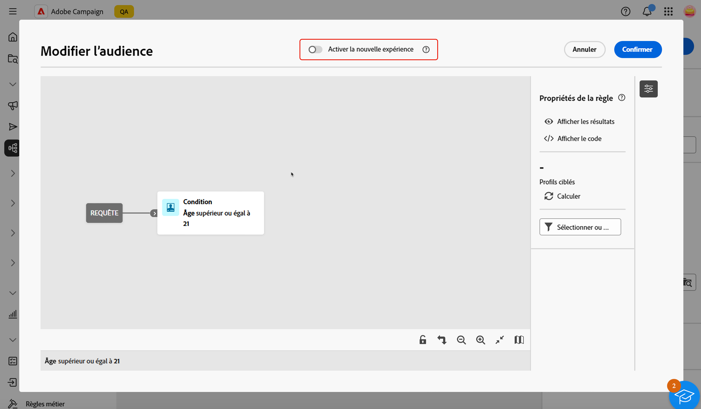

# Filtrer des listes {#filter-lists}

Adobe Campaign Web fournit des filtres dans chaque liste d’objets, ce qui vous permet de filtrer les informations en fonction de critères contextuels spécifiques. Vous pouvez, par exemple, filtrer les diffusions selon leur statut, leur canal, leur date de contact ou leur dossier. Vous pouvez également masquer les BAT.

>[!IMPORTANT]
>
>Une toute nouvelle interface pour le concepteur de requête est disponible. Le nouveau créateur de règles, grâce à son interface simplifiée, vous permet de créer votre requête plus facilement. Pour passer à cette expérience, appuyez sur le bouton (bascule) dans le coin supérieur droit. Vous pouvez revenir au concepteur de requête classique à tout moment en appuyant simplement sur le bouton (bascule) pour désactiver la nouvelle interface. Vous pouvez appliquer les mêmes principes que le concepteur de requête dans cette nouvelle interface.
>>{zoomable="yes"}

## Appliquer des filtres {#apply}

Pour appliquer des filtres à une liste, cliquez sur le bouton **[!UICONTROL Afficher les filtres]** situé dans le coin supérieur gauche de la liste, en regard de la barre de recherche.

Le volet des filtres s’ouvre, affichant les filtres disponibles pour la liste sélectionnée. Vous pouvez, par exemple, filtrer les campagnes selon leur statut, dates de début et de fin ou dossier de stockage, tandis que la liste des services d’abonnement peut être filtrée selon leur canal et dossier de stockage.

{zoomable="yes"}{width="70%" align="left" zoomable="yes"}

Pour filtrer une liste selon vos propres critères, créez un filtre personnalisé. Pour ce faire, accédez au bas du volet des filtres et cliquez sur le bouton **Ajouter des règles**. [Découvrez comment créer des filtres personnalisés](#custom).

Une fois appliqués à une liste, les filtres sont visibles dans la barre de recherche. Vous pouvez supprimer un filtre individuel à tout moment ou supprimer tous les filtres en cliquant sur le bouton **Tout effacer**.

## Créer des filtres personnalisés {#custom}

Les filtres personnalisés vous permettent d’affiner les listes en fonction de vos propres critères. Ils sont conçus à l’aide du concepteur de requête Campaign. Pour créer un filtre personnalisé, procédez comme suit :

1. Ouvrez le volet des filtres et cliquez sur le bouton **Ajouter des règles** situé au bas du volet.

1. Le concepteur de requête s’ouvre. Définissez et combinez vos critères de filtre en fonction de vos besoins. Des informations détaillées sur l’utilisation du concepteur de requête sont disponibles dans [cette section](../query/query-modeler-overview.md).

   L’exemple ci-dessous présente un filtre personnalisé conçu pour s’afficher dans la liste des campagnes par SMS exécutées par les opérateurs et opératrices des services de running ou de yoga.

   {zoomable="yes"}{width="70%" align="left" zoomable="yes"}

1. Une fois votre filtre personnalisé configuré, cliquez sur **[!UICONTROL Confirmer]** pour l’appliquer à la liste.