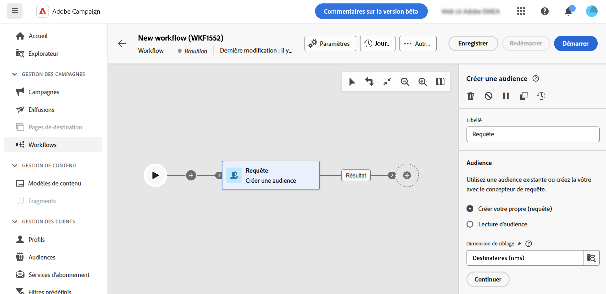
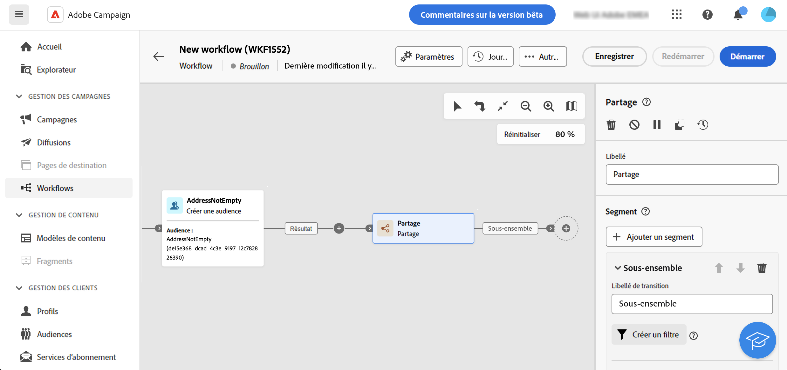
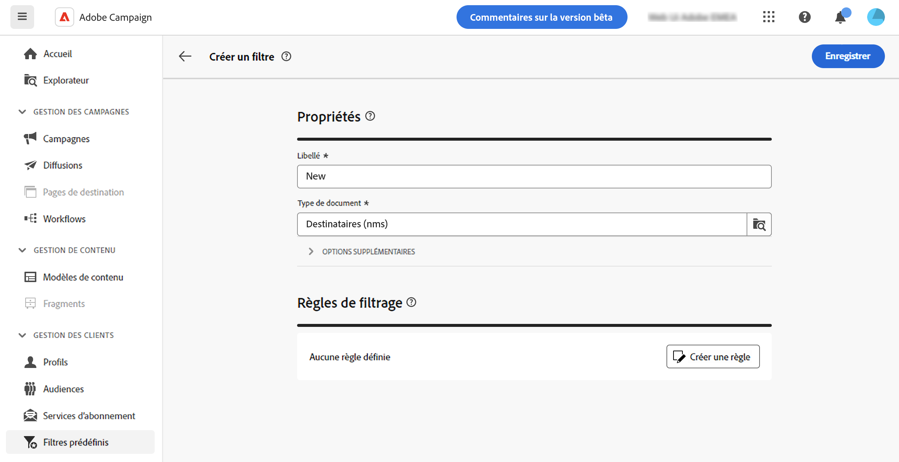
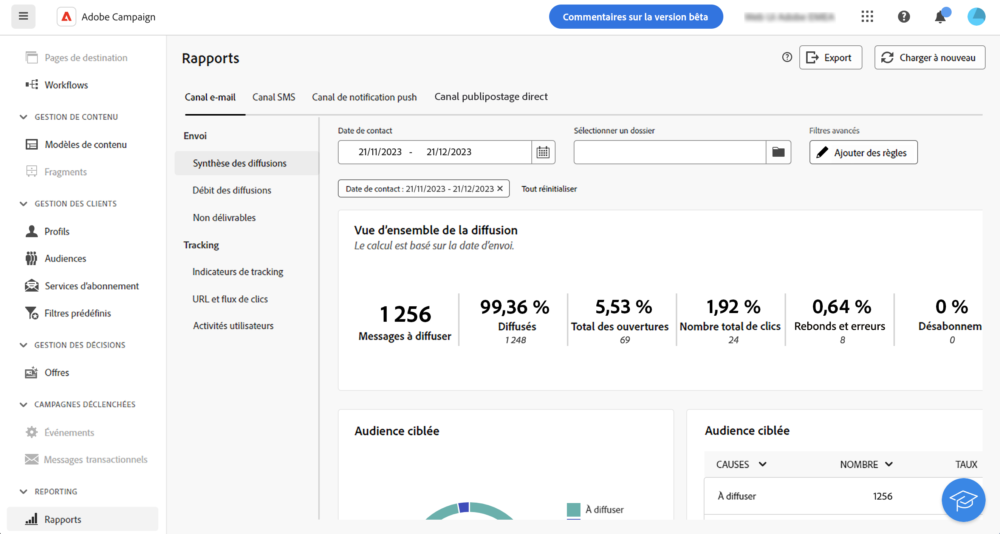
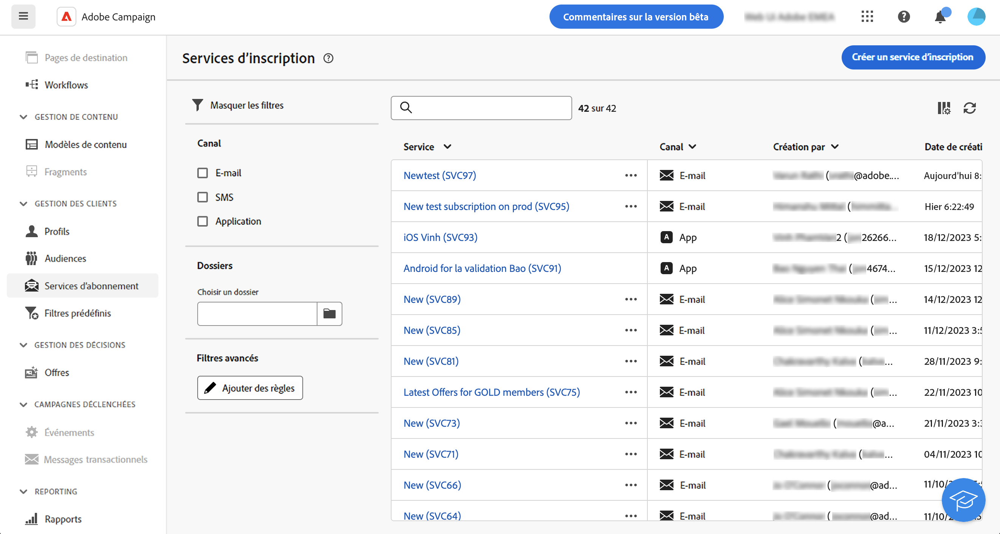
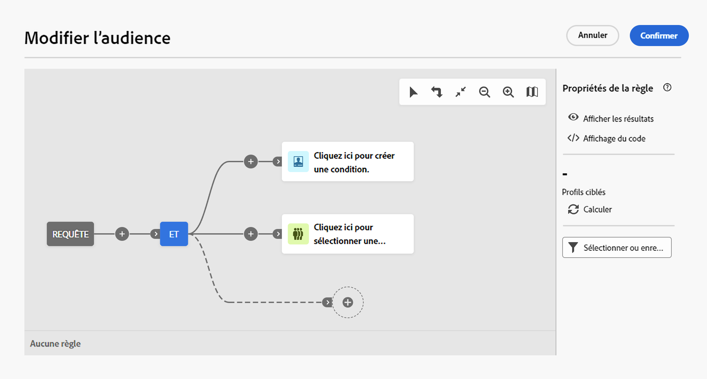

# Utiliser le concepteur de requête {#segment-builder}

>[!CONTEXTUALHELP]
>id="acw_homepage_learning_card5"
>title="Nouveau concepteur de requête"
>abstract="Adobe Campaign Web comporte un concepteur de requête qui simplifie le processus de filtrage des bases de données afin de sélectionner des cibles spécifiques selon différents critères. Cela inclut l’utilisation d’expressions et d’opérateurs avancés. Le concepteur de requête est disponible dans tout contexte où vous devez définir des règles pour filtrer les données."

>[!CONTEXTUALHELP]
>id="acw_orchestration_querymodeler_querymessage"
>title="Concepteur de requête"
>abstract="Définissez des critères de filtrage pour les personnes destinataires ou toute autre dimension de ciblage issue de la base de données. Tirez parti de votre audience Adobe Experience Platform pour affiner davantage votre audience cible et maximiser l’impact de votre campagne."

>[!CONTEXTUALHELP]
>id="acw_deliveries_refine_target"
>title="Affiner la cible"
>abstract="Ces règles ne peuvent être modifiées que dans la console cliente."

L’interface utilisateur web d’Adobe Campaign comporte un concepteur de requête qui simplifie le processus de filtrage des bases de données selon différents critères. Elle assure une compatibilité totale avec les requêtes créées dans la console cliente, ce qui facilite une transition transparente vers l’interface utilisateur web.

De plus, le concepteur de requête peut gérer efficacement des requêtes très complexes et longues, offrant une flexibilité et une précision optimisées. En outre, il prend en charge les filtres prédéfinis dans les conditions, ce qui vous permet d’affiner facilement vos requêtes tout en utilisant des expressions et des opérateurs avancés pour des stratégies de segmentation et un ciblage d’audience complets.

## Accéder au concepteur de requête

Le concepteur de requête est disponible dans tout contexte où vous devez définir des règles pour filtrer les données.

| Usage | Exemple |
|  ---  |  ---  |
| **Définir les audiences** : indiquez la population à cibler dans vos messages ou workflows et créez facilement de nouvelles audiences adaptées à vos besoins. [Découvrir comment créer des audiences](../audience/one-time-audience.md) | {zoomable="yes"}{width="200" align="center" zoomable="yes"} |
| **Personnaliser les activités de workflow** : appliquez des règles à des activités de workflow, telles que **Partage** et **Réconciliation**, afin de respecter vos besoins spécifiques. [En savoir plus sur les activités de workflow](../workflows/activities/about-activities.md) | {zoomable="yes"}{width="200" align="center" zoomable="yes"} |
| **Filtres prédéfinis** : créez des filtres prédéfinis qui servent de raccourcis lors de diverses opérations de filtrage, que vous utilisiez des listes de données ou que vous créiez l’audience pour une diffusion. [Découvrir comment utiliser des filtres prédéfinis](../get-started/predefined-filters.md) | {zoomable="yes"}{width="200" align="center" zoomable="yes"} |
| **Filtrer les données de rapports** : ajoutez une règle pour filtrer les données affichées dans les rapports. [Découvrir comment utiliser les rapports](../reporting/gs-reports.md) | {zoomable="yes"}{width="200" align="center" zoomable="yes"} |
| **Personnaliser les listes** : créez des règles personnalisées pour filtrer les données affichées dans les listes, telles que les personnes destinataires, les listes de diffusions, etc. [Découvrir comment filtrer les listes](../get-started/list-filters.md#list-built-in-filters) | {zoomable="yes"}{width="200" align="center" zoomable="yes"} |
| **Créer du contenu conditionnel** : rendez le contenu d’un e-mail dynamique en créant des conditions qui définissent quel contenu doit être affiché pour différentes personnes destinataires, ce qui garantit des e-mails personnalisés et pertinents. [Découvrir comment créer du contenu conditionnel](../personalization/conditions.md) | {width="200" align="center" zoomable="yes"} |

>[!NOTE]
>
>Lors de l’accès à un objet créé dans la console cliente où des règles ont été appliquées, comme une audience ou un filtre prédéfini, la section **[!UICONTROL Affiner la cible]** peut s’afficher. Cela signifie que des paramètres supplémentaires ont été configurés pour affiner la cible des règles. Ces paramètres ne peuvent être modifiés que dans la console.
>
>{zoomable="yes"}

## Interface du concepteur de requête {#interface}

Le concepteur de requête fournit une zone de travail centrale où vous pouvez créer votre requête, et un volet droit fournissant des informations sur votre requête.

{zoomable="yes"}

### La zone de travail centrale {#canvas}

Le concepteur de requête fournit une zone de travail centrale où vous pouvez ajouter et combiner les différents composants qui construisent votre requête. [Découvrez comment créer une requête](build-query.md)

La barre d’outils située dans le coin supérieur droit de la zone de travail fournit des options permettant de manipuler facilement les composants de requête et de naviguer dans la zone de travail :

* **Mode de sélection multiple** : sélectionnez plusieurs composants de filtrage pour les copier et coller à l’emplacement de votre choix.
* **Faire pivoter** : retournez la zone de travail verticalement.
* **Ajuster à l’écran** : adaptez le niveau de zoom de la zone de travail à votre écran.
* **Zoom arrière**/**Zoom avant** : effectuez un zoom arrière ou avant dans la zone de travail.
* **Afficher la carte** : ouvre un instantané de la zone de travail indiquant où vous vous trouvez.

### Le volet Propriétés de la règle {#rule-properties}

Sur le côté droit, le volet **[!UICONTROL Propriétés de la règle]** fournit des informations sur votre requête. Il vous permet d’effectuer diverses opérations pour vérifier la requête et vous assurer qu’elle correspond à vos besoins. Ce volet s’affiche lors de la création d’une requête pour créer une audience. [Découvrir comment vérifier et valider votre requête](build-query.md#check-and-validate-your-query)
