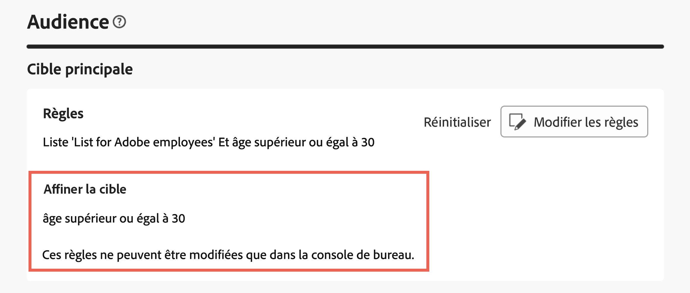

# Utiliser le concepteur de requête {#segment-builder}

>[!CONTEXTUALHELP]
>id="acw_homepage_learning_card5"
>title="Nouveau concepteur de requête"
>abstract="Adobe Campaign Web comporte un concepteur de requête qui simplifie le processus de filtrage des bases de données afin de sélectionner des cibles spécifiques selon différents critères. Cela inclut l’utilisation d’expressions et d’opérateurs avancés. Le concepteur de requête est disponible dans tout contexte où vous devez définir des règles pour filtrer les données."

>[!CONTEXTUALHELP]
>id="acw_orchestration_querymodeler_querymessage"
>title="Concepteur de requête"
>abstract="Définissez des critères de filtrage pour les personnes destinataires ou toute autre dimension de ciblage issue de la base de données. Tirez parti de votre audience Adobe Experience Platform pour affiner davantage votre audience cible et maximiser l’impact de votre campagne."

>[!CONTEXTUALHELP]
>id="acw_deliveries_refine_target"
>title="Affiner la cible"
>abstract="Ces règles ne peuvent être modifiées que dans la console cliente."

L’interface utilisateur web d’Adobe Campaign comporte un concepteur de requête qui simplifie le processus de filtrage des bases de données selon différents critères. Elle assure une compatibilité totale avec les requêtes créées dans la console cliente, ce qui facilite une transition transparente vers l’interface utilisateur web.

En outre, le requêteur gère efficacement des requêtes longues et très complexes, avec une flexibilité et une précision accrues. Il prend également en charge les filtres prédéfinis dans des conditions, ce qui permet aux utilisateurs et utilisatrices d’affiner facilement les requêtes tout en utilisant des expressions et des opérateurs avancés pour le ciblage d’audience et les stratégies de segmentation complètes.

## Accéder au concepteur de requête

Le concepteur de requête est disponible dans tout contexte où vous devez définir des règles pour filtrer les données.

| Usage | Exemple |
|  ---  |  ---  |
| **Définir les audiences** : indiquez la population à cibler dans vos messages ou workflows et créez facilement de nouvelles audiences adaptées à vos besoins. [Découvrir comment créer des audiences](../audience/one-time-audience.md) | {zoomable="yes"}{width="200" align="center" zoomable="yes"} [Image montrant comment accéder à l’interface de création d’audience] |
| **Personnaliser les activités de workflow** : appliquez des règles dans les activités de workflow, telles que **Partage** et **Réconciliation**, pour vous aligner sur vos besoins spécifiques. [En savoir plus sur les activités de workflow](../workflows/activities/about-activities.md) | {zoomable="yes"}{width="200" align="center" zoomable="yes"} [Image illustrant comment accéder aux options de personnalisation d’un workflow] |
| **Filtres prédéfinis** : créez des filtres prédéfinis qui servent de raccourcis lors de diverses opérations de filtrage, que vous utilisiez des listes de données ou que vous créiez l’audience pour une diffusion. [Découvrir comment utiliser des filtres prédéfinis](../get-started/predefined-filters.md) | {zoomable="yes"}{width="200" align="center" zoomable="yes"} [Image illustrant comment accéder aux filtres prédéfinis] |
| **Filtrer les données des rapports** : ajoutez des règles pour filtrer les données affichées dans les rapports. [Découvrir comment utiliser les rapports](../reporting/gs-reports.md) | {zoomable="yes"}{width="200" align="center" zoomable="yes"} [Image illustrant comment filtrer des données dans des rapports] |
| **Personnaliser les listes** : créez des règles personnalisées pour filtrer les données affichées dans les listes, telles que les listes de destinataires ou de diffusions. [Découvrir comment filtrer les listes](../get-started/list-filters.md#list-built-in-filters) | {zoomable="yes"}{width="200" align="center" zoomable="yes"} [Image illustrant comment personnaliser les filtres de liste] |
| **Créer du contenu conditionnel** : rendez le contenu d’e-mail dynamique en créant des conditions qui définissent le contenu à afficher aux différents destinataires, tout en garantissant un message personnalisé et pertinent. [Découvrir comment créer du contenu conditionnel](../personalization/conditions.md) | {width="200" align="center" zoomable="yes"} [Image illustrant comment créer du contenu conditionnel] |

>[!NOTE]
>
>Lors de l’accès à un objet créé dans la console cliente où des règles ont été appliquées, comme une audience ou un filtre prédéfini, la section **[!UICONTROL Affiner la cible]** peut s’afficher. Cela signifie que des paramètres supplémentaires ont été configurés pour affiner la cible des règles. Ces paramètres ne peuvent être modifiés que dans la console.
>
>{zoomable="yes"}

## Interface du concepteur de requête {#interface}

Query Modeler fournit une zone de travail centrale où vous créez votre requête, ainsi qu’un volet de droite qui fournit des informations sur votre requête.

>[!CONTEXTUALHELP]
>id="acw_rule_builder_switch_button"
>title="Nouvelle expérience client"
>abstract="Utilisez ce bouton pour basculer entre l’expérience de modélisation de requête classique et la nouvelle expérience de création de règles."

{zoomable="yes"}

### La zone de travail centrale {#canvas}

La zone de travail centrale du Query Modeler vous permet d’ajouter et de combiner les différents composants afin de créer votre requête. [Découvrez comment créer une requête](build-query.md)

La barre d’outils située dans le coin supérieur droit de la zone de travail propose des options permettant de manipuler facilement les composants de requête et de naviguer dans la zone de travail :

* **Mode de sélection multiple** : sélectionnez plusieurs composants de filtrage pour les copier et coller à l’emplacement de votre choix.
* **Faire pivoter** : retournez la zone de travail verticalement.
* **Ajuster à l’écran** : adaptez le niveau de zoom de la zone de travail à votre écran.
* **Zoom arrière** / **Zoom avant** : zoom arrière ou avant sur la zone de travail.
* **Afficher la carte** : ouvrez un instantané de la zone de travail indiquant votre emplacement actuel.

### Le volet Propriétés de la règle {#rule-properties}

Sur le côté droit, le volet **[!UICONTROL Propriétés des règles]** fournit des informations sur votre requête. Il vous permet d’effectuer diverses opérations pour vérifier la requête et vous assurer qu’elle correspond à vos besoins. Ce volet s’affiche lors de la création d’une requête pour créer une audience. [Découvrir comment vérifier et valider votre requête](build-query.md#check-and-validate-your-query)