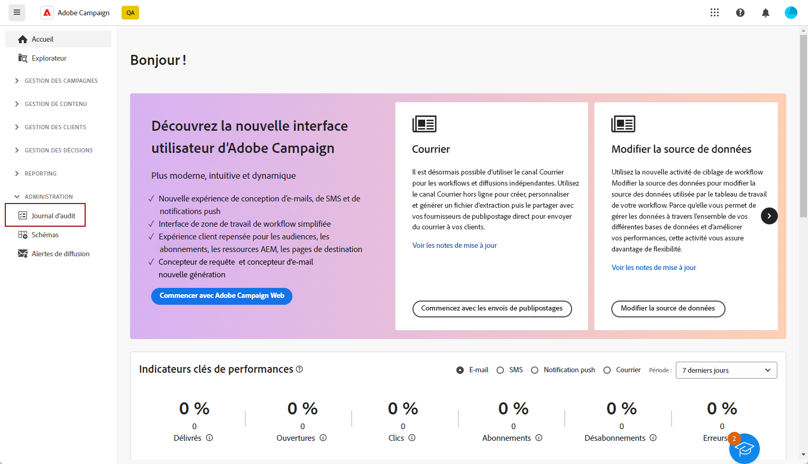
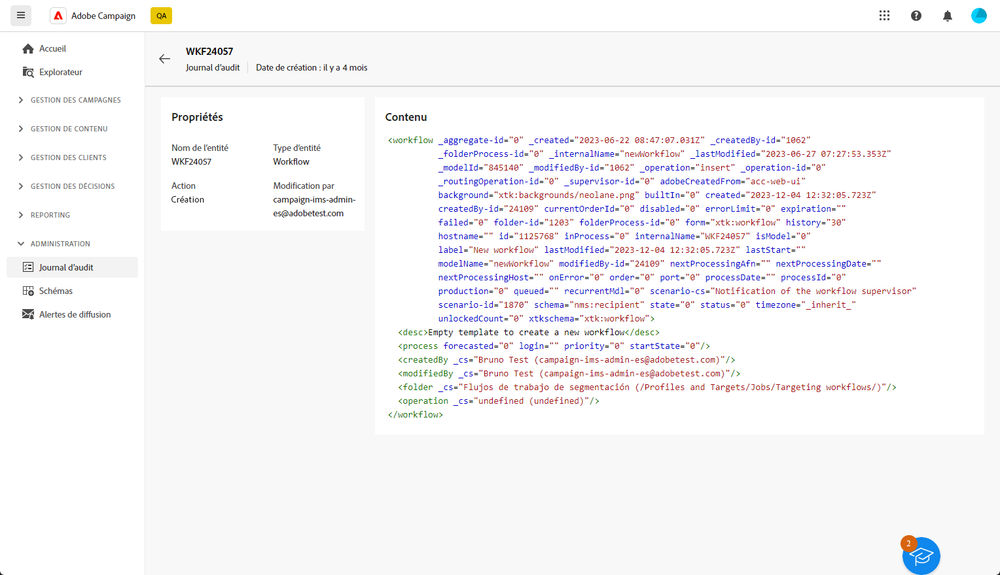

# Journal d’audit {#audit-trail}

Dans l’interface d’utilisation d’Adobe Campaign Web, la fonctionnalité **[!UICONTROL Journal d’audit]** offre aux utilisateurs et utilisatrices une visibilité complète de toutes les modifications apportées à des entités importantes au sein de votre instance, généralement celles qui ont un impact significatif sur le bon fonctionnement de l’instance.

>[!IMPORTANT]
>
>* L’interface d’utilisation d’Adobe Campaign Web ne réalise pas d’audit sur les modifications apportées aux droits des utilisateurs et utilisatrices, aux modèles, aux personnalisations ni aux campagnes.
>* Seuls les administrateurs et les administratrices de l’instance peuvent gérer le journal d’audit.

La fonctionnalité **[!UICONTROL Journal d’audit]** permet d’enregistrer en temps réel un journal détaillé des actions et des événements se produisant dans l’instance Adobe Campaign. Elle offre une méthode pratique d’accès à un enregistrement chronologique des données, en répondant à des requêtes telles que : le statut des workflows, les dernières personnes qui les modifient ou les activités effectuées par les utilisateurs et utilisatrices au sein de l’instance.

+++ En savoir plus sur les entités disponibles du journal d’audit

* **Le journal d&#39;audit des schémas de Source** vous permet de surveiller les activités et les modifications récentes apportées à vos schémas dans la console cliente Campaign v8.

  Pour plus d’informations sur les schémas, consultez la [documentation de Campaign v8](https://experienceleague.adobe.com/fr/docs/campaign/campaign-v8/developer/shemas-forms/schemas).

* Le **Journal d’audit des workflows** permet de suivre les activités et les modifications récentes apportées aux workflows, y compris leurs statuts actuels, telles que :

   * Démarrer
   * Pause
   * Arrêter
   * Redémarrer
   * Nettoyer, qui correspond à l’action Purger l’historique.
   * Simuler, qui correspond à l’action Démarrer en mode simulation.
   * Réveiller, qui correspond à l’action Exécuter les tâches en attente.
   * Arrêt inconditionnel

  Pour plus d’informations sur les workflows, consultez [cette page](../workflows/gs-workflows.md).

* Le **journal d&#39;audit des options** vous permet de surveiller les activités et les modifications récentes apportées à vos options dans Campaign v8.

  Pour plus d’informations sur les options, consultez [cette page](https://experienceleague.adobe.com/fr/docs/campaign-classic/using/installing-campaign-classic/appendices/configuring-campaign-options).

* **Journal d’audit des diffusions** : permet de vérifier les activités et les dernières modifications apportées à vos diffusions.

  Pour plus d’informations sur les diffusions, consultez cette [page](../msg/gs-deliveries.md).

* Le **Compte externe** vous permet de vérifier les modifications apportées aux comptes externes dans Campaign v8, utilisés par des processus techniques tels que les workflows techniques ou les workflows de campagne.

  Pour plus d’informations sur les comptes externes, consultez cette [page](../administration/external-account.md).

* **Mapping de diffusion** permet de surveiller les activités et les modifications récentes apportées à votre mapping de diffusion dans Campaign v8.

  Pour plus d’informations sur les mappings de diffusion, consultez cette [page](https://experienceleague.adobe.com/fr/docs/campaign/campaign-v8/audience/add-profiles/target-mappings).

* **Application web** vous permet de vérifier les modifications apportées aux formulaires web dans Campaign v8, utilisés pour créer des pages avec des champs de saisie et de sélection, et qui peuvent inclure des données de la base de données.

  Pour plus d’informations sur les applications web, consultez cette [page](https://experienceleague.adobe.com/fr/docs/campaign/campaign-v8/content/webapps).

* **Offre** : permet de vérifier les activités et les dernières modifications apportées à vos offres.

  Pour plus d’informations sur les offres, consultez cette [page](../msg/offers.md).

* **Opérateur** permet de surveiller les activités et les modifications récentes apportées à vos opérateurs dans Campaign v8.

  Pour plus d’informations sur les opérateurs et opératrices, consultez cette [page](https://experienceleague.adobe.com/fr/docs/campaign/campaign-v8/offers/interaction-settings/interaction-operators).

+++

## Accéder au journal d’audit {#accessing-audit-trail}

Pour accéder au **[!UICONTROL journal d’audit]** de votre instance, procédez comme suit :

1. Dans le menu **[!UICONTROL Administration]**, sélectionnez **[!UICONTROL Journal d’audit]**.

   

1. La fenêtre **[!UICONTROL Journal d’audit]** s’ouvre avec la liste de vos entités. L’interface d’utilisation d’Adobe Campaign Web réalise l’audit des actions de création, de modification et de suppression pour les workflows, les options, les diffusions et les schémas.

   Sélectionnez l’une des entités pour en savoir plus sur les dernières modifications.

1. La fenêtre **[!UICONTROL Entité d’audit]** vous fournit des informations plus détaillées sur l’entité choisie, telles que :

   * **[!UICONTROL Type]** : workflow, options, diffusions ou schémas.
   * **[!UICONTROL Entité]** : nom interne de vos activités.
   * **[!UICONTROL Modification par]** : nom d’utilisateur ou d’utilisatrice de la dernière personne à avoir modifié cette entité.
   * **[!UICONTROL Action]** : dernière action réalisée sur cette entité (création, modification ou suppression).
   * **[!UICONTROL Date de modification]** : date de la dernière action effectuée sur cette entité.

   Ce bloc de code vous fournit davantage d’informations sur ce qui a été modifié dans votre entité.

   