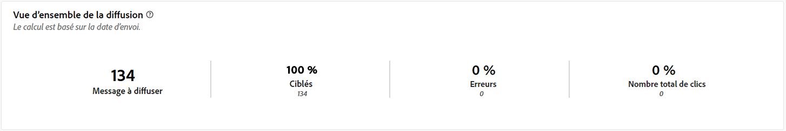

# Rapports de campagne pour le canal Courrier {#campaign-reports-direct-mail}

Chaque rapport de campagne est divisé en différents widgets qui détaillent le succès et les erreurs de votre campagne. Les rapports et mesures du canal Courrier sont détaillés ci-dessous. Découvrez comment accéder aux rapports de campagne sur [cette page](campaign-reports.md).

## Synthèse des diffusions {#delivery-summary-direct}

### Vue d’ensemble de la diffusion {#delivery-overview-direct}

>[!CONTEXTUALHELP]
>id="acw_campaign_reporting_delivery_overview_direct_mail"
>title="Vue d’ensemble de la diffusion"
>abstract="La **Vue d’ensemble de la diffusion** affiche des KPI, ou indicateurs clés de performance, qui offrent des informations détaillées sur la manière dont vos visiteurs et visiteuses interagissent avec les diffusions courrier. Les mesures sont décrites ci-dessous."

La **[!UICONTROL Vue d’ensemble de la diffusion]** affiche des KPI, ou indicateurs clés de performance, qui offrent des informations détaillées sur la manière dont vos visiteurs et visiteuses interagissent avec les diffusions par courrier. Les mesures sont décrites ci-dessous.

{zoomable="yes"}{align="center"}

+++En savoir plus sur les mesures de vue d’ensemble de diffusion.

* **[!UICONTROL Messages à diffuser]** : nombre total de messages traités lors de la préparation de la diffusion.

* **[!UICONTROL Diffusés]** : nombre de messages envoyés avec succès, par rapport au nombre total de messages envoyés.

* **[!UICONTROL Erreurs]** : nombre total d’erreurs accumulées lors des diffusions et du traitement automatique des retours par rapport au nombre total de messages envoyés.

* **[!UICONTROL Nombre total de clics]** : nombre total de destinataires distincts ayant cliqué dans une diffusion au moins une fois.

+++

### Statistiques initiales sur l’audience cible {#delivery-summary-direct-initial-target}

>[!CONTEXTUALHELP]
>id="acw_campaign_reporting_target_audience_direct_mail"
>title="Statistiques initiales sur l’audience cible"
>abstract="Les données de la personne destinataire et les informations sur le message s’affichent dans le tableau **Statistiques initiales sur l´audience cible**, reflétant l’analyse de préparation de la diffusion."

Le tableau **[!UICONTROL Statistiques initiales sur l’audience cible]** affiche des données relatives à vos destinataires. Les mesures sont calculées lors de la préparation de la diffusion. Elles affichent l’audience initiale, le nombre de messages à envoyer et le nombre de destinataires exclus.

{zoomable="yes"}

+++En savoir plus sur les mesures de statistiques de l’audience cible initiale.

* **[!UICONTROL Audience initiale]** : nombre total de personnes destinataires ciblées.

* **[!UICONTROL Message à diffuser]** : nombre total de messages à diffuser après la préparation de la diffusion.

* **[!UICONTROL Rejetés par les règles]** : nombre d’adresses ignorées pendant l’analyse lors de l’application des règles (adresses manquantes, mises en quarantaine, placées sur la liste bloquée, etc.).

+++

### Statistiques d’exécution {#delivery-summary-direct-exec-stats}

>[!CONTEXTUALHELP]
>id="acw_campaign_reporting_execution_statistics_direct_mail"
>title="Statistiques de diffusion"
>abstract="Le tableau **Statistiques d’exécution** détaille le succès de votre diffusion par courrier et les erreurs qui se sont produites."

Le tableau **[!UICONTROL Statistiques d’exécution]** fournit une répartition du succès de chaque diffusion par courrier, avec les mesures détaillées décrites ci-dessous.

+++En savoir plus sur les mesures de statistiques de diffusion.

* **[!UICONTROL Message à diffuser]** : nombre total de messages à diffuser après la préparation de la diffusion.

* **[!UICONTROL Succès]** : nombre de messages traités avec succès par rapport au nombre de messages à diffuser.

* **[!UICONTROL Erreurs]** : nombre total d’erreurs accumulées lors des diffusions et du traitement automatique des rebonds par rapport au nombre de messages à diffuser.

* **[!UICONTROL Nouvelles quarantaines]** : nombre total d’adresses mises en quarantaine à la suite d’un échec de diffusion (par exemple, personne inconnue, domaine invalide) par rapport au nombre de messages à diffuser.

+++

### Flux de clics générés {#click-streams}

>[!CONTEXTUALHELP]
>id="acw_campaign_reporting_clicks_direct_mail"
>title="Flux de clics générés"
>abstract="Le tableau **Flux de clics générés** affiche les données disponibles sur les interactions des destinataires avec votre diffusion."

{zoomable="yes"}{align="center"}

Le tableau **Flux de clics générés** illustre les raisons qui ont empêché des profils d’utilisateurs et d’utilisatrices exclus des profils ciblés de recevoir le message.

+++En savoir plus sur les mesures de flux de clics générés.

* **[!UICONTROL Clics uniques]** : nombre total de personnes destinataires distinctes ayant cliqué dans une diffusion au moins une fois.

* **[!UICONTROL Nombre total de clics]** : nombre total de clics sur les liens dans les diffusions.

* **[!UICONTROL Réactivité]** : ratio du nombre de personnes destinataires ciblées ayant cliqué dans une diffusion, par rapport à l’estimation du nombre de personnes destinataires ciblées ayant ouvert une diffusion.

+++