# Rapports de campagne du canal E-mail {#campaign-reports-email-channel}

Chaque rapport de campagne est divisé en différents widgets qui détaillent le succès et les erreurs de votre campagne. Les rapports et mesures du canal E-mail sont détaillés ci-dessous. Découvrez comment accéder aux rapports de campagne sur [cette page](campaign-reports.md).

## Synthèse des diffusions {#delivery-summary-email}

>[!CONTEXTUALHELP]
>id="acw_campaign_reporting_deliveries_overview"
>title="Vue d’ensemble de la diffusion"
>abstract="La **Vue d’ensemble de la diffusion** fournit des KPI qui donnent des informations détaillées sur la manière dont vos visiteurs et visiteuses interagissent avec votre diffusion e-mail."

### Vue d’ensemble de la diffusion {#delivery-summary-email-ovv}

La **[!UICONTROL Vue d’ensemble de la diffusion]** fournit des KPI qui donnent des informations détaillées sur la manière dont vos visiteurs et visiteuses interagissent avec votre diffusion e-mail. Les mesures sont détaillées ci-dessous.

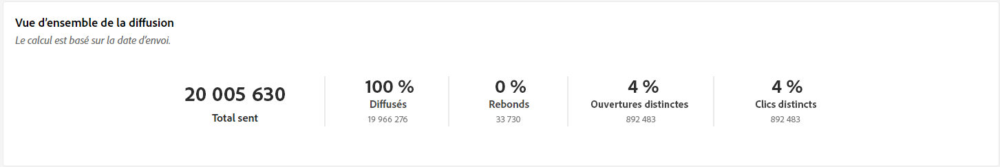{zoomable="yes"}

+++En savoir plus sur les mesures des rapports de campagne par e-mail.

* **[!UICONTROL Messages à diffuser]** : nombre total de messages traités lors de la préparation de la diffusion.

* **[!UICONTROL Diffusés]** : nombre de messages envoyés avec succès, par rapport au nombre total de messages envoyés.

* **[!UICONTROL Rebonds]** : nombre total d’erreurs cumulées lors des diffusions et du traitement automatique des retours par rapport au nombre total de messages envoyés.

* **[!UICONTROL Total des ouvertures]** : nombre total de personnes destinataires ciblées ayant ouvert un message au moins une fois.

* **[!UICONTROL Nombre total de clics]** : nombre total de destinataires distincts ayant cliqué dans une diffusion au moins une fois.

+++

### Statistiques initiales sur l’audience cible {#delivery-summary-email-initial-target}

>[!CONTEXTUALHELP]
>id="acw_campaign_reporting_deliveries_target"
>title="Statistiques initiales sur l’audience cible"
>abstract="Le tableau Statistiques initiales sur l’audience cible affiche des données relatives à vos destinataires."

Le tableau **[!UICONTROL Statistiques initiales sur l’audience cible]** affiche des données relatives à vos destinataires. Les mesures sont détaillées ci-dessous.

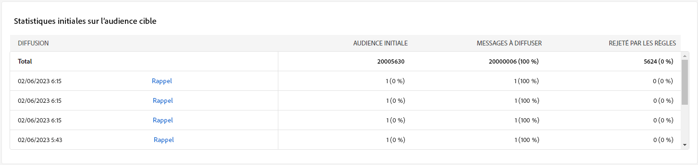{zoomable="yes"}

+++En savoir plus sur les mesures des rapports de campagne par e-mail.

* **[!UICONTROL Audience initiale]** : nombre total de personnes destinataires ciblées.

* **[!UICONTROL Message à diffuser]** : nombre total de messages à diffuser après la préparation de la diffusion.

* **[!UICONTROL Rejetées par les règles]** : nombre d’adresses ignorées pendant l’analyse lors de l’application des règles : adresse manquante, mise en quarantaine, placée sur la liste bloquée, etc.

+++

### Statistiques d’exécution {#delivery-summary-email-exec-stats}

>[!CONTEXTUALHELP]
>id="acw_campaign_reporting_email_exec_stats"
>title="Statistiques d’exécution"
>abstract="Le tableau **Statistiques d’exécution** détaille le succès de votre diffusion : messages à diffuser, succès, erreurs et nouvelles mises en quarantaine."

Le tableau **[!UICONTROL Statistiques d’exécution]** détaille le succès de votre diffusion. Les mesures sont détaillées ci-dessous.

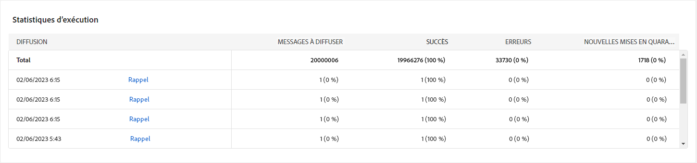{zoomable="yes"}

+++En savoir plus sur les mesures des rapports de campagne par e-mail.

* **[!UICONTROL Message à diffuser]** : nombre total de messages à diffuser après la préparation de la diffusion.

* **[!UICONTROL Succès]** : nombre de messages traités avec succès par rapport au nombre de messages à délivrer.

* **[!UICONTROL Erreurs]** : nombre total d’erreurs cumulées lors des diffusions et du traitement automatique des retours par rapport au nombre de messages à délivrer.

* **[!UICONTROL Nouvelles quarantaines]** : nombre total d’adresses mises en quarantaine à la suite d’un échec de diffusion (utilisateur ou utilisatrice inconnu(e), domaine invalide) par rapport au nombre de messages à délivrer.

  Les types d’erreur d’e-mail sont répertoriés dans la section [Documentation d’Adobe Campaign v8 (console cliente)](https://experienceleague.adobe.com/docs/campaign/campaign-v8/send/failures/delivery-failures.html?lang=fr#email-error-types){target="_blank"}.

+++

### Statistiques des réactions {#delivery-summary-email-reaction-stats}

>[!CONTEXTUALHELP]
>id="acw_campaign_reporting_email_reaction_stats"
>title="Statistiques des réactions"
>abstract="Le tableau **Statistiques des réactions** affiche les données disponibles pour l’activité des destinataires de votre diffusion : nombre d’ouvertures, abonnements, désabonnements, clic sur le lien de la page miroir."

Le tableau **[!UICONTROL Statistiques des réactions]** contient les données disponibles relatives à l’activité des destinataires de votre diffusion. Les mesures sont détaillées ci-dessous.

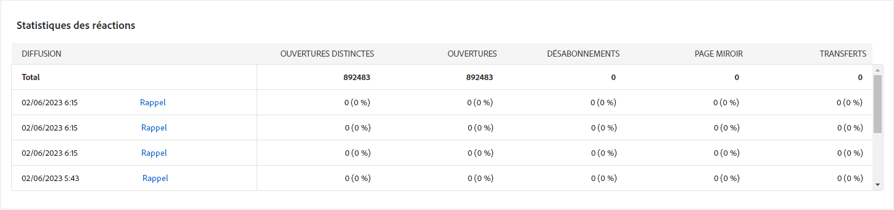{zoomable="yes"}

+++En savoir plus sur les mesures des rapports de campagne par e-mail.

* **[!UICONTROL Ouvertures uniques]** : nombre total de personnes destinataires ciblées ayant ouvert un message au moins une fois.

* **[!UICONTROL Total des ouvertures]** : nombre de personnes destinataires ciblées distinctes pour ce domaine ayant ouvert un message au moins une fois.

* **[!UICONTROL Désabonnements]** : nombre de destinataires ayant cliqué afin de se désabonner pour la période correspondante.

* **[!UICONTROL Page miroir]** : nombre de destinataires ayant cliqué sur le lien de la page miroir.

* **[!UICONTROL Transferts]** : nombre de destinataires ayant cliqué et transféré l’e-mail.
+++

### Flux de clics générés {#delivery-summary-email-click-streams}

>[!CONTEXTUALHELP]
>id="acw_campaign_reporting_email_click_streams"
>title="Flux de clics générés"
>abstract="Le tableau **Flux de clics générés** affiche les données disponibles sur les interactions des destinataires avec votre diffusion."

Le tableau **[!UICONTROL Flux de clics générés]** affiche des données relatives à la manière dont vos destinataires ont interagi avec votre diffusion. Les mesures sont détaillées ci-dessous.

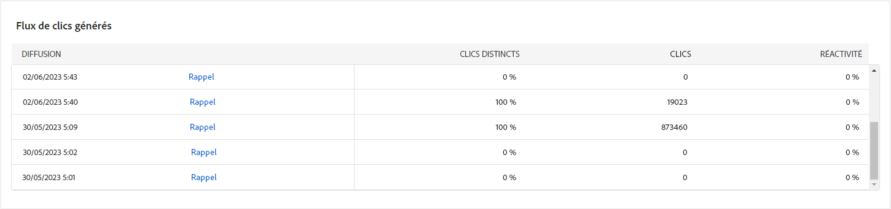{zoomable="yes"}

+++En savoir plus sur les mesures des rapports de campagne par e-mail.

* **[!UICONTROL Clics uniques]** : nombre total de personnes destinataires distinctes ayant cliqué dans une diffusion au moins une fois.

* **[!UICONTROL Nombre total de clics]** : nombre total de clics sur les liens dans les diffusions.

* **[!UICONTROL Réactivité]** : ratio du nombre de personnes destinataires ciblées ayant cliqué dans une diffusion, par rapport à l’estimation du nombre de personnes destinataires ciblées ayant ouvert une diffusion.

+++

## Non diffusables {#non-deliverables-email}

### Répartition des erreurs par type {#delivery-summary-email-breakdown-per-type}

>[!CONTEXTUALHELP]
>id="acw_campaign_reporting_error_type"
>title="Répartition des erreurs par type"
>abstract="Le tableau et le graphe **Répartition des erreurs par type** contiennent les données disponibles pour chaque type d’erreur rencontré : utilisateur inconnu ou utilisatrice inconnue, boîte pleine, domaine non valide, etc."

Le tableau et le graphe **[!UICONTROL Répartition des erreurs par type]** contiennent les données disponibles pour les erreurs possibles rencontrées pour chaque type de domaine. Les mesures sont détaillées ci-dessous.

Les erreurs présentées dans ce rapport déclenchent le processus de mise en quarantaine. Pour plus d’informations sur la gestion des quarantaines, consultez la [documentation de Campaign v8 (console cliente)](https://experienceleague.adobe.com/docs/campaign/campaign-v8/campaigns/send/failures/delivery-failures.html?lang=fr){target="_blank"}.

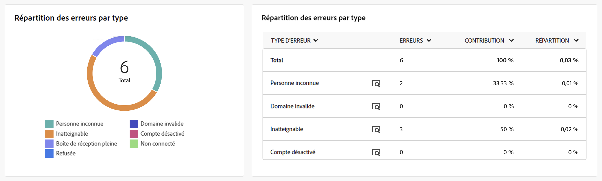{zoomable="yes"}

+++En savoir plus sur les mesures des rapports de campagne par e-mail.

* **[!UICONTROL Utilisateur inconnu]** : type d&#39;erreur générée lors de l&#39;envoi d&#39;une diffusion indiquant que l&#39;adresse e-mail est invalide.

* **[!UICONTROL Domaine invalide]** : type d&#39;erreur générée lors de l&#39;envoi d&#39;une diffusion indiquant que le domaine de l&#39;adresse e-mail est erroné ou n&#39;existe plus.

* **[!UICONTROL Boîte pleine]** : type d’erreur générée, après cinq tentatives de diffusion, indiquant que la boîte de réception de la personne destinataire contient trop de messages.

* **[!UICONTROL Compte désactivé]** : type d&#39;erreur générée lors de l&#39;envoi d&#39;une diffusion indiquant que l&#39;adresse n&#39;existe plus.

* **[!UICONTROL Refusé]** : type d’erreur générée lorsqu’une adresse est refusée par le FAI (Fournisseur d’accès Internet), par exemple, suite à l’application d’une règle de sécurité (logiciel anti-spams).

* **[!UICONTROL Inatteignable]** : type d&#39;erreur survenue dans la chaîne de distribution du message : incident sur le relais SMTP, domaine temporairement inatteignable, etc.

* **[!UICONTROL Non connecté]** : type d’erreur indiquant que le téléphone portable de la personne destinataire est éteint ou n’est pas connecté au réseau au moment de l’envoi du message.

+++

### Répartition des erreurs par domaine {#delivery-summary-email-breakdown-per-domain}

>[!CONTEXTUALHELP]
>id="acw_campaign_reporting_error_domain"
>title="Répartition des erreurs par domaine"
>abstract="Le tableau et le graphe **Répartition des erreurs par domaine** affichent les données disponibles pour chaque type d’erreur rencontré en fonction de chaque domaine."

Le tableau et le graphe **[!UICONTROL Répartition des erreurs par domaine]** contiennent les données disponibles pour les erreurs possibles rencontrées pour chaque domaine. Les mesures sont communes au tableau et au graphe **[!UICONTROL Répartition des erreurs par type]** présentés ci-dessus.

## Indicateurs de tracking {#tracking-indicators-email}

### Statistiques de diffusion {#delivery-summary-email-statistics}

>[!CONTEXTUALHELP]
>id="acw_delivery_campaign_delivery_statistics_summary"
>title="Statistiques de diffusion"
>abstract="Le graphe **Statistiques de diffusion** détaille le succès de votre diffusion et les erreurs qui se sont produites."

Les mesures **[!UICONTROL Statistiques de diffusion]** fournissent des indicateurs clés de performances (KPI) qui donnent des informations détaillées sur les données disponibles pour les e-mails envoyés. Les mesures sont détaillées ci-dessous.

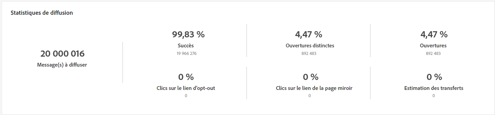{zoomable="yes"}

+++En savoir plus sur les mesures des rapports de campagne par e-mail.

* **[!UICONTROL Message(s) à diffuser]** : nombre de messages traités avec succès par rapport au nombre de messages à diffuser.

* **[!UICONTROL Ouvertures uniques]** : nombre total de personnes destinataires ciblées ayant ouvert un message au moins une fois.

* **[!UICONTROL Total des ouvertures]** : nombre de personnes destinataires ciblées distinctes pour ce domaine, ayant ouvert un message au moins une fois.

* **[!UICONTROL Clics sur le lien d’exclusion]** : nombre de clics effectués sur le lien d’exclusion.

* **[!UICONTROL Clics sur le lien miroir]** : nombre de clics sur le lien vers la page miroir.

* **[!UICONTROL Estimation des transferts]** : estimation du nombre d’e-mails transférés par les destinataires ciblé(e)s.
+++

### Taux d’ouverture et de clic publicitaire {#delivery-summary-open-rate}

>[!CONTEXTUALHELP]
>id="acw_campaign_reporting_open_clickthrough"
>title="Taux d’ouvertures et de clics"
>abstract="Le tableau **Taux d’ouvertures et de clics** affiche des données relatives à l’engagement de vos destinataires envers votre diffusion."

Le tableau **[!UICONTROL Taux d’ouverture et de clic publicitaire]** affiche des données relatives à vos destinataires. Les mesures sont détaillées ci-dessous.

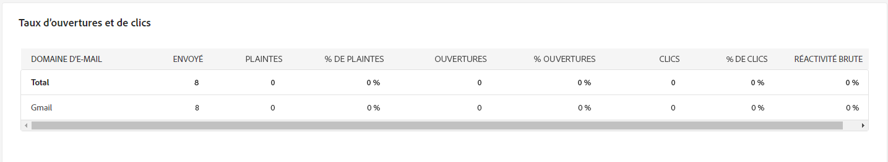{zoomable="yes"}

+++ En savoir plus sur les mesures des rapports de campagne par e-mail.

* **[!UICONTROL Envoyés]** : nombre total de messages envoyés.

* **[!UICONTROL Plaintes]** : nombre et pourcentage de messages pour ce domaine qui ont été signalés par la personne destinataire comme indésirables.

* **[!UICONTROL Ouvertures uniques]** : nombre et pourcentage de personnes destinataires ciblées distinctes pour ce domaine, ayant ouvert un message au moins une fois.

* **[!UICONTROL Clics uniques]** : nombre et poucentage de personnes destinataires ciblées distinctes ayant cliqué au moins une fois dans une même diffusion.

* **[!UICONTROL Réactivité brute]** : pourcentage du nombre de destinataires ayant cliqué au moins une fois dans une même diffusion par rapport au nombre de destinataires ayant ouvert au moins une fois une même diffusion.

+++

## URL et flux de clics {#url-email}

>[!CONTEXTUALHELP]
>id="acw_campaign_reporting_urls_clickstreams"
>title="URL et flux de clics"
>abstract="Le rapport **URL et flux de clics** fournit des indicateurs clés de performances (KPI) qui donnent des informations détaillées sur les URL qui ont reçu le plus grand nombre de clics lors d’une diffusion."

Le rapport **[!UICONTROL URL et flux de clics]** fournit des indicateurs clés de performances (KPI) qui donnent des informations détaillées sur les URL qui ont reçu le plus grand nombre de clics lors d’une diffusion. Les mesures sont détaillées ci-dessous.

{zoomable="yes"}

+++ En savoir plus sur les mesures des rapports de campagne par e-mail.

* **[!UICONTROL Réactivité]** : ratio du nombre de personnes destinataires ciblées ayant cliqué dans une diffusion, par rapport à l’estimation du nombre de personnes destinataires ciblées ayant ouvert une diffusion.

* **[!UICONTROL Clics uniques]** : nombre total de personnes destinataires distinctes ayant cliqué dans une diffusion au moins une fois.

* **[!UICONTROL Nombre total de clics]** : nombre total de clics sur les liens dans les diffusions.

* **[!UICONTROL Moyenne plateforme]** : ce taux moyen, affiché sous chaque taux (réactivité, clics distincts et clics cumulés) est calculé sur les diffusions envoyées au cours des six derniers mois. Seules les diffusions de même typologie et envoyées sur le même canal sont prises en compte. Les épreuves sont exclues.

+++

### Top 10 des liens les plus visités {#top10-campaign-report-email}

>[!CONTEXTUALHELP]
>id="acw_campaign_reporting_urls_clickstreams_top10"
>title="Top 10 des liens les plus visités"
>abstract="Le tableau et le graphe des **10 liens les plus visités** contiennent les données disponibles pour le comportement des destinataires par lien."

Le tableau et le graphe des **[!UICONTROL 10 liens les plus visités]** contiennent les données disponibles pour le comportement des destinataires par lien. Les mesures sont détaillées ci-dessous.

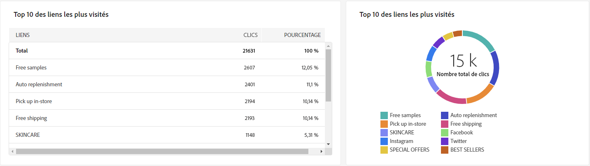{zoomable="yes"}

+++En savoir plus sur les mesures des rapports de campagne par e-mail.

* **[!UICONTROL Clics]** : nombre total de clics sur les liens dans les diffusions.

* **[!UICONTROL Pourcentage]** : pourcentage d’utilisateurs et utilisatrices ayant interagi avec la diffusion.

+++

### Répartition des clics dans le temps {#campaign-report-email-breakdown-clicks}

>[!CONTEXTUALHELP]
>id="acw_delivery_campaign_urls_click_breakdown"
>title="Répartition des clics dans le temps"
>abstract="Le graphe **Répartition des clics dans le temps** contient les données disponibles sur le comportement des destinataires par lien."

Le graphe **[!UICONTROL Répartition des clics dans le temps]** contient les données disponibles sur le comportement des destinataires par lien.

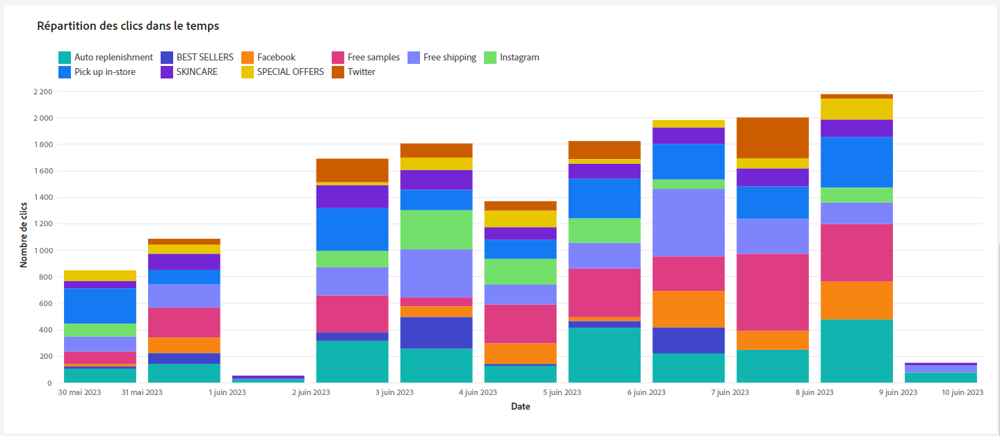{zoomable="yes"}

## Activités utilisateurs {#user-activities-email}

>[!CONTEXTUALHELP]
>id="acw_campaign_reporting_user_activities"
>title="Activités utilisateurs"
>abstract="Le graphe **Activités utilisateurs** affiche la répartition des ouvertures et des clics sous la forme d’un diagramme."

Le graphe **[!UICONTROL Activités utilisateurs]** affiche la répartition des ouvertures et des clics sous la forme d’un diagramme. Les mesures de ce rapport sont détaillées ci-dessous.

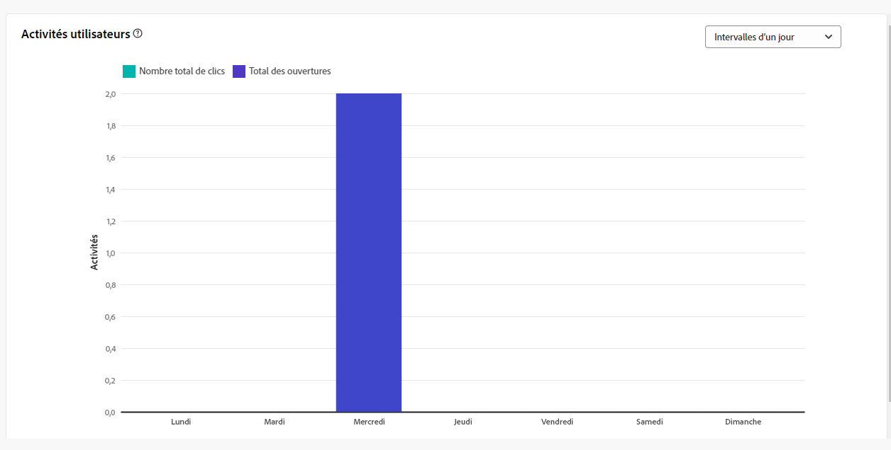{zoomable="yes"}{align="center"}

+++En savoir plus sur les mesures des rapports de diffusion par e-mail.

* **[!UICONTROL Clics]** : nombre total de clics sur les liens dans les diffusions.

* **[!UICONTROL Ouvertures]** : nombre de destinataires ciblé(e)s distinct(e)s, pour ce domaine, ayant ouvert un message au moins une fois.

+++
