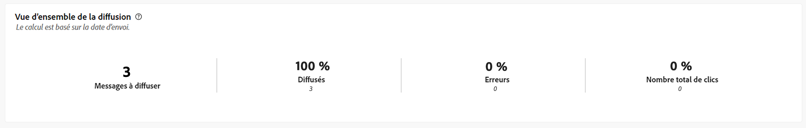
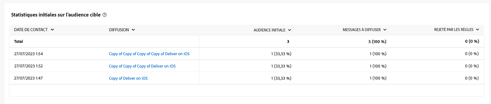
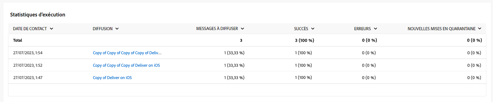
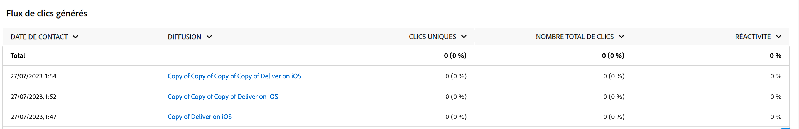

# Rapports de campagne de canal de notification push {#campaign-reports-push-channel}

Chaque rapport de campagne est divisé en différents widgets qui détaillent le succès et les erreurs de votre campagne. Pour le canal de notification push, les mesures et les rapports sont détaillés ci-dessous. Découvrez comment accéder aux rapports de campagne sur [cette page](campaign-reports.md).

## Synthèse des diffusions {#delivery-summary-push}

>[!CONTEXTUALHELP]
>id="acw_campaign_reporting_push_deliveries_overview"
>title="Vue d’ensemble de la diffusion"
>abstract="Le rapport **Vue d’ensemble de la diffusion** affiche des KPI qui donnent des informations détaillées sur les interactions de vos visiteurs et visiteuses avec votre diffusion Notification push."

Le rapport **[!UICONTROL Vue d’ensemble de la diffusion]** affiche des KPI qui donnent des informations détaillées sur les interactions de vos visiteurs et visiteuses avec votre diffusion Notification push. Les mesures sont détaillées ci-dessous.

{zoomable=&quot;yes&quot;}

+++En savoir plus sur les mesures des rapports de campagne par notification push.

* **[!UICONTROL Messages à diffuser]** : nombre total de messages traités lors de la préparation de la diffusion.

* **[!UICONTROL Diffusés]** : nombre de messages envoyés avec succès, par rapport au nombre total de messages envoyés.

* **[!UICONTROL Erreurs]** : nombre total d’erreurs cumulées lors des diffusions et du traitement automatique des retours par rapport au nombre total de messages envoyés.

* **[!UICONTROL Nombre total de clics]** : nombre total de personnes destinataires distinctes ayant cliqué dans une diffusion au moins une fois.

+++

### Statistiques initiales sur l’audience cible {#delivery-summary-push-initial-target}

>[!CONTEXTUALHELP]
>id="acw_campaign_reporting_push_target"
>title="Statistiques initiales sur l’audience cible"
>abstract="Le tableau **Statistiques initiales sur l’audience cible** affiche des données relatives à vos personnes destinataires."

Le tableau **[!UICONTROL Statistiques initiales sur l’audience cible]** affiche des données relatives à vos destinataires. Les mesures sont détaillées ci-dessous.

{zoomable=&quot;yes&quot;}

+++En savoir plus sur les mesures des rapports de campagne par notification push.

* **[!UICONTROL Audience initiale]** : nombre total de personnes destinataires ciblées.

* **[!UICONTROL Message à diffuser]** : nombre total de messages à diffuser après la préparation de la diffusion.

* **[!UICONTROL Rejetées par les règles]** : nombre d’adresses ignorées pendant l’analyse lors de l’application des règles : adresse manquante, mise en quarantaine, placée sur la liste bloquée, etc.

+++

### Statistiques d’exécution {#delivery-summary-push-exec-stats}

>[!CONTEXTUALHELP]
>id="acw_campaign_reporting_push_exec_stats"
>title="Statistiques d’exécution"
>abstract="Le tableau **Statistiques d’exécution** détaille le succès de votre diffusion : messages à diffuser, succès, erreurs et nouvelles mises en quarantaine."

Le tableau **[!UICONTROL Statistiques d’exécution]** détaille le succès de votre diffusion. Les mesures sont détaillées ci-dessous.

{zoomable=&quot;yes&quot;}

+++En savoir plus sur les mesures des rapports de campagne par notification push.

* **[!UICONTROL Message à diffuser]** : nombre total de messages à diffuser après la préparation de la diffusion.

* **[!UICONTROL Succès]** : nombre de messages traités avec succès par rapport au nombre de messages à délivrer.

* **[!UICONTROL Erreurs]** : nombre total d’erreurs cumulées lors des diffusions et du traitement automatique des retours par rapport au nombre de messages à délivrer.

* **[!UICONTROL Nouvelles quarantaines]** : nombre total d’adresses mises en quarantaine à la suite d’un échec de diffusion (enregistrement non valide, rejet du message, erreur de payload, par exemple), par rapport au nombre de messages à diffuser.

  Les types d’erreur de notifications push sont répertoriés dans la [documentation d’Adobe Campaign v8 (console cliente)](https://experienceleague.adobe.com/docs/campaign/campaign-v8/send/failures/delivery-failures.html?lang=fr#push-error-types){target="_blank"}.

+++

### Flux de clics générés {#delivery-summary-push-click-streams}

>[!CONTEXTUALHELP]
>id="acw_campaign_reporting_push_click_streams"
>title="Flux de clics générés"
>abstract="Le tableau **Flux de clics générés** affiche les données disponibles sur les interactions des destinataires avec votre diffusion."

Le tableau **[!UICONTROL Flux de clics générés]** affiche des données relatives à la manière dont vos destinataires ont interagi avec votre diffusion. Les mesures sont détaillées ci-dessous.

{zoomable=&quot;yes&quot;}

+++En savoir plus sur les mesures des rapports de campagne par notification push.

* **[!UICONTROL Clics uniques]** : nombre total de personnes destinataires distinctes ayant cliqué dans une diffusion au moins une fois.

* **[!UICONTROL Nombre total de clics]** : nombre total de clics sur les liens dans les diffusions.

* **[!UICONTROL Réactivité]** : ratio du nombre de personnes destinataires ciblées ayant cliqué dans une diffusion, par rapport à l’estimation du nombre de personnes destinataires ciblées ayant ouvert une diffusion.

+++
