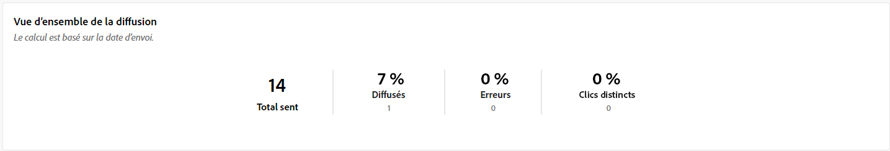
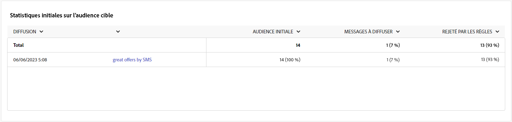

# Rapports de campagne pour le canal SMS {#campaign-reports-sms-channel}

Chaque rapport de campagne est divisé en différents widgets détaillant le succès et les erreurs de votre campagne. Pour le canal SMS, les rapports et les mesures sont présentés ci-dessous. Découvrez comment accéder aux rapports de campagne dans [cette page](campaign-reports.md).

## Synthèse des diffusions {#delivery-summary-sms}

>[!CONTEXTUALHELP]
>id="acw_campaign_reporting_sms_deliveries_overview"
>title="Vue d’ensemble de la diffusion"
>abstract="La variable **Présentation de la diffusion** Ce rapport fournit des indicateurs de performances clés (IPC) qui fournissent des informations détaillées sur la manière dont vos visiteurs interagissent avec votre diffusion SMS."

La variable **[!UICONTROL Présentation de la diffusion]** Ce rapport fournit des indicateurs de performances clés (IPC) qui fournissent des informations détaillées sur la manière dont vos visiteurs interagissent avec votre diffusion SMS. Les mesures sont détaillées ci-dessous.

+++En savoir plus sur les mesures des rapports de campagne SMS.

* **[!UICONTROL Total envoyé]** : nombre total de messages traités lors de la préparation de la diffusion.

* **[!UICONTROL Délivrés]** : nombre de messages envoyés avec succès, par rapport au nombre total de messages envoyés.

* **[!UICONTROL Erreurs]** : nombre total d’erreurs cumulées lors des diffusions et du traitement automatique des retours par rapport au nombre total de messages envoyés.

* **[!UICONTROL Clics distincts]** : nombre total de destinataires distinct(e)s ayant cliqué dans une diffusion au moins une fois.

+++

### Statistiques initiales sur l´audience cible {#delivery-summary-sms-initial-target}

>[!CONTEXTUALHELP]
>id="acw_campaign_reporting_sms_target"
>title="Statistiques initiales sur l´audience cible"
>abstract="La variable **Statistiques initiales d’audience cible** affiche des données relatives à vos destinataires."

La variable **[!UICONTROL Statistiques initiales d’audience cible]** affiche des données relatives à vos destinataires. Les mesures sont détaillées ci-dessous.

+++En savoir plus sur les mesures des rapports de campagne SMS.

* **[!UICONTROL Audience initiale]** : nombre total de destinataires ciblé(e)s.

* **[!UICONTROL Message à diffuser]** : nombre total de messages à diffuser après la préparation de la diffusion.

* **[!UICONTROL Rejetés par les règles]** : nombre d’adresses ignorées pendant l’analyse lors de l’application des règles : adresse manquante, mise en quarantaine, placée sur la liste bloquée, etc.

+++

### Statistiques d’exécution {#delivery-summary-sms-exec-stats}

>[!CONTEXTUALHELP]
>id="acw_campaign_reporting_sms_exec_stats"
>title="Statistiques d’exécution"
>abstract="La variable **Statistiques d&#39;exécution** le tableau détaille le succès de votre diffusion : messages à diffuser, succès, erreurs et nouvelles mises en quarantaine."

La variable **[!UICONTROL Statistiques d&#39;exécution]** le tableau décrit le succès de votre diffusion. Les mesures sont détaillées ci-dessous.

+++En savoir plus sur les mesures des rapports de campagne SMS.

* **[!UICONTROL Message à diffuser]** : nombre total de messages à diffuser après la préparation de la diffusion.

* **[!UICONTROL Succès]** : nombre de messages traités avec succès par rapport au nombre de messages à diffuser.

* **[!UICONTROL Erreurs]** : nombre total d’erreurs cumulées lors des diffusions et du traitement automatique des retours par rapport au nombre de messages à diffuser.

* **[!UICONTROL Nouvelles quarantaines]** : nombre total d’adresses mises en quarantaine à la suite d’un échec de diffusion (utilisateur ou utilisatrice inconnu(e), domaine invalide) par rapport au nombre de messages à diffuser.

  Les types d&#39;erreur de SMS sont répertoriés dans la section [Documentation d’Adobe Campaign v8 (console cliente)](https://experienceleague.adobe.com/docs/campaign/campaign-v8/send/failures/delivery-failures.html#sms-quarantines){target="_blank"}.

+++

### Flux de clics générés {#delivery-summary-sms-click-streams}

>[!CONTEXTUALHELP]
>id="acw_campaign_reporting_sms_click_streams"
>title="Flux de clics générés"
>abstract="La variable **Flux de clics générés** Le tableau affiche les données disponibles par rapport à la façon dont vos destinataires ont interagi avec votre diffusion."

La variable **[!UICONTROL Flux de clics générés]** Le tableau affiche des données relatives à la manière dont vos destinataires ont interagi avec votre diffusion. Les mesures sont détaillées ci-dessous.

+++En savoir plus sur les mesures des rapports de campagne SMS.

* **[!UICONTROL Clics distincts]** : nombre total de destinataires distinct(e)s ayant cliqué dans une diffusion au moins une fois.

* **[!UICONTROL Clics]** : nombre total de clics sur les liens dans les diffusions.

* **[!UICONTROL Réactivité]** : ratio du nombre de destinataires ciblé(e)s ayant cliqué dans une diffusion, par rapport à l’estimation du nombre de destinataires ciblé(e)s ayant ouvert une diffusion.

+++
