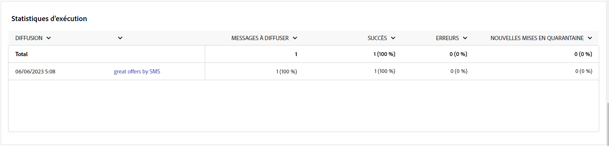

# Rapports de campagne du canal SMS {#campaign-reports-sms-channel}

Chaque rapport de campagne est divisé en différents widgets qui détaillent le succès et les erreurs de votre campagne. Pour le canal SMS, les mesures et les rapports sont détaillés ci-dessous. Découvrez comment accéder aux rapports de campagne sur [cette page](campaign-reports.md).

## Synthèse des diffusions {#delivery-summary-sms}

>[!CONTEXTUALHELP]
>id="acw_campaign_reporting_sms_deliveries_overview"
>title="Vue d’ensemble de la diffusion"
>abstract="Le rapport **Vue d’ensemble de la diffusion** fournit des KPI qui donnent des informations détaillées sur la manière dont vos visiteurs et visiteuses interagissent avec votre diffusion SMS."

Le rapport **[!UICONTROL Vue d’ensemble de la diffusion]** fournit des KPI qui donnent des informations détaillées sur la manière dont vos visiteurs et visiteuses interagissent avec votre diffusion SMS. Les mesures sont détaillées ci-dessous.

{zoomable=&quot;yes&quot;}

+++En savoir plus sur les mesures des rapports de campagne SMS.

* **[!UICONTROL Total envoyé]** : nombre total de messages traités lors de la préparation de la diffusion.

* **[!UICONTROL Délivrés]** : nombre de messages envoyés avec succès, par rapport au nombre total de messages envoyés.

* **[!UICONTROL Erreurs]** : nombre total d’erreurs cumulées lors des diffusions et du traitement automatique des retours par rapport au nombre total de messages envoyés.

* **[!UICONTROL Clics distincts]** : nombre total de destinataires distinct(e)s ayant cliqué dans une diffusion au moins une fois.

+++

### Statistiques initiales sur l’audience cible {#delivery-summary-sms-initial-target}

>[!CONTEXTUALHELP]
>id="acw_campaign_reporting_sms_target"
>title="Statistiques initiales sur l’audience cible"
>abstract="Le tableau **Statistiques initiales sur l’audience cible** affiche des données relatives à vos personnes destinataires."

Le tableau **[!UICONTROL Statistiques initiales sur l’audience cible]** affiche des données relatives à vos destinataires. Les mesures sont détaillées ci-dessous.

{zoomable=&quot;yes&quot;}

+++En savoir plus sur les mesures des rapports de campagne SMS.

* **[!UICONTROL Audience initiale]** : nombre total de destinataires ciblé(e)s.

* **[!UICONTROL Message à diffuser]** : nombre total de messages à diffuser après la préparation de la diffusion.

* **[!UICONTROL Rejetées par les règles]** : nombre d’adresses ignorées pendant l’analyse lors de l’application des règles : adresse manquante, mise en quarantaine, placée sur la liste bloquée, etc.

+++

### Statistiques d’exécution {#delivery-summary-sms-exec-stats}

>[!CONTEXTUALHELP]
>id="acw_campaign_reporting_sms_exec_stats"
>title="Statistiques d’exécution"
>abstract="Le tableau **Statistiques d’exécution** détaille le succès de votre diffusion : messages à diffuser, succès, erreurs et nouvelles mises en quarantaine."

Le tableau **[!UICONTROL Statistiques d’exécution]** détaille le succès de votre diffusion. Les mesures sont détaillées ci-dessous.

{zoomable=&quot;yes&quot;}

+++En savoir plus sur les mesures des rapports de campagne SMS.

* **[!UICONTROL Message à diffuser]** : nombre total de messages à diffuser après la préparation de la diffusion.

* **[!UICONTROL Succès]** : nombre de messages traités avec succès par rapport au nombre de messages à délivrer.

* **[!UICONTROL Erreurs]** : nombre total d’erreurs cumulées lors des diffusions et du traitement automatique des retours par rapport au nombre de messages à délivrer.

* **[!UICONTROL Nouvelles quarantaines]** : nombre total d’adresses mises en quarantaine à la suite d’un échec de diffusion (utilisateurs et utilisatrices inconnus, domaine non valide) par rapport au nombre de messages à diffuser.

  Les types d’erreur de SMS sont répertoriés dans la [documentation d’Adobe Campaign v8 (console cliente)](https://experienceleague.adobe.com/docs/campaign/campaign-v8/send/failures/delivery-failures.html?lang=fr#sms-quarantines){target="_blank"}.

+++

### Flux de clics générés {#delivery-summary-sms-click-streams}

>[!CONTEXTUALHELP]
>id="acw_campaign_reporting_sms_click_streams"
>title="Flux de clics générés"
>abstract="Le tableau **Flux de clics générés** affiche les données disponibles sur les interactions des destinataires avec votre diffusion."

Le tableau **[!UICONTROL Flux de clics générés]** affiche des données relatives à la manière dont vos destinataires ont interagi avec votre diffusion. Les mesures sont détaillées ci-dessous.

{zoomable=&quot;yes&quot;}

+++En savoir plus sur les mesures des rapports de campagne SMS.

* **[!UICONTROL Clics distincts]** : nombre total de destinataires distinct(e)s ayant cliqué dans une diffusion au moins une fois.

* **[!UICONTROL Clics]** : nombre total de clics sur les liens dans les diffusions.

* **[!UICONTROL Réactivité]** : ratio du nombre de personnes destinataires ciblées ayant cliqué dans une diffusion, par rapport à l’estimation du nombre de personnes destinataires ciblées ayant ouvert une diffusion.

+++
