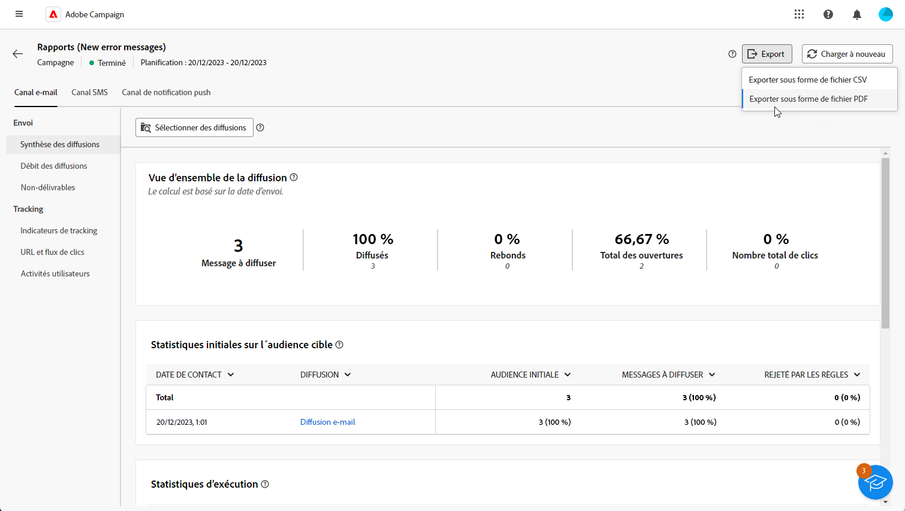

# Prise en main des rapports de campagne {#campaign-reports}

<!-- CAN BE REMOVED___
>[!CONTEXTUALHELP]
>id="acw_campaign_reporting_sending"
>title="Reporting Sending"
>abstract="The Sending tab within your report provides in-depth insights into your visitors' interactions with your deliveries and any potential errors they may have encountered."

>[!CONTEXTUALHELP]
>id="acw_campaign_reporting_tracking"
>title="Reporting tracking"
>abstract="The Tracking tab within your report offers valuable data, including recipient behavior per link, breakdown of opens and clicks, as well as detailed information about the most frequently clicked URLs during a delivery."
-->

La variable **Rapports de campagne** fournir un aperçu complet de votre **campaign**, incorporant toutes les informations pertinentes concernant les différentes diffusions incluses. Ces rapports proposent une analyse approfondie des performances de chaque diffusion, pour chaque canal : taux de succès, engagement de l’audience et autres mesures essentielles. Ils vous permettent d’évaluer l’efficacité globale et l’impact de votre campagne.

La liste complète des rapports et mesures associées pour chaque canal est disponible dans les pages suivantes :

* [Canal de campagne par e-mail](campaign-reports-email.md)
* [Canal de campagne SMS](campaign-reports-sms.md)
* [Canal de campagne push](campaign-reports-push.md)

## Gérer le tableau de bord des rapports {#manage-reports}

Pour accéder aux rapports de vos campagnes et les gérer, procédez comme suit :

1. Accédez au **[!UICONTROL Campagnes]** . Cliquez sur le bouton **Rapports** du tableau de bord de votre campagne.

   

   Vous pouvez également utiliser les trois points. **Autres actions** en regard du nom de l&#39;opération dans la liste des opérations et sélectionnez **[!UICONTROL Afficher le rapport]**.

   

1. Dans le menu de gauche, sélectionnez un rapport dans la liste et naviguez dans l’onglet pour afficher les données de chaque canal.

   

1. Dans votre tableau de bord, cliquez sur **[!UICONTROL Sélectionner les diffusions]** si vous souhaitez cibler une diffusion spécifique incluse dans votre campagne.

1. Dans le **[!UICONTROL Débit de diffusion]** , choisissez une **Début** et **[!UICONTROL Heure de fin]** pour cibler des données spécifiques.

   

1. Dans la **[!UICONTROL Choisir le dossier]** , choisissez si vous souhaitez cibler des diffusions ou des campagnes à partir d’un dossier spécifique.

   Vous pouvez également sélectionner **[!UICONTROL Ajouter des règles]** pour commencer à créer des requêtes afin de mieux filtrer les données de reporting. [Découvrez comment utiliser le créateur de modèles de requête](../query/query-modeler-overview.md)

   

1. Dans la **[!UICONTROL URL et flux de clics]**, vous pouvez également choisir la variable **[!UICONTROL Liens les plus visités]** ou le **[!UICONTROL Période]**.

   La variable **[!UICONTROL Afficher par]** Les options vous permettent de filtrer selon les URL, les libellés ou les catégories.

## Exportation des rapports {#export-reports}

Vous pouvez facilement exporter vos différents rapports au format PDF ou CSV, ce qui vous permet de les partager, de les manipuler ou de les imprimer.

1. Dans votre rapport, cliquez sur **[!UICONTROL Exporter]** et sélectionnez **[!UICONTROL Exporter en tant que fichier PDF]** ou **[!UICONTROL Exportation au format CSV]**.

   

1. Localisez le dossier dans lequel vous souhaitez enregistrer votre fichier, renommez-le si nécessaire, puis cliquez sur **[!UICONTROL Enregistrer]**.

Votre rapport peut désormais être affiché ou partagé dans un PDF ou fichier CSV.

