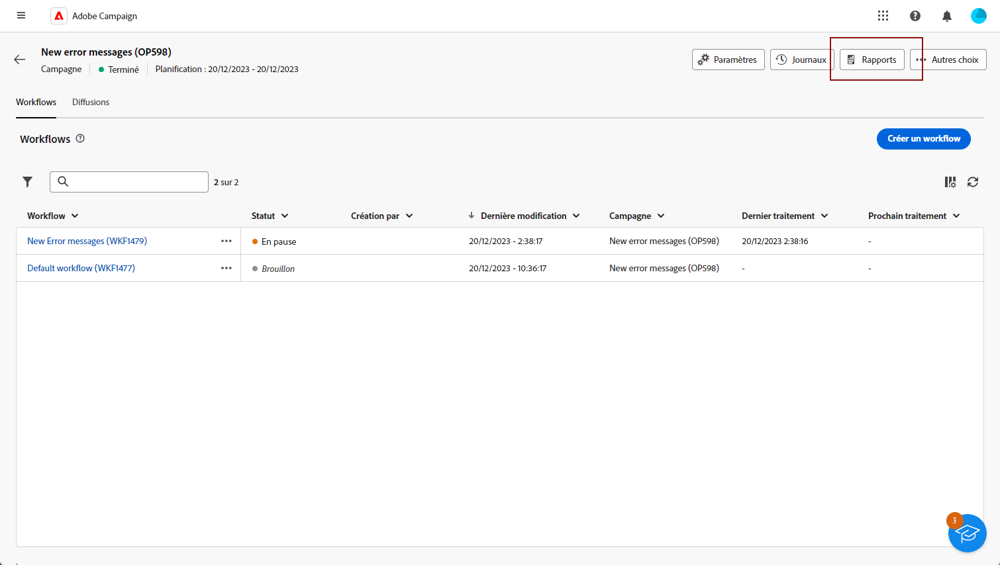
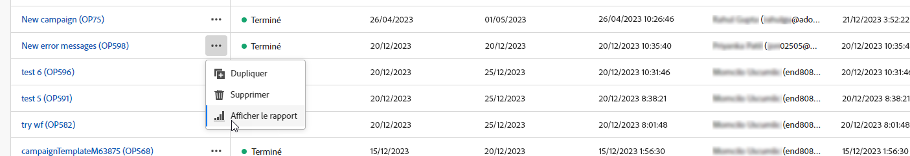
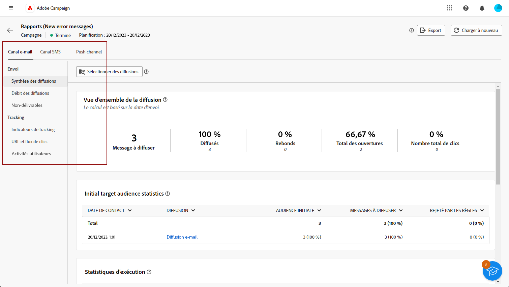
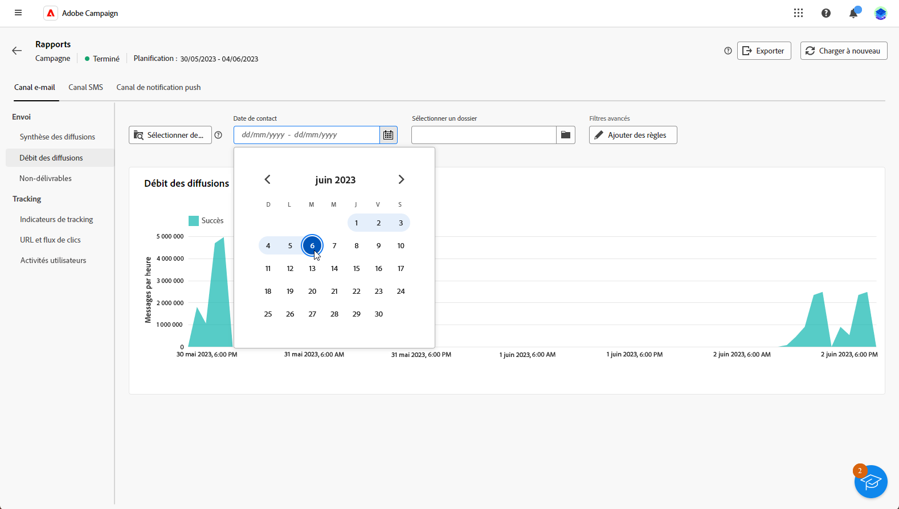

# Prise en main des rapports de campagne {#campaign-reports}

<!-- CAN BE REMOVED___
>[!CONTEXTUALHELP]
>id="acw_campaign_reporting_sending"
>title="Reporting Sending"
>abstract="The Sending tab within your report provides in-depth insights into your visitors' interactions with your deliveries and any potential errors they may have encountered."

>[!CONTEXTUALHELP]
>id="acw_campaign_reporting_tracking"
>title="Reporting tracking"
>abstract="The Tracking tab within your report offers valuable data, including recipient behavior per link, breakdown of opens and clicks, as well as detailed information about the most frequently clicked URLs during a delivery."
-->

Les **rapports de campagne** fournissent une vue d’ensemble complète de votre **campagne**, intégrant toutes les informations pertinentes concernant les différentes diffusions incluses. Ces rapports proposent une analyse approfondie des performances de chaque diffusion, pour chaque canal : taux de succès, engagement de l’audience et autres mesures essentielles. Ils vous permettent d’évaluer l’efficacité globale et l’impact de votre campagne.

La liste complète des rapports et mesures associées pour chaque canal est disponible dans les pages suivantes :

* [Canal de campagne par e-mail](campaign-reports-email.md)
* [Canal de campagne par SMS](campaign-reports-sms.md)
* [Canal de campagne par notification push](campaign-reports-push.md)

## Gérer votre tableau de bord des rapports {#manage-reports}

Pour accéder à vos rapports de campagne et les gérer, procédez comme suit :

1. Accédez au menu **[!UICONTROL Campagnes]**. Cliquez sur le bouton **Rapports** dans le tableau de bord de votre campagne.

   

   Vous pouvez également utiliser les trois points **Plus d’actions** en regard du nom de la campagne dans la liste des campagnes et sélectionner **[!UICONTROL Afficher le rapport]**.

   

1. Dans le menu de gauche, sélectionnez un rapport dans la liste et naviguez dans l’onglet pour afficher les données de chaque canal.

   

1. Dans votre tableau de bord, cliquez sur **[!UICONTROL Sélectionner des diffusions]** si vous souhaitez cibler une diffusion spécifique incluse dans votre campagne.

1. Dans le menu **[!UICONTROL Débit de diffusion]**, choisissez une **Heure de début** et une **[!UICONTROL Heure de fin]** pour cibler des données spécifiques.

   

1. Dans le champ **[!UICONTROL Sélectionner un dossier]**, choisissez si vous souhaitez cibler des diffusions ou une campagne d’un dossier spécifique.

   Vous pouvez également sélectionner **[!UICONTROL Ajouter des règles]** pour commencer à créer des requêtes afin de mieux filtrer les données de rapport. [Découvrez comment utiliser le concepteur de requête](../query/query-modeler-overview.md)

   

1. Dans **[!UICONTROL URL et flux de clics]**, vous pouvez également choisir **[!UICONTROL Liens les plus visités]** ou **[!UICONTROL Période]**.

   Les options **[!UICONTROL Afficher par]** vous permettent de filtrer sur des URL, des libellés ou des catégories.
