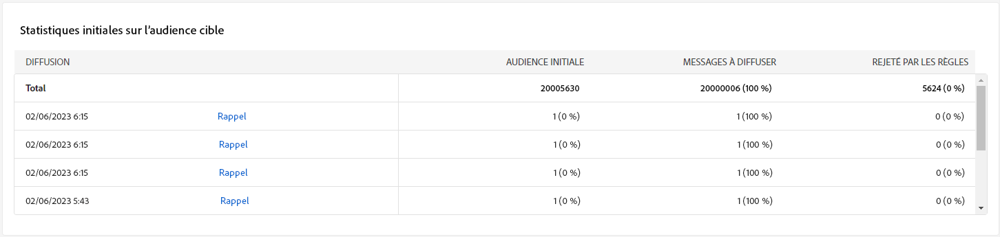

# Rapports de campagne {#campaign-reports}

Le rapport Campagne est divisé en différents widgets qui détaillent le succès et les erreurs de votre campagne.

La page du rapport Campagne s&#39;affiche avec les onglets suivants :

* [Canal email](#email-channel)
* [Canal SMS](#sms-channel)
* [Canal de notification push](#push-channel)

Pour accéder au rapport Campagne , cliquez sur Rapports dans le tableau de bord de votre campagne.

## Canal e-mail {#email-channel}

### Synthèse des diffusions {#delivery-summary-email}

* **[!UICONTROL Présentation de la diffusion]** fournit des indicateurs de performances clés (IPC) qui fournissent des informations détaillées sur la manière dont vos visiteurs interagissent avec votre diffusion par e-mail.

  

  +++En savoir plus sur les mesures des rapports de campagne par e-mail.

   * **[!UICONTROL Total envoyé]**: Nombre total de messages traités lors de l&#39;analyse de la diffusion.

   * **[!UICONTROL Délivrés]** : nombre de messages envoyés avec succès, par rapport au nombre total de messages envoyés.

   * **[!UICONTROL Rebonds]**: Nombre total d&#39;erreurs cumulées lors des diffusions et du traitement automatique des retours par rapport au nombre total de messages envoyés.

   * **[!UICONTROL Ouvertures distinctes]**: Nombre total de destinataires ciblés ayant ouvert au moins une fois un même message.

   * **[!UICONTROL Clics distincts]**: Nombre total de destinataires distincts ayant cliqué au moins une fois dans une même diffusion.

+++

* **[!UICONTROL Statistiques initiales d’audience cible]** Le tableau affiche les données relatives à vos destinataires :

  

  +++En savoir plus sur les mesures des rapports de campagne par e-mail.

   * **[!UICONTROL Audience initiale]**: Nombre total de destinataires ciblés.

   * **[!UICONTROL Message à diffuser]**: Nombre total de messages à diffuser après l&#39;analyse de la diffusion.

   * **[!UICONTROL Rejetés par les règles]**: Nombre total d&#39;adresses ignorées lors de l&#39;analyse lors de l&#39;application des règles : adresse manquante, en quarantaine, à liste bloquée, etc.

+++

* **[!UICONTROL Statistiques d&#39;exécution]** le tableau décrit le succès de votre diffusion.

  

  +++En savoir plus sur les mesures des rapports de campagne par e-mail.

   * **[!UICONTROL Message à diffuser]**: Nombre total de messages à diffuser après l&#39;analyse de la diffusion.

   * **[!UICONTROL Succès]**: Nombre de messages traités avec succès par rapport au nombre de messages à diffuser.

   * **[!UICONTROL Erreurs]**: Nombre total d&#39;erreurs cumulées lors des diffusions et du traitement automatique des retours par rapport au nombre de messages à diffuser.

   * **[!UICONTROL Nouvelles quarantaines]**: Nombre total d&#39;adresses mises en quarantaine à la suite d&#39;un échec de diffusion (utilisateur inconnu, domaine invalide) par rapport au nombre de messages à diffuser.

+++

* **[!UICONTROL Statistiques de réaction]** contient les données disponibles pour l&#39;activité des destinataires pour votre diffusion.

  

  +++En savoir plus sur les mesures des rapports de campagne par e-mail.

   * **[!UICONTROL Ouvertures distinctes]**: Nombre total de destinataires ciblés ayant ouvert au moins une fois un même message.

   * **[!UICONTROL Ouvertures]**: Nombre de destinataires ciblés distincts, pour ce domaine, ayant ouvert au moins une fois un même message.

   * **[!UICONTROL Désabonnements]**: Nombre de destinataires ayant cliqué sur les désinscriptions pour la période correspondante.

   * **[!UICONTROL Page miroir]**: Nombre de destinataires ayant cliqué sur le lien de la page miroir.

   * **[!UICONTROL Transférer]**: Nombre de destinataires ayant cliqué et ayant transféré l&#39;email.
+++

* **[!UICONTROL Flux de clics générés]** Le tableau affiche des données relatives à la manière dont vos destinataires ont interagi avec votre diffusion.

  

  +++En savoir plus sur les mesures des rapports de campagne par e-mail.

   * **[!UICONTROL Clics distincts]**: Nombre total de destinataires distincts ayant cliqué au moins une fois dans une même diffusion.

   * **[!UICONTROL Clics]**: Nombre total de clics sur les liens dans les diffusions.

   * **[!UICONTROL Réactivité]**: Ratio du nombre de destinataires ciblés ayant cliqué dans une diffusion, par rapport à l&#39;estimation du nombre de destinataires ciblés ayant ouvert une diffusion.

+++

### Non délivrables {#non-deliverables-email}

* **[!UICONTROL Ventilation des erreurs par type]** et **[!UICONTROL Ventilation des erreurs par domaine]** les tableaux et les graphiques contiennent les données disponibles pour les erreurs possibles rencontrées pour chaque domaine.

  

  +++En savoir plus sur les mesures des rapports de campagne par e-mail.

   * **[!UICONTROL Utilisateur inconnu]** : Type d&#39;erreur générée lors de l&#39;envoi d&#39;une diffusion indiquant que l&#39;adresse email est invalide.

   * **[!UICONTROL Domaine invalide]** : Type d&#39;erreur générée lors de l&#39;envoi d&#39;une diffusion indiquant que le domaine de l&#39;adresse email est erroné ou n&#39;existe plus.

   * **[!UICONTROL Boîte pleine]**: Type d’erreur généré après cinq tentatives de diffusion pour indiquer que la boîte de réception du destinataire contient trop de messages.

   * **[!UICONTROL Compte désactivé]** : Type d&#39;erreur générée lors de l&#39;envoi d&#39;une diffusion indiquant que l&#39;adresse n&#39;existe plus.

   * **[!UICONTROL Refusés]**: Type d&#39;erreur générée lorsqu&#39;une adresse est refusée par l&#39;IAP (Fournisseur d&#39;Accès Internet), par exemple suite à l&#39;application d&#39;une règle de sécurité (logiciel anti-spam).

   * **[!UICONTROL Inatteignable]** : Type d&#39;erreur survenue dans la chaîne de distribution du message : incident sur le relais SMTP, domaine temporairement inatteignable, etc.

   * **[!UICONTROL Non connecté]**: Type d&#39;erreur indiquant que le téléphone portable du destinataire est éteint ou déconnecté du réseau au moment de l&#39;envoi.

+++

### Indicateurs de tracking {#tracking-indicators-email}

* **[!UICONTROL Statistiques de diffusion]** fournit des indicateurs de performances clés (IPC) qui fournissent des informations détaillées sur les données disponibles pour les emails envoyés.

  

  +++En savoir plus sur les mesures des rapports de campagne par e-mail.

   * **[!UICONTROL Succès]**: Nombre de messages traités avec succès par rapport au nombre de messages à diffuser.

   * **[!UICONTROL Ouvertures distinctes]**: Nombre total de destinataires ciblés ayant ouvert au moins une fois un même message.

   * **[!UICONTROL Ouvertures]**: Nombre de destinataires ciblés distincts, pour ce domaine, ayant ouvert au moins une fois un même message.

   * **[!UICONTROL Clics sur le lien d’exclusion]**: Nombre de clics sur le lien de désinscription.

   * **[!UICONTROL Clics sur le lien miroir]**: Nombre de clics sur le lien vers la page miroir.

   * **[!UICONTROL Estimation des transferts]**: Estimation du nombre d&#39;emails transférés par les destinataires ciblés.
+++

* **[!UICONTROL Statistiques initiales d’audience cible]** affiche des données relatives à vos destinataires.

  

  +++En savoir plus sur les mesures des rapports de campagne par e-mail.

   * **[!UICONTROL Envoyé]**: Nombre total de messages envoyés.

   * **[!UICONTROL Plaintes]**: Nombre de messages pour ce domaine qui ont été signalés par le destinataire comme indésirables.

   * **[!UICONTROL Ouvertures]**: Nombre de destinataires ciblés distincts, pour ce domaine, ayant ouvert au moins une fois un même message.

   * **[!UICONTROL Clics]**: Nombre de destinataires ciblés distincts ayant cliqué au moins une fois dans une même diffusion.

   * **[!UICONTROL Réactivité brute]** : Pourcentage du nombre de destinataires ayant cliqué au moins une fois dans une même diffusion par rapport au nombre de destinataires ayant ouvert au moins une fois une même diffusion.
+++

### URL et flux de clics {#url-email}

* **[!UICONTROL URL et flux de clics]** fournit des indicateurs de performances clés (IPC) qui fournissent des informations détaillées sur les URL qui ont reçu le plus grand nombre de clics lors d’une diffusion.

  

  +++En savoir plus sur les mesures des rapports de campagne par e-mail.

   * **[!UICONTROL Réactivité]**: Ratio du nombre de destinataires ciblés ayant cliqué dans une diffusion, par rapport à l&#39;estimation du nombre de destinataires ciblés ayant ouvert une diffusion.

   * **[!UICONTROL Clics distincts]**: Nombre total de destinataires distincts ayant cliqué au moins une fois dans une même diffusion.

   * **[!UICONTROL Clics]**: Nombre total de clics sur les liens dans les diffusions.

+++

* **[!UICONTROL 10 liens les plus consultés]** Le graphique et le tableau contiennent les données disponibles pour le comportement des destinataires par lien.

  

  +++En savoir plus sur les mesures des rapports de campagne par e-mail.

   * **[!UICONTROL Clics]**: Nombre total de clics sur les liens dans les diffusions.

   * **[!UICONTROL Pourcentage]**: Pourcentage d&#39;utilisateurs ayant interagi avec la diffusion.

+++

* **[!UICONTROL Répartition des clics au fil du temps]** Le graphique contient les données disponibles sur le comportement des destinataires par lien.

  

### Activités utilisateurs {#user-activities-email}

* **[!UICONTROL Activités utilisateurs]** affiche la répartition des ouvertures et clics sous la forme d&#39;un graphique.

  

  +++En savoir plus sur les mesures des rapports de campagne par e-mail.

   * **[!UICONTROL Clics]**: Nombre total de clics sur les liens dans les diffusions.

   * **[!UICONTROL Ouvertures]**: Nombre de destinataires ciblés distincts, pour ce domaine, ayant ouvert au moins une fois un même message.

+++

## Canal SMS {#sms-channel}

### Synthèse des diffusions {#delivery-summary-sms}

* **[!UICONTROL Présentation de la diffusion]** fournit des indicateurs de performances clés (IPC) qui fournissent des informations détaillées sur la manière dont vos visiteurs interagissent avec votre diffusion SMS.

  

  +++En savoir plus sur les mesures des rapports de campagne SMS.

   * **[!UICONTROL Total envoyé]**: Nombre total de messages traités lors de l&#39;analyse de la diffusion.

   * **[!UICONTROL Délivrés]** : nombre de messages envoyés avec succès, par rapport au nombre total de messages envoyés.

   * **[!UICONTROL Erreurs]**: Nombre total d&#39;erreurs cumulées lors des diffusions et du traitement automatique des retours par rapport au nombre total de messages envoyés.

   * **[!UICONTROL Clics distincts]**: Nombre total de destinataires distincts ayant cliqué au moins une fois dans une même diffusion.

+++

* **[!UICONTROL Statistiques initiales d’audience cible]** Le tableau affiche les données relatives à vos destinataires :

  

  +++En savoir plus sur les mesures des rapports de campagne SMS.

   * **[!UICONTROL Audience initiale]**: Nombre total de destinataires ciblés.

   * **[!UICONTROL Message à diffuser]**: Nombre total de messages à diffuser après l&#39;analyse de la diffusion.

   * **[!UICONTROL Rejetés par les règles]**: Nombre total d&#39;adresses ignorées lors de l&#39;analyse lors de l&#39;application des règles : adresse manquante, en quarantaine, à liste bloquée, etc.

+++

* **[!UICONTROL Statistiques d&#39;exécution]** le tableau détaille le succès de votre diffusion :

  

  +++En savoir plus sur les mesures des rapports de campagne SMS.

   * **[!UICONTROL Message à diffuser]**: Nombre total de messages à diffuser après l&#39;analyse de la diffusion.

   * **[!UICONTROL Succès]**: Nombre de messages traités avec succès par rapport au nombre de messages à diffuser.

   * **[!UICONTROL Erreurs]**: Nombre total d&#39;erreurs cumulées lors des diffusions et du traitement automatique des retours par rapport au nombre de messages à diffuser.

   * **[!UICONTROL Nouvelles quarantaines]**: Nombre total d&#39;adresses mises en quarantaine à la suite d&#39;un échec de diffusion (utilisateur inconnu, domaine invalide) par rapport au nombre de messages à diffuser.

+++

* **[!UICONTROL Flux de clics générés]** Le tableau affiche des données relatives à la manière dont vos destinataires ont interagi avec votre diffusion :

  

  +++En savoir plus sur les mesures des rapports de campagne SMS.

   * **[!UICONTROL Clics distincts]**: Nombre total de destinataires distincts ayant cliqué au moins une fois dans une même diffusion.

   * **[!UICONTROL Clics]**: Nombre total de clics sur les liens dans les diffusions.

   * **[!UICONTROL Réactivité]**: Ratio du nombre de destinataires ciblés ayant cliqué dans une diffusion, par rapport à l&#39;estimation du nombre de destinataires ciblés ayant ouvert une diffusion.

+++

## Canal de notification push {#push-channel}

### Synthèse des diffusions {#delivery-summary-push}

* **[!UICONTROL Présentation de la diffusion]** fournit des indicateurs de performances clés (IPC) qui fournissent des informations détaillées sur la manière dont vos visiteurs interagissent avec votre diffusion de notification push.

  +++En savoir plus sur les mesures des rapports de campagne push.

   * **[!UICONTROL Total envoyé]**: Nombre total de messages traités lors de l&#39;analyse de la diffusion.

   * **[!UICONTROL Délivrés]** : nombre de messages envoyés avec succès, par rapport au nombre total de messages envoyés.

   * **[!UICONTROL Erreurs]**: Nombre total d&#39;erreurs cumulées lors des diffusions et du traitement automatique des retours par rapport au nombre total de messages envoyés.

   * **[!UICONTROL Clics distincts]**: Nombre total de destinataires distincts ayant cliqué au moins une fois dans une même diffusion.

+++

* **[!UICONTROL Statistiques initiales d’audience cible]** Le tableau affiche les données relatives à vos destinataires :

  +++En savoir plus sur les mesures des rapports de campagne push.

   * **[!UICONTROL Audience initiale]**: Nombre total de destinataires ciblés.

   * **[!UICONTROL Message à diffuser]**: Nombre total de messages à diffuser après l&#39;analyse de la diffusion.

   * **[!UICONTROL Rejetés par les règles]**: Nombre total d&#39;adresses ignorées lors de l&#39;analyse lors de l&#39;application des règles : adresse manquante, en quarantaine, à liste bloquée, etc.

+++

* **[!UICONTROL Statistiques d&#39;exécution]** le tableau détaille le succès de votre diffusion :

  +++En savoir plus sur les mesures des rapports de campagne push.

   * **[!UICONTROL Message à diffuser]**: Nombre total de messages à diffuser après l&#39;analyse de la diffusion.

   * **[!UICONTROL Succès]**: Nombre de messages traités avec succès par rapport au nombre de messages à diffuser.

   * **[!UICONTROL Erreurs]**: Nombre total d&#39;erreurs cumulées lors des diffusions et du traitement automatique des retours par rapport au nombre de messages à diffuser.

   * **[!UICONTROL Nouvelles quarantaines]**: Nombre total d&#39;adresses mises en quarantaine à la suite d&#39;un échec de diffusion (utilisateur inconnu, domaine invalide) par rapport au nombre de messages à diffuser.

+++

* **[!UICONTROL Flux de clics générés]** Le tableau affiche des données relatives à la manière dont vos destinataires ont interagi avec votre diffusion :

  +++En savoir plus sur les mesures des rapports de campagne push.

   * **[!UICONTROL Clics distincts]**: Nombre total de destinataires distincts ayant cliqué au moins une fois dans une même diffusion.

   * **[!UICONTROL Clics]**: Nombre total de clics sur les liens dans les diffusions.

   * **[!UICONTROL Réactivité]**: Ratio du nombre de destinataires ciblés ayant cliqué dans une diffusion, par rapport à l&#39;estimation du nombre de destinataires ciblés ayant ouvert une diffusion.

+++
