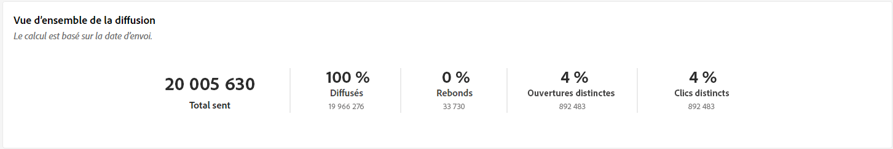
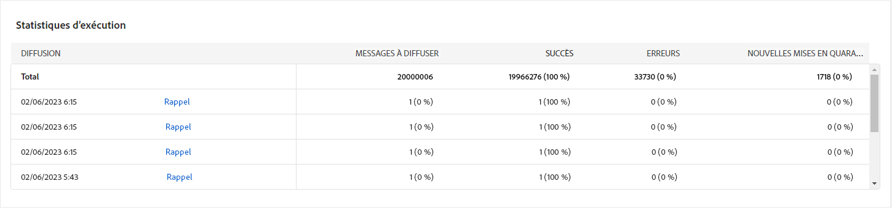
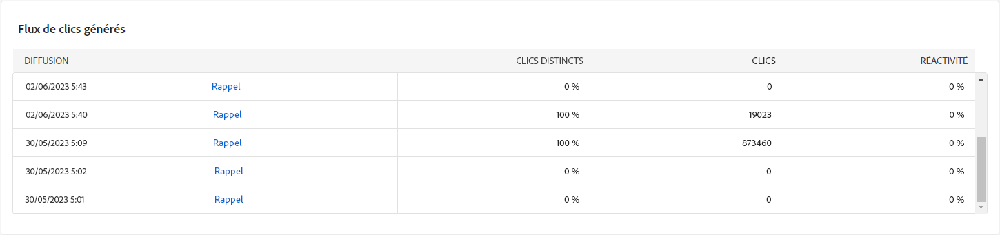

# Rapports de campagne {#campaign-reports}

## Canal e-mail {#email-channel}

### Synthèse des diffusions {#delivery-summary-email}

* **[!UICONTROL Présentation de la diffusion]** fournit des indicateurs de performances clés (IPC) qui fournissent des informations détaillées sur la manière dont vos visiteurs interagissent avec votre diffusion par e-mail.

  +++En savoir plus sur les mesures des rapports de campagne par e-mail.

   * **[!UICONTROL Total envoyé]**: Nombre total de messages traités lors de l&#39;analyse de la diffusion.

   * **[!UICONTROL Délivrés]** : nombre de messages envoyés avec succès, par rapport au nombre total de messages envoyés.

   * **[!UICONTROL Rebonds]**: Nombre total d&#39;erreurs cumulées lors des diffusions et du traitement automatique des retours par rapport au nombre total de messages envoyés.

   * **[!UICONTROL Ouvertures distinctes]**: Nombre total de destinataires ciblés ayant ouvert au moins une fois un même message.

   * **[!UICONTROL Clics distincts]**: Nombre total de destinataires distincts ayant cliqué au moins une fois dans une même diffusion.

+++

  

* **[!UICONTROL Statistiques initiales sur l´audience cible]**

  +++En savoir plus sur les mesures des rapports de campagne par e-mail.

   * **[!UICONTROL Audience initiale]**: Nombre total de destinataires ciblés.

   * **[!UICONTROL Message à diffuser]**: Nombre total de messages à diffuser après l&#39;analyse de la diffusion.

   * **[!UICONTROL Rejetés par les règles]**: Nombre total d&#39;adresses ignorées lors de l&#39;analyse lors de l&#39;application des règles : adresse manquante, en quarantaine, à liste bloquée, etc.

+++

  

* **[!UICONTROL Statistiques d’exécution]**

  +++En savoir plus sur les mesures des rapports de campagne par e-mail.

   * **[!UICONTROL Message à diffuser]**: Nombre total de messages à diffuser après l&#39;analyse de la diffusion.

   * **[!UICONTROL Succès]**: Nombre de messages traités avec succès par rapport au nombre de messages à diffuser.

   * **[!UICONTROL Erreurs]**: Nombre total d&#39;erreurs cumulées lors des diffusions et du traitement automatique des retours par rapport au nombre de messages à diffuser.

   * **[!UICONTROL Nouvelles quarantaines]**: Nombre total d&#39;adresses mises en quarantaine à la suite d&#39;un échec de diffusion (utilisateur inconnu, domaine invalide) par rapport au nombre de messages à diffuser.

+++

  

* **[!UICONTROL Statistiques des réactions]**

  +++En savoir plus sur les mesures des rapports de campagne par e-mail.

   * **[!UICONTROL Ouvertures distinctes]**: Nombre total de destinataires ciblés ayant ouvert au moins une fois un même message.

   * **[!UICONTROL Ouvertures]**: Nombre de destinataires ciblés distincts, pour ce domaine, ayant ouvert au moins une fois un même message.

   * **[!UICONTROL Désabonnements]**: Nombre de destinataires ayant cliqué sur les désinscriptions pour la période correspondante.

   * **[!UICONTROL Page miroir]**: Nombre de destinataires ayant cliqué sur le lien de la page miroir.

   * **[!UICONTROL Transférer]**: Nombre de destinataires ayant cliqué et ayant transféré l&#39;email.

  
+++

* **[!UICONTROL Flux de clics générés]**

  

  +++En savoir plus sur les mesures des rapports de campagne par e-mail.

   * **[!UICONTROL Clics distincts]**: Nombre total de destinataires distincts ayant cliqué au moins une fois dans une même diffusion.

   * **[!UICONTROL Clics]**: Nombre total de clics sur les liens dans les diffusions.

   * **[!UICONTROL Réactivité]**: Ratio du nombre de destinataires ciblés ayant cliqué dans une diffusion, par rapport à l&#39;estimation du nombre de destinataires ciblés ayant ouvert une diffusion.

+++

### Non délivrables {#non-deliverables-email}

* **[!UICONTROL Ventilation des erreurs par type]** et **[!UICONTROL Répartition des erreurs par navigateur]**

  +++En savoir plus sur les mesures des rapports de campagne par e-mail.

   * **[!UICONTROL Erreurs]**: Nombre total d&#39;erreurs cumulées lors des diffusions et du traitement automatique des retours, par rapport au nombre de messages à diffuser.

   * **[!UICONTROL Contribution]**:

   * **[!UICONTROL Répartition]**:

+++

  

### Indicateurs de tracking {#tracking-indicators-email}

* **[!UICONTROL Statistiques de diffusion]**

  +++En savoir plus sur les mesures des rapports de campagne par e-mail.

   * **[!UICONTROL Succès]**: Nombre de messages traités avec succès par rapport au nombre de messages à diffuser.

   * **[!UICONTROL Ouvertures distinctes]**: Nombre total de destinataires ciblés ayant ouvert au moins une fois un même message.

   * **[!UICONTROL Ouvertures]**: Nombre de destinataires ciblés distincts, pour ce domaine, ayant ouvert au moins une fois un même message.

   * **[!UICONTROL Clics sur le lien d’exclusion]**: Nombre de clics sur le lien de désinscription.

   * **[!UICONTROL Clics sur le lien miroir]**: Nombre de clics sur le lien vers la page miroir.

   * **[!UICONTROL Estimation des transferts]**: Estimation du nombre d&#39;emails transférés par les destinataires ciblés.
+++

  

* **[!UICONTROL Taux d&#39;ouverture et de clic]**

  +++En savoir plus sur les mesures des rapports de campagne par e-mail.

   * **[!UICONTROL Envoyé]**: Nombre total de messages envoyés.

   * **[!UICONTROL Plaintes]**: Nombre de messages pour ce domaine qui ont été signalés par le destinataire comme indésirables.

   * **[!UICONTROL Ouvertures]**: Nombre de destinataires ciblés distincts, pour ce domaine, ayant ouvert au moins une fois un même message.

   * **[!UICONTROL Clics]**: Nombre de destinataires ciblés distincts ayant cliqué au moins une fois dans une même diffusion.

   * **[!UICONTROL Réactivité brute]** : Pourcentage du nombre de destinataires ayant cliqué au moins une fois dans une même diffusion par rapport au nombre de destinataires ayant ouvert au moins une fois une même diffusion.
+++

  

### URL et flux de clics {#url-email}

* **[!UICONTROL URL et flux de clics]**

  +++En savoir plus sur les mesures des rapports de campagne par e-mail.

   * **[!UICONTROL Réactivité]**: Ratio du nombre de destinataires ciblés ayant cliqué dans une diffusion, par rapport à l&#39;estimation du nombre de destinataires ciblés ayant ouvert une diffusion.

   * **[!UICONTROL Clics distincts]**: Nombre total de destinataires distincts ayant cliqué au moins une fois dans une même diffusion.

   * **[!UICONTROL Clics]**: Nombre total de clics sur les liens dans les diffusions.

+++

  

* **[!UICONTROL Top 10 des liens les plus visités]**

  +++En savoir plus sur les mesures des rapports de campagne par e-mail.

   * **[!UICONTROL Clics]**: Nombre total de clics sur les liens dans les diffusions.

   * **[!UICONTROL Pourcentage]**: Pourcentage d&#39;utilisateurs ayant interagi avec la diffusion.

+++

  

* **[!UICONTROL Répartition des clics au fil du temps]**, nombre de clics

  

### Activités utilisateurs {#user-activities-email}

* **[!UICONTROL Activités utilisateurs]**

   * **[!UICONTROL Clics]**: Nombre total de clics sur les liens dans les diffusions.

   * **[!UICONTROL Ouvertures]**: Nombre de destinataires ciblés distincts, pour ce domaine, ayant ouvert au moins une fois un même message.

+++

  

## Canal SMS {#sms-channel}

### Synthèse des diffusions {#delivery-summary-sms}

* **[!UICONTROL Présentation de la diffusion]** fournit des indicateurs de performances clés (IPC) qui fournissent des informations détaillées sur la manière dont vos visiteurs interagissent avec votre diffusion SMS.

  +++En savoir plus sur les mesures des rapports de campagne SMS.

   * **[!UICONTROL Total envoyé]**: Nombre total de messages traités lors de l&#39;analyse de la diffusion.

   * **[!UICONTROL Délivrés]** : nombre de messages envoyés avec succès, par rapport au nombre total de messages envoyés.

   * **[!UICONTROL Erreurs]**: Nombre total d&#39;erreurs cumulées lors des diffusions et du traitement automatique des retours par rapport au nombre total de messages envoyés.

   * **[!UICONTROL Clics distincts]**: Nombre total de destinataires distincts ayant cliqué au moins une fois dans une même diffusion.

+++

* **[!UICONTROL Statistiques initiales sur l´audience cible]**

  +++En savoir plus sur les mesures des rapports de campagne SMS.

   * **[!UICONTROL Audience initiale]**: Nombre total de destinataires ciblés.

   * **[!UICONTROL Message à diffuser]**: Nombre total de messages à diffuser après l&#39;analyse de la diffusion.

   * **[!UICONTROL Rejetés par les règles]**: Nombre total d&#39;adresses ignorées lors de l&#39;analyse lors de l&#39;application des règles : adresse manquante, en quarantaine, à liste bloquée, etc.

+++

* **[!UICONTROL Statistiques d’exécution]**

  +++En savoir plus sur les mesures des rapports de campagne SMS.

   * **[!UICONTROL Message à diffuser]**: Nombre total de messages à diffuser après l&#39;analyse de la diffusion.

   * **[!UICONTROL Succès]**: Nombre de messages traités avec succès par rapport au nombre de messages à diffuser.

   * **[!UICONTROL Erreurs]**: Nombre total d&#39;erreurs cumulées lors des diffusions et du traitement automatique des retours par rapport au nombre de messages à diffuser.

   * **[!UICONTROL Nouvelles quarantaines]**: Nombre total d&#39;adresses mises en quarantaine à la suite d&#39;un échec de diffusion (utilisateur inconnu, domaine invalide) par rapport au nombre de messages à diffuser.

+++

* **[!UICONTROL Flux de clics générés]**

  +++En savoir plus sur les mesures des rapports de campagne SMS.

   * **[!UICONTROL Clics distincts]**: Nombre total de destinataires distincts ayant cliqué au moins une fois dans une même diffusion.

   * **[!UICONTROL Clics]**: Nombre total de clics sur les liens dans les diffusions.

   * **[!UICONTROL Réactivité]**: Ratio du nombre de destinataires ciblés ayant cliqué dans une diffusion, par rapport à l&#39;estimation du nombre de destinataires ciblés ayant ouvert une diffusion.

+++

## Canal de notification push {#push-channel}

### Synthèse des diffusions {#delivery-summary-push}

* **[!UICONTROL Présentation de la diffusion]** fournit des indicateurs de performances clés (IPC) qui fournissent des informations détaillées sur la manière dont vos visiteurs interagissent avec votre diffusion de notification push.

  +++En savoir plus sur les mesures des rapports de campagne push.

   * **[!UICONTROL Total envoyé]**: Nombre total de messages traités lors de l&#39;analyse de la diffusion.

   * **[!UICONTROL Délivrés]** : nombre de messages envoyés avec succès, par rapport au nombre total de messages envoyés.

   * **[!UICONTROL Erreurs]**: Nombre total d&#39;erreurs cumulées lors des diffusions et du traitement automatique des retours par rapport au nombre total de messages envoyés.

   * **[!UICONTROL Clics distincts]**: Nombre total de destinataires distincts ayant cliqué au moins une fois dans une même diffusion.

+++

* **[!UICONTROL Statistiques initiales sur l´audience cible]**

  +++En savoir plus sur les mesures des rapports de campagne push.

   * **[!UICONTROL Audience initiale]**: Nombre total de destinataires ciblés.

   * **[!UICONTROL Message à diffuser]**: Nombre total de messages à diffuser après l&#39;analyse de la diffusion.

   * **[!UICONTROL Rejetés par les règles]**: Nombre total d&#39;adresses ignorées lors de l&#39;analyse lors de l&#39;application des règles : adresse manquante, en quarantaine, à liste bloquée, etc.

+++

* **[!UICONTROL Statistiques d’exécution]**

  +++En savoir plus sur les mesures des rapports de campagne push.

   * **[!UICONTROL Message à diffuser]**: Nombre total de messages à diffuser après l&#39;analyse de la diffusion.

   * **[!UICONTROL Succès]**: Nombre de messages traités avec succès par rapport au nombre de messages à diffuser.

   * **[!UICONTROL Erreurs]**: Nombre total d&#39;erreurs cumulées lors des diffusions et du traitement automatique des retours par rapport au nombre de messages à diffuser.

   * **[!UICONTROL Nouvelles quarantaines]**: Nombre total d&#39;adresses mises en quarantaine à la suite d&#39;un échec de diffusion (utilisateur inconnu, domaine invalide) par rapport au nombre de messages à diffuser.

+++

* **[!UICONTROL Flux de clics générés]**

  +++En savoir plus sur les mesures des rapports de campagne push.

   * **[!UICONTROL Clics distincts]**: Nombre total de destinataires distincts ayant cliqué au moins une fois dans une même diffusion.

   * **[!UICONTROL Clics]**: Nombre total de clics sur les liens dans les diffusions.

   * **[!UICONTROL Réactivité]**: Ratio du nombre de destinataires ciblés ayant cliqué dans une diffusion, par rapport à l&#39;estimation du nombre de destinataires ciblés ayant ouvert une diffusion.

+++
