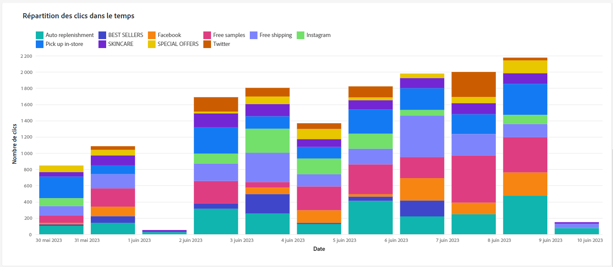
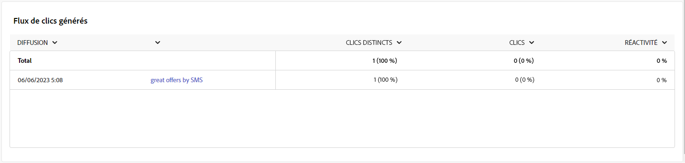

# Rapports de campagne {#campaign-reports}

>[!CONTEXTUALHELP]
>id="acw_campaign_reporting_sending"
>title="Envoi des rapports"
>abstract="L&#39;onglet Envoi de votre rapport fournit des informations détaillées sur les interactions de vos visiteurs avec vos diffusions et sur les erreurs potentielles qu&#39;ils ont pu rencontrer."

>[!CONTEXTUALHELP]
>id="acw_campaign_reporting_tracking"
>title="Tracking des rapports"
>abstract="L&#39;onglet Tracking de votre rapport propose des données précieuses, notamment le comportement des destinataires par lien, la répartition des ouvertures et des clics, ainsi que des informations détaillées sur les URL ayant reçu le plus grand nombre de clics lors d&#39;une diffusion."

>[!CONTEXTUALHELP]
>id="acw_campaign_reporting_deliveries_overview"
>title="Vue d’ensemble de la diffusion"
>abstract="L’ aperçu de la diffusion fournit des indicateurs de performances clés (IPC) qui fournissent des informations détaillées sur la manière dont les visiteurs interagissent avec votre diffusion par e-mail."

>[!CONTEXTUALHELP]
>id="acw_campaign_reporting_deliveries_target"
>title="Statistiques initiales sur l´audience cible"
>abstract="Le tableau Statistiques d&#39;audience cible initiale affiche les données relatives à vos destinataires."

Le rapport Campagne est divisé en différents widgets détaillant le succès et les erreurs de votre campagne.

La page du rapport de campagne s’affiche avec les onglets suivants :

* [Canal email](#email-channel)
* [Canal SMS](#sms-channel)
* [Canal de notification push](#push-channel)

Pour accéder au rapport de campagne, cliquez sur Rapports dans le tableau de bord de votre campagne.

## Canal e-mail {#email-channel}

### Synthèse des diffusions {#delivery-summary-email}

* La **[!UICONTROL vue d’ensemble de la diffusion]** fournit des KPI qui donnent des informations détaillées sur la manière dont vos visiteurs et visiteuses interagissent avec votre diffusion e-mail.

  

  +++En savoir plus sur les mesures des rapports de campagne par e-mail.

   * **[!UICONTROL Total envoyé]**: Nombre total de messages traités lors de la préparation de la diffusion.

   * **[!UICONTROL Délivrés]** : nombre de messages envoyés avec succès, par rapport au nombre total de messages envoyés.

   * **[!UICONTROL Bounces]** : nombre total d’erreurs cumulées lors des diffusions et du traitement automatique des retours par rapport au nombre total de messages envoyés.

   * **[!UICONTROL Ouvertures distinctes]** : nombre total de destinataires ciblé(e)s ayant ouvert un message au moins une fois.

   * **[!UICONTROL Clics distincts]** : nombre total de destinataires distinct(e)s ayant cliqué dans une diffusion au moins une fois.

+++

* Le tableau **[!UICONTROL Statistiques d’audience cible initiale]** affiche les données relatives à vos destinataires :

  

  +++En savoir plus sur les mesures des rapports de campagne par e-mail.

   * **[!UICONTROL Audience initiale]** : nombre total de destinataires ciblé(e)s.

   * **[!UICONTROL Message à diffuser]**: Nombre total de messages à diffuser après la préparation de la diffusion.

   * **[!UICONTROL Rejetés par les règles]** : nombre d’adresses ignorées pendant l’analyse lors de l’application des règles : adresse manquante, mise en quarantaine, placée sur la liste bloquée, etc.

+++

* Le tableau **[!UICONTROL Statistiques d’exécution]** détaille le succès de votre diffusion.

  

  +++En savoir plus sur les mesures des rapports de campagne par e-mail.

   * **[!UICONTROL Message à diffuser]**: Nombre total de messages à diffuser après la préparation de la diffusion.

   * **[!UICONTROL Succès]** : nombre de messages traités avec succès par rapport au nombre de messages à diffuser.

   * **[!UICONTROL Erreurs]** : nombre total d’erreurs cumulées lors des diffusions et du traitement automatique des retours par rapport au nombre de messages à diffuser.

   * **[!UICONTROL Nouvelles quarantaines]** : nombre total d’adresses mises en quarantaine à la suite d’un échec de diffusion (utilisateur ou utilisatrice inconnu(e), domaine invalide) par rapport au nombre de messages à diffuser.

+++

* Le tableau **[!UICONTROL Statistiques de réaction]** contient les données disponibles relatives à l’activité des destinataires pour votre diffusion.

  

  +++En savoir plus sur les mesures des rapports de campagne par e-mail.

   * **[!UICONTROL Ouvertures distinctes]** : nombre total de destinataires ciblé(e)s ayant ouvert un message au moins une fois.

   * **[!UICONTROL Ouvertures]** : nombre de destinataires ciblé(e)s distinct(e)s, pour ce domaine, ayant ouvert un message au moins une fois.

   * **[!UICONTROL Désabonnements]** : nombre de destinataires ayant cliqué afin de se désabonner pour la période correspondante.

   * **[!UICONTROL Page miroir]** : nombre de destinataires ayant cliqué sur le lien de la page miroir.

   * **[!UICONTROL Transferts]** : nombre de destinataires ayant cliqué et transféré l’e-mail.
+++

* Le tableau **[!UICONTROL Flux de clics générés]** affiche des données relatives à la manière dont vos destinataires ont interagi avec votre diffusion.

  

  +++En savoir plus sur les mesures des rapports de campagne par e-mail.

   * **[!UICONTROL Clics distincts]** : nombre total de destinataires distinct(e)s ayant cliqué dans une diffusion au moins une fois.

   * **[!UICONTROL Clics]** : nombre total de clics sur les liens dans les diffusions.

   * **[!UICONTROL Réactivité]** : ratio du nombre de destinataires ciblé(e)s ayant cliqué dans une diffusion, par rapport à l’estimation du nombre de destinataires ciblé(e)s ayant ouvert une diffusion.

+++

### Non délivrables {#non-deliverables-email}

* Les tableaux et graphes **[!UICONTROL Répartition des erreurs par type]** et **[!UICONTROL Répartition des erreurs par domaine]** contiennent les données disponibles pour les erreurs possibles rencontrées pour chaque domaine.

  Les erreurs présentées dans ce rapport déclenchent le processus de mise en quarantaine. Pour plus d’informations sur la gestion des quarantaines, consultez la [documentation de Campaign v8 (console cliente)](https://experienceleague.adobe.com/docs/campaign/campaign-v8/campaigns/send/failures/delivery-failures.html?lang=fr){target="_blank"}.

  

  +++En savoir plus sur les mesures des rapports de campagne par e-mail.

   * **[!UICONTROL Utilisateur inconnu]** : type d&#39;erreur générée lors de l&#39;envoi d&#39;une diffusion indiquant que l&#39;adresse e-mail est invalide.

   * **[!UICONTROL Domaine invalide]** : type d&#39;erreur générée lors de l&#39;envoi d&#39;une diffusion indiquant que le domaine de l&#39;adresse e-mail est erroné ou n&#39;existe plus.

   * **[!UICONTROL Boîte pleine]**: Type d&#39;erreur généré après cinq tentatives de diffusion pour indiquer que la boîte de réception du destinataire contient trop de messages.

   * **[!UICONTROL Compte désactivé]** : type d&#39;erreur générée lors de l&#39;envoi d&#39;une diffusion indiquant que l&#39;adresse n&#39;existe plus.

   * **[!UICONTROL Refusé]** : type d’erreur générée lorsqu’une adresse est refusée par le FAI (Fournisseur d’accès Internet), par exemple, suite à l’application d’une règle de sécurité (logiciel anti-spams).

   * **[!UICONTROL Inatteignable]** : type d&#39;erreur survenue dans la chaîne de distribution du message : incident sur le relais SMTP, domaine temporairement inatteignable, etc.

   * **[!UICONTROL Non connecté]** : Type d&#39;erreur indiquant que le téléphone portable du destinataire est éteint ou n&#39;est pas connecté au réseau au moment de l&#39;envoi du message.

+++

### Indicateurs de tracking {#tracking-indicators-email}

* Les **[!UICONTROL statistiques de diffusion]** fournissent des indicateurs clés de performances (KPI) qui donnent des informations détaillées sur les données disponibles pour les e-mails envoyés.

  

  +++En savoir plus sur les mesures des rapports de campagne par e-mail.

   * **[!UICONTROL Succès]** : nombre de messages traités avec succès par rapport au nombre de messages à diffuser.

   * **[!UICONTROL Ouvertures distinctes]** : nombre total de destinataires ciblé(e)s ayant ouvert un message au moins une fois.

   * **[!UICONTROL Ouvertures]** : nombre de destinataires ciblé(e)s distinct(e)s pour ce domaine ayant ouvert un message au moins une fois.

   * **[!UICONTROL Clics sur le lien d’exclusion]** : nombre de clics effectués sur le lien d’exclusion.

   * **[!UICONTROL Clics sur le lien miroir]** : nombre de clics sur le lien vers la page miroir.

   * **[!UICONTROL Estimation des transferts]** : estimation du nombre d’e-mails transférés par les destinataires ciblé(e)s.
+++

* Le tableau **[!UICONTROL Statistiques d’audience cible initiale]** affiche des données relatives à vos destinataires.

  

  +++En savoir plus sur les mesures des rapports de campagne par e-mail.

   * **[!UICONTROL Envoyés]** : nombre total de messages envoyés.

   * **[!UICONTROL Plaintes]** : nombre de messages pour ce domaine qui ont été signalés par le ou la destinataire comme indésirables.

   * **[!UICONTROL Ouvertures]** : nombre de destinataires ciblé(e)s distinct(e)s, pour ce domaine, ayant ouvert un message au moins une fois.

   * **[!UICONTROL Clics]** : nombre de destinataires ciblé(e)s distinct(e)s ayant cliqué au moins une fois dans une même diffusion.

   * **[!UICONTROL Réactivité brute]** : pourcentage du nombre de destinataires ayant cliqué au moins une fois dans une même diffusion par rapport au nombre de destinataires ayant ouvert au moins une fois une même diffusion.
+++

### URL et flux de clics {#url-email}

* Les **[!UICONTROL URL et flux de clics]** fournissent des indicateurs clés de performances (KPI) qui donnent des informations détaillées sur les URL qui ont reçu le plus grand nombre de clics lors d’une diffusion.

  

  +++En savoir plus sur les mesures des rapports de campagne par e-mail.

   * **[!UICONTROL Réactivité]** : ratio du nombre de destinataires ciblé(e)s ayant cliqué dans une diffusion, par rapport à l’estimation du nombre de destinataires ciblé(e)s ayant ouvert une diffusion.

   * **[!UICONTROL Clics distincts]** : nombre total de destinataires distinct(e)s ayant cliqué dans une diffusion au moins une fois.

   * **[!UICONTROL Clics]** : nombre total de clics sur les liens dans les diffusions.

   * **[!UICONTROL Moyenne plateforme]** : ce taux moyen, affiché sous chaque taux (réactivité, clics distincts et clics cumulés), est calculé pour les diffusions envoyées sur les six derniers mois. Seules les diffusions de même typologie et envoyées sur le même canal sont prises en compte. Les BAT sont exclus.
+++

* Le tableau et le graphe des **[!UICONTROL 10 liens les plus consultés]** contiennent les données disponibles pour le comportement des destinataires par lien.

  

  +++En savoir plus sur les mesures des rapports de campagne par e-mail.

   * **[!UICONTROL Clics]** : nombre total de clics sur les liens dans les diffusions.

   * **[!UICONTROL Pourcentage]** : pourcentage d’utilisateurs et utilisatrices ayant interagi avec la diffusion.

+++

* Le graphe **[!UICONTROL Répartition des clics au fil du temps]** contient les données disponibles sur le comportement des destinataires par lien.

  

### Activités utilisateurs {#user-activities-email}

* Les **[!UICONTROL Activités utilisateurs]** affiche la répartition des ouvertures et clics sous la forme d’un graphique.

  

  +++En savoir plus sur les mesures des rapports de campagne par e-mail.

   * **[!UICONTROL Clics]** : nombre total de clics sur les liens dans les diffusions.

   * **[!UICONTROL Ouvertures]** : nombre de destinataires ciblé(e)s distinct(e)s, pour ce domaine, ayant ouvert un message au moins une fois.

+++

## Canal SMS {#sms-channel}

### Synthèse des diffusions {#delivery-summary-sms}

* La **[!UICONTROL vue d’ensemble de la diffusion]** fournit des KPI qui donnent des informations détaillées sur la manière dont vos visiteurs et visiteuses interagissent avec votre diffusion par SMS.

  

  +++En savoir plus sur les mesures des rapports de campagne SMS.

   * **[!UICONTROL Total envoyé]**: Nombre total de messages traités lors de la préparation de la diffusion.

   * **[!UICONTROL Délivrés]** : nombre de messages envoyés avec succès, par rapport au nombre total de messages envoyés.

   * **[!UICONTROL Erreurs]** : nombre total d’erreurs cumulées lors des diffusions et du traitement automatique des retours par rapport au nombre total de messages envoyés.

   * **[!UICONTROL Clics distincts]** : nombre total de destinataires distinct(e)s ayant cliqué dans une diffusion au moins une fois.

+++

* Le tableau **[!UICONTROL Statistiques d’audience cible initiale]** affiche les données relatives à vos destinataires :

  

  +++En savoir plus sur les mesures des rapports de campagne SMS.

   * **[!UICONTROL Audience initiale]** : nombre total de destinataires ciblé(e)s.

   * **[!UICONTROL Message à diffuser]**: Nombre total de messages à diffuser après la préparation de la diffusion.

   * **[!UICONTROL Rejetés par les règles]** : nombre d’adresses ignorées pendant l’analyse lors de l’application des règles : adresse manquante, mise en quarantaine, placée sur la liste bloquée, etc.

+++

* Le tableau **[!UICONTROL Statistiques d&#39;exécution]** détaille le succès de votre diffusion :

  

  +++En savoir plus sur les mesures des rapports de campagne SMS.

   * **[!UICONTROL Message à diffuser]**: Nombre total de messages à diffuser après la préparation de la diffusion.

   * **[!UICONTROL Succès]** : nombre de messages traités avec succès par rapport au nombre de messages à diffuser.

   * **[!UICONTROL Erreurs]** : nombre total d’erreurs cumulées lors des diffusions et du traitement automatique des retours par rapport au nombre de messages à diffuser.

   * **[!UICONTROL Nouvelles quarantaines]** : nombre total d’adresses mises en quarantaine suite à un échec de diffusion (utilisateur ou utilisatrice inconnu(e), domaine invalide) par rapport au nombre de messages à diffuser.

+++

* Le tableau **[!UICONTROL Flux de clics générés]** affiche des données sur les interactions des destinataires avec votre diffusion :

  

  +++En savoir plus sur les mesures des rapports de campagne SMS.

   * **[!UICONTROL Clics distincts]** : nombre total de destinataires distinct(e)s ayant cliqué dans une diffusion au moins une fois.

   * **[!UICONTROL Clics]** : nombre total de clics sur les liens dans les diffusions.

   * **[!UICONTROL Réactivité]** : ratio du nombre de destinataires ciblé(e)s ayant cliqué dans une diffusion, par rapport à l’estimation du nombre de destinataires ciblé(e)s ayant ouvert une diffusion.

+++

## Canal de notification push {#push-channel}

### Synthèse des diffusions {#delivery-summary-push}

* La **[!UICONTROL Vue d’ensemble de la diffusion]** affiche des KPI qui donnent des informations détaillées sur les interactions de vos visiteurs et visiteuses avec votre diffusion Notification push.

  +++En savoir plus sur les mesures des rapports de campagne Notification push.

   * **[!UICONTROL Total envoyé]**: Nombre total de messages traités lors de la préparation de la diffusion.

   * **[!UICONTROL Délivrés]** : nombre de messages envoyés avec succès, par rapport au nombre total de messages envoyés.

   * **[!UICONTROL Erreurs]** : nombre total d’erreurs cumulées lors des diffusions et du traitement automatique des retours par rapport au nombre total de messages envoyés.

   * **[!UICONTROL Clics distincts]** : nombre total de destinataires distinct(e)s ayant cliqué dans une diffusion au moins une fois.

+++

* Le tableau **[!UICONTROL Statistiques initiales sur laudience cible]** affiche les données relatives à vos destinataires :

  +++En savoir plus sur les mesures des rapports de campagne Notification push.

   * **[!UICONTROL Audience initiale]** : nombre total de destinataires ciblé(e)s.

   * **[!UICONTROL Message à diffuser]**: Nombre total de messages à diffuser après la préparation de la diffusion.

   * **[!UICONTROL Rejetés par les règles]** : nombre d’adresses ignorées pendant l’analyse lors de l’application des règles : adresse manquante, mise en quarantaine, placée sur la liste bloquée, etc.

+++

* Le tableau **[!UICONTROL Statistiques d’exécution]** détaille le succès de votre diffusion :

  +++En savoir plus sur les mesures des rapports de campagne Notification push.

   * **[!UICONTROL Message à diffuser]**: Nombre total de messages à diffuser après la préparation de la diffusion.

   * **[!UICONTROL Succès]** : nombre de messages traités avec succès par rapport au nombre de messages à diffuser.

   * **[!UICONTROL Erreurs]** : nombre total d’erreurs cumulées lors des diffusions et du traitement automatique des retours par rapport au nombre de messages à diffuser.

   * **[!UICONTROL Nouvelles quarantaines]** : nombre total d’adresses mises en quarantaine suite à un échec de diffusion (utilisateur ou utilisatrice inconnu(e), domaine invalide) par rapport au nombre de messages à diffuser.

+++

* Le tableau **[!UICONTROL Flux de clics générés]** affiche des données sur les interactions des destinataires avec votre diffusion :

  +++En savoir plus sur les mesures des rapports de campagne Notification push.

   * **[!UICONTROL Clics distincts]** : nombre total de destinataires distinct(e)s ayant cliqué dans une diffusion au moins une fois.

   * **[!UICONTROL Clics]** : nombre total de clics sur les liens dans les diffusions.

   * **[!UICONTROL Réactivité]** : ratio du nombre de destinataires ciblé(e)s ayant cliqué dans une diffusion, par rapport à l’estimation du nombre de destinataires ciblé(e)s ayant ouvert une diffusion.

+++
