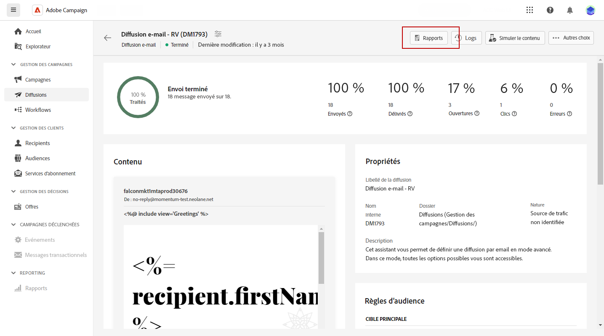

# Accéder aux rapports de diffusion {#reports}

Adobe Campaign propose plusieurs types de rapports, accessibles pour chaque diffusion. Ces rapports vous permettent de mesurer et de visualiser l’impact et les performances de vos messages dans un tableau de bord intégré.

Pour afficher les rapports, procédez comme suit :

1. Pour générer un rapport concernant une diffusion spécifique, accédez au menu **[!UICONTROL Diffusions]** et sélectionnez la diffusion pour laquelle vous souhaitez créer un rapport.

1. Dans le tableau de bord de la **[!UICONTROL Diffusion]**, cliquez sur **[!UICONTROL Rapports]**.

   

1. Dans le menu de gauche, sélectionnez un rapport dans la liste.

   

