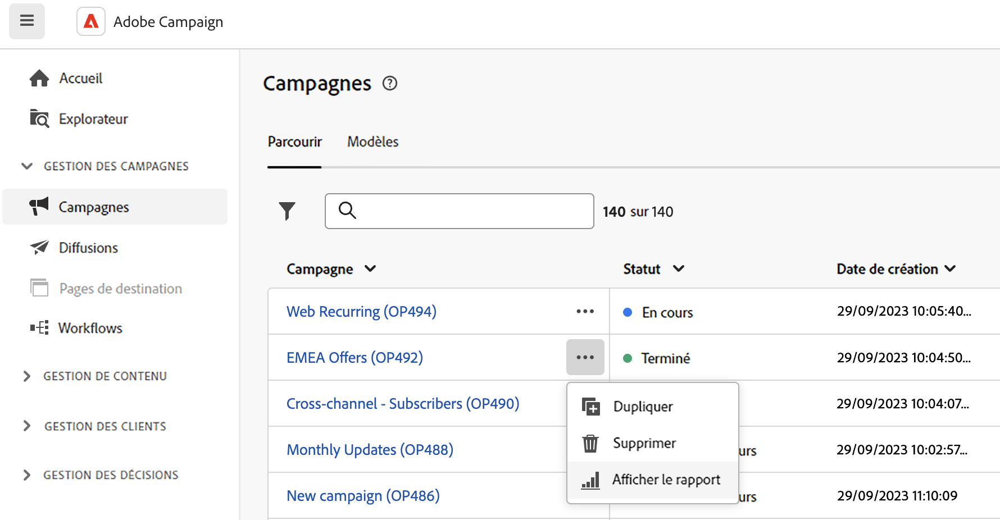

# Accéder aux rapports de diffusion {#reports}

>[!CONTEXTUALHELP]
>id="acw_campaign_reporting_deliveries_selection"
>title="Reporting agrégé pour les diffusions"
>abstract="Sélectionnez au moins deux diffusions pour afficher un rapport de données agrégées."

>[!CONTEXTUALHELP]
>id="acw_reporting_email_exportation"
>title="Exporter"
>abstract="Cliquez sur le bouton **Exporter** pour exporter ces mesures au format PDF ou CSV, ce qui vous permet de les partager ou de les imprimer. "

Adobe Campaign propose plusieurs types de rapports, accessibles pour chaque diffusion. Ces rapports vous permettent de mesurer et de visualiser l’impact et les performances de vos messages dans un tableau de bord intégré.

Pour afficher les rapports, procédez comme suit :

1. Pour générer un rapport concernant une diffusion spécifique, accédez au menu **[!UICONTROL Diffusions]** et sélectionnez la diffusion pour laquelle vous souhaitez créer un rapport.

1. Dans le tableau de bord de la **[!UICONTROL Diffusion]**, cliquez sur **[!UICONTROL Rapports]**.

   

   Vous pouvez également utiliser les trois points. **Autres actions** en regard du nom de la diffusion dans la liste des campagnes, comme dans l&#39;exemple ci-dessous :

   {width="50%" align="left" zoomable="yes"}

1. Dans le menu de gauche, sélectionnez un rapport dans la liste.

   

1. Si votre diffusion est récurrente, sélectionnez une diffusion spécifique sur laquelle vous souhaitez créer un rapport en cliquant sur **[!UICONTROL Sélectionner les diffusions]**.

   Vous pouvez également appliquer une période à votre rapport en sélectionnant la **[!UICONTROL Date de contact]**.

   

La liste complète des rapports et mesures associées pour chaque canal est disponible dans les pages suivantes :

* [Rapports de diffusion par e-mail](email-report.md)
* [Rapports de diffusion SMS](sms-report.md)
* [Rapports de diffusion des notifications push](push-report.md)
