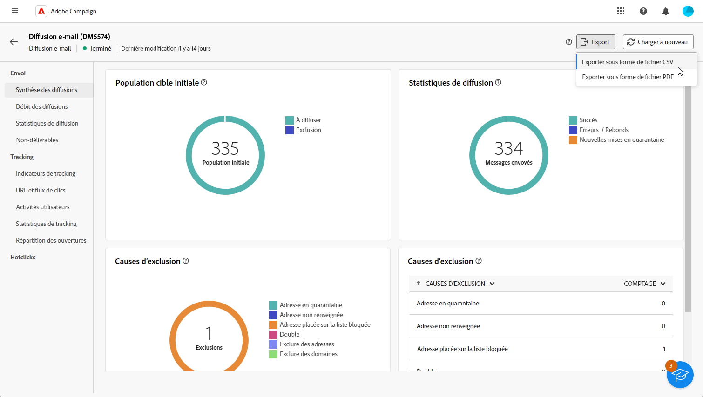

# Prise en main des rapports de diffusion {#reports}

>[!CONTEXTUALHELP]
>id="acw_campaign_reporting_deliveries_selection"
>title="Reporting agrégé pour les diffusions"
>abstract="Sélectionnez au moins deux diffusions pour afficher un rapport de données agrégées."

>[!CONTEXTUALHELP]
>id="acw_reporting_email_exportation"
>title="Exporter"
>abstract="Cliquez sur le bouton **Exporter** pour exporter ces mesures au format PDF ou CSV, ce qui vous permet de les partager ou de les imprimer."

La variable **Rapports de diffusion** fournir des informations détaillées et des données exclusivement axées sur vos **diffusions** sur chaque canal. Ils fournissent des informations détaillées sur les performances, l’efficacité et les résultats de vos diffusions individuelles, ce qui vous permet d’obtenir une vue d’ensemble complète.

La liste complète des rapports et mesures associées pour chaque canal est disponible dans les pages suivantes :

* [Rapports de diffusion E-mail](email-report.md)
* [Rapports de diffusion SMS](sms-report.md)
* [Rapports de diffusion Notifications push](push-report.md)

## Gérer le tableau de bord des rapports {#manage-reports}

Adobe Campaign propose plusieurs types de rapports, accessibles pour chaque diffusion. Ces rapports vous permettent de mesurer et de visualiser l’impact et les performances de vos messages dans un tableau de bord intégré.

Pour afficher et gérer des rapports, procédez comme suit :

1. Pour générer un rapport concernant une diffusion spécifique, accédez au menu **[!UICONTROL Diffusions]** et sélectionnez la diffusion pour laquelle vous souhaitez créer un rapport.

1. Dans le tableau de bord de la **[!UICONTROL Diffusion]**, cliquez sur **[!UICONTROL Rapports]**.

   

   Vous pouvez également utiliser les trois points. **Autres actions** en regard du nom de la diffusion dans la liste des diffusions et sélectionnez **[!UICONTROL Afficher le rapport]**.

   {width="50%" zoomable="yes"}

1. Dans le menu de gauche, sélectionnez un rapport dans la liste.

   

1. Si votre diffusion est récurrente, sélectionnez une diffusion spécifique sur laquelle créer un rapport en cliquant sur **[!UICONTROL Sélectionner des diffusions]**.

   Vous pouvez également appliquer une période à votre rapport en sélectionnant la **[!UICONTROL Date de contact]**.

   

1. Dans la **[!UICONTROL URL et flux de clics]**, vous pouvez également choisir la variable **[!UICONTROL Liens les plus visités]** ou le **[!UICONTROL Période]**.

   La variable **[!UICONTROL Afficher par]** Les options vous permettent de filtrer selon les URL, les libellés ou les catégories.

   

## Exportation des rapports {#export-reports}

Vous pouvez facilement exporter vos différents rapports au format PDF ou CSV, ce qui vous permet de les partager, de les manipuler ou de les imprimer.

1. Dans votre rapport, cliquez sur **[!UICONTROL Exporter]** et sélectionnez **[!UICONTROL Exporter en tant que fichier PDF]** ou **[!UICONTROL Exportation au format CSV]**.

   

1. Localisez le dossier dans lequel vous souhaitez enregistrer votre fichier, renommez-le si nécessaire, puis cliquez sur **[!UICONTROL Enregistrer]**.

Votre rapport peut désormais être affiché ou partagé dans un PDF ou fichier CSV.

