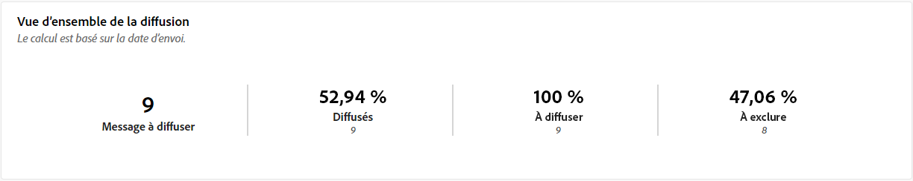
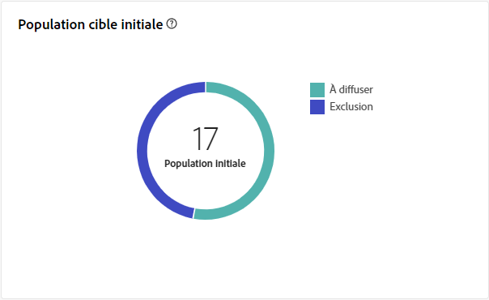
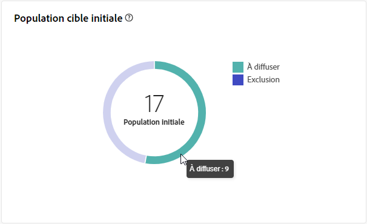
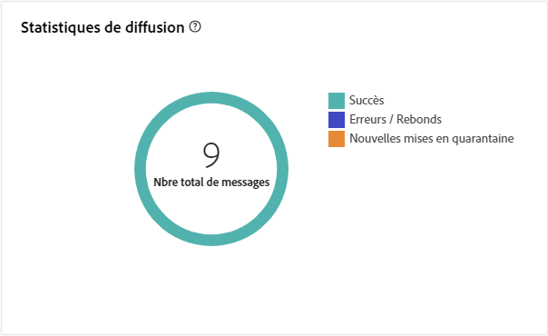
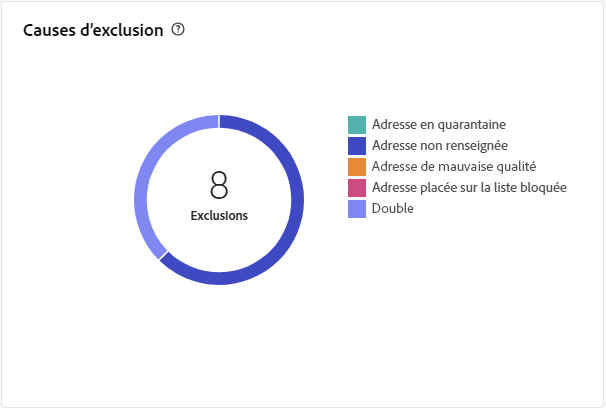
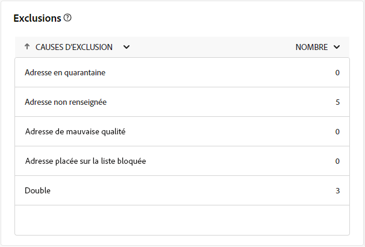

# Rapport Diffusion courrier {#direct-mail-report}

La variable **Rapport Diffusion courrier** offre des informations complètes et des données spécifiques à votre diffusion courrier. Il fournit des informations détaillées sur les performances, l’efficacité et les résultats de vos diffusions individuelles, ce qui vous permet d’obtenir une vue d’ensemble complète.

## Synthèse des diffusions {#delivery-summary-direct-mail}

### Vue d’ensemble de la diffusion {#delivery-overview-direct-mail}

>[!CONTEXTUALHELP]
>id="acw_delivery_reporting_delivery_overview_direct_mail"
>title="Vue d’ensemble de la diffusion"
>abstract="La **Vue d’ensemble de la diffusion** présente des indicateurs clés de performance (KPI) qui donnent des informations détaillées sur l’interaction de vos visiteurs et visiteuses avec chaque diffusion par courrier. Les mesures sont décrites ci-dessous."

La variable **[!UICONTROL Présentation de la diffusion]** fournit des informations détaillées sur la manière dont vos visiteurs interagissent avec chaque diffusion courrier, en exposant les mesures de performances clés (IPC) essentielles.  Les mesures sont décrites ci-dessous.

{zoomable=&quot;yes&quot;}{align="center"}

+++En savoir plus sur les mesures de vue d’ensemble de diffusion.

* **[!UICONTROL Messages à diffuser]** : nombre total de messages traités lors de la préparation de la diffusion.

* **[!UICONTROL Ciblés]**: nombre de profils utilisateur qui remplissent les critères de ciblage pour vos messages postaux.

* **[!UICONTROL Pour exclure]**: nombre de profils utilisateur, exclus des profils ciblés, qui ne recevront pas vos courriers.
+++

### Population cible initiale {#direct-mail-delivery-targeted-population}

>[!CONTEXTUALHELP]
>id="acw_delivery_reporting_initial_target_direct_mail"
>title="Population cible initiale"
>abstract="Le graphe **Population cible initiale** affiche les données relatives à vos destinataires et messages, en fonction des résultats de la préparation de la diffusion."

Le graphe **[!UICONTROL Population cible initiale]** affiche les données relatives à vos destinataires. Les mesures sont calculées lors de la préparation de la diffusion. Elles affichent l’audience initiale, le nombre de messages à envoyer et le nombre de destinataires exclus.

{zoomable=&quot;yes&quot;}

Placez le pointeur de la souris sur une partie du graphe pour afficher le nombre exact.

{zoomable=&quot;yes&quot;}

+++En savoir plus sur les mesures des rapports de diffusion courrier.

* **[!UICONTROL Audience initiale]** : nombre total de destinataires ciblé(e)s.

* **[!UICONTROL À délivrer]** : nombre total de messages à délivrer après la préparation de la diffusion.

* **[!UICONTROL Exclusion]** : nombre total de destinataires exclus de la population cible.
+++

### Statistiques de diffusion {#direct-mail-delivery-stats}

>[!CONTEXTUALHELP]
>id="acw_delivery_reporting_delivery_statistics_summary_direct_mail"
>title="Statistiques de diffusion"
>abstract="Le graphe **Statistiques de diffusion** détaille le succès de votre diffusion par courrier et les erreurs qui se sont produites."

La variable **[!UICONTROL Statistiques de diffusion]** Le graphique offre un aperçu complet des performances de vos diffusions, avec des mesures détaillées pour mesurer le succès et l’efficacité.

{zoomable=&quot;yes&quot;}

+++En savoir plus sur les mesures des rapports de campagne Courrier.

* **[!UICONTROL Message envoyé]** : nombre total de messages à délivrer après la préparation de la diffusion.

* **[!UICONTROL Succès]** : nombre de messages traités avec succès par rapport au nombre de messages à délivrer.

* **[!UICONTROL Erreurs]** : nombre total d’erreurs cumulées lors des diffusions et du traitement automatique des retours par rapport au nombre de messages à délivrer.

* **[!UICONTROL Nouvelles quarantaines]** : nombre total d’adresses mises en quarantaine à la suite d’un échec de diffusion (utilisateur ou utilisatrice inconnu(e), domaine invalide) par rapport au nombre de messages à délivrer.

+++

### Causes d’exclusion {#direct-mail-delivery-exclusions}

>[!CONTEXTUALHELP]
>id="acw_delivery_reporting_causes_exclusion_direct_mail"
>title="Causes d’exclusion lors d’une diffusion"
>abstract="Le graphe **Causes d’exclusion** illustre la distribution des messages rejetés, classés par règle, lors de la préparation de la diffusion."

La variable **[!UICONTROL Causes d&#39;exclusion]** Le graphique fournit une ventilation détaillée des raisons pour lesquelles les messages sont rejetés pendant le processus de préparation de la diffusion. Cette répartition est organisée selon différentes règles, offrant une vue d&#39;ensemble des facteurs contribuant à l&#39;exclusion des messages. Les règles d’exclusion sont détaillées dans la section [Documentation de Campaign v8 (console)](https://experienceleague.adobe.com/docs/campaign/campaign-v8/send/failures/delivery-failures.html?lang=fr#email-error-types){_blank}.

{zoomable=&quot;yes&quot;}{align="center" zoomable="yes"}

+++En savoir plus sur les mesures Causes d’exclusion.

* **[!UICONTROL Adresse en quarantaine]**: Type d&#39;erreur générée lorsque l&#39;adresse est mise en quarantaine.

* **[!UICONTROL Adresse non renseignée]**: Type d&#39;erreur générée lors de l&#39;envoi d&#39;une diffusion indiquant que l&#39;adresse n&#39;existe pas.

* **[!UICONTROL Adresse de mauvaise qualité]**: type d’erreur générée lorsque la note de qualité de l’adresse postale est trop basse.

* **[!UICONTROL Adresse Placée sur la liste bloquée]**: Type d&#39;erreur générée lorsque le destinataire a été placé sur la liste bloquée lors de l&#39;exécution de la diffusion.

* **[!UICONTROL Double]**: Type d&#39;erreur générée lorsque le destinataire a été exclu, car ses valeurs de clés n&#39;étaient pas uniques.

* **[!UICONTROL Population témoin]**: l&#39;adresse du destinataire fait partie de la population témoin.

* **[!UICONTROL Cible limitée en taille]**: la taille de diffusion maximale a été atteinte pour le destinataire.

+++

### Exclusions {#direct-mail-exclusions}

>[!CONTEXTUALHELP]
>id="acw_delivery_reporting_exclusions_direct_mail"
>title="Exclusions"
>abstract="Le tableau **[!UICONTROL Exclusions]** affiche une répartition détaillée, par règle, des messages qui ont été rejetés pendant le processus de préparation de la diffusion."

La variable **[!UICONTROL Exclusions]** Le tableau fournit une ventilation détaillée, classée par règles spécifiques, des messages qui ont été rejetés lors de la phase de préparation de la diffusion. Cette répartition exhaustive permet de comprendre clairement les raisons de l&#39;exclusion de ces messages du processus de diffusion.

{zoomable=&quot;yes&quot;}{align="center" zoomable="yes"}

Les mesures disponibles sont les mêmes que pour la variable [Causes d&#39;exclusion](#direct-mail-delivery-exclusions) décrits ci-dessus.
