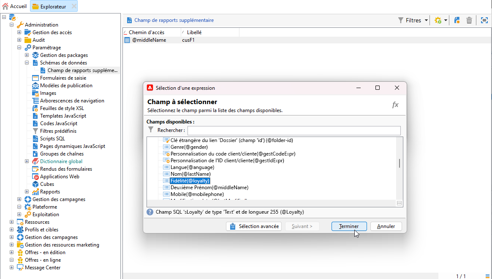

# Créer une dimension de profil{#creating-a-custom-profile-dimension}

Les rapports peuvent également être créés et gérés en fonction des données de profil créées lors de l&#39;extension du schéma du destinataire.

* [Étape 1 : étendre votre schéma de destinataires](##extend-schema)
* [Étape 2 : lier votre nouveau champ personnalisé](#link-custom)
* [Étape 3 : créer un rapport dynamique pour filtrer les destinataires avec la dimension de profil](#create-report)

## Étape 1 : étendre votre schéma de destinataires {#extend-schema}

Pour ajouter un nouveau champ de profil, vous devez étendre votre schéma, procédez comme suit :

1. Accédez au dossier **[!UICONTROL Administration]** > **[!UICONTROL Configuration]** > **[!UICONTROL Schémas de données]** dans l’Explorateur.

   

1. Identifiez votre schéma de destinataires personnalisé et sélectionnez-le. Si vous n&#39;avez pas encore étendu le schéma nms:recipient intégré, reportez-vous à [cette procédure](https://experienceleague.adobe.com/fr/docs/campaign/campaign-v8/developer/shemas-forms/extend-schema).

1. Ajoutez votre champ personnalisé à l’éditeur de schéma.

   Par exemple, pour ajouter un champ personnalisé Fidélité dans votre schéma de destinataires :

   ```
   <attribute label="Loyalty" name="loyalty" type="string"/>
   ```

   

1. Cliquez sur **[!UICONTROL Enregistrer]**.

1. Ensuite, identifiez votre schéma broadLogRcp personnalisé et sélectionnez-le. Si vous n&#39;avez pas encore étendu le schéma intégré des logs de diffusion, reportez-vous à [cette procédure](https://experienceleague.adobe.com/fr/docs/campaign/campaign-v8/developer/shemas-forms/extend-schema).

1. Ajoutez le même champ personnalisé que votre schéma de destinataire à l’éditeur de schémas.

   

1. Cliquez sur **[!UICONTROL Enregistrer]**.

1. Pour appliquer les modifications apportées aux schémas, lancez l&#39;assistant de mise à jour de la base de données via **[!UICONTROL Outils]** > **[!UICONTROL Avancé]** > **[!UICONTROL Mettre à jour la structure de la base de données]** et exécutez la commande Mettre à jour la structure de la base de données. [En savoir plus](https://experienceleague.adobe.com/fr/docs/campaign/campaign-v8/developer/shemas-forms/update-database-structure)

   

Votre nouveau champ de profil est maintenant prêt à être utilisé et sélectionné par vos destinataires.

## Étape 2 : lier votre nouveau champ personnalisé {#link-custom}

>[!NOTE]
>
> Vous pouvez uniquement ajouter jusqu’à 20 champs personnalisés au rapport dynamique.

Maintenant que votre champ de profil est créé, nous devons le lier à la dimension de reporting dynamique correspondante.

Avant d’étendre le journal avec notre champ de profil, assurez-vous que la fenêtre des PII a été acceptée pour pouvoir envoyer des données PII au rapport dynamique. Pour en savoir plus à ce sujet, consultez cette [page](pii-agreement.md).

1. Accédez au dossier **[!UICONTROL Administration]** > **[!UICONTROL Configuration]** > **[!UICONTROL Schémas de données]** > **[!UICONTROL Champ de reporting supplémentaire]** dans l’Explorateur.

   

1. Cliquez sur **[!UICONTROL Nouveau]** pour créer la dimension de rapport dynamique correspondante.

1. Sélectionnez **[!UICONTROL Modifier l’expression]** et parcourez le schéma Destinataire pour trouver le champ de profil précédemment créé.

   

1. Cliquez sur **[!UICONTROL Terminer]**.

1. Saisissez votre dimension **[!UICONTROL Libellé]**, visible dans les rapports dynamiques, puis cliquez sur **[!UICONTROL Enregistrer]**.

   

Votre champ de profil est désormais disponible en tant que dimension de profil dans vos rapports. Pour supprimer votre dimension de profil, vous pouvez la sélectionner et cliquer sur l’icône **[!UICONTROL Supprimer]**.

Maintenant que le schéma des destinataires a été étendu avec ce champ de profil et que votre dimension personnalisée a été créée, vous pouvez commencer à cibler les destinataires dans les diffusions.

## Étape 3 : créer un rapport dynamique pour filtrer les destinataires avec la dimension de profil {#create-report}

Une fois votre diffusion envoyée, vous pouvez répartir les rapports à l’aide de votre dimension de profil.

1. Depuis l&#39;onglet **[!UICONTROL Rapports]**, sélectionnez un rapport aux paramètres d&#39;usine et cliquez sur le bouton **[!UICONTROL Créer]** pour en lancer un à partir de zéro.

   

1. Dans la catégorie **[!UICONTROL Dimensions]**, cliquez sur **[!UICONTROL Profil]** puis glissez-déposez votre dimension de profil dans votre tableau à structure libre.

   

1. Effectuez un glisser-déposer des mesures pour commencer à filtrer vos données.

1. Faites glisser et déposez une visualisation dans votre espace de travail, le cas échéant.

