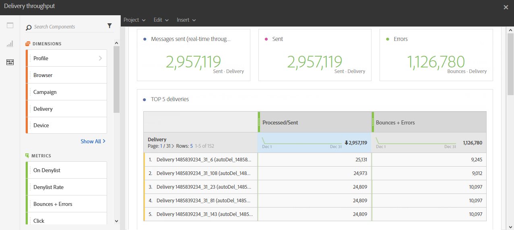

# Débit des diffusions{#delivery-throughput}

Ce rapport regroupe les informations relatives au débit de diffusion d&#39;un envoi, ou de plusieurs envois. Ces données sont :

* nombre de messages traités par heure
* Le tableau **[!UICONTROL Top 5 des diffusions]** et les nombres de synthèse complémentaires qui affichent les cinq diffusions présentant le meilleur gain de reprise.

>[!NOTE]
>
>La page **[!UICONTROL Débit des diffusions]** affiche la vitesse de débit pour le relais de vos messages depuis Campaign vers le MTA amélioré d’Adobe Campaign (Message Transfer Agent).
