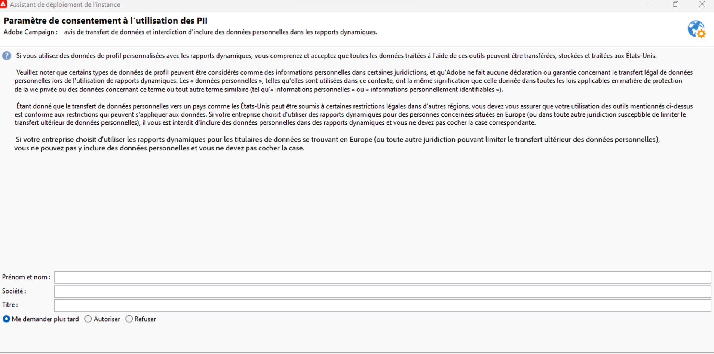

# Accord sur l’utilisation des rapports dynamiques {#pii-agreement}

L’accord sur l’utilisation des rapports dynamiques fonctionne comme un consentement pop-up pour le traitement des données. Par défaut, seuls les utilisateurs et utilisatrices auxquels sont affectés des droits d’administration peuvent afficher et accepter ou refuser cet accord.

Pour accéder à l’accord sur l’utilisation des rapports dynamiques, sélectionnez **[!UICONTROL Outils]** > **[!UICONTROL Avancé]** > **[!UICONTROL Assistant de déploiement]**.

Trois options sont disponibles :

* **[!UICONTROL Me demander plus tard]** : tant que vous n’avez pas accepté ou refusé l’accord, les dimensions de profil ne s’affichent pas dans vos rapports et les PII de vos clientes et clients ne sont pas collectées ni envoyées.
* **[!UICONTROL Accepter]** : lorsque vous acceptez les termes de cet accord, vous autorisez Adobe Campaign à collecter les PII de vos clients et à les transférer au centre de données ou de reporting.
* **[!UICONTROL Refuser]** : lorsque vous refusez les termes de l&#39;accord, les dimensions de profil ne s&#39;affichent pas dans vos rapports et les PII de vos clients ne sont pas collectées ni envoyées. Notez que dans ce cas, externalID sera toujours collecté et utilisé pour identifier les utilisateurs finaux.

Le tableau ci-dessous indique ce qui se passe après l&#39;acceptation de cet accord selon votre zone géographique.

|  | Rapports dynamiques | Connecteur Microsoft Dynamics 365 |
|---|---|---|
| Amériques et Asie-Pacifique | **Fonctionnalité disponible**.  Toutes les informations de profil personnalisées et prêtes à l’emploi (c’est-à-dire ville, pays/région, État, genre et segments selon l’âge) sont transmises au centre de reporting des États-Unis. | **Fonctionnalité disponible**.  Tous les champs de profil personnalisés et prêts à l’emploi, ainsi que les champs d’événement Adobe Campaign, sont traités dans le centre de données des États-Unis. |
| EMEA (Europe, Moyen-Orient et Afrique) | **Fonctionnalité disponible**.  Toutes les informations de profil personnalisées et prêtes à l’emploi (c’est-à-dire ville, pays/région, État, genre et segments selon l’âge) sont transmises au centre de reporting EMEA. | **Fonctionnalité disponible.**  Tous les champs de profil personnalisés et prêts à l’emploi, ainsi que les champs d’événement Adobe Campaign, sont traités dans le centre de données EMEA. Les  **[!UICONTROL données de contrôle ]**qui contiennent les données d&#39;enregistrement Adobe I/O et les identifiants des événements utilisateur des clients sont envoyés et stockés dans le centre de données des Etats-Unis. |

Le tableau ci-dessous indique ce qui se passe après le refus de cet accord selon votre zone géographique. Notez que même si vous refusez cet accord, le reporting sur les diffusions et l&#39;intégration de Microsoft Dynamics 365 sera toujours disponible.

| Zone géographique | Rapports dynamiques | Connecteur Microsoft Dynamics 365 |
|---|---|---|
| Amériques et Asie-Pacifique | **Fonctionnalité disponible**.   Aucune information de profil personnalisée et d&#39;usine n&#39;est transmise au centre de reporting des Etats-Unis, à l&#39;exception d&#39;ExternalID. | **Fonctionnalité disponible**.  Aucun champ de profil personnalisé et d&#39;usine n&#39;est envoyé au centre de données des Etats-Unis, à l&#39;exception des champs Identifiant externe et Identifiant du destinataire.  Tous les champs d’événement Adobe Campaign sont traités dans le centre de données des États-Unis, à l’exception de l’ID de la page miroir. |
| EMEA (Europe, Moyen-Orient et Afrique) | **Fonctionnalité disponible**.  Aucune information de profil personnalisée et d&#39;usine n&#39;est transmise au centre de reporting EMEA, à l&#39;exception d&#39;ExternalID. | **Fonctionnalité disponible.**  Aucun champ de profil personnalisé et d&#39;usine n&#39;est envoyé au centre de données EMEA, à l&#39;exception des champs Identifiant externe et Identifiant du destinataire.  Tous les champs d’événement Adobe Campaign sont traités dans le centre de données EMEA, à l’exception de l’ID de la page miroir. |

Ce choix n’est pas définitif, vous pouvez toujours le modifier en sélectionnant l’option **[!UICONTROL realtimeReporting_collectPII]** dans **[!UICONTROL Administration]** > **[!UICONTROL Plateforme]** > **[!UICONTROL Options]**.

La valeur peut être modifiée à tout moment. La valeur 1 correspond à **[!UICONTROL Me demander plus tard]**, 2 à **[!UICONTROL Refuser]** et 3 à **[!UICONTROL Accepter]**.
