# Rapport de diffusion par e-mail {#email-report}

Le **rapport de diffusion par e-mail** offre des informations et des données complètes spécifiques au canal e-mail. Il fournit des informations détaillées sur les performances, l’efficacité et les résultats de vos diffusions individuelles, ce qui vous permet d’obtenir une vue d’ensemble complète.

## Synthèse des diffusions {#delivery-summary-email}

>[!CONTEXTUALHELP]
>id="acw_delivery_reporting_sending_email"
>title="Envoi des rapports"
>abstract="L’onglet **Envoi** de votre rapport fournit des informations détaillées sur les interactions de vos visiteurs et visiteuses avec vos diffusions, ainsi que sur les erreurs potentielles qu’ils ont pu rencontrer."

### Population cible initiale {#email-delivery-targeted-population}

>[!CONTEXTUALHELP]
>id="acw_delivery_reporting_initial_target"
>title="Population cible initiale"
>abstract="Le graphe **Population cible initiale** affiche les données relatives à vos destinataires et messages, en fonction des résultats de la préparation de la diffusion."

Le graphe **[!UICONTROL Population cible initiale]** affiche les données relatives à vos destinataires. Les mesures sont calculées lors de la préparation de la diffusion. Elles affichent l’audience initiale, le nombre de messages à envoyer et le nombre de destinataires exclus.

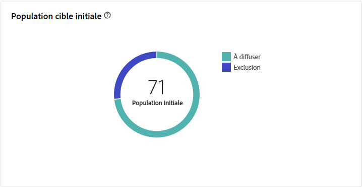{width="50%" align="left" zoomable="yes"}

Placez le pointeur de la souris sur une partie du graphe pour afficher le nombre exact.

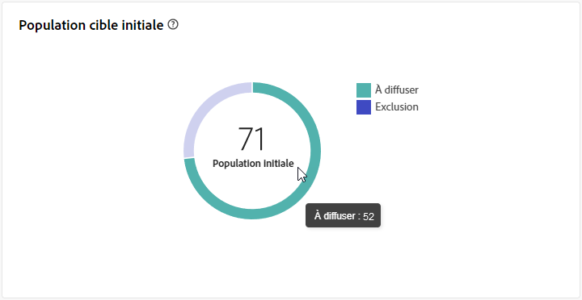{width="50%" align="left" zoomable="yes"}

+++En savoir plus sur les mesures des rapports de diffusion par e-mail.

* **[!UICONTROL Audience initiale]** : nombre total de destinataires ciblé(e)s.

* **[!UICONTROL À délivrer]** : nombre total de messages à délivrer après la préparation de la diffusion.

* **[!UICONTROL Exclusion]** : nombre total de destinataires exclus de la population cible.
+++

### Statistiques de diffusion {#email-delivery-stats}

>[!CONTEXTUALHELP]
>id="acw_delivery_reporting_delivery_statistics_summary"
>title="Statistiques de diffusion"
>abstract="Le graphe **Statistiques de diffusion** détaille le succès de votre diffusion et les erreurs qui se sont produites."

Le graphe **[!UICONTROL Statistiques de diffusion]** détaille le succès de votre diffusion. Les mesures sont détaillées ci-dessous.

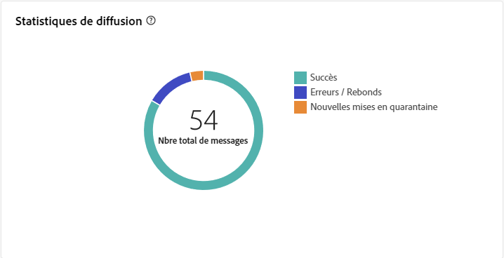{width="50%" align="left" zoomable="yes"}

+++En savoir plus sur les mesures des rapports de campagne par e-mail.

* **[!UICONTROL Message envoyé]** : nombre total de messages à délivrer après la préparation de la diffusion.

* **[!UICONTROL Succès]** : nombre de messages traités avec succès par rapport au nombre de messages à délivrer.

* **[!UICONTROL Erreurs]** : nombre total d’erreurs cumulées lors des diffusions et du traitement automatique des retours par rapport au nombre de messages à délivrer.

* **[!UICONTROL Nouvelles quarantaines]** : nombre total d’adresses mises en quarantaine à la suite d’un échec de diffusion (utilisateur ou utilisatrice inconnu(e), domaine invalide) par rapport au nombre de messages à délivrer.

+++

### Causes d’exclusion  {#email-delivery-exclusions}

>[!CONTEXTUALHELP]
>id="acw_delivery_reporting_exclusion"
>title="Causes d’exclusion lors d’une diffusion"
>abstract="Le tableau et le graphe **Causes d’exclusion** affichent la répartition par règle des messages rejetés lors de la préparation de la diffusion."

Le tableau et le graphe **[!UICONTROL Causes d’exclusion]** affichent la répartition par règle des messages rejetés lors de la préparation de la diffusion. Les règles d’exclusion sont détaillées dans la section [Documentation de Campaign v8 (console)](https://experienceleague.adobe.com/docs/campaign/campaign-v8/send/failures/delivery-failures.html?lang=fr#email-error-types){_blank}.

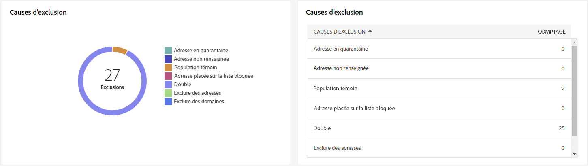{align="center" zoomable="yes"}

+++En savoir plus sur les mesures des rapports de diffusion par e-mail.

* **[!UICONTROL Utilisateur inconnu]** : type d’erreur générée lors de l’envoi d’une diffusion indiquant que l’adresse e-mail n’est pas valide.

* **[!UICONTROL Domaine invalide]** : type d&#39;erreur générée lors de l&#39;envoi d&#39;une diffusion indiquant que le domaine de l&#39;adresse e-mail est erroné ou n&#39;existe plus.

* **[!UICONTROL Boîte pleine]** : type d’erreur générée, après cinq tentatives de diffusion, indiquant que la boîte de réception de la personne destinataire contient trop de messages.

* **[!UICONTROL Compte désactivé]** : type d&#39;erreur générée lors de l&#39;envoi d&#39;une diffusion indiquant que l&#39;adresse n&#39;existe plus.

* **[!UICONTROL Refusé]** : type d’erreur générée lorsqu’une adresse est refusée par le FAI (Fournisseur d’accès Internet), par exemple, suite à l’application d’une règle de sécurité (logiciel anti-spams).

* **[!UICONTROL Inatteignable]** : type d&#39;erreur survenue dans la chaîne de distribution du message : incident sur le relais SMTP, domaine temporairement inatteignable, etc.

* **[!UICONTROL Non connecté]** : type d’erreur indiquant que le téléphone portable de la personne destinataire est éteint ou n’est pas connecté au réseau au moment de l’envoi du message.

+++

## Débit des diffusions (Delivery throughput) {#delivery-throughtput}

>[!CONTEXTUALHELP]
>id="acw_delivery_reporting_throughput_email"
>title="Débit des diffusions (Delivery throughput) "
>abstract="Le rapport **Débit de diffusion** présente des informations détaillées sur le débit de diffusion de l’ensemble de la plateforme dans un délai donné."

Ce rapport présente des informations détaillées sur le débit de diffusion de l’ensemble de la plateforme au cours d’une période donnée. La mesure principale utilisée pour mesurer la vitesse de diffusion des messages est le nombre de messages envoyés par heure.

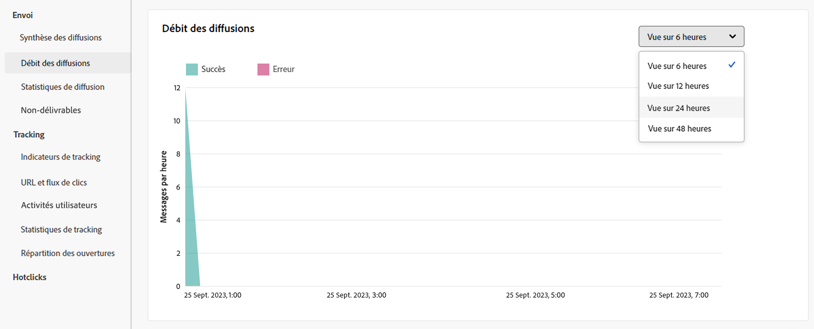{align="center" zoomable="yes"}

## Statistiques de domaine {#broadcast-statistics}

>[!CONTEXTUALHELP]
>id="acw_delivery_reporting_broadcast_statistics"
>title="Statistiques de domaine"
>abstract="Le rapport **Statistiques de domaine** contient les données disponibles liées aux erreurs possibles rencontrées pour chaque domaine."

Le tableau **[!UICONTROL Statistiques de domaine]** contient les données disponibles liées aux erreurs possibles rencontrées pour chaque domaine. Les mesures sont détaillées ci-dessous.

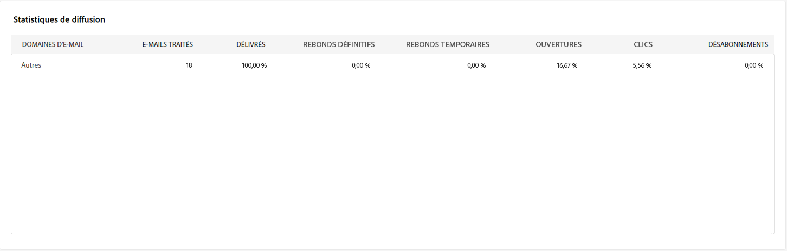{align="center" zoomable="yes"}

+++En savoir plus sur les mesures des rapports de diffusion par e-mail.

* **[!UICONTROL E-mails traités]** : nombre total de messages traités par le serveur de diffusion.

* **[!UICONTROL Délivrés]** : pourcentage du nombre de messages traités avec succès, par rapport au nombre total de messages traités.

* **[!UICONTROL Rebonds définitifs]** : pourcentage du nombre de rebonds définitifs, c’est-à-dire des erreurs permanentes, telles qu’une mauvaise adresse e-mail, par rapport au nombre total de messages traités.

* **[!UICONTROL Rebonds temporaires]** : pourcentage du nombre de rebonds temporaires, c’est-à-dire des erreurs temporaires telles qu’une boîte de réception pleine, par rapport au nombre total de messages traités.

* **[!UICONTROL Ouvertures]** : pourcentage du nombre de destinataires ciblé(e)s ayant ouvert un message au moins une fois, par rapport au nombre de messages traités avec succès.

* **[!UICONTROL Clics]** : pourcentage du nombre de personnes ayant cliqué au moins une fois dans une diffusion, par rapport au nombre de messages traités avec succès.

* **[!UICONTROL Désinscriptions]** : pourcentage du nombre de clics effectués sur un lien de désinscription, par rapport au nombre de messages traités avec succès.
+++

## Non diffusables {#non-deliverables-email}

### Répartition des erreurs par type {#email-delivery-breakdown-type}

>[!CONTEXTUALHELP]
>id="acw_delivery_reporting_error_type"
>title="Répartition des erreurs par type"
>abstract="Le tableau et le graphe **Répartition des erreurs par type** contiennent les données disponibles pour chaque type d’erreur rencontré : utilisateur inconnu ou utilisatrice inconnue, boîte pleine, domaine non valide, etc."

Le tableau et le graphe **[!UICONTROL Répartition des erreurs par type]** contiennent les données disponibles pour chaque type d’erreur. Les mesures sont détaillées ci-dessous.

Les erreurs présentées dans ce rapport déclenchent le processus de mise en quarantaine. Pour plus d’informations sur la gestion des quarantaines, consultez la [documentation de Campaign v8 (console cliente)](https://experienceleague.adobe.com/docs/campaign/campaign-v8/campaigns/send/failures/delivery-failures.html?lang=fr){target="_blank"}.

{align="left" zoomable="yes"}

+++En savoir plus sur les mesures des rapports de diffusion par e-mail.

* **[!UICONTROL Utilisateur inconnu]** : type d’erreur générée lors de l’envoi d’une diffusion indiquant que l’adresse e-mail n’est pas valide.

* **[!UICONTROL Domaine invalide]** : type d&#39;erreur générée lors de l&#39;envoi d&#39;une diffusion indiquant que le domaine de l&#39;adresse e-mail est erroné ou n&#39;existe plus.

* **[!UICONTROL Boîte pleine]** : type d’erreur générée, après cinq tentatives de diffusion, indiquant que la boîte de réception de la personne destinataire contient trop de messages.

* **[!UICONTROL Compte désactivé]** : type d&#39;erreur générée lors de l&#39;envoi d&#39;une diffusion indiquant que l&#39;adresse n&#39;existe plus.

* **[!UICONTROL Refusé]** : type d’erreur générée lorsqu’une adresse est refusée par le FAI (Fournisseur d’accès Internet), par exemple, suite à l’application d’une règle de sécurité (logiciel anti-spams).

* **[!UICONTROL Inatteignable]** : type d&#39;erreur survenue dans la chaîne de distribution du message : incident sur le relais SMTP, domaine temporairement inatteignable, etc.

* **[!UICONTROL Non connecté]** : type d’erreur indiquant que le téléphone portable de la personne destinataire est éteint ou n’est pas connecté au réseau au moment de l’envoi du message.

+++

### Répartition des erreurs par domaine {#email-delivery-breakdown-domain}

>[!CONTEXTUALHELP]
>id="acw_delivery_reporting_error_domain"
>title="Répartition des erreurs par domaine"
>abstract="Le tableau et le graphe **Répartition des erreurs par domaine** affichent les données disponibles pour chaque type d’erreur rencontré en fonction de chaque domaine."

Le tableau et le graphe **[!UICONTROL Répartition des erreurs par domaine]** affichent les données disponibles pour les erreurs possibles rencontrées pour chaque domaine.

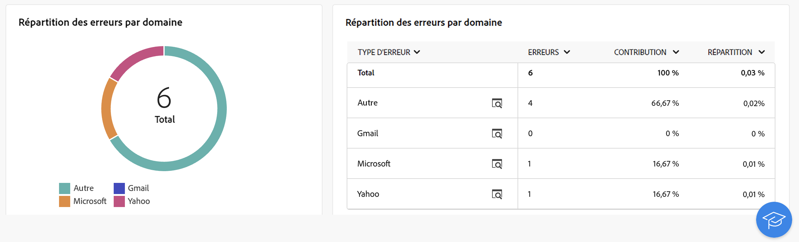{align="left" zoomable="yes"}

Cliquez sur l’icône en regard du nom de chaque domaine pour afficher les détails.

{align="left" zoomable="yes"}

Les mesures disponibles sont les mêmes que celles de la [Répartition des erreurs par type](#email-delivery-breakdown-type) décrites ci-dessus.

## Indicateurs de tracking {#tracking-indicators-email}

>[!CONTEXTUALHELP]
>id="acw_delivery_reporting_tracking_email"
>title="Tracking des rapports"
>abstract="L’onglet **Tracking** de votre rapport contient des données importantes, notamment le comportement des personnes destinataires par lien, la répartition des ouvertures et des clics, ainsi que des informations détaillées sur les URL ayant reçu le plus de clics lors d’une diffusion."

### Statistiques de diffusion  {#email-tracking-delivery-stats}

>[!CONTEXTUALHELP]
>id="acw_delivery_reporting_delivery_statistics_indicators"
>title=" Statistiques de diffusion"
>abstract="Le rapport **Statistiques de diffusion** fournit des indicateurs clés de performances (KPI) qui donnent des informations détaillées sur les données disponibles pour les e-mails envoyés : succès, ouvertures, clics, etc."

Le rapport **[!UICONTROL Statistiques de diffusion]** fournit des indicateurs clés de performances (KPI) qui donnent des informations détaillées sur les données disponibles pour les e-mails envoyés. Les mesures sont détaillées ci-dessous.

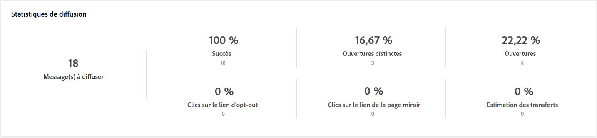{align="center"}

+++En savoir plus sur les mesures des rapports de diffusion par e-mail.

* **[!UICONTROL Succès]** : nombre de messages traités avec succès par rapport au nombre de messages à délivrer.

* **[!UICONTROL Ouvertures distinctes]** : nombre total de destinataires ciblé(e)s ayant ouvert un message au moins une fois.

* **[!UICONTROL Ouvertures]** : nombre de destinataires ciblé(e)s distinct(e)s pour ce domaine ayant ouvert un message au moins une fois.

* **[!UICONTROL Clics sur le lien d’exclusion]** : nombre de clics effectués sur le lien d’exclusion.

* **[!UICONTROL Clics sur le lien miroir]** : nombre de clics sur le lien vers la page miroir.

* **[!UICONTROL Estimation des transferts]** : estimation du nombre d’e-mails transférés par les destinataires ciblé(e)s.
+++

### Taux d’ouvertures et de clics {#email-tracking-click-through}

>[!CONTEXTUALHELP]
>id="acw_delivery_reporting_open_clickthrough"
>title="Taux d’ouvertures et de clics"
>abstract="Le tableau **Taux d’ouvertures et de clics** affiche des données relatives à l’engagement de vos destinataires envers votre diffusion."

Le tableau **[!UICONTROL Taux d’ouvertures et de clics]** affiche des données relatives à vos destinataires. Les mesures sont détaillées ci-dessous.

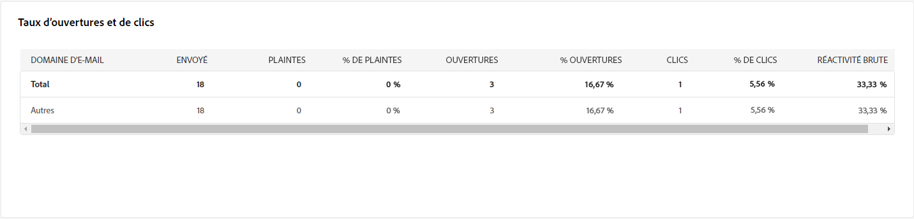{align="center"}

+++En savoir plus sur les mesures des rapports de diffusion par e-mail.

* **[!UICONTROL Envoyés]** : nombre total de messages envoyés.

* **[!UICONTROL Plaintes]** : nombre de messages pour ce domaine qui ont été signalés par le ou la destinataire comme indésirables.

* **[!UICONTROL Ouvertures]** : nombre de destinataires ciblé(e)s distinct(e)s, pour ce domaine, ayant ouvert un message au moins une fois.

* **[!UICONTROL Clics]** : nombre de destinataires ciblé(e)s distinct(e)s ayant cliqué au moins une fois dans une même diffusion.

* **[!UICONTROL Réactivité brute]** : pourcentage du nombre de destinataires ayant cliqué au moins une fois dans une même diffusion par rapport au nombre de destinataires ayant ouvert au moins une fois une même diffusion.
+++

## URL et flux de clics {#url-email}

>[!CONTEXTUALHELP]
>id="acw_delivery_reporting_urls_clickstreams"
>title="URL et flux de clics (URLs and click streams)"
>abstract="Le rapport **URL et flux de clics** fournit des indicateurs clés de performances (KPI) qui donnent des informations détaillées sur les URL qui ont reçu le plus grand nombre de clics lors d’une diffusion."

Le rapport **[!UICONTROL URL et flux de clics]** fournit des indicateurs clés de performances (KPI) qui donnent des informations détaillées sur les URL qui ont reçu le plus grand nombre de clics lors d’une diffusion.

{align="center"}

+++En savoir plus sur les mesures des rapports de diffusion par e-mail.

* **[!UICONTROL Réactivité]** : ratio du nombre de personnes destinataires ciblées ayant cliqué dans une diffusion, par rapport à l’estimation du nombre de personnes destinataires ciblées ayant ouvert une diffusion.

* **[!UICONTROL Clics distincts]** : nombre total de destinataires distinct(e)s ayant cliqué dans une diffusion au moins une fois.

* **[!UICONTROL Clics]** : nombre total de clics sur les liens dans les diffusions.

* **[!UICONTROL Moyenne plateforme]** : ce taux moyen, affiché sous chaque taux (réactivité, clics distincts et clics cumulés), est calculé pour les diffusions envoyées sur les six derniers mois. Seules les diffusions de même typologie et envoyées sur le même canal sont prises en compte. Les BAT sont exclus.

+++

### Top 10 des liens les plus visités {#email-tracking-top10}

>[!CONTEXTUALHELP]
>id="acw_delivery_reporting_urls_clickstreams_top10"
>title="Top 10 des liens les plus visités"
>abstract="Le tableau et le graphe des **10 liens les plus visités** contiennent les données disponibles pour le comportement des destinataires par lien."

Le tableau et le graphe des **[!UICONTROL 10 liens les plus visités]** contiennent les données disponibles pour le comportement des destinataires par lien.

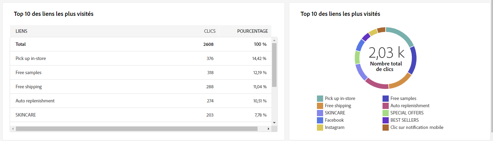{align="center"}

+++En savoir plus sur les mesures des rapports de diffusion par e-mail.

* **[!UICONTROL Clics]** : nombre total de clics sur les liens dans les diffusions.

* **[!UICONTROL Pourcentage]** : pourcentage d’utilisateurs et utilisatrices ayant interagi avec la diffusion.

+++

### Répartition des clics dans le temps {#email-tracking-breakdown-over-time}

>[!CONTEXTUALHELP]
>id="acw_delivery_reporting_urls_click_breakdown"
>title="Répartition des clics dans le temps"
>abstract="Le graphe **Répartition des clics dans le temps** contient les données disponibles sur le comportement des destinataires par lien."

Le graphe **[!UICONTROL Répartition des clics dans le temps]** contient les données disponibles sur le comportement des destinataires par lien.

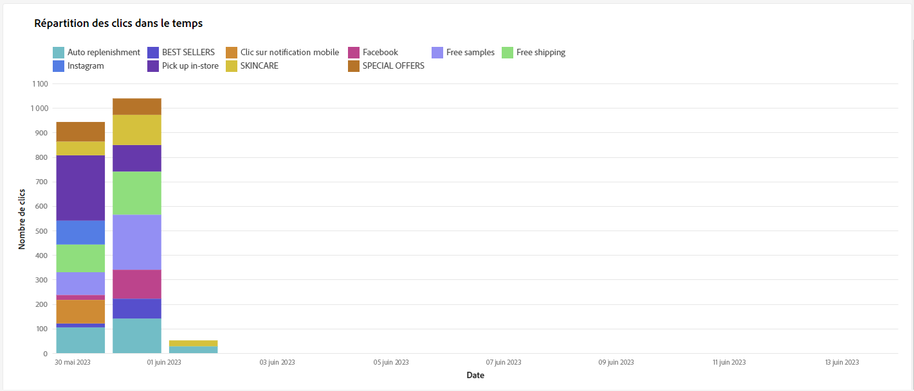{align="center"}

## Activités utilisateurs {#user-activities-email}

>[!CONTEXTUALHELP]
>id="acw_delivery_reporting_user_activities"
>title="Activités utilisateurs"
>abstract="Le graphe **Activités utilisateurs et utilisatrices** affiche la répartition des ouvertures et des clics sous la forme d’un diagramme. Vous pouvez choisir la période pour laquelle cibler les données : dernier jour, dernière heure ou 30 dernières minutes."

Le graphe **[!UICONTROL Activités utilisateurs]** affiche la répartition des ouvertures et des clics sous la forme d’un diagramme. Vous pouvez choisir la période pour laquelle cibler les données : dernier jour, dernière heure ou 30 dernières minutes.

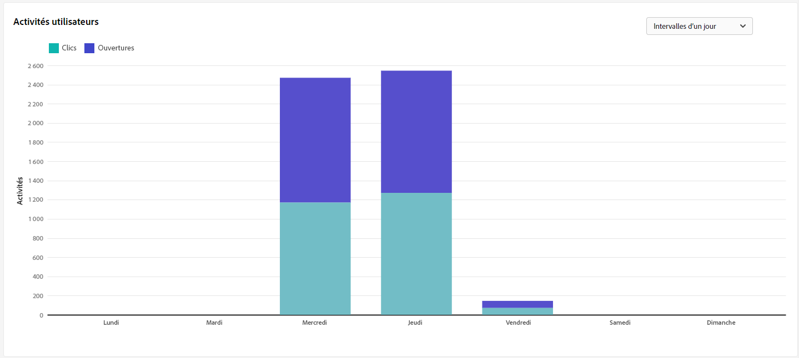{align="center"}

+++En savoir plus sur les mesures des rapports de diffusion par e-mail.

* **[!UICONTROL Clics]** : nombre total de clics sur les liens dans les diffusions.

* **[!UICONTROL Ouvertures]** : nombre de destinataires ciblé(e)s distinct(e)s, pour ce domaine, ayant ouvert un message au moins une fois.

+++

## Statistiques de tracking {#tracking-statistics}

>[!CONTEXTUALHELP]
>id="acw_delivery_reporting_statistics"
>title="Statistiques de tracking"
>abstract="Le graphe **Statistiques de tracking** fournit des statistiques sur les ouvertures et les clics. Vous avez la possibilité de sélectionner la période spécifique pour les données de ciblage."

Le graphe **[!UICONTROL Statistiques de tracking]** fournit des statistiques sur les ouvertures et les clics. Vous avez la possibilité de sélectionner la période spécifique pour les données de ciblage.

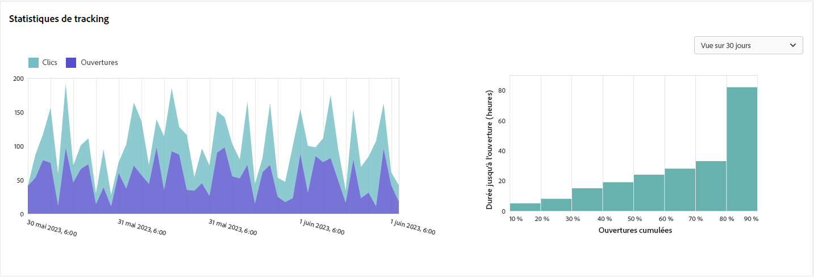{align="center"}

+++En savoir plus sur les mesures des rapports de diffusion par e-mail.

* **[!UICONTROL Clics]** : nombre total de clics sur les liens dans les diffusions.

* **[!UICONTROL Ouvertures]** : nombre de destinataires ciblé(e)s distinct(e)s, pour ce domaine, ayant ouvert un message au moins une fois.

+++

## Répartition des ouvertures {#breakdown-opens}

### Répartition des ouvertures par appareil {#breakdown-opens-devices}

>[!CONTEXTUALHELP]
>id="acw_delivery_reporting_breakdown_device"
>title="Répartition par appareil"
>abstract="Le rapport **Répartition par appareil** affiche la répartition des ouvertures, par type d’appareil, sur la période concernée. Deux graphiques sont utilisés pour chaque catégorie. Le premier affiche les statistiques d’ouverture sur un ordinateur et des appareils mobiles. Le second affiche le nombre et le pourcentage exacts pour chaque type d’appareil."

Le rapport **Répartition par appareil** affiche la répartition des ouvertures, par appareil, sur la période concernée : ordinateurs personnels, appareils Android, appareils Apple, etc.

Deux graphiques sont utilisés pour chaque catégorie. Le premier affiche les statistiques d’ouverture sur un ordinateur et des appareils mobiles. Le second affiche le nombre et le pourcentage exacts pour chaque type d’appareil.

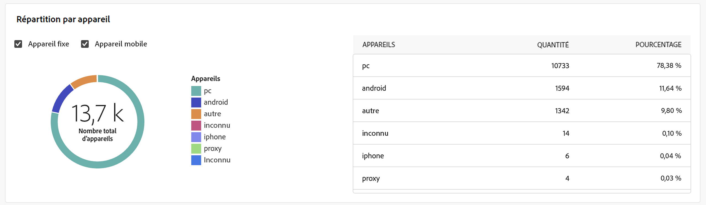{align="center"}

### Répartition des ouvertures par système d’exploitation {#breakdown-opens-os}

>[!CONTEXTUALHELP]
>id="acw_delivery_reporting_breakdown_os"
>title="Répartition par système d’exploitation"
>abstract="Le rapport **Répartition par système d’exploitation** affiche la répartition des ouvertures par système d’exploitation sur la période concernée. Le premier diagramme affiche les statistiques d’ouverture sur un ordinateur et des appareils mobiles. Le second affiche le nombre et le pourcentage exacts pour chaque système d’exploitation."

Le rapport **Répartition par système d’exploitation** affiche la répartition des ouvertures, par système d’exploitation, sur la période concernée : systèmes Windows, systèmes Android, systèmes iOS, etc.

Deux graphiques sont utilisés pour chaque catégorie. Le premier affiche les statistiques d’ouverture sur un ordinateur et des systèmes d’exploitation mobiles. Le second affiche le nombre et le pourcentage exacts pour chaque système d’exploitation.

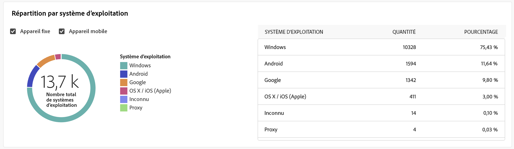{align="center"}

### Répartition des ouvertures par navigateur {#breakdown-opens-browser}

>[!CONTEXTUALHELP]
>id="acw_delivery_reporting_breakdown_browser"
>title="Répartition par navigateur"
>abstract="La **Répartition par navigateur** affiche la répartition des ouvertures par navigateur sur la période concernée. Le premier diagramme affiche les statistiques d’ouverture sur un ordinateur et des appareils mobiles. Le second affiche le nombre et le pourcentage exacts pour chaque navigateur."

Le rapport **Répartition par navigateur** affiche la répartition des ouvertures par navigateur : Chrome, Safari, Internet Explorer, etc.

Deux graphiques sont utilisés pour chaque catégorie. Le premier affiche les statistiques d’ouverture sur un ordinateur et des systèmes d’exploitation mobiles. Le second affiche le nombre et le pourcentage exacts pour chaque navigateur.

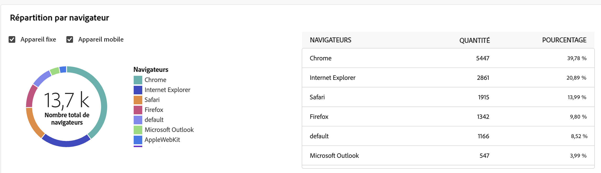{align="center"}

## Hotclicks {#hotclicks}

>[!CONTEXTUALHELP]
>id="acw_delivery_reporting_hotclicks"
>title="Rapport Hotclicks"
>abstract="Le rapport **Hotclicks** présente le contenu de l’e-mail (HTML et/ou texte) avec, sur chaque lien, le pourcentage de clics sur ce lien. Les blocs de personnalisation, liens de désinscription, liens de page miroir et liens d’offre sont pris en compte dans le total des clics cumulés, mais ne sont pas affichés dans le rapport."

Ce rapport présente le contenu du message (HTML et/ou texte) avec, sur chaque lien, le pourcentage de clics sur ce lien. Les blocs de personnalisation, liens de désinscription, liens de page miroir et liens d’offre sont pris en compte dans le total des clics cumulés, mais ne sont pas affichés dans le rapport.

