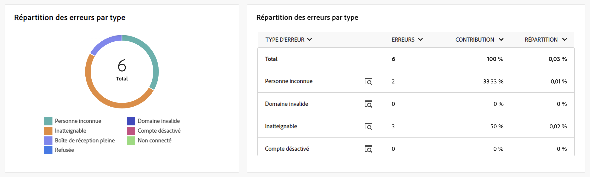

# Rapport de diffusion par e-mail {#email-report}

Le **rapport de diffusion par e-mail** offre des informations et des données complètes spécifiques au canal e-mail. Il fournit des informations détaillées sur les performances, l’efficacité et les résultats de vos diffusions individuelles, ce qui vous permet d’obtenir une vue d’ensemble complète.

## Synthèse des diffusions {#delivery-summary-email}

* Le tableau des **[!UICONTROL statistiques sur l’audience cible initiale]** affiche les données relatives à vos destinataires :

  {align="left" zoomable="yes"}

  +++En savoir plus sur les mesures des rapports de diffusion par e-mail.

   * **[!UICONTROL Audience initiale]** : nombre total de destinataires ciblé(e)s.

   * **[!UICONTROL À diffuser]** : nombre total de messages à diffuser après l’analyse de la diffusion.

   * **[!UICONTROL Exclusion]** : nombre total de messages exclus de la cible envoyés.
+++

* Le tableau des **[!UICONTROL statistiques de diffusion]** détaille le succès de votre diffusion.

  {align="left"}

  +++En savoir plus sur les mesures des rapports de campagne par e-mail.

   * **[!UICONTROL Message envoyé]** : nombre total de messages à diffuser après l’analyse de la diffusion.

   * **[!UICONTROL Succès]** : nombre de messages traités avec succès par rapport au nombre de messages à diffuser.

   * **[!UICONTROL Erreurs]** : nombre total d’erreurs cumulées lors des diffusions et du traitement automatique des retours par rapport au nombre de messages à diffuser.

   * **[!UICONTROL Nouvelles quarantaines]** : nombre total d’adresses mises en quarantaine à la suite d’un échec de diffusion (utilisateur ou utilisatrice inconnu(e), domaine non valide) par rapport au nombre de messages à diffuser.

+++

* Le tableau et le graphe des **[!UICONTROL causes d’exclusion]** affichent la répartition par règle des messages rejetés lors de l’analyse.

  {align="center"}

  +++En savoir plus sur les mesures des rapports de diffusion par e-mail.

   * **[!UICONTROL Utilisateur inconnu]** : type d’erreur générée lors de l’envoi d’une diffusion indiquant que l’adresse e-mail n’est pas valide.

   * **[!UICONTROL Domaine invalide]** : type d&#39;erreur générée lors de l&#39;envoi d&#39;une diffusion indiquant que le domaine de l&#39;adresse e-mail est erroné ou n&#39;existe plus.

   * **[!UICONTROL Boîte pleine]** : type d’erreur générée, après cinq tentatives d’envoi d’une diffusion, indiquant que la boîte de réception des destinataires contient trop de messages.

   * **[!UICONTROL Compte désactivé]** : type d&#39;erreur générée lors de l&#39;envoi d&#39;une diffusion indiquant que l&#39;adresse n&#39;existe plus.

   * **[!UICONTROL Refusé]** : type d’erreur générée lorsqu’une adresse est refusée par le FAI (Fournisseur d’accès Internet), par exemple, suite à l’application d’une règle de sécurité (logiciel anti-spams).

   * **[!UICONTROL Inatteignable]** : type d&#39;erreur survenue dans la chaîne de distribution du message : incident sur le relais SMTP, domaine temporairement inatteignable, etc.

   * **[!UICONTROL Non connecté]** : type d’erreur indiquant que le téléphone mobile du ou de la destinataire est éteint ou n’est pas connecté au réseau au moment de l’envoi du message.

+++

## Débit des diffusions {#delivery-throughtput}

Ce rapport présente des informations détaillées sur le débit de diffusion de l’ensemble de la plateforme au cours d’une période donnée. La mesure principale utilisée pour mesurer la vitesse de diffusion des messages est le nombre de messages envoyés par heure.

## Statistiques de diffusion {#broadcast-statistics}

* Le tableau **[!UICONTROL Statistiques de diffusion]** contient les données disponibles liées aux erreurs possibles rencontrées pour chaque domaine.

  {align="center"}

  +++En savoir plus sur les mesures des rapports de diffusion par e-mail.

   * **[!UICONTROL E-mails traités]** : nombre total de messages traités par le serveur de diffusion.

   * **[!UICONTROL Diffusés]** : pourcentage du nombre de messages traités avec succès, par rapport au nombre total de messages traités.

   * **[!UICONTROL Erreurs hard]** : pourcentage du nombre d’erreurs « hard », des erreurs permantentes telles qu’une mauvaise adresse e-mail, par rapport au nombre total de messages traités.

   * **[!UICONTROL Erreurs soft]** : pourcentage du nombre d’erreurs « soft », des erreurs temporaires telles qu’une boîte de réception pleine, par rapport au nombre total de messages traités.

   * **[!UICONTROL Ouvertures]** : pourcentage du nombre de destinataires ciblé(e)s ayant ouvert un message au moins une fois, par rapport au nombre de messages traités avec succès.

   * **[!UICONTROL Clics]** : pourcentage du nombre de personnes ayant cliqué au moins une fois dans une diffusion, par rapport au nombre de messages traités avec succès.

   * **[!UICONTROL Désinscriptions]** : pourcentage du nombre de clics effectués sur un lien de désinscription, par rapport au nombre de messages traités avec succès.
+++

## Échecs et bounces {#non-deliverables-email}

* Les tableaux et graphes **[!UICONTROL Répartition des erreurs par type]** et **[!UICONTROL Répartition des erreurs par domaine]** contiennent les données disponibles pour les erreurs possibles rencontrées pour chaque domaine.

  Les erreurs présentées dans ce rapport déclenchent le processus de mise en quarantaine. Pour plus d’informations sur la gestion des quarantaines, consultez la [documentation de Campaign v8 (console)](https://experienceleague.adobe.com/docs/campaign/campaign-v8/campaigns/send/failures/delivery-failures.html?lang=fr){target="_blank"}.

  

  +++En savoir plus sur les mesures des rapports de diffusion par e-mail.

   * **[!UICONTROL Utilisateur inconnu]** : type d’erreur générée lors de l’envoi d’une diffusion indiquant que l’adresse e-mail n’est pas valide.

   * **[!UICONTROL Domaine invalide]** : type d&#39;erreur générée lors de l&#39;envoi d&#39;une diffusion indiquant que le domaine de l&#39;adresse e-mail est erroné ou n&#39;existe plus.

   * **[!UICONTROL Boîte pleine]** : type d’erreur générée, après cinq tentatives d’envoi d’une diffusion, indiquant que la boîte de réception des destinataires contient trop de messages.

   * **[!UICONTROL Compte désactivé]** : type d&#39;erreur générée lors de l&#39;envoi d&#39;une diffusion indiquant que l&#39;adresse n&#39;existe plus.

   * **[!UICONTROL Refusé]** : type d’erreur générée lorsqu’une adresse est refusée par le FAI (Fournisseur d’accès Internet), par exemple, suite à l’application d’une règle de sécurité (logiciel anti-spams).

   * **[!UICONTROL Inatteignable]** : type d&#39;erreur survenue dans la chaîne de distribution du message : incident sur le relais SMTP, domaine temporairement inatteignable, etc.

   * **[!UICONTROL Non connecté]** : type d’erreur indiquant que le téléphone portable des destinataires est éteint ou n’est pas connecté au réseau au moment de l’envoi du message.

+++

## Indicateurs de tracking {#tracking-indicators-email}

* Les **[!UICONTROL statistiques de diffusion]** fournissent des indicateurs clés de performances (KPI) qui donnent des informations détaillées sur les données disponibles pour les e-mails envoyés.

  {align="center"}

  +++En savoir plus sur les mesures des rapports de diffusion par e-mail.

   * **[!UICONTROL Succès]** : nombre de messages traités avec succès par rapport au nombre de messages à diffuser.

   * **[!UICONTROL Ouvertures distinctes]** : nombre total de destinataires ciblé(e)s ayant ouvert un message au moins une fois.

   * **[!UICONTROL Ouvertures]** : nombre de destinataires ciblé(e)s distinct(e)s pour ce domaine ayant ouvert un message au moins une fois.

   * **[!UICONTROL Clics sur le lien d’exclusion]** : nombre de clics effectués sur le lien d’exclusion.

   * **[!UICONTROL Clics sur le lien miroir]** : nombre de clics sur le lien vers la page miroir.

   * **[!UICONTROL Estimation des transferts]** : estimation du nombre d’e-mails transférés par les destinataires ciblé(e)s.
+++

* Le tableau **[!UICONTROL Taux d’ouverture et de clic publicitaire]** affiche des données relatives à vos destinataires.

  {align="center"}

  +++En savoir plus sur les mesures des rapports de diffusion par e-mail.

   * **[!UICONTROL Envoyés]** : nombre total de messages envoyés.

   * **[!UICONTROL Plaintes]** : nombre de messages pour ce domaine qui ont été signalés par le ou la destinataire comme indésirables.

   * **[!UICONTROL Ouvertures]** : nombre de destinataires ciblé(e)s distinct(e)s, pour ce domaine, ayant ouvert un message au moins une fois.

   * **[!UICONTROL Clics]** : nombre de destinataires ciblé(e)s distinct(e)s ayant cliqué au moins une fois dans une même diffusion.

   * **[!UICONTROL Réactivité brute]** : pourcentage du nombre de destinataires ayant cliqué au moins une fois dans une même diffusion par rapport au nombre de destinataires ayant ouvert au moins une fois une même diffusion.
+++

## URL et flux de clics {#url-email}

* Les **[!UICONTROL URL et flux de clics]** fournissent des indicateurs clés de performances (KPI) qui donnent des informations détaillées sur les URL qui ont reçu le plus grand nombre de clics lors d’une diffusion.

  {align="center"}

  +++En savoir plus sur les mesures des rapports de diffusion par e-mail.

   * **[!UICONTROL Réactivité]** : ratio du nombre de destinataires ciblé(e)s ayant cliqué dans une diffusion, par rapport à l’estimation du nombre de destinataires ciblé(e)s ayant ouvert une diffusion.

   * **[!UICONTROL Clics distincts]** : nombre total de destinataires distinct(e)s ayant cliqué dans une diffusion au moins une fois.

   * **[!UICONTROL Clics]** : nombre total de clics sur les liens dans les diffusions.

   * **[!UICONTROL Moyenne plateforme]** : ce taux moyen, affiché sous chaque taux (réactivité, clics distincts et clics cumulés), est calculé pour les diffusions envoyées sur les six derniers mois. Seules les diffusions de même typologie et envoyées sur le même canal sont prises en compte. Les BAT sont exclus.

+++

* Le tableau et le graphe des **[!UICONTROL 10 liens les plus consultés]** contiennent les données disponibles pour le comportement des destinataires par lien.

  {align="center"}

  +++En savoir plus sur les mesures des rapports de diffusion par e-mail.

   * **[!UICONTROL Clics]** : nombre total de clics sur les liens dans les diffusions.

   * **[!UICONTROL Pourcentage]** : pourcentage d’utilisateurs et utilisatrices ayant interagi avec la diffusion.

+++

* Le graphe **[!UICONTROL Répartition des clics au fil du temps]** contient les données disponibles sur le comportement des destinataires par lien.

  {align="center"}

## Activités utilisateurs {#user-activities-email}

* Les **[!UICONTROL Activités utilisateurs]** affiche la répartition des ouvertures et clics sous la forme d’un graphique. Vous pouvez choisir la période pour laquelle cibler les données : dernier jour, dernière heure ou 30 dernières minutes.

  {align="center"}

  +++En savoir plus sur les mesures des rapports de diffusion par e-mail.

   * **[!UICONTROL Clics]** : nombre total de clics sur les liens dans les diffusions.

   * **[!UICONTROL Ouvertures]** : nombre de destinataires ciblé(e)s distinct(e)s, pour ce domaine, ayant ouvert un message au moins une fois.

+++

## Statistiques de tracking {#tracking-statistics}

* Le graphe **[!UICONTROL Statistiques de tracking]** fournit des statistiques sur les ouvertures et les clics. Vous avez la possibilité de sélectionner la période spécifique pour les données de ciblage.

  {align="center"}

  +++En savoir plus sur les mesures des rapports de diffusion par e-mail.

   * **[!UICONTROL Clics]** : nombre total de clics sur les liens dans les diffusions.

   * **[!UICONTROL Ouvertures]** : nombre de destinataires ciblé(e)s distinct(e)s, pour ce domaine, ayant ouvert un message au moins une fois.

+++

## Répartition des ouvertures {#breakdown-opens}

Ce rapport affiche la répartition des ouvertures par système d’exploitation, par appareil, et par navigateur, sur la période sélectionnée. Pour chaque catégorie, deux graphiques sont utilisés. Le premier affiche les statistiques d’ouvertures sur ordinateur et mobile. Le second affiche uniquement les statistiques d’ouvertures sur mobiles.
Vous avez la possibilité de passer de **[!UICONTROL Fixe et mobile]** à **[!UICONTROL Mobile uniquement]** pour un ciblage plus précis.

{align="center"}

## Hotclicks {#hotclicks}

Ce rapport présente le contenu du message (HTML et/ou texte) avec, sur chaque lien, le pourcentage de clics sur ce lien. Les liens situés dans les blocs de personnalisation, le lien de désinscription, le lien vers la page miroir et les liens des offres sont comptabilisés dans le total des clics cumulés mais ne sont pas affichés dans le rapport.

