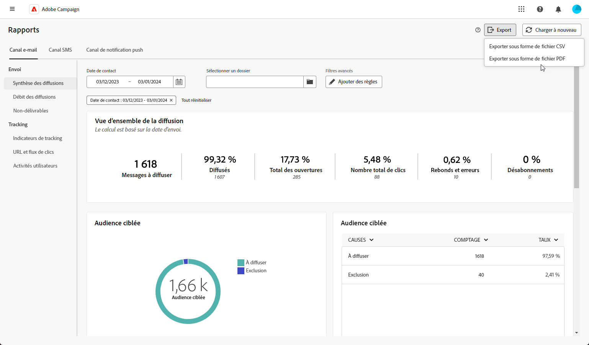

# Exportation des rapports {#export-reports}

>[!CONTEXTUALHELP]
>id="acw_reporting_email_exportation"
>title="Exportation des rapports"
>abstract="Cliquez sur le bouton **Exporter** pour exporter ces mesures au format PDF ou CSV, ce qui vous permet de les partager ou de les imprimer."

Vous pouvez  exporter vos rapports au format PDF ou CSV, ce qui vous permet de les partager, de les manipuler ou de les imprimer.

1. Dans votre rapport, cliquez sur **[!UICONTROL Exporter]** et sélectionnez **[!UICONTROL Exporter sous forme de fichier PDF]** ou **[!UICONTROL Exporter sous forme de fichier CSV]**.

   {zoomable="yes"}

1. Localisez le dossier dans lequel vous souhaitez enregistrer votre fichier, renommez-le si nécessaire, puis cliquez sur **[!UICONTROL Enregistrer]**.

Votre rapport peut désormais être affiché ou partagé dans un fichier PDF ou CSV.