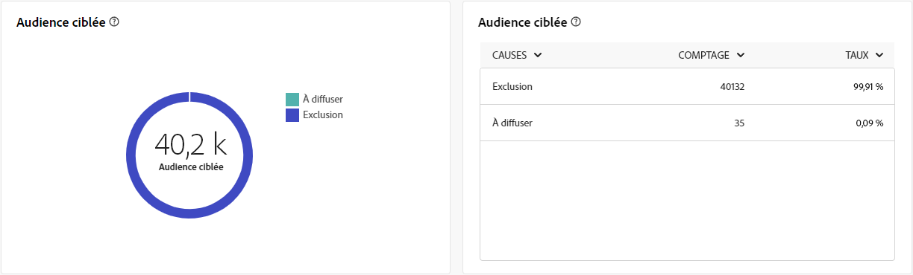
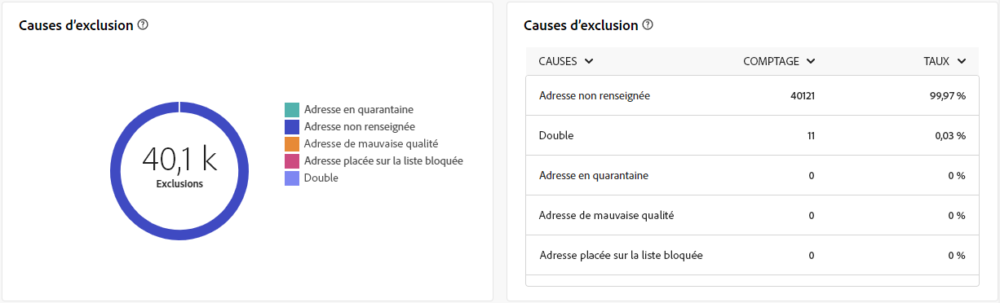

# Rapports globaux pour le canal Courrier {#global-report-direct}

Les rapports globaux sur le publipostage direct offrent aux utilisateurs une vue d’ensemble complète des mesures de trafic et d’engagement au niveau du canal.

Accédez au menu **[!UICONTROL Rapports]** dans la section **[!UICONTROL Reporting]**. Vous pouvez filtrer vos données en fonction de la date du rapport, du dossier ou des règles. [En savoir plus](global-reports.md)

## Synthèse des diffusions {#delivery-summary-direct}

### Vue d’ensemble de la diffusion {#delivery-overview-direct}

>[!CONTEXTUALHELP]
>id="acw_global_reporting_delivery_overview_direct_mail"
>title="Vue d’ensemble de la diffusion"
>abstract="La **Vue d’ensemble de la diffusion** affiche des KPI, ou indicateurs clés de performance, qui offrent des informations détaillées sur la manière dont vos visiteurs et visiteuses interagissent avec les diffusions courrier. Les mesures sont décrites ci-dessous."

La **[!UICONTROL Présentation de la diffusion]** présente des mesures de performances clés (KPI) et offre des informations détaillées sur l’interaction de vos visiteurs et visiteuses avec chaque diffusion de publipostage direct. Les mesures sont décrites ci-dessous.

{zoomable="yes"}{align="center"}

+++En savoir plus sur les mesures de vue d’ensemble de diffusion.

* **[!UICONTROL Messages à diffuser]** : nombre total de messages traités lors de la préparation de la diffusion.

* **[!UICONTROL Diffusés]** : nombre de messages envoyés avec succès, par rapport au nombre total de messages envoyés.

* **[!UICONTROL Erreurs]** : nombre total d’erreurs accumulées lors des diffusions et du traitement automatique des retours, par rapport au nombre total de messages envoyés.

* **[!UICONTROL Désabonnements]** : nombre de destinataires ayant cliqué sur des liens de désabonnement.

+++

### Audience ciblée {#delivery-summary-direct-initial-target}

>[!CONTEXTUALHELP]
>id="acw_global_reporting_target_audience_direct_mail_graph"
>title="Audience ciblée"
>abstract="Les données de la personne destinataire et les informations sur le message s’affichent sur le graphe **Audience ciblée**, reflétant l’analyse de préparation de la diffusion."

>[!CONTEXTUALHELP]
>id="acw_global_reporting_target_audience_direct_mail_table"
>title="Audience ciblée"
>abstract="Le tableau **Audience ciblée** fournit une répartition détaillée de vos personnes destinataires et des messages correspondants, basée sur les résultats du processus de préparation de la diffusion."

Le tableau et le graphe pour **[!UICONTROL Audience ciblée]** présentent des données relatives à vos personnes destinataires, avec les mesures détaillées fournies ci-dessous.

{zoomable="yes"}{align="center"}

+++En savoir plus sur les mesures d’audience ciblée.

* **[!UICONTROL Audience ciblée]** : nombre total de destinataires ciblés.

* **[!UICONTROL Message à diffuser]** : nombre total de messages à diffuser après la préparation de la diffusion.

* **[!UICONTROL Exclusion]** : nombre total d’adresses ignorées pendant l’analyse lors de l’application des règles, telles que l’adresse manquante, mise en quarantaine ou sur une liste bloquée.

+++

### Statistiques de diffusion {#delivery-summary-direct-exec-stats}

>[!CONTEXTUALHELP]
>id="acw_global_reporting_delivery_statistics_summary_direct_mail_graph"
>title="Statistiques de diffusion"
>abstract="Le graphe **Statistiques de diffusion** fournit des informations sur l’efficacité de vos diffusions courrier, y compris les diffusions réussies et les erreurs rencontrées."

>[!CONTEXTUALHELP]
>id="acw_global_reporting_delivery_statistics_summary_direct_mail_table"
>title="Statistiques de diffusion"
>abstract="Le tableau **Statistiques de diffusion** détaille le succès de votre diffusion et les erreurs qui se sont produites."

Le graphe **[!UICONTROL Statistiques de diffusion]** fournit une répartition du succès de chaque diffusion par courrier, avec les mesures détaillées décrites ci-dessous.

+++En savoir plus sur les mesures des statistiques de diffusion.

* **[!UICONTROL Message à diffuser]** : nombre total de messages à diffuser après la préparation de la diffusion.

* **[!UICONTROL Succès]** : nombre de messages traités avec succès, par rapport au nombre de messages à diffuser.

* **[!UICONTROL Erreurs / Bounces]** : nombre total d’erreurs accumulées lors des diffusions et du traitement automatique des retours, par rapport au nombre de messages à diffuser.

* **[!UICONTROL Nouvelles quarantaines]** : nombre total d’adresses mises en quarantaine à la suite d’un échec de diffusion (par exemple, utilisateur ou utilisatrice inconnu(e), domaine invalide), par rapport au nombre de messages à diffuser.

+++

### Causes d’exclusion {#causes-exclusion}

>[!CONTEXTUALHELP]
>id="acw_global_reporting_exclusions_direct_mail_table"
>title="Exclusions"
>abstract="Le tableau **Causes d’exclusion** affiche une répartition détaillée, par règle, des messages qui ont été rejetés pendant le processus de préparation de la diffusion."

>[!CONTEXTUALHELP]
>id="acw_global_reporting_causes_exclusion_direct_mail_graph"
>title="Causes d’exclusion"
>abstract="Le graphe **Causes d’exclusion** illustre la distribution des messages rejetés, classés par règle, lors de la préparation de la diffusion."

{zoomable="yes"}{align="center"}

Le graphe et le tableau Exclusions illustrent les raisons qui ont empêché des profils d’utilisateurs et d’utilisatrices exclus des profils ciblés de recevoir le message.

+++En savoir plus sur les mesures de causes d’exclusion.

* **[!UICONTROL Adresse en quarantaine]** : type d&#39;erreur générée lors de la mise en quarantaine d&#39;une adresse.

* **[!UICONTROL Adresse non renseignée]** : type d’erreur générée lors de l’envoi d’une diffusion indiquant que l’adresse n’existe pas.

* **[!UICONTROL Adresse de mauvaise qualité]** : type d’erreur générée lorsque l’indice de qualité de l’adresse postale est trop faible.

* **[!UICONTROL Adresse placée sur la liste bloquée]** : type d’erreur générée lorsque la personne destinataire a été placée sur la liste bloquée lors de l’exécution de la diffusion.

* **[!UICONTROL Double]** : type d&#39;erreur générée lors de l&#39;exclusion du destinataire car ses valeurs de clé ne sont pas uniques.

* **[!UICONTROL Population témoin]** : l’adresse de la personne destinataire fait partie de la population témoin.

* **[!UICONTROL Cible limitée en taille]** : la taille de diffusion maximale a été atteinte pour la personne destinataire.

+++