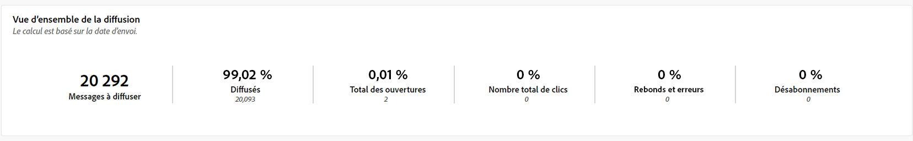
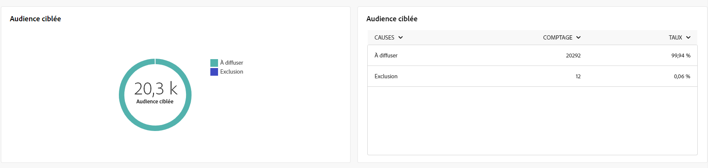
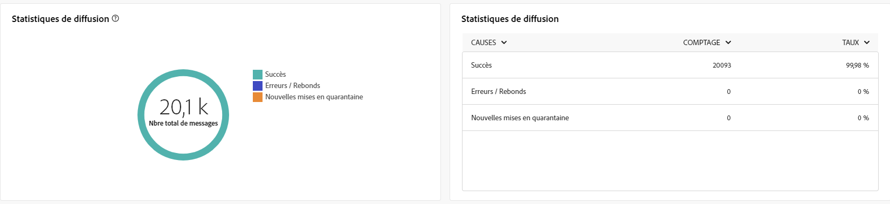
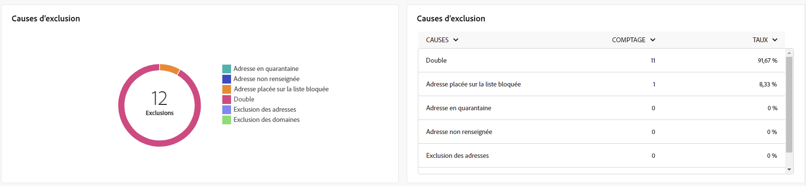

# Rapports globaux pour le canal courrier {#global-report-direct}

Les rapports globaux offrent aux utilisateurs un aperçu complet des mesures de trafic et d’engagement au niveau des canaux.

Accédez au **[!UICONTROL Rapports]** dans le **[!UICONTROL Reporting]** . Vous pouvez filtrer vos données en fonction de la date, du dossier ou des règles du rapport. [En savoir plus](global-reports.md)

## Synthèse des diffusions {#delivery-summary-direct}

### Vue d’ensemble de la diffusion {#delivery-overview-direct}

La variable **[!UICONTROL Présentation de la diffusion]** présente des mesures de performances clés (IPC) qui offrent des informations détaillées sur l’interaction de vos visiteurs avec chaque diffusion par e-mail. Les mesures sont décrites ci-dessous.

{align="center"}

+++En savoir plus sur les mesures de présentation des diffusions.

* **[!UICONTROL Messages à diffuser]** : nombre total de messages traités lors de la préparation de la diffusion.

* **[!UICONTROL Délivrés]** : nombre de messages envoyés avec succès, par rapport au nombre total de messages envoyés.

* **[!UICONTROL Erreurs]** : nombre total d’erreurs cumulées lors des diffusions et du traitement automatique des retours par rapport au nombre total de messages envoyés.

* **[!UICONTROL Désabonne]**: nombre de destinataires ayant cliqué sur les désabonnements.
+++

### Audience ciblée {#delivery-summary-direct-initial-target}

Le tableau et le graphique pour **[!UICONTROL Audience ciblée]** présenter les données relatives à vos destinataires, avec les mesures détaillées fournies ci-dessous.

{align="center"}

+++En savoir plus sur les mesures d’audience ciblées.

* **[!UICONTROL Audience ciblée]**: Nombre total de destinataires ciblés.

* **[!UICONTROL Message à diffuser]** : nombre total de messages à diffuser après la préparation de la diffusion.

* **[!UICONTROL Exclusion]**: Nombre total d&#39;adresses ignorées lors de l&#39;analyse lors de l&#39;application des règles : adresse manquante, en quarantaine, en liste bloquée, etc.

+++

### Statistiques de diffusion {#delivery-summary-direct-exec-stats}

La variable **[!UICONTROL Statistiques de diffusion]** le tableau fournit une ventilation des performances de chaque diffusion courrier, avec les mesures détaillées décrites ci-dessous.

{align="center"}

+++En savoir plus sur les mesures de statistiques de diffusion.

* **[!UICONTROL Message à diffuser]** : nombre total de messages à diffuser après la préparation de la diffusion.

* **[!UICONTROL Succès]** : nombre de messages traités avec succès par rapport au nombre de messages à délivrer.

* **[!UICONTROL Erreurs / Rebonds]**: Nombre total d&#39;erreurs cumulées lors des diffusions et du traitement automatique des retours par rapport au nombre de messages à diffuser.

* **[!UICONTROL Nouvelles quarantaines]** : nombre total d’adresses mises en quarantaine à la suite d’un échec de diffusion (utilisateur ou utilisatrice inconnu(e), domaine invalide) par rapport au nombre de messages à délivrer.

+++

### Causes d’exclusion {#causes-exclusion}

{align="center"}

Le tableau et graphique Exclusions illustrent les raisons qui ont empêché les profils utilisateur, exclus des profils ciblés, de recevoir le message.

## Débit des diffusions (Delivery throughput)  {#delivery-throughput}

Ce rapport fournit des détails complets sur le débit de diffusion au cours d’une période spécifiée. La mesure clé utilisée pour mesurer la vitesse de diffusion des messages est le nombre de messages envoyés par heure.

## Non diffusables {#non-deliverables-direct}

### Répartition des erreurs par type {#delivery-summary-direct-breakdown-per-type}

La variable **[!UICONTROL Ventilation des erreurs par type]** tableau et graphique présentent les données liées aux erreurs potentielles rencontrées dans différents domaines, avec des mesures spécifiques fournies ci-dessous.

Les erreurs présentées dans ce rapport déclenchent le processus de mise en quarantaine. Pour plus d’informations sur la gestion des quarantaines, consultez la [documentation de Campaign v8 (console cliente)](https://experienceleague.adobe.com/docs/campaign/campaign-v8/campaigns/send/failures/delivery-failures.html?lang=fr){target="_blank"}.

+++En savoir plus sur la ventilation des erreurs par mesures de type.

* **[!UICONTROL Utilisateur inconnu]**: Type d&#39;erreur générée lors de la diffusion pour indiquer que l&#39;adresse n&#39;est pas valide.

* **[!UICONTROL Domaine invalide]**: Type d&#39;erreur générée lors de l&#39;envoi d&#39;une diffusion indiquant que le domaine de l&#39;adresse est erroné ou n&#39;existe pas.

* **[!UICONTROL Boîte pleine]** : type d’erreur générée, après cinq tentatives de diffusion, indiquant que la boîte de réception de la personne destinataire contient trop de messages.

* **[!UICONTROL Compte désactivé]** : type d&#39;erreur générée lors de l&#39;envoi d&#39;une diffusion indiquant que l&#39;adresse n&#39;existe plus.

* **[!UICONTROL Refusé]** : type d’erreur générée lorsqu’une adresse est refusée par le FAI (Fournisseur d’accès Internet), par exemple, suite à l’application d’une règle de sécurité (logiciel anti-spams).

* **[!UICONTROL Inatteignable]** : type d&#39;erreur survenue dans la chaîne de distribution du message : incident sur le relais SMTP, domaine temporairement inatteignable, etc.

* **[!UICONTROL Non connecté]** : type d’erreur indiquant que le téléphone portable de la personne destinataire est éteint ou n’est pas connecté au réseau au moment de l’envoi du message.

+++

### Répartition des erreurs par domaine {#delivery-summary-email-breakdown-per-domain}

La variable **[!UICONTROL Ventilation des erreurs par domaine]** tableau et graphique présentent les données liées aux erreurs potentielles dans chaque domaine. Les mesures sont communes au tableau et au graphe **[!UICONTROL Répartition des erreurs par type]** présentés ci-dessus.

