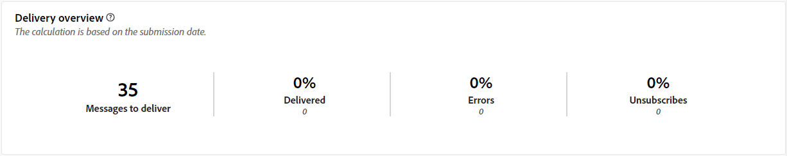

# Rapports globaux pour le canal courrier {#global-report-direct}

Les rapports globaux Courrier offrent aux utilisateurs un aperçu complet des mesures de trafic et d’engagement au niveau des canaux.

Accédez au menu **[!UICONTROL Rapports]** dans la section **[!UICONTROL Reporting]**. Vous pouvez filtrer vos données en fonction de la date, du dossier ou des règles du rapport. [En savoir plus](global-reports.md)

## Synthèse des diffusions {#delivery-summary-direct}

### Vue d’ensemble de la diffusion {#delivery-overview-direct}

>[!CONTEXTUALHELP]
>id="acw_global_reporting_delivery_overview_direct_mail"
>title="Vue d’ensemble de la diffusion"
>abstract="La **Vue d’ensemble de la diffusion** présente des indicateurs clés de performance (KPI) qui donnent des informations détaillées sur l’interaction de vos visiteurs et visiteuses avec chaque diffusion par courrier. Les mesures sont décrites ci-dessous."

La **[!UICONTROL Vue d’ensemble de la diffusion]** présente des indicateurs clés de performance (KPI) qui donnent des informations détaillées sur l’interaction de vos visiteurs et visiteuses avec chaque diffusion par courrier. Les mesures sont décrites ci-dessous.

{zoomable=&quot;yes&quot;}{align="center"}

+++En savoir plus sur les mesures de vue d’ensemble de diffusion.

* **[!UICONTROL Messages à diffuser]** : nombre total de messages traités lors de la préparation de la diffusion.

* **[!UICONTROL Diffusés]** : nombre de messages envoyés avec succès, par rapport au nombre total de messages envoyés.

* **[!UICONTROL Erreurs]** : nombre total d’erreurs cumulées lors des diffusions et du traitement automatique des retours par rapport au nombre total de messages envoyés.

* **[!UICONTROL Désabonnements]** : nombre de destinataires ayant cliqué afin de se désabonner.
+++

### Audience ciblée {#delivery-summary-direct-initial-target}

>[!CONTEXTUALHELP]
>id="acw_global_reporting_target_audience_direct_mail_graph"
>title="Audience ciblée"
>abstract="Les données de la personne destinataire et les informations sur le message s’affichent sur le graphe **Audience ciblée**, reflétant l’analyse de préparation de la diffusion."

>[!CONTEXTUALHELP]
>id="acw_global_reporting_target_audience_direct_mail_table"
>title="Audience ciblée"
>abstract="Le tableau **Audience ciblée** fournit une répartition détaillée de vos personnes destinataires et des messages correspondants, basée sur les résultats du processus de préparation de la diffusion."

Le tableau et le graphe pour **[!UICONTROL Audience ciblée]** présentent des données relatives à vos destinataires, avec les mesures détaillées fournies ci-dessous.

{zoomable=&quot;yes&quot;}{align="center"}

+++En savoir plus sur les mesures d’audience ciblée.

* **[!UICONTROL Audience ciblée]** : nombre total de destinataires ciblés.

* **[!UICONTROL Message à diffuser]** : nombre total de messages à diffuser après la préparation de la diffusion.

* **[!UICONTROL Exclusion]** : nombre d’adresses ignorées pendant l’analyse lors de l’application des règles : adresse manquante, mise en quarantaine, placée sur la liste bloquée, etc.

+++

### Statistiques de diffusion {#delivery-summary-direct-exec-stats}

>[!CONTEXTUALHELP]
>id="acw_global_reporting_delivery_statistics_summary_direct_mail_graph"
>title="Statistiques de diffusion"
>abstract="Le graphe **Statistiques de diffusion** fournit des informations sur l’efficacité de vos diffusions par courrier, y compris les diffusions réussies et les erreurs rencontrées."

>[!CONTEXTUALHELP]
>id="acw_global_reporting_delivery_statistics_summary_direct_mail_table"
>title="Statistiques de diffusion"
>abstract="Le tableau **Statistiques de diffusion** détaille le succès de votre diffusion par courrier et les erreurs qui se sont produites."

La variable **[!UICONTROL Statistiques de diffusion]** le graphique et le tableau fournissent une ventilation des performances de chaque diffusion courrier, avec les mesures détaillées décrites ci-dessous.

+++En savoir plus sur les mesures des statistiques de diffusion.

* **[!UICONTROL Message à diffuser]** : nombre total de messages à diffuser après la préparation de la diffusion.

* **[!UICONTROL Succès]** : nombre de messages traités avec succès par rapport au nombre de messages à délivrer.

* **[!UICONTROL Erreurs/Rebonds]** : nombre total d’erreurs cumulées lors des diffusions et du traitement automatique des rebonds par rapport au nombre de messages à diffuser.

* **[!UICONTROL Nouvelles quarantaines]** : nombre total d’adresses mises en quarantaine à la suite d’un échec de diffusion (utilisateurs et utilisatrices inconnus, domaine non valide) par rapport au nombre de messages à diffuser.

+++

### Causes d’exclusion {#causes-exclusion}

>[!CONTEXTUALHELP]
>id="acw_global_reporting_exclusions_direct_mail_table"
>title="Exclusions"
>abstract="Le tableau **Causes d’exclusion** affiche une répartition détaillée par règle des messages qui ont été rejetés pendant le processus de préparation de la diffusion."

>[!CONTEXTUALHELP]
>id="acw_global_reporting_causes_exclusion_direct_mail_graph"
>title="Causes d’exclusion lors d’une diffusion"
>abstract="Le graphe **Causes d’exclusion** illustre la distribution des messages rejetés, classés par règle, lors de la préparation de la diffusion."

{zoomable=&quot;yes&quot;}{align="center"}

Le graphe et le tableau Exclusions illustrent les raisons qui ont empêché des profils utilisateur et utilisatrice exclus des profils ciblés de recevoir le message.

+++En savoir plus sur les mesures Causes d’exclusion.

* **[!UICONTROL Adresse en quarantaine]**: Type d&#39;erreur générée lorsque l&#39;adresse est mise en quarantaine.

* **[!UICONTROL Adresse non renseignée]**: Type d&#39;erreur générée lors de l&#39;envoi d&#39;une diffusion indiquant que l&#39;adresse n&#39;existe pas.

* **[!UICONTROL Adresse de mauvaise qualité]**: type d’erreur générée lorsque la note de qualité de l’adresse postale est trop basse.

* **[!UICONTROL Adresse Placée sur la liste bloquée]**: Type d&#39;erreur générée lorsque le destinataire a été placé sur la liste bloquée lors de l&#39;exécution de la diffusion.

* **[!UICONTROL Double]**: Type d&#39;erreur générée lorsque le destinataire a été exclu, car ses valeurs de clés n&#39;étaient pas uniques.

* **[!UICONTROL Population témoin]**: l&#39;adresse du destinataire fait partie de la population témoin.

* **[!UICONTROL Cible limitée en taille]**: la taille de diffusion maximale a été atteinte pour le destinataire.

+++
