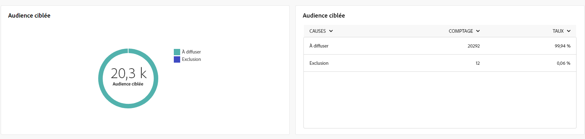
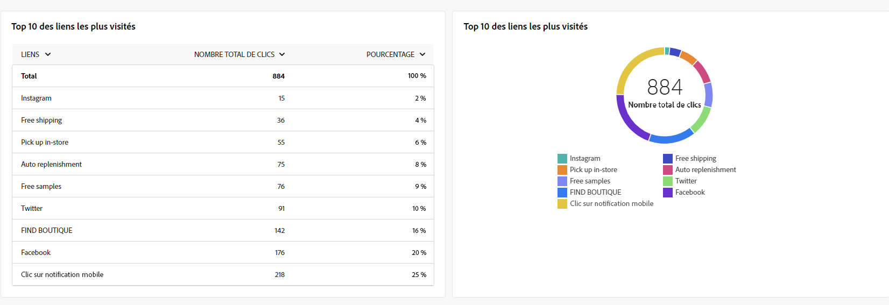

# Rapports globaux pour le canal Email {#global-report-direct}

Les rapports globaux offrent aux utilisateurs un aperçu complet des mesures de trafic et d’engagement au niveau des canaux.

Accédez au **[!UICONTROL Rapports]** dans le **[!UICONTROL Reporting]** . Vous pouvez filtrer vos données en fonction de la date, du dossier ou des règles du rapport. [En savoir plus](global-reports.md)

## Synthèse des diffusions {#delivery-summary-email}

### Vue d’ensemble de la diffusion {#delivery-overview-email}

>[!CONTEXTUALHELP]
>id="acw_global_reporting_deliveries_overview_email"
>title="Vue d’ensemble de la diffusion"
>abstract="La variable **Présentation de la diffusion** présente des indicateurs de performances clés (IPC) qui offrent des informations détaillées sur la manière dont votre audience interagit avec les diffusions email et les campagnes que vous envoyez."

La variable **[!UICONTROL Présentation de la diffusion]** présente des mesures de performances clés (IPC) qui offrent des informations détaillées sur l’interaction de vos visiteurs avec chaque diffusion par e-mail. Les mesures sont décrites ci-dessous.

{align="center"}

+++En savoir plus sur les mesures de présentation des diffusions.

* **[!UICONTROL Messages à diffuser]** : nombre total de messages traités lors de la préparation de la diffusion.

* **[!UICONTROL Délivrés]** : nombre de messages envoyés avec succès, par rapport au nombre total de messages envoyés.

* **[!UICONTROL Total des ouvertures]** : nombre total de personnes destinataires ciblées ayant ouvert un message au moins une fois.

* **[!UICONTROL Nombre total de clics]**: Nombre total de destinataires ayant cliqué au moins une fois dans une même diffusion.

* **[!UICONTROL Rebonds et erreurs]**: Nombre total d&#39;erreurs cumulées lors des diffusions et du traitement automatique des retours par rapport au nombre total de messages envoyés.

* **[!UICONTROL Désabonne]**: nombre de destinataires ayant cliqué sur les désabonnements.
+++

### Audience ciblée {#delivery-summary-email-initial-target}

>[!CONTEXTUALHELP]
>id="acw_global_reporting_target_audience_email"
>title="Statistiques initiales sur l’audience cible"
>abstract="La variable **Audience ciblée** le tableau et le graphique offrent des informations sur l’engagement des destinataires, ce qui vous aide à évaluer l’efficacité de vos campagnes et diffusions."

Le tableau et le graphique pour **[!UICONTROL Audience ciblée]** présenter les données relatives à vos destinataires, avec les mesures détaillées fournies ci-dessous.

{align="center"}

+++En savoir plus sur les mesures d’audience ciblées.

* **[!UICONTROL Audience ciblée]**: Nombre total de destinataires ciblés.

* **[!UICONTROL Message à diffuser]** : nombre total de messages à diffuser après la préparation de la diffusion.

* **[!UICONTROL Exclusion]**: Nombre total d&#39;adresses ignorées lors de l&#39;analyse lors de l&#39;application des règles : adresse manquante, en quarantaine, en liste bloquée, etc.

+++

### Statistiques de diffusion {#delivery-summary-email-delivery-stats}

>[!CONTEXTUALHELP]
>id="acw_global_reporting_email_delivery_stats"
>title="Statistiques de diffusion"
>abstract="La variable **Statistiques de diffusion** le graphique et le tableau présentent les principales mesures, notamment les diffusions réussies, les erreurs et les nouvelles mises en quarantaine, et offrent un aperçu concis pour évaluer les performances des diffusions."

La variable **[!UICONTROL Statistiques de diffusion]** Le tableau fournit une ventilation des performances de chaque diffusion par courrier électronique, avec les mesures détaillées décrites ci-dessous.

{align="center"}

+++En savoir plus sur les mesures de statistiques de diffusion.

* **[!UICONTROL Message à diffuser]** : nombre total de messages à diffuser après la préparation de la diffusion.

* **[!UICONTROL Succès]** : nombre de messages traités avec succès par rapport au nombre de messages à délivrer.

* **[!UICONTROL Erreurs / Rebonds]**: Nombre total d&#39;erreurs cumulées lors des diffusions et du traitement automatique des retours par rapport au nombre de messages à diffuser.

* **[!UICONTROL Nouvelles quarantaines]** : nombre total d’adresses mises en quarantaine à la suite d’un échec de diffusion (utilisateur ou utilisatrice inconnu(e), domaine invalide) par rapport au nombre de messages à délivrer.

+++

### Causes d’exclusion {#causes-exclusion}

>[!CONTEXTUALHELP]
>id="acw_global_reporting_exclusion_email"
>title="Causes d’exclusion"
>abstract="La variable **Causes d’exclusion** Un graphique et un tableau illustrent les raisons spécifiques du rejet des messages lors de la préparation de la diffusion, avec une ventilation détaillée par règle."

{align="center"}

Le tableau et graphique Exclusions illustrent les raisons qui ont empêché les profils utilisateur, exclus des profils ciblés, de recevoir le message.

Les types d’erreur d’e-mail sont répertoriés dans la section [Documentation d’Adobe Campaign v8 (console cliente)](https://experienceleague.adobe.com/docs/campaign/campaign-v8/send/failures/delivery-failures.html?lang=fr#email-error-types){target="_blank"}.

## Débit des diffusions (Delivery throughput) {#delivery-throughput}

>[!CONTEXTUALHELP]
>id="acw_global_reporting_throughput_email"
>title="Débit des diffusions (Delivery throughput) "
>abstract="Ceci **Débit de diffusion** fournit des informations complètes sur le débit des diffusions, en mettant en évidence les taux de succès et d’erreur au cours d’une période spécifiée."

{align="center"}

Le rapport Débit des diffusions fournit des informations détaillées sur l’efficacité du processus de diffusion, en présentant une vue d’ensemble détaillée des taux de succès et d’erreur au cours d’une période spécifiée.

+++En savoir plus sur les mesures de débit de diffusion.

* **[!UICONTROL Succès]** : nombre de messages traités avec succès par rapport au nombre de messages à délivrer.

* **[!UICONTROL Erreurs]** : nombre total d’erreurs cumulées lors des diffusions et du traitement automatique des retours par rapport au nombre de messages à délivrer.

+++

## Non diffusables {#non-deliverables-email}

### Répartition des erreurs par type {#delivery-summary-email-breakdown-per-type}

>[!CONTEXTUALHELP]
>id="acw_global_reporting_error_type_email"
>title="Répartition des erreurs par type"
>abstract="Le tableau et le graphique détaillant la variable **Ventilation des erreurs par type** englobe les informations sur les différents types d’erreur rencontrés lors du processus, notamment l’utilisateur inconnu, la boîte pleine, le domaine invalide, etc."

{align="center"}

La variable **[!UICONTROL Ventilation des erreurs par type]** tableau et graphique présentent les données liées aux erreurs potentielles rencontrées dans différents domaines, avec des mesures spécifiques fournies ci-dessous.

Les erreurs présentées dans ce rapport déclenchent le processus de mise en quarantaine. Pour plus d’informations sur la gestion des quarantaines, consultez la [documentation de Campaign v8 (console cliente)](https://experienceleague.adobe.com/docs/campaign/campaign-v8/campaigns/send/failures/delivery-failures.html?lang=fr){target="_blank"}.

+++En savoir plus sur la ventilation des erreurs par mesures de type.

* **[!UICONTROL Utilisateur inconnu]** : type d&#39;erreur générée lors de l&#39;envoi d&#39;une diffusion indiquant que l&#39;adresse e-mail est invalide.

* **[!UICONTROL Domaine invalide]** : type d&#39;erreur générée lors de l&#39;envoi d&#39;une diffusion indiquant que le domaine de l&#39;adresse e-mail est erroné ou n&#39;existe plus.

* **[!UICONTROL Boîte pleine]** : type d’erreur générée, après cinq tentatives de diffusion, indiquant que la boîte de réception de la personne destinataire contient trop de messages.

* **[!UICONTROL Compte désactivé]** : type d&#39;erreur générée lors de l&#39;envoi d&#39;une diffusion indiquant que l&#39;adresse n&#39;existe plus.

* **[!UICONTROL Refusé]** : type d’erreur générée lorsqu’une adresse est refusée par le FAI (Fournisseur d’accès Internet), par exemple, suite à l’application d’une règle de sécurité (logiciel anti-spams).

* **[!UICONTROL Inatteignable]** : type d&#39;erreur survenue dans la chaîne de distribution du message : incident sur le relais SMTP, domaine temporairement inatteignable, etc.

* **[!UICONTROL Non connecté]** : type d’erreur indiquant que le téléphone portable de la personne destinataire est éteint ou n’est pas connecté au réseau au moment de l’envoi du message.

+++

### Répartition des erreurs par domaine {#delivery-summary-email-breakdown-per-domain}

>[!CONTEXTUALHELP]
>id="acw_global_reporting_error_domain_email"
>title="Répartition des erreurs par domaine"
>abstract="Le tableau et le graphique qui illustrent la variable **Ventilation des erreurs par domaine** présenter les données correspondant à chaque type d’erreur rencontré, classées par domaines spécifiques."

{align="center"}

La variable **[!UICONTROL Ventilation des erreurs par domaine]** tableau et graphique présentent les données liées aux erreurs potentielles dans chaque domaine. Les mesures sont communes au tableau et au graphe **[!UICONTROL Répartition des erreurs par type]** présentés ci-dessus.

## Indicateurs de tracking {#tracking-indicators-email}

### Statistiques de diffusion {#delivery-summary-email-statistics}

>[!CONTEXTUALHELP]
>id="acw_global_delivery_statistics_summary_email"
>title="Statistiques de diffusion"
>abstract="La variable **Statistiques de diffusion** Les indicateurs de performance clés (IPC) fournissent un aperçu complet des performances de vos diffusions et campagnes, et vous donnent des informations à la fois sur les diffusions réussies, les erreurs rencontrées et l’engagement des utilisateurs."

La variable **[!UICONTROL Statistiques de diffusion]** Les mesures offrent des indicateurs de performances clés (IPC) fournissant des informations détaillées sur les données associées à chaque diffusion par e-mail. Vous trouverez plus d’informations sur ces mesures ci-dessous.

{align="center"}

+++En savoir plus sur les mesures de statistiques de diffusion.

* **[!UICONTROL Messages à diffuser]** : nombre total de messages traités lors de la préparation de la diffusion.

* **[!UICONTROL Succès]** : nombre de messages traités avec succès par rapport au nombre de messages à délivrer.

* **[!UICONTROL Ouvertures uniques]** : nombre total de personnes destinataires ciblées ayant ouvert un message au moins une fois.

* **[!UICONTROL Total des ouvertures]** : nombre de personnes destinataires ciblées distinctes pour ce domaine, ayant ouvert un message au moins une fois.

* **[!UICONTROL Clics sur le lien d’exclusion]** : nombre de clics effectués sur le lien d’exclusion.

* **[!UICONTROL Clics sur le lien miroir]** : nombre de clics sur le lien vers la page miroir.

* **[!UICONTROL Estimation des transferts]** : estimation du nombre d’e-mails transférés par les destinataires ciblé(e)s.
+++

### Taux d’ouverture et de clic publicitaire {#delivery-summary-open-rate}

>[!CONTEXTUALHELP]
>id="acw_global_reporting_open_clickthrough_email"
>title="Taux d’ouvertures et de clics"
>abstract="Le tableau pour **Taux d&#39;ouverture et de clic** révèle l’engagement des destinataires avec votre diffusion, en présentant les données sur les taux d’ouverture et les taux de clics publicitaires pour un aperçu rapide et pertinent."

Le tableau **[!UICONTROL Taux d’ouverture et de clic publicitaire]** affiche des données relatives à vos destinataires. Les mesures sont détaillées ci-dessous.

{align="center"}

+++En savoir plus sur les mesures Ouverture et taux de clics.

* **[!UICONTROL Envoyés]** : nombre total de messages envoyés.

* **[!UICONTROL Plaintes]** : nombre et pourcentage de messages pour ce domaine qui ont été signalés par la personne destinataire comme indésirables.

* **[!UICONTROL Ouvertures uniques]** : nombre et pourcentage de personnes destinataires ciblées distinctes pour ce domaine, ayant ouvert un message au moins une fois.

* **[!UICONTROL Clics uniques]** : nombre et poucentage de personnes destinataires ciblées distinctes ayant cliqué au moins une fois dans une même diffusion.

* **[!UICONTROL Réactivité brute]** : pourcentage du nombre de destinataires ayant cliqué au moins une fois dans une même diffusion par rapport au nombre de destinataires ayant ouvert au moins une fois une même diffusion.
+++

## URL et flux de clics {#url-email}

### URL et flux de clics IPC {#url-email-kpis}

>[!CONTEXTUALHELP]
>id="acw_global_reporting_urls_clickstreams_email"
>title="URL et flux de clics"
>abstract="La variable **URL et flux de clics** Ce rapport fournit des indicateurs de performance clés (IPC) essentiels qui offrent des informations détaillées sur les URL ayant reçu le plus de clics lors d’une diffusion."

La variable **[!UICONTROL URL et flux de clics]** Ce rapport fournit des indicateurs de performance clés (IPC) qui fournissent des informations détaillées sur les URL ayant reçu le plus grand nombre de clics au cours d’une diffusion. Les mesures sont détaillées ci-dessous.

{align="center"}

+++En savoir plus sur les mesures URL et flux de clics.

* **[!UICONTROL Réactivité]** : ratio du nombre de personnes destinataires ciblées ayant cliqué dans une diffusion, par rapport à l’estimation du nombre de personnes destinataires ciblées ayant ouvert une diffusion.

* **[!UICONTROL Clics uniques]** : nombre total de personnes destinataires distinctes ayant cliqué dans une diffusion au moins une fois.

* **[!UICONTROL Nombre total de clics]** : nombre total de clics sur les liens dans les diffusions.

* **[!UICONTROL Moyenne plateforme]** : ce taux moyen, affiché sous chaque taux (réactivité, clics distincts et clics cumulés), est calculé pour les diffusions envoyées sur les six derniers mois. Seules les diffusions de même typologie et envoyées sur le même canal sont prises en compte. Les BAT sont exclus.
+++

### Top 10 des liens les plus visités {#top10-global-report-email}

>[!CONTEXTUALHELP]
>id="acw_global_reporting_top10_email"
>title="Top 10 des liens les plus visités"
>abstract="La variable **Les 10 liens les plus consultés**  le graphique et le tableau présentent des données complètes sur l’interaction des destinataires avec chaque lien."

Le tableau et le graphe des **[!UICONTROL 10 liens les plus visités]** contiennent les données disponibles pour le comportement des destinataires par lien. Les mesures sont détaillées ci-dessous.

{align="center"}

+++En savoir plus sur les 10 mesures de liens les plus consultés.

* **[!UICONTROL Nombre total de clics]** : nombre total de clics sur les liens dans les diffusions.

* **[!UICONTROL Pourcentage]** : pourcentage d’utilisateurs et utilisatrices ayant interagi avec la diffusion.

+++

### Répartition des clics dans le temps {#global-report-email-breakdown-clicks}

>[!CONTEXTUALHELP]
>id="acw_global_reporting_urls_click_breakdown_email"
>title="Répartition des clics dans le temps"
>abstract="La variable **Répartition des clics au fil du temps** le graphique offre une vue complète de la façon dont les destinataires interagissent avec les liens tout au long de la période désignée."

Le graphe **[!UICONTROL Répartition des clics dans le temps]** contient les données disponibles sur le comportement des destinataires par lien.

{align="center"}

## Activités utilisateurs {#user-activities-email}

>[!CONTEXTUALHELP]
>id="acw_global_reporting_user_activities_email"
>title="Activités utilisateurs"
>abstract="Représentation graphique de **Activités utilisateurs** propose une répartition détaillée des interactions des destinataires, en présentant les ouvertures et les clics à travers un format de graphique informatif."

Le graphe **[!UICONTROL Activités utilisateurs]** affiche la répartition des ouvertures et des clics sous la forme d’un diagramme. Les mesures de ce rapport sont détaillées ci-dessous.

{align="center"}

+++En savoir plus sur les mesures des activités utilisateur.

* **[!UICONTROL Nombre total de clics]** : nombre total de clics sur les liens dans les diffusions.

* **[!UICONTROL Nombre total d’ouvertures]**: Nombre total de destinataires ciblés distincts, pour ce domaine, ayant ouvert au moins une fois un même message.

+++
