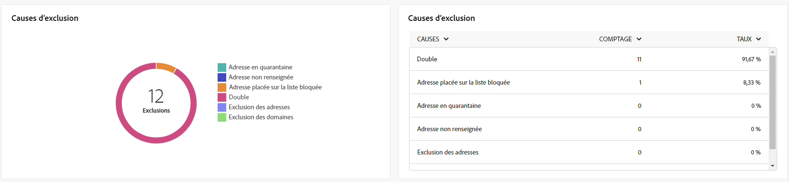

# Rapports globaux du canal e-mail {#global-report-direct}

Les rapports globaux offrent aux utilisateurs un aperçu complet des mesures de trafic et d’engagement au niveau des canaux.

Accédez au menu **[!UICONTROL Rapports]** dans la section **[!UICONTROL Reporting]**. Vous pouvez filtrer vos données en fonction de la date, du dossier ou des règles du rapport. [En savoir plus](global-reports.md)

## Synthèse des diffusions {#delivery-summary-email}

### Vue d’ensemble de la diffusion {#delivery-overview-email}

>[!CONTEXTUALHELP]
>id="acw_global_reporting_deliveries_overview_email"
>title="Vue d’ensemble de la diffusion"
>abstract="La **Vue d’ensemble de la diffusion** présente des KPI, ou indicateurs clés de performance, qui offrent des informations détaillées sur la manière dont votre audience interagit avec les diffusions e-mail et les campagnes que vous envoyez."

La **[!UICONTROL Vue d’ensemble de la diffusion]** affiche des KPI, ou indicateurs clés de performance, qui offrent des informations détaillées sur la manière dont vos visiteurs et visiteuses interagissent avec les diffusions e-mail. Les mesures sont décrites ci-dessous.

{align="center"}

+++En savoir plus sur les mesures de vue d’ensemble de diffusion.

* **[!UICONTROL Messages à diffuser]** : nombre total de messages traités lors de la préparation de la diffusion.

* **[!UICONTROL Diffusés]** : nombre de messages envoyés avec succès, par rapport au nombre total de messages envoyés.

* **[!UICONTROL Total des ouvertures]** : nombre total de destinataires ciblés ayant ouvert un message au moins une fois.

* **[!UICONTROL Nombre total de clics]** : nombre total de destinataires ayant cliqué au moins une fois dans une diffusion.

* **[!UICONTROL Rebonds + erreurs]** : nombre total d’erreurs cumulées lors des diffusions et du traitement automatique des retours par rapport au nombre total de messages envoyés.

* **[!UICONTROL Désabonnements]** : nombre de destinataires ayant cliqué sur le lien de désabonnement.
+++

### Audience ciblée {#delivery-summary-email-initial-target}

>[!CONTEXTUALHELP]
>id="acw_global_reporting_target_audience_email"
>title="Statistiques initiales sur l’audience cible"
>abstract="Le tableau et le graphe **Audience ciblée** offrent des informations sur l’engagement des destinataires afin de vous aider à juger de l’efficacité de vos campagnes et de vos diffusions."

Le tableau et le graphe **[!UICONTROL Audience ciblée]** affichent les données relatives à vos destinataires sous la forme de mesures détaillées. Consultez-les ci-dessous.

{align="center"}

+++En savoir plus sur les mesures d’audience ciblée.

* **[!UICONTROL Audience ciblée]** : nombre total de destinataires ciblés.

* **[!UICONTROL Message à diffuser]** : nombre total de messages à diffuser après la préparation de la diffusion.

* **[!UICONTROL Exclusion]** : nombre d’adresses ignorées pendant l’analyse lors de l’application des règles : adresse manquante, mise en quarantaine, placée sur la liste bloquée, etc.

+++

### Statistiques de diffusion {#delivery-summary-email-delivery-stats}

>[!CONTEXTUALHELP]
>id="acw_global_reporting_email_delivery_stats"
>title="Statistiques de diffusion"
>abstract="Le graphe et le tableau **Statistiques de diffusion** présentent les mesures clés, notamment les diffusions réussies, les erreurs et les nouvelles mises en quarantaine, et offrent une vue d’ensemble permettant d’évaluer les performances de la diffusion."

Le tableau **[!UICONTROL Statistiques de diffusion]** fournit une répartition des performances pour chaque diffusion e-mail, qui comprend les mesures détaillées ci-dessous.

{align="center"}

+++En savoir plus sur les mesures des statistiques de diffusion.

* **[!UICONTROL Message à diffuser]** : nombre total de messages à diffuser après la préparation de la diffusion.

* **[!UICONTROL Succès]** : nombre de messages traités avec succès par rapport au nombre de messages à délivrer.

* **[!UICONTROL Erreurs/Rebonds]** : nombre total d’erreurs cumulées lors des diffusions et du traitement automatique des rebonds par rapport au nombre de messages à diffuser.

* **[!UICONTROL Nouvelles quarantaines]** : nombre total d’adresses mises en quarantaine à la suite d’un échec de diffusion (utilisateurs et utilisatrices inconnus, domaine non valide) par rapport au nombre de messages à diffuser.

+++

### Causes d’exclusion {#causes-exclusion}

>[!CONTEXTUALHELP]
>id="acw_global_reporting_exclusion_email"
>title="Causes d’exclusion"
>abstract="Le graphe et le tableau **Causes d’exclusion** illustrent les raisons spécifiques du rejet des messages lors de la préparation de la diffusion, avec une répartition détaillée par règle."

{align="center"}

Le graphe et le tableau Exclusions illustrent les raisons qui ont empêché des profils utilisateur et utilisatrice exclus des profils ciblés de recevoir le message.

Les types d’erreur d’e-mail sont répertoriés dans la section [Documentation d’Adobe Campaign v8 (console cliente)](https://experienceleague.adobe.com/docs/campaign/campaign-v8/send/failures/delivery-failures.html?lang=fr#email-error-types){target="_blank"}.

## Débit de diffusion {#delivery-throughput}

>[!CONTEXTUALHELP]
>id="acw_global_reporting_throughput_email"
>title="Débit de diffusion"
>abstract="Le rapport **Débit de diffusion** fournit des informations complètes sur le débit des diffusions, en mettant en évidence les taux de succès et d’erreur au cours d’une période donnée."

{align="center"}

Le rapport Débit de diffusion présente des informations détaillées sur l’efficacité du processus de diffusion, ainsi qu’une vue d’ensemble des taux de succès et d’erreur survenus au cours d’une période donnée.

+++En savoir plus sur les mesures de débit de diffusion.

* **[!UICONTROL Succès]** : nombre de messages traités avec succès par rapport au nombre de messages à délivrer.

* **[!UICONTROL Erreurs]** : nombre total d’erreurs cumulées lors des diffusions et du traitement automatique des retours par rapport au nombre de messages à délivrer.

+++

## Non diffusables {#non-deliverables-email}

### Répartition des erreurs par type {#delivery-summary-email-breakdown-per-type}

>[!CONTEXTUALHELP]
>id="acw_global_reporting_error_type_email"
>title="Répartition des erreurs par type"
>abstract="Le tableau et le graphe détaillant la **Répartition des erreurs par type** présentent les informations sur les différents types d’erreur rencontrés lors du processus, notamment l’utilisateur ou utilisatrice inconnu, la boîte pleine, le domaine non valide, etc."

{align="center"}

Le tableau et le graphe **[!UICONTROL Répartition des erreurs par type]** présentent les données relatives aux erreurs potentielles rencontrées dans différents domaines sous la forme de mesures spécifiques. Consultez-les ci-dessous.

Les erreurs présentées dans ce rapport déclenchent le processus de mise en quarantaine. Pour plus d’informations sur la gestion des quarantaines, consultez la [documentation de Campaign v8 (console cliente)](https://experienceleague.adobe.com/docs/campaign/campaign-v8/campaigns/send/failures/delivery-failures.html?lang=fr){target="_blank"}.

+++En savoir plus sur les mesures de répartition des erreurs par type.

* **[!UICONTROL Utilisateur inconnu]** : type d&#39;erreur générée lors de l&#39;envoi d&#39;une diffusion indiquant que l&#39;adresse e-mail est invalide.

* **[!UICONTROL Domaine invalide]** : type d&#39;erreur générée lors de l&#39;envoi d&#39;une diffusion indiquant que le domaine de l&#39;adresse e-mail est erroné ou n&#39;existe plus.

* **[!UICONTROL Boîte pleine]** : type d’erreur générée, après cinq tentatives de diffusion, indiquant que la boîte de réception de la personne destinataire contient trop de messages.

* **[!UICONTROL Compte désactivé]** : type d&#39;erreur générée lors de l&#39;envoi d&#39;une diffusion indiquant que l&#39;adresse n&#39;existe plus.

* **[!UICONTROL Refusé]** : type d’erreur générée lorsqu’une adresse est refusée par le FAI (Fournisseur d’accès Internet), par exemple, suite à l’application d’une règle de sécurité (logiciel anti-spams).

* **[!UICONTROL Inatteignable]** : type d&#39;erreur survenue dans la chaîne de distribution du message : incident sur le relais SMTP, domaine temporairement inatteignable, etc.

* **[!UICONTROL Non connecté]** : type d’erreur indiquant que le téléphone portable de la personne destinataire est éteint ou n’est pas connecté au réseau au moment de l’envoi du message.

+++

### Répartition des erreurs par domaine {#delivery-summary-email-breakdown-per-domain}

>[!CONTEXTUALHELP]
>id="acw_global_reporting_error_domain_email"
>title="Répartition des erreurs par domaine"
>abstract="Le tableau et le graphe illustrant la **Répartition des erreurs par domaine** présentent les données correspondant à chaque type d’erreur rencontré, avec un classement par domaine."

{align="center"}

Le tableau et le graphe **[!UICONTROL Répartition des erreurs par domaine]** présentent les données relatives aux erreurs potentielles rencontrées dans chaque domaine. Les mesures sont communes au tableau et au graphe **[!UICONTROL Répartition des erreurs par type]** présentés ci-dessus.

## Indicateurs de tracking {#tracking-indicators-email}

### Statistiques de diffusion {#delivery-summary-email-statistics}

>[!CONTEXTUALHELP]
>id="acw_global_delivery_statistics_summary_email"
>title="Statistiques de diffusion"
>abstract="Les KPI (indicateurs clés de performance) des **Statistiques de diffusion** offrent une vue d’ensemble complète des performances de vos diffusions et campagnes, et vous donnent des informations sur les diffusions réussies, les erreurs rencontrées et l’interaction client."

Les mesures des **[!UICONTROL Statistiques de diffusion]** offrent des KPI (indicateurs clés de performance) pour éclairer les données obtenues avec chaque diffusion e-mail. Vous trouverez plus d’informations sur ces mesures ci-dessous.

{align="center"}

+++En savoir plus sur les mesures des statistiques de diffusion.

* **[!UICONTROL Messages à diffuser]** : nombre total de messages traités lors de la préparation de la diffusion.

* **[!UICONTROL Succès]** : nombre de messages traités avec succès par rapport au nombre de messages à diffuser.

* **[!UICONTROL Ouvertures uniques]** : nombre total de personnes destinataires ciblées ayant ouvert un message au moins une fois.

* **[!UICONTROL Total des ouvertures]** : nombre de personnes destinataires ciblées distinctes pour ce domaine, ayant ouvert un message au moins une fois.

* **[!UICONTROL Clics sur le lien d’exclusion]** : nombre de clics effectués sur le lien d’exclusion.

* **[!UICONTROL Clics sur le lien miroir]** : nombre de clics sur le lien vers la page miroir.

* **[!UICONTROL Estimation des transferts]** : estimation du nombre d’e-mails transférés par les destinataires ciblé(e)s.
+++

### Taux d’ouverture et de clic publicitaire {#delivery-summary-open-rate}

>[!CONTEXTUALHELP]
>id="acw_global_reporting_open_clickthrough_email"
>title="Taux d’ouvertures et de clics"
>abstract="Le tableau **Taux d’ouverture et de clic publicitaire** révèle l’engagement des destinataires envers votre diffusion, en présentant les données sur les taux d’ouverture et les taux de clic publicitaire. Vous obtenez ainsi une vue d’ensemble rapide et pertinente sur votre diffusion."

Le tableau **[!UICONTROL Taux d’ouverture et de clic publicitaire]** affiche des données relatives à vos destinataires. Les mesures sont détaillées ci-dessous.

{align="center"}

+++En savoir plus sur les mesures Taux d’ouvertures et Taux de clic publicitaire.

* **[!UICONTROL Envoyés]** : nombre total de messages envoyés.

* **[!UICONTROL Plaintes]** : nombre et pourcentage de messages pour ce domaine qui ont été signalés par la personne destinataire comme indésirables.

* **[!UICONTROL Ouvertures uniques]** : nombre et pourcentage de personnes destinataires ciblées distinctes pour ce domaine, ayant ouvert un message au moins une fois.

* **[!UICONTROL Clics uniques]** : nombre et poucentage de personnes destinataires ciblées distinctes ayant cliqué au moins une fois dans une même diffusion.

* **[!UICONTROL Réactivité brute]** : pourcentage du nombre de destinataires ayant cliqué au moins une fois dans une même diffusion par rapport au nombre de destinataires ayant ouvert au moins une fois une même diffusion.
+++

## URL et flux de clics {#url-email}

### KPI sur les URL et sur les flux de clics {#url-email-kpis}

>[!CONTEXTUALHELP]
>id="acw_global_reporting_urls_clickstreams_email"
>title="URL et flux de clics"
>abstract="Le rapport **URL et flux de clics** présente des KPI (indicateurs clés de performance) essentiels qui offrent des informations détaillées sur les URL ayant reçu le plus de clics lors d’une diffusion."

Le rapport **[!UICONTROL URL et flux de clics]** fournit des KPI (indicateurs clés de performances) qui donnent des informations détaillées sur les URL qui ont reçu le plus grand nombre de clics lors d’une diffusion. Les mesures sont détaillées ci-dessous.

{align="center"}

+++En savoir plus sur les mesures URL et flux de clics.

* **[!UICONTROL Réactivité]** : ratio du nombre de personnes destinataires ciblées ayant cliqué dans une diffusion, par rapport à l’estimation du nombre de personnes destinataires ciblées ayant ouvert une diffusion.

* **[!UICONTROL Clics uniques]** : nombre total de personnes destinataires distinctes ayant cliqué dans une diffusion au moins une fois.

* **[!UICONTROL Nombre total de clics]** : nombre total de clics sur les liens dans les diffusions.

* **[!UICONTROL Moyenne plateforme]** : ce taux moyen, affiché sous chaque taux (réactivité, clics distincts et clics cumulés), est calculé pour les diffusions envoyées sur les six derniers mois. Seules les diffusions de même typologie et envoyées sur le même canal sont prises en compte. Les BAT sont exclus.
+++

### Top 10 des liens les plus visités {#top10-global-report-email}

>[!CONTEXTUALHELP]
>id="acw_global_reporting_top10_email"
>title="Top 10 des liens les plus visités"
>abstract="Le graphique et le tableau **Top 10 des liens les plus visités** présentent des données complètes sur l’interaction des destinataires avec chaque lien."

Le tableau et le graphe des **[!UICONTROL 10 liens les plus visités]** contiennent les données disponibles pour le comportement des destinataires par lien. Les mesures sont détaillées ci-dessous.

{align="center"}

+++En savoir plus sur le Top 10 des liens les plus visités.

* **[!UICONTROL Nombre total de clics]** : nombre total de clics sur les liens dans les diffusions.

* **[!UICONTROL Pourcentage]** : pourcentage d’utilisateurs et utilisatrices ayant interagi avec la diffusion.

+++

### Répartition des clics dans le temps {#global-report-email-breakdown-clicks}

>[!CONTEXTUALHELP]
>id="acw_global_reporting_urls_click_breakdown_email"
>title="Répartition des clics dans le temps"
>abstract="Le graphique **Répartition des clics dans le temps** offre une vue complète de la façon dont les destinataires interagissent avec les liens tout au long de la période désignée."

Le graphe **[!UICONTROL Répartition des clics dans le temps]** contient les données disponibles sur le comportement des destinataires par lien.

{align="center"}

## Activités utilisateurs {#user-activities-email}

>[!CONTEXTUALHELP]
>id="acw_global_reporting_user_activities_email"
>title="Activités utilisateurs"
>abstract="La représentation graphique des **Activités utilisateurs** propose une répartition détaillée des interactions des destinataires, en présentant les ouvertures et les clics à travers un format de graphique informatif."

Le graphe **[!UICONTROL Activités utilisateurs]** affiche la répartition des ouvertures et des clics sous la forme d’un diagramme. Les mesures de ce rapport sont détaillées ci-dessous.

{align="center"}

+++En savoir plus sur les mesures des activités utilisateurs.

* **[!UICONTROL Nombre total de clics]** : nombre total de clics sur les liens dans les diffusions.

* **[!UICONTROL Total des ouvertures]** : nombre de destinataires ciblés distincts pour ce domaine, ayant ouvert un message au moins une fois.

+++
