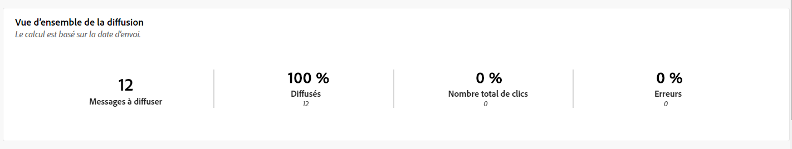
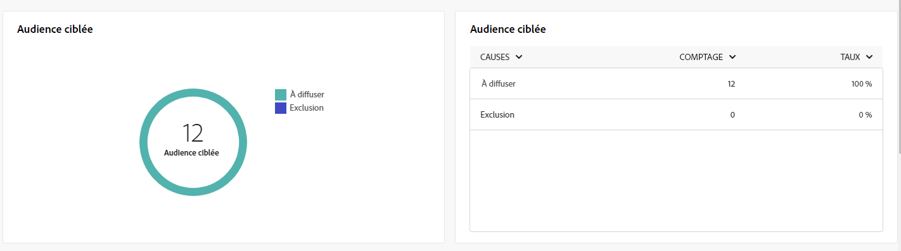
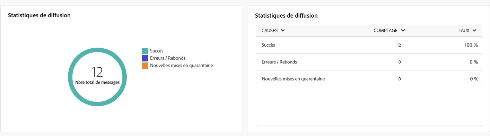
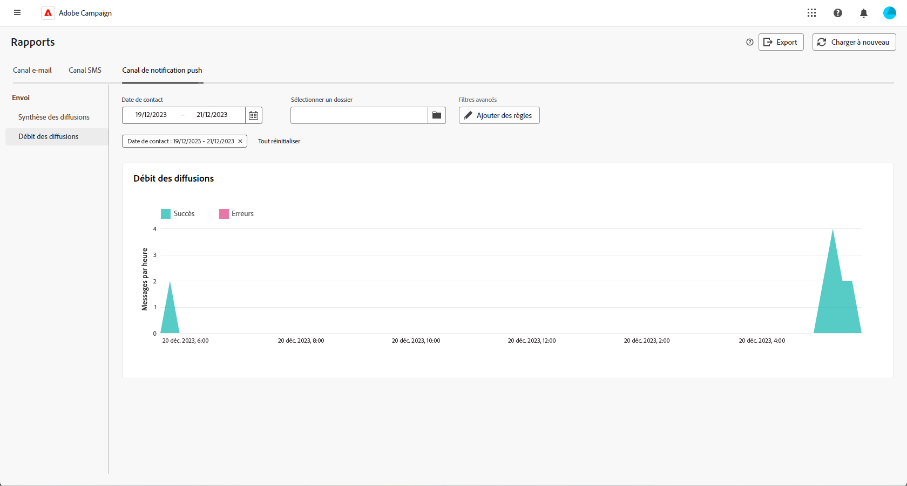

# Rapports globaux du canal de notification push {#campaign-reports-push}

Les rapports globaux offrent aux utilisateurs un aperçu complet des mesures de trafic et d’engagement au niveau des canaux.

Accédez au menu **[!UICONTROL Rapports]** dans la section **[!UICONTROL Reporting]**. Vous pouvez filtrer vos données en fonction de la date, du dossier ou des règles du rapport. [En savoir plus](global-reports.md)

## Synthèse des diffusions {#delivery-summary-push}

### Vue d’ensemble de la diffusion {#delivery-overview-push}

>[!CONTEXTUALHELP]
>id="acw_push_global_report_overview"
>title="Vue d’ensemble de la diffusion des notifications push"
>abstract="Les KPI de la **Vue d’ensemble de la diffusion** des notifications push offrent un examen approfondi de vos diffusions push, en vous présentant des informations détaillées et des données ciblées. Les performances, l’efficacité et les résultats des diffusions sont scrutés à la loupe."

Le rapport **[!UICONTROL Vue d’ensemble de la diffusion]** fournit des KPI (indicateurs clés de performance) qui illustrent l’engagement de vos visiteurs et de vos visiteuses par rapport à chaque diffusion de notification push. Les mesures sont détaillées ci-dessous.

+++En savoir plus sur les mesures de vue d’ensemble de diffusion.

* **[!UICONTROL Messages à diffuser]** : nombre total de messages traités lors de la préparation de la diffusion.

* **[!UICONTROL Diffusés]** : nombre de messages envoyés avec succès, par rapport au nombre total de messages envoyés.

* **[!UICONTROL Nombre total de clics]** : nombre total de destinataires distincts ayant cliqué dans une diffusion au moins une fois.

* **[!UICONTROL Erreurs]** : nombre total d’erreurs cumulées lors des diffusions et du traitement automatique des retours par rapport au nombre total de messages envoyés.

+++

### Audience ciblée {#delivery-summary-push-initial-target}

>[!CONTEXTUALHELP]
>id="acw_global_reporting_push_targeted_audience"
>title="Population ciblée des notifications push"
>abstract="Le tableau et le graphe **Population ciblée** affichent des données relatives à votre audience de messages push, notamment les messages à diffuser et les exclusions."

Le tableau et le graphe **[!UICONTROL Audience ciblée]** présentent les données relatives à vos destinataires pour chaque diffusion de notification push envoyée. Les mesures sont détaillées ci-dessous.

+++En savoir plus sur les mesures d’audience ciblée.

* **[!UICONTROL Audience ciblée]** : nombre total de destinataires ciblés.

* **[!UICONTROL Message à diffuser]** : nombre total de messages à diffuser après la préparation de la diffusion.

* **[!UICONTROL Exclusion]** : nombre d’adresses ignorées pendant l’analyse lors de l’application des règles : adresse manquante, mise en quarantaine, placée sur la liste bloquée, etc.

+++

### Statistiques de diffusion {#delivery-summary-push-exec-stats}

>[!CONTEXTUALHELP]
>id="acw_global_reporting_push_delivery_stats"
>title="Statistiques de diffusion push"
>abstract="Le rapport **Statistiques globales** fournit des informations sur les notifications push envoyées, notamment le taux de succès, les erreurs et les mises en quarantaine."

Le tableau **[!UICONTROL Statistiques de diffusion]** renseigne sur le succès des diffusions de notifications push. Les mesures sont détaillées ci-dessous.

+++En savoir plus sur les mesures des statistiques de diffusion.

* **[!UICONTROL Nombre total de messages]** : nombre total de messages à diffuser après la préparation de la diffusion.

* **[!UICONTROL Succès]** : nombre de messages traités avec succès par rapport au nombre de messages à diffuser.

* **[!UICONTROL Erreurs/Rebonds]** : nombre total d’erreurs cumulées lors des diffusions et du traitement automatique des rebonds par rapport au nombre de messages à diffuser.

* **[!UICONTROL Nouvelles quarantaines]** : nombre total d’adresses mises en quarantaine à la suite d’un échec de diffusion (enregistrement non valide, rejet du message, erreur de payload, par exemple), par rapport au nombre de messages à diffuser.

  Les types d’erreur de notifications push sont répertoriés dans la [documentation d’Adobe Campaign v8 (console cliente)](https://experienceleague.adobe.com/docs/campaign/campaign-v8/send/failures/delivery-failures.html?lang=fr#push-error-types){target="_blank"}.

+++

### Causes d’exclusion {#causes-exclusion}

>[!CONTEXTUALHELP]
>id="acw_global_reporting_push_exclusion"
>title="Causes d’exclusion des notifications push"
>abstract="Le graphe et le tableau **Causes d’exclusion** renseignent sur les différentes raisons pour lesquelles les profils utilisateur n’ont pas reçu les notifications push."

Le graphe et le tableau **[!UICONTROL Causes d’exclusion]** illustrent les raisons pour lesquelles les profils utilisateur exclus des profils ciblés n’ont pas reçu le message.

Les types d’erreur de notifications push sont répertoriés dans la [documentation d’Adobe Campaign v8 (console cliente)](https://experienceleague.adobe.com/docs/campaign/campaign-v8/send/failures/delivery-failures.html?lang=fr#push-error-types){target="_blank"}.

## Débit de diffusion {#delivery-throughput-sms}

>[!CONTEXTUALHELP]
>id="acw_global_reporting_throughput_push"
>title="Rapport de débit de diffusion"
>abstract="Le rapport **Débit de diffusion** présente des informations détaillées sur le débit de diffusion de la notification push de l’ensemble de la plateforme dans un délai donné."

Le rapport **[!UICONTROL Débit de diffusion]** offre des informations complètes sur l’efficacité du système de diffusion des notifications push, ainsi qu’un résumé détaillé des taux de succès et d’erreur sur une période donnée.
