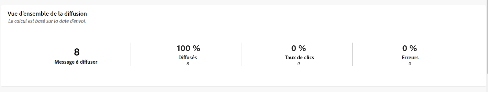
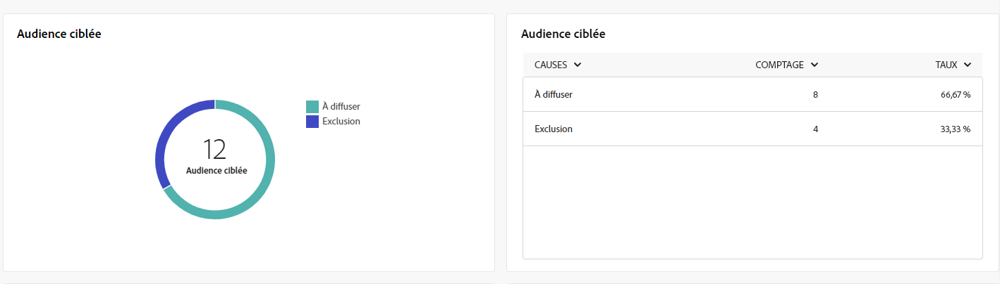
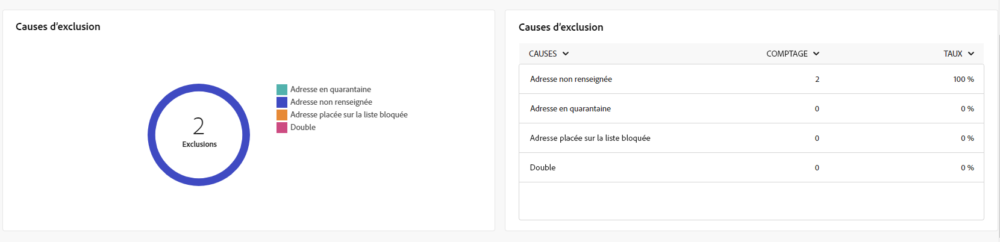
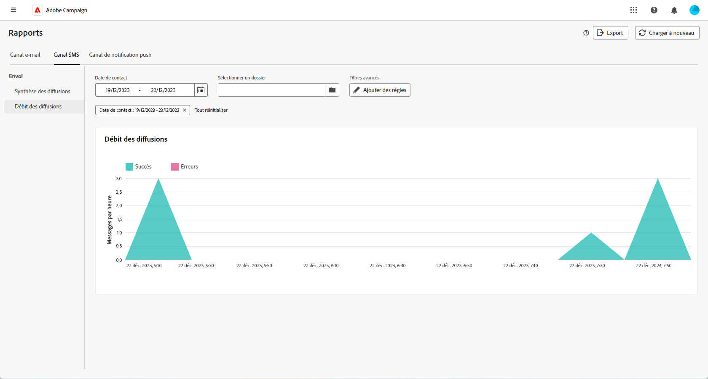

# Rapports globaux du canal SMS {#campaign-reports-sms}

Les rapports globaux offrent aux utilisateurs et aux utilisatrices une vue d’ensemble complète des mesures de trafic et d’engagement au niveau d’un canal.

Accédez au menu **[!UICONTROL Rapports]** dans la section **[!UICONTROL Reporting]**. Vous pouvez filtrer vos données en fonction de la date, du dossier ou des règles du rapport. [En savoir plus](global-reports.md)

## Synthèse des diffusions {#delivery-summary-sms}

### Vue d’ensemble de la diffusion {#delivery-overview-sms}

>[!CONTEXTUALHELP]
>id="acw_sms_global_report_overview"
>title="Vue d’ensemble de la diffusion SMS"
>abstract="Les KPI **Vue d’ensemble de la diffusion SMS** offrent un résumé complet de votre diffusion SMS, avec des informations détaillées et des données spécifiques. Ils fournissent des informations complètes sur les performances, l’efficacité et les résultats de chaque diffusion."

Le rapport **[!UICONTROL Vue d’ensemble de la diffusion]** offre des indicateurs clés de performance (KPI) complets, qui fournissent des informations détaillées sur les schémas d’interaction de vos visiteurs et de vos visiteuses avec chaque diffusion SMS. Les mesures suivantes sont décrites ci-dessous.

{zoomable="yes"}

+++En savoir plus sur les mesures de vue d’ensemble de diffusion.

* **[!UICONTROL Messages à diffuser]** : nombre total de messages traités lors de la préparation de la diffusion.

* **[!UICONTROL Diffusés]** : pourcentage de messages envoyés avec succès par rapport au nombre total de messages envoyés.

* **[!UICONTROL Taux de clics]** : pourcentage de destinataires distincts ayant cliqué dans une diffusion au moins une fois.

* **[!UICONTROL Erreurs]** : pourcentage d’erreurs accumulées lors des diffusions et du traitement automatique des retours par rapport au nombre total de messages envoyés.

+++

### Audience ciblée {#delivery-summary-sms-initial-target}

>[!CONTEXTUALHELP]
>id="acw_global_reporting_sms_targeted_audience"
>title="Population ciblée par les SMS"
>abstract="Le graphique et tableau pour la **Population ciblée** présentent les données relatives à votre audience SMS, y compris les informations sur les messages à diffuser et les exclusions."

Le tableau et le graphe **[!UICONTROL Audience ciblée]** présentent les données relatives à vos destinataires pour chaque diffusion SMS envoyée. Les mesures sont détaillées ci-dessous.

{zoomable="yes"}

+++En savoir plus sur les mesures d’audience ciblée.

* **[!UICONTROL Audience ciblée]** : nombre total de destinataires ciblés.

* **[!UICONTROL Message à diffuser]** : nombre total de messages à diffuser après la préparation de la diffusion.

* **[!UICONTROL Exclusion]** : nombre total d’adresses ignorées pendant l’analyse lors de l’application des règles : adresse manquante, en quarantaine, sur liste de blocage, etc.

+++

### Statistiques de diffusion {#delivery-summary-sms-exec-stats}

>[!CONTEXTUALHELP]
>id="acw_global_reporting_sms_delivery_stats"
>title="Statistiques de diffusion SMS"
>abstract="Le rapport **Statistiques de diffusion** fournit des informations complètes sur le SMS envoyé, en fournissant une répartition de diverses mesures telles que les taux de succès, les occurrences d’erreurs et l’audience mise en quarantaine. Cette présentation détaillée permet un examen approfondi des performances globales et des résultats du processus de diffusion SMS."

Le tableau **[!UICONTROL Statistiques de diffusion]** détaille le succès de chaque diffusion SMS. Les mesures sont détaillées ci-dessous.

{zoomable="yes"}

+++En savoir plus sur les mesures de statistiques de diffusion.

* **[!UICONTROL Nombre total de messages]** : nombre total de messages à diffuser après la préparation de la diffusion.

* **[!UICONTROL Succès]** : nombre de messages traités avec succès par rapport au nombre de messages à délivrer.

* **[!UICONTROL Erreurs/Rebonds]** : nombre total d’erreurs accumulées lors des diffusions et du traitement automatique des rebonds par rapport au nombre de messages à diffuser.

* **[!UICONTROL Nouvelles quarantaines]** : nombre total d’adresses mises en quarantaine à la suite d’un échec de diffusion (par exemple, personne inconnue, domaine invalide) par rapport au nombre de messages à diffuser.

  Les types d’erreur des SMS sont répertoriés dans la [documentation d’Adobe Campaign v8 (console cliente)](https://experienceleague.adobe.com/docs/campaign/campaign-v8/send/failures/delivery-failures.html?lang=fr#sms-quarantines){target="_blank"}.

+++

### Causes d’exclusion {#causes-exclusion}

>[!CONTEXTUALHELP]
>id="acw_global_reporting_sms_exclusions"
>title="Causes d’exclusion SMS"
>abstract="Le graphe et le tableau **Causes d’exclusion** illustrent les différentes raisons qui ont empêché des profils utilisateur de recevoir les SMS."

Le graphe et le tableau **[!UICONTROL Causes d’exclusion]** affichent les raisons qui ont empêché des profils utilisateurs exclus des profils ciblés de recevoir vos diffusions SMS.

Les types d’erreurs sont répertoriés dans la [documentation d’Adobe Campaign v8 (console cliente)](https://experienceleague.adobe.com/docs/campaign/campaign-v8/send/failures/delivery-failures.html?lang=fr#email-error-types){target="_blank"}.

{zoomable="yes"}

## Débit de diffusion {#delivery-throughput-sms}

>[!CONTEXTUALHELP]
>id="acw_global_reporting_throughput_sms"
>title="Débit des diffusions par SMS"
>abstract="Le rapport **Débit de diffusion** fournit des informations détaillées sur l’efficacité du système de diffusion des SMS, et présente une vue d’ensemble détaillée des taux de succès et d’erreur dans un délai donné."

{zoomable="yes"}

Le rapport **[!UICONTROL Débit de diffusion]** fournit des informations complètes sur l’efficacité du système de diffusion des SMS, et offre un résumé détaillé des taux de succès et d’erreur pendant une période donnée.