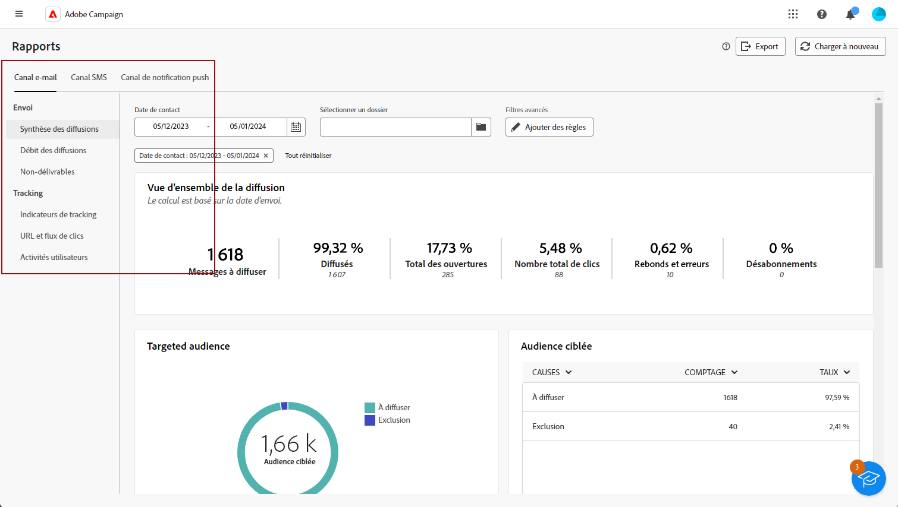
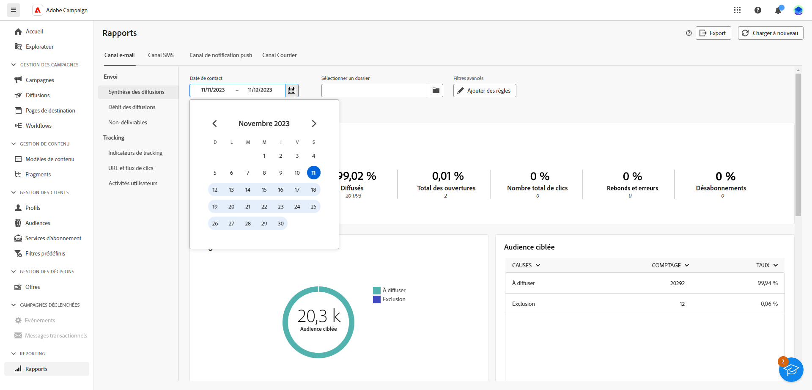
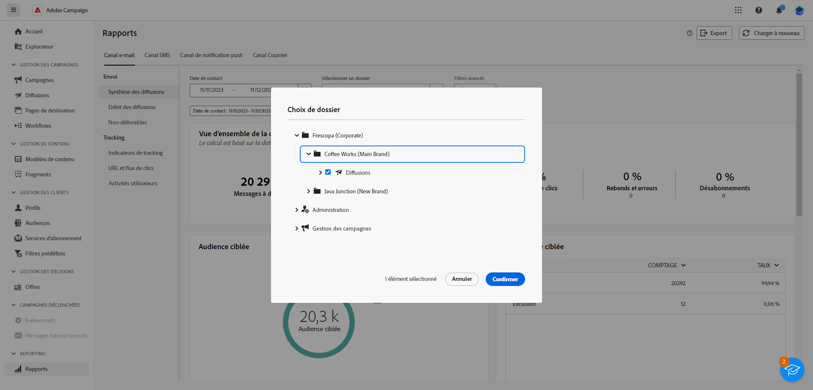

# Prise en main des rapports globaux {#global-report-gs}

La variable **Rapports globaux** constitue un outil efficace, offrant un résumé global consolidé des mesures de trafic et d’engagement pour chaque canal de votre instance Campaign. Ces rapports se composent de différents widgets, chacun offrant une perspective différente des performances de vos campagnes ou diffusions.

La liste complète des rapports et mesures associées pour chaque canal est disponible dans les pages suivantes :

* [Envoyer les rapports globaux par courriel](global-report-email.md)
* [Rapports globaux SMS](global-report-sms.md)
* [Rapports globaux push](global-report-push.md)

## Gérer le tableau de bord des rapports {#manage-reports}

Pour accéder à vos rapports globaux et les gérer, procédez comme suit :

1. Accédez au **[!UICONTROL Rapports]** dans le **[!UICONTROL Reporting]** .

1. Dans le menu de gauche, sélectionnez un rapport dans la liste et naviguez dans l’onglet pour afficher les données de chaque canal.

   

1. Dans votre tableau de bord, choisissez une **Début** et **[!UICONTROL Heure de fin]** pour cibler des données spécifiques.

   

1. Dans la **[!UICONTROL Choisir le dossier]** , choisissez si vous souhaitez cibler des diffusions ou des campagnes à partir d’un dossier spécifique.

   

1. Cliquez sur **[!UICONTROL Ajouter des règles]** pour commencer à créer des requêtes afin de mieux filtrer les données de reporting. [Découvrez comment utiliser le créateur de modèles de requête](../query/query-modeler-overview.md)

1. Dans la **[!UICONTROL URL et flux de clics]**, vous pouvez également choisir la variable **[!UICONTROL Liens les plus visités]** ou le **[!UICONTROL Période]**.

   La variable **[!UICONTROL Afficher par]** Les options vous permettent de filtrer selon les URL, les libellés ou les catégories.
