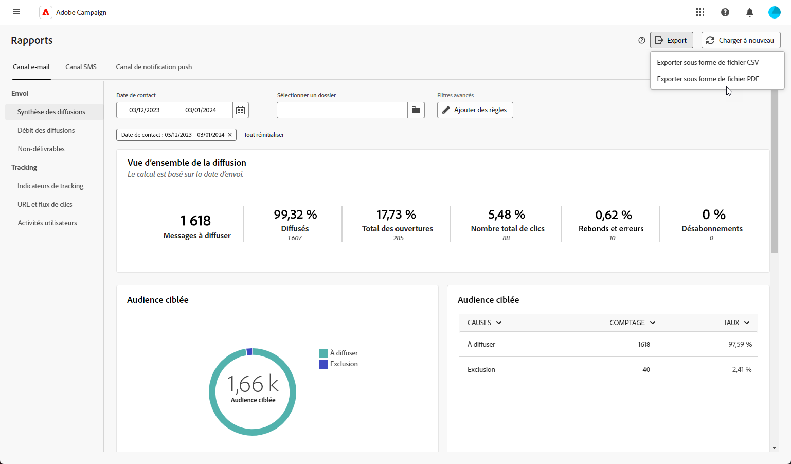

# Prise en main des rapports globaux {#global-report-gs}

Les rapports globaux fournissent un aperçu complet du trafic et de l’engagement sur tous les canaux, et offrent un large éventail de widgets qui fournissent des informations uniques sur les performances des campagnes et des diffusions.

## Gérer le tableau de bord des rapports {#manage-reports}

Pour accéder à vos rapports globaux et les gérer, procédez comme suit :

1. Accédez au **[!UICONTROL Rapports]** dans le **[!UICONTROL Reporting]** .

1. Dans votre tableau de bord, choisissez une **Début** et **[!UICONTROL Heure de fin]** pour cibler des données spécifiques.

   

1. Dans la **[!UICONTROL Choisir le dossier]** , choisissez si vous souhaitez cibler des diffusions ou des campagnes à partir d’un dossier spécifique.

   

1. Cliquez sur **[!UICONTROL Ajouter des règles]** pour commencer à créer des requêtes afin de mieux filtrer les données de reporting.

1. Dans la **[!UICONTROL URL et flux de clics]**, vous pouvez également choisir la variable **[!UICONTROL Liens les plus visités]** ou le **[!UICONTROL Période]**.

   La variable **[!UICONTROL Afficher par]** Les options vous permettent de filtrer selon les URL, les libellés ou les catégories.

## Exportation des rapports {#export-reports}

Vous pouvez facilement exporter vos différents rapports au format PDF ou CSV, ce qui vous permet de les partager, de les manipuler ou de les imprimer.

1. Dans votre rapport, cliquez sur **[!UICONTROL Exporter]** et sélectionnez **[!UICONTROL Exporter en tant que fichier PDF]** ou **[!UICONTROL Exportation au format CSV]**.

   

1. Localisez le dossier dans lequel vous souhaitez enregistrer votre fichier, renommez-le si nécessaire, puis cliquez sur **[!UICONTROL Enregistrer]**.

Votre rapport peut désormais être affiché ou partagé dans un PDF ou fichier CSV.

