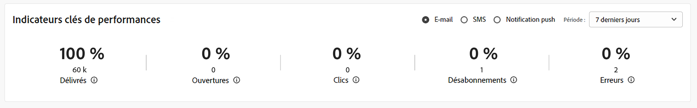

# Indicateurs clés de performance {#kpis}

>[!CONTEXTUALHELP]
>id="acw_homepage_kpi"
>title="Indicateurs clés de performance"
>abstract="La section **Indicateurs clés de performance** vous permet de vérifier l’efficacité de votre plateforme à travers des KPI communs."

<!-- à enlever? -->

>[!CONTEXTUALHELP]
>id="acw_keyindicators_spam"
>title="Indésirables"
>abstract="KPI pour le courrier indésirable"

Accédez à la page d’accueil pour vérifier les indicateurs clés de performances de votre plateforme. Ces indicateurs affichent le nombre et le pourcentage de messages diffusés, ouverts, ayant fait l&#39;objet d&#39;un clic, les désabonnements et les taux d&#39;erreur.

Les mesures sont calculées par défaut pour les diffusions envoyées au cours des sept derniers jours. Vous pouvez modifier le point dans la liste déroulante de la section supérieure droite de la carte. Les messages envoyés aux profils de test sont exclus.

Vous pouvez sélectionner le canal à afficher. Par défaut, ces indicateurs reflètent les mesures pour le canal e-mail.

{zoomable="yes"}

## Message délivré {#ui-delivered-kpi}

>[!CONTEXTUALHELP]
>id="acw_keyindicators_delivered"
>title="Délivrés"
>abstract="Cette mesure affiche, pour le canal sélectionné, la somme de tous les messages traités avec succès, et le pourcentage de messages diffusés avec succès par rapport au nombre total de messages envoyés."

Le nombre de messages délivrés reflète votre taux de délivrabilité. Il ne peut jamais être égal à 100 % pour les raisons suivantes : certaines adresses ou certains numéros de téléphone peuvent être erronés, des bloqueurs de spam chez les fournisseurs de messagerie peuvent rejeter vos messages ou des problèmes de délivrabilité peuvent se produire.

L’indicateur **Diffusé** affiche les KPI suivants pour chaque canal :

* Pourcentage du nombre de messages diffusés avec succès par rapport au nombre total de messages envoyés.

* Nombre de messages traités.

Dans Adobe Campaign, la règle pour marquer un message comme « Délivré » est la suivante :

Nombre de messages pour lesquels le champ « adresse de contrôle » est égal à « Non » et dont le statut est égal à « Pris en compte par le prestataire » (pour les SMS), « Envoyés » (pour les Emails), ou « Reçus sur le mobile » (pour les Notifications push).

## Total des ouvertures {#ui-open-kpi}

>[!CONTEXTUALHELP]
>id="acw_keyindicators_opens"
>title="Ouvertures"
>abstract="Cette mesure affiche, pour le canal sélectionné, la somme de tous les messages ouverts et le pourcentage de messages ouverts par rapport au nombre total de messages diffusés avec succès."

Le nombre total d’ouvertures est calculé en suivant le nombre total d’ouvertures d’un message, quel que soit le nombre de destinataires individuels qui génèrent ces ouvertures. Cet indicateur n’est disponible que pour les e-mails.

L’indicateur **Ouvertures** affiche les KPI suivants pour chaque canal :

* Pourcentage du nombre de messages ouverts par rapport au nombre total de messages diffusés avec succès.

* Nombre total de messages ouverts, par canal.

Adobe Campaign détecte les messages ouverts lorsque la personne destinataire télécharge les images dans l’e-mail. Les e-mails HTML et Multipart/Alternative incluent une image de 0 pixel, qui permet de détecter les messages qui ont été ouverts. Les messages au format texte ne contenant aucune image, il est impossible de détecter s’ils ont été ouverts. Les valeurs calculées à partir des ouvertures de messages sont toujours des estimations en raison de la marge d’erreur liée à l’affichage des images.

## Taux de clics {#ui-click-kpi}

>[!CONTEXTUALHELP]
>id="acw_keyindicators_clicks"
>title="Clics"
>abstract="Cette mesure indique, pour le canal sélectionné, la somme de toutes les URL cliquées dans les messages et le pourcentage de clics par rapport au nombre total de messages diffusés avec succès."

Ajoutez des URL dans le contenu de votre message pour rediriger les destinataires vers une page particulière. Le taux de clic publicitaire mesure le nombre et le pourcentage de destinataires qui ont cliqué sur un lien dans le message.

L’indicateur **Clics** affiche les KPI suivants pour chaque canal :

* Pourcentage du nombre de clics par rapport au nombre total de messages délivrés.

* Nombre de personnes distinctes ayant cliqué au moins une fois dans une diffusion. Les liens de désinscription et les liens vers la page miroir de l’e-mail sont exclus.

Ces mesures sont basées sur le tableau de suivi consolidé (`nms:trackingStats`). Ce tableau d’agrégats est utilisé pour des raisons de performances lors de l’affichage des rapports, au lieu du tableau des logs de tracking des destinataires (`nms:trackingLogRcp`). Il n’est pas calculé en temps réel. La table est générée quelques minutes après la récupération des logs de tracking.

## Taux d’abonnements {#ui-sub-kpi}

>[!CONTEXTUALHELP]
>id="acw_keyindicators_subscriptions"
>title="Abonnements"
>abstract="Cette mesure indique, pour le canal sélectionné, le nombre total d’abonnements à un service, ainsi que le pourcentage d’abonnements par rapport au nombre total de messages diffusés."

Les destinataires peuvent accepter les communications par e-mail et SMS.

L’indicateur **Abonnements** affiche les KPI suivants pour chaque canal :

* Pourcentage du nombre d&#39;abonnements par rapport au nombre total de messages diffusés avec succès.

>[!NOTE]
>
> Les indicateurs clés de performance (KPI) d’abonnement et de désinscription varient en fonction du type de service. Par exemple, les abonnements et désinscriptions aux e-mails englobent tous les services liés aux e-mails, qu’ils proviennent d’actions manuelles ou de formulaires web. Il est important de distinguer cette approche de la mesure de désinscription au niveau de la diffusion, qui effectue le suivi des clics sur les liens de désinscription plutôt que des personnes désabonnées réelles.

## Taux de désinscription {#ui-unsub-kpi}

>[!CONTEXTUALHELP]
>id="acw_keyindicators_unsubscriptions"
>title="Désinscriptions"
>abstract="Cette mesure indique, pour le canal sélectionné, le total des désinscriptions à un service, ainsi que le pourcentage de désinscriptions par rapport au nombre total de messages délivrés."

Les destinataires doivent pouvoir se désabonner des e-mails et SMS via un lien de désabonnement dédié dans le contenu de l&#39;e-mail ou en répondant à STOP à un SMS.

L’indicateur **Désabonnements** affiche les KPI suivants pour chaque canal :

* Pourcentage du nombre de désinscriptions par rapport au nombre total de messages délivrés.

* Somme de tous les clics sur un lien de désinscription, c&#39;est-à-dire avec une catégorie d&#39;URL égale à « Opt-out ».

>[!NOTE]
>
> Les indicateurs clés de performance (KPI) d’abonnement et de désinscription varient en fonction du type de service. Par exemple, les abonnements et désinscriptions aux e-mails englobent tous les services liés aux e-mails, qu’ils proviennent d’actions manuelles ou de formulaires web. Il est important de distinguer cette approche de la mesure de désinscription au niveau de la diffusion, qui effectue le suivi des clics sur les liens de désinscription plutôt que des personnes désabonnées réelles.

## Taux d’erreurs {#ui-error-kpi}

>[!CONTEXTUALHELP]
>id="acw_keyindicators_errors"
>title="Erreurs"
>abstract="Nombre total d’erreurs cumulées lors des diffusions et du traitement automatique des rebonds. Le taux associé est le ratio par rapport au nombre de messages à délivrer."

Certains messages envoyés par votre plateforme Adobe Campaign peuvent ne pas arriver à destination. Cela peut se produire lorsque l’adresse utilisateur ou le téléphone comporte des fautes de frappe, si le destinataire a modifié son adresse e-mail ou si sa boîte de réception est pleine. Si un message ne peut pas être envoyé à un profil, le serveur distant envoie automatiquement un message d’erreur à Adobe Campaign. Cette erreur est qualifiée pour déterminer si l’adresse e-mail, le numéro de téléphone ou l’appareil doit être mis en quarantaine.

Vérifiez et mettez à jour régulièrement votre base de données et assurez-vous que tous les profils sont actifs et réels. Les erreurs de diffusion peuvent être temporaires ou permanentes (soft ou hard bounce), selon la raison pour laquelle le message n&#39;a pas été diffusé.

L’indicateur **Erreurs** affiche les KPI suivants pour chaque canal :

* Pourcentage du nombre d’erreurs, par rapport au nombre total de messages à délivrer.

* Nombre total d’erreurs cumulées lors des diffusions et du traitement automatique des rebonds.

## Message envoyé {#ui-sent-kpi}

<!--DRAFT - This section requires a validation-->

>[!CONTEXTUALHELP]
>id="acw_keyindicators_sent"
>title="Envoyés"
>abstract="Cette mesure indique, pour le canal courrier, la somme de tous les messages envoyés et le pourcentage de messages envoyés au fournisseur, par rapport au nombre total de messages préparés pendant la phase de préparation de la diffusion."

Lors de la phase de préparation, le fichier d&#39;extraction du courrier est généré, mais les informations relatives aux destinataires (logs de diffusion) ne sont pas mises à jour. Le statut d&#39;une diffusion passe de En attente de diffusion à Envoyé lorsque l&#39;utilisateur Campaign confirme l&#39;envoi de la diffusion. La diffusion est alors paramétrée sur Terminé.

Il ne peut jamais s&#39;agir de 100 % des messages envoyés par rapport au total des messages préparés, car certaines adresses peuvent être manquantes ou incomplètes.

L’indicateur **Envoyé** affiche les KPI suivants pour le canal Publipostage direct :

* Pourcentage du nombre de messages envoyés par rapport au nombre total de messages préparés.

* Somme de tous les messages envoyés.