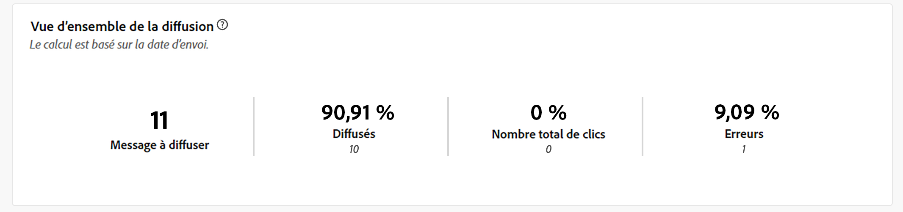
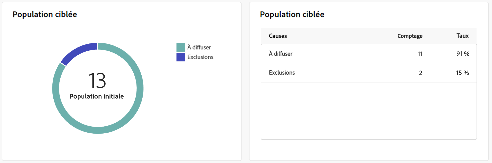
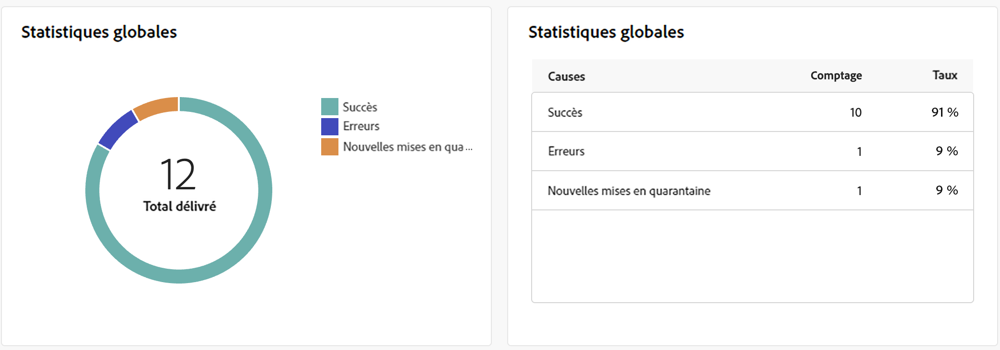
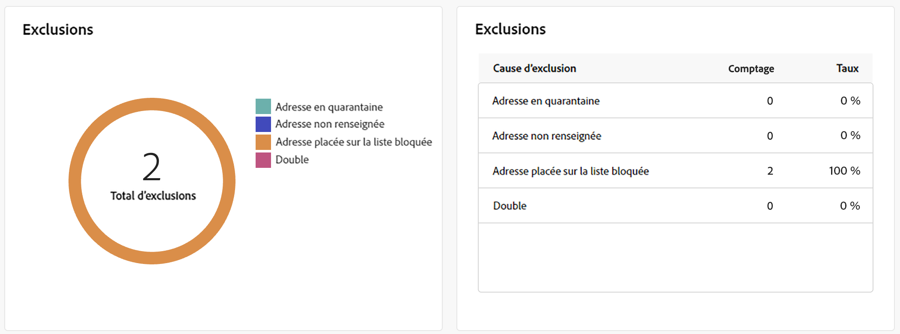
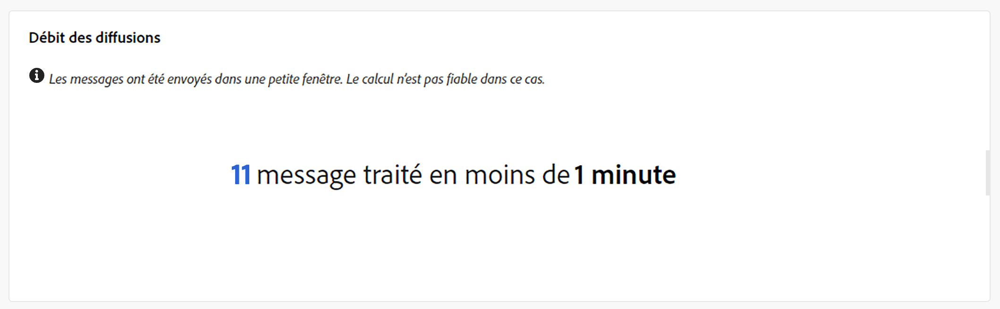

# Rapports de diffusion des notifications push {#push-report}

>[!CONTEXTUALHELP]
>id="acw_push_report_overview"
>title="Résumé du rapport Diffusion push"
>abstract="La variable **Présentation de la diffusion push** offre un aperçu complet de votre diffusion push, fournissant des informations détaillées et des données spécifiques. Il fournit des informations complètes sur les performances, l’efficacité et les résultats de votre diffusion."

>[!CONTEXTUALHELP]
>id="acw_delivery_reporting_sending_push"
>title="Envoi des rapports"
>abstract="he **Envoi** Cet onglet de votre rapport fournit des informations détaillées sur les interactions de vos visiteurs avec vos diffusions et sur les erreurs potentielles qu’ils ont pu rencontrer."

Le **rapport de diffusion des notifications push** offre une vue d’ensemble complète du canal de notification push, avec des informations détaillées et des données spécifiques. Il fournit des informations complètes sur les performances, l’efficacité et les résultats de chaque diffusion.

## Résumé de notifications push {#push-summary}

### Vue d’ensemble de la diffusion {#push-delivery-overview}

La variable **[!UICONTROL Présentation de la diffusion]** Ce rapport fournit des indicateurs de performances clés (IPC) qui fournissent des informations détaillées sur la manière dont les visiteurs interagissent avec vos messages push.

+++En savoir plus sur les mesures des rapports de diffusion des notifications push.

* **[!UICONTROL Total envoyé]**: Nombre total de messages traités lors de la préparation de la diffusion.

* **[!UICONTROL Délivrés]** : nombre de messages envoyés avec succès, par rapport au nombre total de messages envoyés.

* **[!UICONTROL Clics]** : nombre total de destinataires ayant interagi avec la notification push.

* **[!UICONTROL Erreurs]** : nombre total d’erreurs qui se sont produites au cours d’une diffusion et qui l’ont empêché d’être envoyée aux profils.

+++

### Population ciblée {#push-delivery-targeted-population}

>[!CONTEXTUALHELP]
>id="acw_delivery_reporting_push_targeted_population"
>title="Push population ciblée"
>abstract="La variable **Population ciblée** données d’affichage graphiques et tabulaires relatives à votre audience de messagerie push : messages à diffuser et exclusions."

La variable **Population ciblée** données d&#39;affichage graphiques et tabulaires relatives à votre audience : messages à diffuser et exclusions. Les mesures sont détaillées ci-dessous.

+++En savoir plus sur les mesures des rapports de diffusion des notifications push.

* **[!UICONTROL A envoyer]**: Nombre total de messages traités lors de la préparation de la diffusion.

* **[!UICONTROL Exclusions]** : nombre de profils qui ont été exclus de l’analyse.

+++

### Statistiques globales {#push-delivery-overall}

>[!CONTEXTUALHELP]
>id="acw_delivery_reporting_push_overall_stats"
>title="Statistiques globales push"
>abstract="La variable **Statistiques globales** présente les données des notifications push envoyées : succès, erreurs et mises en quarantaine."

La variable **Statistiques globales** présente les données des notifications push envoyées : succès, erreurs et mises en quarantaine. Les mesures sont détaillées ci-dessous.

+++En savoir plus sur les mesures des rapports de diffusion des notifications push.

* **[!UICONTROL Succès]** : nombre de messages traités avec succès.

* **[!UICONTROL Erreurs]** : nombre total d’erreurs qui se sont produites pendant la diffusion, empêchant l’envoi des messages à certains profils.

* **[!UICONTROL Nouvelle quarantaine]** : nombre de profils qui ont été exclus et ajoutés à la quarantaine.

+++

### Exclusions {#push-delivery-exclusions}

>[!CONTEXTUALHELP]
>id="acw_delivery_reporting_push_exclusions"
>title="Statistiques globales push"
>abstract="La variable **Exclusions** le graphique et le tableau affichent les différentes raisons qui ont empêché les profils utilisateur, qui ont été exclus des profils ciblés, de recevoir le message."

La variable **[!UICONTROL Exclusions]** le graphique et le tableau affichent les différentes raisons qui ont empêché les profils utilisateur, qui ont été exclus des profils ciblés, de recevoir le message. Les règles d&#39;exclusion sont détaillées dans la section [Documentation de Campaign v8 (console)](https://experienceleague.adobe.com/docs/campaign/campaign-v8/send/failures/delivery-failures.html#push-error-types){_blank}.

## Débit des diffusions (Delivery throughput) {#delivery-throughput}

>[!CONTEXTUALHELP]
>id="acw_delivery_reporting_throughput_push"
>title="Débit des diffusions (Delivery throughput) rapport"
>abstract="Le rapport Débit de diffusion présente des informations détaillées sur le débit de diffusion de l’ensemble de la plateforme au cours d’une période donnée."

La variable **Débit de diffusion** le rapport présente des informations détaillées sur le débit de diffusion de l’ensemble de la plateforme au cours d’une période spécifiée. La mesure principale utilisée pour mesurer la vitesse de diffusion des messages est le nombre de messages envoyés par heure.

