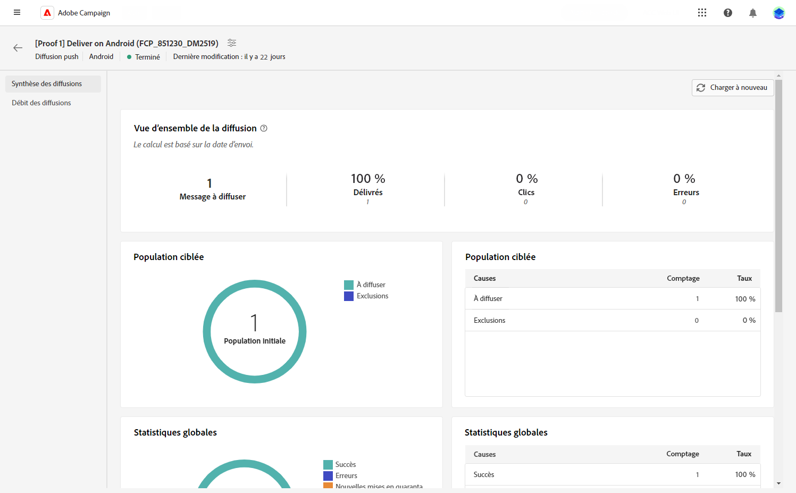

# Rapport Diffusion push {#push-report}

>[!CONTEXTUALHELP]
>id="acw_push_report_overview"
>title="Synthèse du rapport des notifications push"
>abstract="Découvrez les mesures de reporting pour votre diffusion par notification push."

## Résumé de notifications push {#push-summary}

* **[!UICONTROL Présentation de la diffusion]** fournit des indicateurs de performances clés (IPC) qui fournissent des informations détaillées sur la manière dont vos visiteurs interagissent avec vos messages push. Ces indicateurs clés de performance incluent :

   * **[!UICONTROL Total envoyé]**: Nombre total de messages traités lors de l&#39;analyse de la diffusion.

   * **[!UICONTROL Délivrés]** : nombre de messages envoyés avec succès, par rapport au nombre total de messages envoyés.

   * **[!UICONTROL Clics]**: Nombre total de destinataires ayant interagi avec le message push.

   * **[!UICONTROL Erreurs]**: Nombre total d&#39;erreurs qui se sont produites au cours d&#39;une diffusion et qui l&#39;ont empêché d&#39;être envoyée aux profils.

* **Population ciblée** les données d’affichage graphiques et tabulaires relatives à votre audience :

   * **[!UICONTROL A envoyer]**: Nombre total de messages traités lors de l&#39;analyse de la diffusion.

   * **[!UICONTROL Exclusions]**: Nombre de profils qui ont été exclus de l’analyse.

* **Statistiques globales** présente des données pour les notifications push envoyées, notamment :

   * **[!UICONTROL Succès]**: Nombre de messages traités avec succès.

   * **[!UICONTROL Erreurs]**: Nombre total d&#39;erreurs qui se sont produites pendant la diffusion, empêchant l&#39;envoi des messages à certains profils.

   * **[!UICONTROL Nouvelle mise en quarantaine]**: Nombre de profils qui ont été exclus et ajoutés à la quarantaine.

* **[!UICONTROL Exclusions]** le graphique et le tableau affichent les différentes raisons qui ont empêché les profils utilisateur, qui ont été exclus des profils ciblés, de recevoir le message.