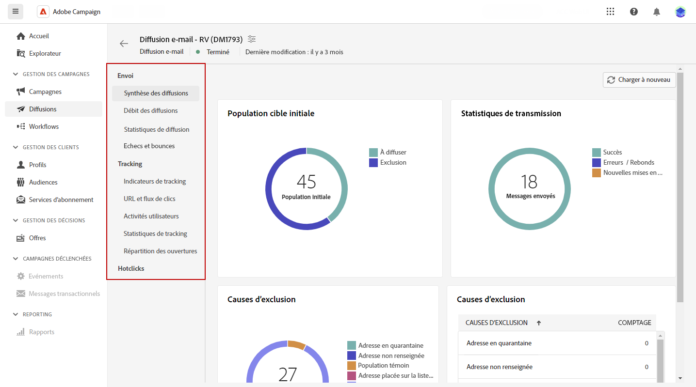

# Rapports de diffusion {#reports}

<!--
detail delivery reports and how to access them

same content as in v7 (excepted for the navigation that is similar to AJO
-->

Adobe Campaign propose plusieurs types de rapports, accessibles pour chaque diffusion. Ces rapports vous permettent de mesurer et de visualiser l’impact et les performances de vos messages dans un tableau de bord intégré.

Pour afficher les rapports, procédez comme suit :

1. Accédez à votre diffusion e-mail et cliquez sur le bouton **Rapport**.
1. Dans le menu de gauche, sélectionnez un rapport dans la liste.

**Envoi**

* **Résumé de diffusion** : ce rapport présente l’ensemble des informations principales relatives à la diffusion. Population cible, causes d’exclusion, statistiques de diffusion.

* **Débit des diffusions** : ce rapport contient des informations sur le débit des diffusions pour une période donnée. Pour mesurer la vitesse à laquelle les messages sont diffusés, les critères sont le nombre de messages envoyés par heure et la taille des messages (en bits par seconde). Dans l’exemple ci-dessous, le premier graphique indique les diffusions réussies en bleu et le nombre de diffusions erronées en orange.

* **Statistiques de diffusion** : ce rapport présente la répartition, par domaine Internet, des messages traités et envoyés, des erreurs hard et soft, des ouvertures, des clics et des désinscriptions.
Échecs et retours : ce rapport présente la répartition des messages en échec et la répartition des retours par domaine Internet.

**Effectuer un tracking**

* **Indicateurs de tracking** : ce rapport regroupe les indicateurs-clés permettant de tracker le comportement des destinataires à la réception de la diffusion. Il donne accès aux statistiques d’envoi et de réception, aux taux d’ouverture et de clics, aux flux de clics générés, au tracking web ainsi qu’au partage d’activités sur les réseaux sociaux.

* **URL et flux de clics** : ce rapport présente la liste des pages visitées suite à une diffusion.

* **Activités utilisateurs**: Ce rapport présente la répartition des ouvertures et clics par demi-heure, heure ou jour, sous la forme d&#39;un graphique.

* **Statistiques de suivi**: Ce rapport fournit des statistiques sur les ouvertures et les clics.

* **Répartition des ouvertures** : ce rapport présente la répartition des ouvertures, par système d’exploitation, par appareil et par navigateur, sur la période concernée. Deux graphiques sont utilisés pour chaque catégorie. Le premier affiche les statistiques d’ouverture sur un ordinateur et des appareils mobiles. Le second affiche des statistiques relatives uniquement aux ouvertures sur les appareils mobiles.

**Hotclicks**

Ce rapport présente le contenu du message (HTML et/ou texte) avec, sur chaque lien, le pourcentage de clics sur ce lien. Les liens situés dans les blocs de personnalisation, le lien de désinscription, le lien vers la page miroir et les liens des offres sont comptabilisés dans le total des clics cumulés mais ne sont pas affichés dans le rapport.
