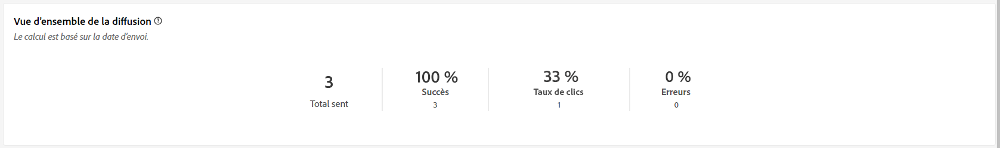
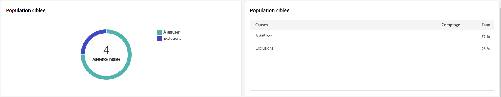
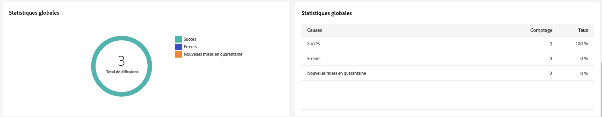
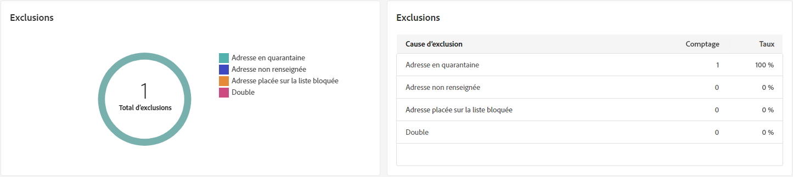
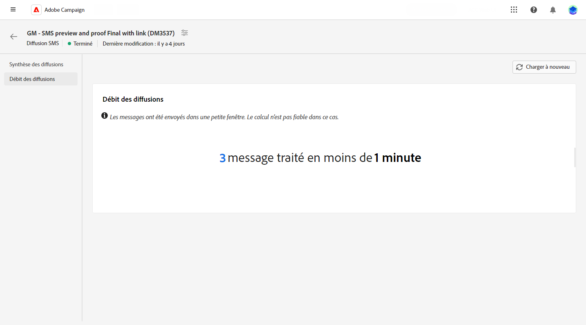

# Rapports de diffusion SMS {#sms-report}

>[!CONTEXTUALHELP]
>id="acw_delivery_reporting_sending_sms"
>title="Envoi des rapports"
>abstract="L’onglet **Envoi** de votre rapport fournit des informations détaillées sur les interactions de vos visiteurs et visiteuses avec vos diffusions, ainsi que sur les erreurs potentielles qu’ils ont pu rencontrer."

La **Vue d’ensemble de la diffusion SMS** offre une vue d’ensemble complète de votre diffusion SMS, avec des informations détaillées et des données spécifiques. Elle fournit des informations complètes sur les performances, l’efficacité et les résultats de chaque diffusion.

## Synthèse des diffusions {#delivery-summary}

>[!CONTEXTUALHELP]
>id="acw_sms_report_overview"
>title="Vue d’ensemble de la diffusion SMS"
>abstract="La **Vue d’ensemble de la diffusion SMS** constitue une vue d’ensemble complète du canal SMS, avec des informations détaillées et des données spécifiques. Elle fournit des informations complètes sur les performances, l’efficacité et les résultats de chaque diffusion."

### Vue d’ensemble de la diffusion {#sms-delivery-overview}

Le rapport **[!UICONTROL Vue d’ensemble de la diffusion]** fournit des KPI qui donnent des informations détaillées sur les taux d’erreurs et de succès, ainsi que sur la manière dont vos visiteurs et visiteuses interagissent avec vos SMS.

+++En savoir plus sur les mesures des rapports de diffusion SMS.

* **[!UICONTROL Total envoyé]** : pourcentage et nombre total de messages traités lors de la préparation de la diffusion.

* **[!UICONTROL Succès]** : pourcentage et nombre de messages envoyés avec succès, par rapport au nombre total de messages envoyés.

* **[!UICONTROL Taux de clic publicitaire]** : pourcentage et nombre d’utilisateurs et utilisatrices ayant interagi avec des liens inclus dans votre diffusion SMS.

* **[!UICONTROL Erreurs]** : pourcentage et nombre total d’erreurs qui se sont produites au cours d’une diffusion, l’empêchant d’être envoyée aux profils.

+++

### Population ciblée {#sms-delivery-targeted-population}

>[!CONTEXTUALHELP]
>id="acw_delivery_reporting_sms_targeted_population"
>title="Population ciblée par les SMS"
>abstract="Le tableau et le graphe **Population ciblée** affichent des données relatives à votre audience SMS : messages à diffuser et exclusions."

Le graphe et le tableau **Population ciblée** affichent les données relatives à votre audience. Les mesures sont détaillées ci-dessous.

+++En savoir plus sur les mesures des rapports de diffusion SMS.

* **[!UICONTROL À diffuser]** : nombre total et pourcentage de messages traités lors de la préparation de la diffusion.

* **[!UICONTROL Exclusions]** : nombre et pourcentage de profils qui ont été exclus de l’analyse.
+++

### Statistiques globales {#sms-delivery-overall}

>[!CONTEXTUALHELP]
>id="acw_delivery_reporting_sms_overall_stats"
>title="Statistiques globales des SMS"
>abstract="Le rapport **Statistiques globales** présente des données relatives aux SMS envoyés : succès, erreurs et mises en quarantaine."

Le rapport **Statistiques globales** présente les données des SMS envoyés. Les mesures sont détaillées ci-dessous.

+++En savoir plus sur les mesures des rapports de diffusion SMS.

* **[!UICONTROL Succès]** : nombre et pourcentage de messages traités avec succès.

* **[!UICONTROL Erreurs]** : nombre total et pourcentage d’erreurs qui se sont produites pendant la diffusion, empêchant l’envoi des messages à certains profils.

* **[!UICONTROL Nouvelle quarantaine]** : nombre et pourcentage de profils qui ont été exclus et ajoutés à la quarantaine.
+++

### Exclusions {#sms-delivery-exclusions}

>[!CONTEXTUALHELP]
>id="acw_delivery_reporting_sms_exclusions"
>title="Exclusions de SMS"
>abstract="Le graphe et le tableau **Exclusions** affichent les différentes raisons qui ont empêché les profils utilisateur, qui ont été exclus des profils ciblés, de recevoir le message."

Le graphe et le tableau **[!UICONTROL Exclusions]** affichent les raisons qui ont empêché les profils d’utilisateurs et d’utilisatrices exclus des profils ciblés de recevoir le message. Les règles d’exclusion sont détaillées dans la [documentation de Campaign v8 (console)](https://experienceleague.adobe.com/docs/campaign/campaign-v8/send/failures/delivery-failures.html?lang=fr#sms-quarantines){_blank}.

## Débit des diffusions {#delivery-throughput}

>[!CONTEXTUALHELP]
>id="acw_delivery_reporting_throughput_sms"
>title="Débit des diffusions SMS"
>abstract="La variable **Débit de diffusion** le rapport présente des informations détaillées sur le débit de diffusion au cours d’une période spécifiée.  La mesure principale utilisée pour mesurer la vitesse de diffusion des messages est le nombre de messages envoyés par heure."

Ce rapport présente des informations détaillées sur le débit des diffusions au cours d&#39;une période spécifiée. La mesure principale utilisée pour mesurer la vitesse de diffusion des messages est le nombre de messages envoyés par heure.

