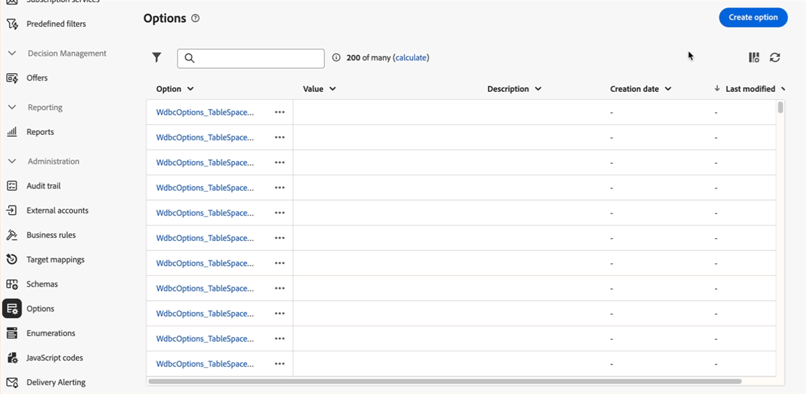

# Notes de mise à jour {#latest-release}

>[!CONTEXTUALHELP]
>id="acw_homepage_learning_card2"
>title="Notes de mise à jour"
>abstract="Les versions de l’interface utilisateur d’Adobe Campaign Web fonctionnent sur un modèle de diffusion continu qui permet une approche plus évolutive et progressive du déploiement des fonctionnalités. Par conséquent, les notes de mise à jour de Campaign sont mises à jour plusieurs fois par mois, avec les derniers correctifs, les dernières fonctionnalités et les dernières améliorations. Nous vous recommandons de les vérifier régulièrement."

Les mises à jour de l’interface utilisateur web d’Adobe Campaign fonctionnent sur un modèle de diffusion continu, ce qui permet une approche évolutive et progressive du déploiement des fonctionnalités. Par conséquent, ces notes de mise à jour sont mises à jour plusieurs fois par mois. Vérifiez-les régulièrement.

Les modifications et améliorations disponibles avec les versions précédentes sont répertoriées [sur cette page](release-notes-24.md).

## Version de février 2025 {#25-2-release}

**Date de publication** : 18 février 2025

Les fonctionnalités et améliorations suivantes sont disponibles à compter de la version de février.

### Fonctionnalités {#25-2-features}

<table>
<thead>
<tr>
<th><strong>Créer des règles métier (règles de typologie)</strong> </th>
</tr>
</thead>
<tbody>
<tr>
<td>

Vous pouvez désormais créer des typologies et des règles de typologie dans l’interface d’utilisation web d’Adobe Campaign. Les typologies contrôlent, filtrent et hiérarchisent l’envoi des diffusions. Les typologies valident le fait que les diffusions contiennent toujours des composants obligatoires (tels qu’un lien de désinscription ou une ligne d’objet) ou des règles de filtrage pour exclure des groupes de votre audience (tels que les désabonnés, les concurrents ou les clients non fidèles).

Pour plus d’informations, consultez la <a href="../administration/typologies.md">documentation détaillée</a>.

</td>
</tr>
</tbody>
</table>

<table>
<thead>
<tr>
<th><strong>Mappings de ciblage</strong> </th>
</tr>
</thead>
<tbody>
<tr>
<td>

Vous pouvez désormais créer des mappings de ciblage dans l’interface d’utilisation web de Campaign. Les mappings de ciblage définissent la manière dont différents canaux de diffusion (e-mails, SMS, notifications push) sont liés aux champs de données d’un schéma. Le mapping de ciblage définit l'audience ciblée : profils, bénéficiaires d'un contrat, opérateurs, abonnés, prospects, etc.

Pour plus d’informations, consultez la <a href="../administration/target-mappings.md">documentation détaillée</a>.

</td>
</tr>
</tbody>
</table>

<table>
<thead>
<tr>
<th><strong>Détails du schéma</strong> </th>
</tr>
</thead>
<tbody>
<tr>
<td>

Vous pouvez désormais accéder aux détails d’un schéma en sélectionnant son nom dans la liste. La modification des champs personnalisés est désormais accessible à partir du bouton <b>Modifier les champs personnalisés</b> disponible dans les détails du schéma.

Pour plus d’informations, consultez la <a href="../administration/schemas.md">documentation détaillée</a>.

</td>
</tr>
</tbody>
</table>

## Version de janvier 2025 {#25-1-release}

**Date de publication** : 5 février 2025

Les fonctionnalités et améliorations suivantes sont disponibles à compter de la version de janvier.

### Fonctionnalités {#25-1-features}

<table>
<thead>
<tr>
<th><strong>Créer et utiliser des fragments visuels</strong> </th>
</tr>
</thead>
<tbody>
<tr>
<td>

Les fragments visuels sont des blocs visuels prédéfinis que vous pouvez réutiliser dans plusieurs diffusions e-mail ou dans des modèles de contenu. Cette fonctionnalité est désormais disponible pour les clientes et clients utilisant la version 8.6.4 du serveur et les versions ultérieures.

Pour plus d’informations, consultez la <a href="../content/use-visual-fragments.md">documentation détaillée</a>.

</td>
</tr>
</tbody>
</table>

<table>
<thead>
<tr>
<th><strong>Utiliser un système tiers pour envoyer des diffusions</strong> </th>
</tr>
</thead>
<tbody>
<tr>
<td>

Vous pouvez désormais définir des diffusions externes et des modèles de diffusion externe dans l’interface web de Campaign. Avec ce mode, les messages sont compilés dans un fichier de sortie qui peut être partagé avec votre fournisseur externe. Par défaut, le mode de diffusion externe est utilisé pour le canal courrier.

Pour plus d’informations, consultez la <a href="../msg/send-external-deliveries.md">documentation détaillée</a>.

</td>
</tr>
</tbody>
</table>

<table>
<thead>
<tr>
<th><strong>Gérer vos énumérations</strong> </th>
</tr>
</thead>
<tbody>
<tr>
<td>

Vous pouvez désormais créer des énumérations directement via l’interface d’utilisation web d’Adobe Campaign. Une énumération est une liste de valeurs proposées par le système pour renseigner les champs. Utilisez des énumérations pour normaliser les valeurs de ces champs, faciliter la saisie de données ou les utiliser dans des requêtes.

Pour plus d’informations, consultez la <a href="../administration/enumerations.md">documentation détaillée</a>.

</td>
</tr>
</tbody>
</table>

<table>
<thead>
<tr>
<th><strong>Créer des options personnalisées</strong> </th>
</tr>
</thead>
<tbody>
<tr>
<td>

Vous pouvez désormais accéder aux options techniques de l’interface d’utilisation web d’Adobe Campaign et créer vos propres options personnalisées en fonction de vos besoins. Cela s’avère particulièrement utile lorsque vous travaillez avec des activités de workflow de code JavaScript pour stocker des données intermédiaires.

Pour plus d’informations, consultez la <a href="../administration/options.md">documentation détaillée</a>.

</td>
</tr>
</tbody>
</table>

<table>
<thead>
<tr>
<th><strong>Définition et appel des codes JavaScript</strong> </th>
</tr>
</thead>
<tbody>
<tr>
<td>

Vous pouvez désormais créer des codes JavaScript dans l’interface d’utilisation web d’Adobe Campaign. Vous pouvez ainsi créer des fonctions réutilisables qui peuvent être utilisées dans les workflows, comme une bibliothèque.

Pour plus d’informations, consultez la <a href="../administration/javascript-codes.md">documentation détaillée</a>.

</td>
</tr>
</tbody>
</table>

<table>
<thead>
<tr>
<th><strong>Génération de pages de destination avec l’assistant AI</strong> </th>
</tr>
</thead>
<tbody>
<tr>
<td>

L’assistant AI est désormais disponible avec vos diffusions de page de destination, ce qui vous permet de générer du texte, des images ou des mises en page complètes.

Pour plus d’informations sur l’assistant IA, consultez la <a href="../email/generative-lp.md">documentation détaillée</a>.

</td>
</tr>
</tbody>
</table>

### Améliorations {#25-1-improvements}

* Personnalisez l’affichage des champs personnalisés dans l’interface :
   * Sélectionnez d’autres champs personnalisés à afficher dans l’interface.
   * Définissez des règles pour l’affichage des champs personnalisés de type lien, telles que la restriction des valeurs de liste en fonction des entrées d’un autre champ.
   * Organisez les champs dans l’interface de manière plus flexible : les champs peuvent s’étendre sur une seule colonne ou être regroupés en sous-sections pour une meilleure organisation.
   * Définissez des champs spécifiques en lecture seule.

* Filtres récents et Favoris : ajoutez les attributs fréquemment utilisés aux favoris pour un accès rapide. Outre les favoris, affichez et utilisez les attributs sélectionnés le plus récemment.

* Comptes externes : le nouveau type **[!UICONTROL Routage]** peut être sélectionné lors de la création d’un compte externe. Il permet de configurer un compte externe spécifique à utiliser dans vos diffusions externes. [En savoir plus](../administration/external-account.md#routing).