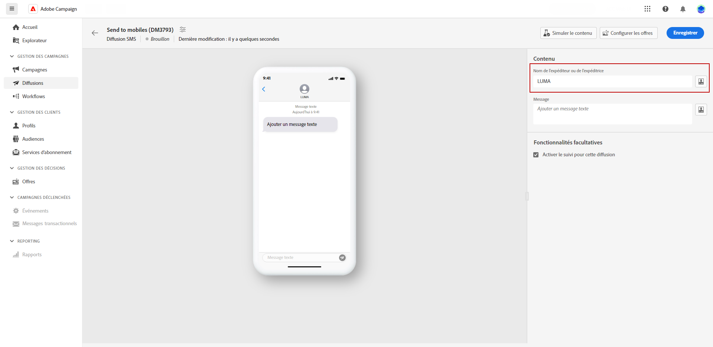
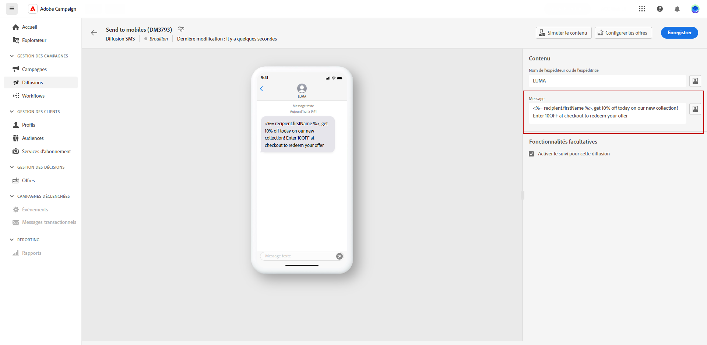

# Créer une diffusion par SMS {#design-sms}

>[!CONTEXTUALHELP]
>id="acw_deliveries_sms_content"
>title="Contenu SMS"
>abstract="Créez le contenu de vos diffusions SMS et personnalisez-le avec des champs de personnalisation, des blocs de contenu et du contenu dynamique. Pour commencer à composer votre message, cliquez sur le bouton **Modifier le contenu**."

>[!CONTEXTUALHELP]
>id="acw_deliveries_sms_msg"
>title="Contenu du message SMS"
>abstract="Définissez le contenu de votre SMS. Pour composer votre message, cliquez sur le champ **Message** et saisissez le contenu du message. Utilisez l’éditeur d’expression pour ajouter des données personnalisées et du contenu dynamique. Vous pouvez également personnaliser le nom de l’expéditeur ou de l’expéditrice. Par défaut, le suivi est activé pour toutes les diffusions SMS, afin que vous puissiez mesurer le moment où les personnes destinataires cliquent sur les liens."

Pour concevoir le contenu d’une diffusion SMS, procédez comme suit :

1. Dans votre page de diffusion, cliquez sur le bouton **[!UICONTROL Modifier le contenu]** pour concevoir le contenu de votre SMS.

1. Sur la page **[!UICONTROL Modifier le contenu]**, vous pouvez personnaliser le nom de l’expéditeur ou expéditrice en accédant au **[!UICONTROL champ Expéditeur]** et en saisissant le nom souhaité.

   En outre, en cliquant sur **[!UICONTROL Ouvrir la boîte de dialogue de personnalisation]**, vous pouvez inclure des champs de personnalisation, des blocs de contenu et du contenu dynamique dans votre message.

   {zoomable="yes"}

1. Saisissez votre message texte dans le champ **[!UICONTROL Message]** ou cliquez sur l’option **[!UICONTROL Ouvrir la boîte de dialogue de personnalisation]** pour définir le contenu et ajouter du contenu dynamique. [En savoir plus](../personalization/gs-personalization.md)

   {zoomable="yes"}

1. Par défaut, le tracking est activé pour les diffusions. Vous pouvez désactiver cette option dans la **[!UICONTROL section Fonctionnalités facultatives]**.

1. Cliquez sur **[!UICONTROL Paramètres]** pour accéder aux options avancées liées à votre modèle de diffusion. [En savoir plus](../advanced-settings/delivery-settings.md)

1. Accédez au menu **[!UICONTROL Simuler du contenu]** pour prévisualiser votre contenu personnalisé. [En savoir plus](send-sms.md#preview-sms)

1. Cliquez sur **[!UICONTROL Enregistrer]** et vérifiez votre message dans l’aperçu.

Vous pouvez maintenant vérifier et envoyer votre SMS à votre audience.
