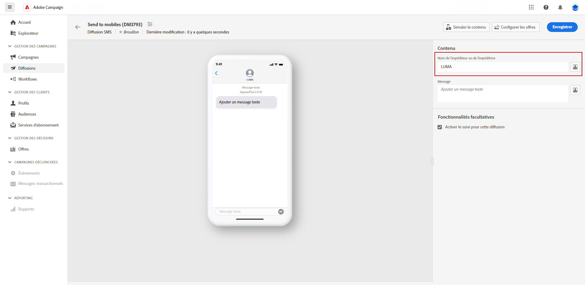
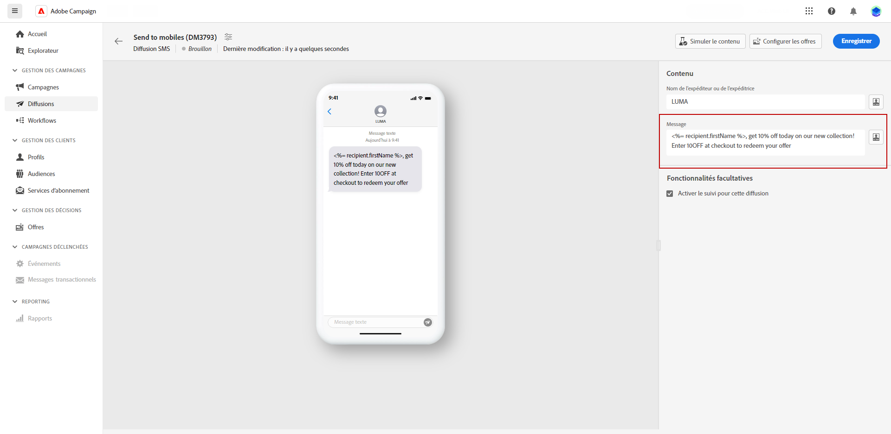

<?xml version="1.0" encoding="UTF-8"?>
<xliff xmlns="urn:oasis:names:tc:xliff:document:1.2" xmlns:okp="okapi-framework:xliff-extensions" xmlns:its="http://www.w3.org/2005/11/its" xmlns:itsxlf="http://www.w3.org/ns/its-xliff/" version="1.2" its:version="2.0">
<file original="help/v8/sms/content-sms.md.mdsc" source-language="en-US" target-language="en-XX" datatype="x-text/markdown">
<body>
<trans-unit id="tu1" restype="x-YAML_METADATA_HEADER_VALUE" xml:space="preserve">
<source xml:lang="en-US">Design a SMS delivery</source>
<target xml:lang="en-XX">Créer une diffusion SMS</target>
</trans-unit>
<trans-unit id="tu2" restype="x-YAML_METADATA_HEADER_VALUE" xml:space="preserve">
<source xml:lang="en-US">Learn how to design your SMS delivery</source>
<target xml:lang="en-XX">Découvrez comment concevoir votre diffusion SMS.</target>
</trans-unit>
<trans-unit id="tu3" xml:space="preserve">
<source xml:lang="en-US">Design an SMS delivery</source>
<target xml:lang="en-XX">Créer une diffusion par SMS</target>
</trans-unit>
<trans-unit id="tu4" xml:space="preserve">
<source xml:lang="en-US">SMS Content</source>
<target xml:lang="en-XX">Contenu SMS</target>
</trans-unit>
<trans-unit id="tu5" xml:space="preserve">
<source xml:lang="en-US">Create the content of your SMS deliveries, and personalize it with personalization fields, expression fragments, and dynamic content. To start composing your message, click the <ph id="1" ctype="x-STRONG_EMPHASIS">**</ph>Edit content<ph id="2" ctype="x-STRONG_EMPHASIS">**</ph> button.</source>
<target xml:lang="en-XX">Créez le contenu de vos diffusions SMS et personnalisez-le avec des champs de personnalisation, des fragments d’expression et du contenu dynamique. Pour commencer à composer votre message, cliquez sur le bouton <ph id="1" ctype="x-STRONG_EMPHASIS">**</ph>Modifier le contenu<ph id="2" ctype="x-STRONG_EMPHASIS">**</ph>.</target>
</trans-unit>
<trans-unit id="tu6" xml:space="preserve">
<source xml:lang="en-US">SMS message content</source>
<target xml:lang="en-XX">Contenu du message SMS</target>
</trans-unit>
<trans-unit id="tu7" xml:space="preserve">
<source xml:lang="en-US">Define the content of your SMS. To compose your message, click the <ph id="1" ctype="x-STRONG_EMPHASIS">**</ph>Message<ph id="2" ctype="x-STRONG_EMPHASIS">**</ph> field and enter the message content. Use the Expression editor to add personalized data and dynamic content. You can also customize the sender name. By default, tracking is enabled for all SMS deliveries, allowing you to measure when recipients click on links.</source>
<target xml:lang="en-XX">Définissez le contenu de votre SMS. Pour composer votre message, cliquez sur le champ <ph id="1" ctype="x-STRONG_EMPHASIS">**</ph>Message<ph id="2" ctype="x-STRONG_EMPHASIS">**</ph> et saisissez le contenu du message. Utilisez l’éditeur d’expression pour ajouter des données personnalisées et du contenu dynamique. Vous pouvez également personnaliser le nom de l’expéditeur ou de l’expéditrice. Par défaut, le suivi est activé pour toutes les diffusions SMS, ce qui vous permet de mesurer le nombre de fois où les personnes destinataires cliquent sur les liens.</target>
</trans-unit>
<trans-unit id="tu8" xml:space="preserve">
<source xml:lang="en-US">To design the content of an SMS delivery, follow these steps:</source>
<target xml:lang="en-XX">Pour concevoir le contenu d’une diffusion SMS, procédez comme suit :</target>
</trans-unit>
<trans-unit id="tu9" xml:space="preserve">
<source xml:lang="en-US">From your delivery page, click the <ph id="1" ctype="x-STRONG_EMPHASIS">**[!UICONTROL </ph>Edit content<ph id="3" ctype="x-LINK_REF">]**</ph> button to design your SMS content.</source>
<target xml:lang="en-XX">Dans votre page de diffusion, cliquez sur le bouton <ph id="1" ctype="x-STRONG_EMPHASIS">**[!UICONTROL </ph>Modifier le contenu<ph id="3" ctype="x-LINK_REF">]**</ph> pour concevoir le contenu de votre SMS.</target>
</trans-unit>
<trans-unit id="tu10" xml:space="preserve">
<source xml:lang="en-US">On the <ph id="1" ctype="x-STRONG_EMPHASIS">**[!UICONTROL </ph>Edit content<ph id="3" ctype="x-LINK_REF">]**</ph> page, customize the sender name by accessing the <ph id="5" ctype="x-STRONG_EMPHASIS">**[!UICONTROL </ph>Sender field<ph id="7" ctype="x-LINK_REF">]**</ph> and entering the preferred name.</source>
<target xml:lang="en-XX">Sur la page <ph id="1" ctype="x-STRONG_EMPHASIS">**[!UICONTROL </ph>Modifier le contenu<ph id="3" ctype="x-LINK_REF">]**</ph>, personnalisez le nom de l’expéditeur ou de l’expéditrice en accédant au <ph id="5" ctype="x-STRONG_EMPHASIS">**[!UICONTROL </ph>champ Expéditeur ou expéditrice<ph id="7" ctype="x-LINK_REF">]**</ph> et en saisissant le nom souhaité.</target>
</trans-unit>
<trans-unit id="tu11" xml:space="preserve">
<source xml:lang="en-US">Additionally, click <ph id="1" ctype="x-STRONG_EMPHASIS">**[!UICONTROL </ph>Open personalization dialog<ph id="3" ctype="x-LINK_REF">]**</ph> to include personalization fields, expression fragments, and dynamic content in your message.</source>
<target xml:lang="en-XX">En outre, cliquez sur <ph id="1" ctype="x-STRONG_EMPHASIS">**[!UICONTROL </ph>Ouvrir la boîte de dialogue de personnalisation<ph id="3" ctype="x-LINK_REF">]**</ph>, pour inclure des champs de personnalisation, des fragments d’expression et du contenu dynamique dans votre message.</target>
</trans-unit>
<trans-unit id="tu12" xml:space="preserve">
<source xml:lang="en-US"><ph id="1" ctype="x-IMAGE">{zoomable="yes"}</ph></source>
<target xml:lang="en-XX"><ph id="1" ctype="x-IMAGE">{zoomable="yes"}</ph></target>
</trans-unit>
<trans-unit id="tu13" xml:space="preserve">
<source xml:lang="en-US">Type your text message in the <ph id="1" ctype="x-STRONG_EMPHASIS">**[!UICONTROL </ph>Message<ph id="3" ctype="x-LINK_REF">]**</ph> field, or click the <ph id="5" ctype="x-STRONG_EMPHASIS">**[!UICONTROL </ph>Open personalization dialog<ph id="7" ctype="x-LINK_REF">]**</ph> option to define content and add dynamic content. <ph id="9" ctype="x-LINK">[</ph>Learn more<ph id="10" ctype="x-LINK">](../personalization/gs-personalization.md)</ph></source>
<target xml:lang="en-XX">Saisissez votre message texte dans le champ <ph id="1" ctype="x-STRONG_EMPHASIS">**[!UICONTROL </ph>Message<ph id="3" ctype="x-LINK_REF">]**</ph> ou cliquez sur l’option <ph id="5" ctype="x-STRONG_EMPHASIS">**[!UICONTROL </ph>Ouvrir la boîte de dialogue de personnalisation<ph id="7" ctype="x-LINK_REF">]**</ph> pour définir le contenu et ajouter du contenu dynamique. <ph id="9" ctype="x-LINK">[</ph>En savoir plus<ph id="10" ctype="x-LINK">](../personalization/gs-personalization.md)</ph></target>
</trans-unit>
<trans-unit id="tu14" xml:space="preserve">
<source xml:lang="en-US"><ph id="1" ctype="x-IMAGE">{zoomable="yes"}</ph></source>
<target xml:lang="en-XX"><ph id="1" ctype="x-IMAGE">{zoomable="yes"}</ph></target>
</trans-unit>
<trans-unit id="tu15" xml:space="preserve">
<source xml:lang="en-US">By default, tracking is enabled for deliveries. Disable this option from the delivery's <ph id="1" ctype="x-STRONG_EMPHASIS">**[!UICONTROL </ph>Settings<ph id="3" ctype="x-LINK_REF">]**</ph> > <ph id="5" ctype="x-STRONG_EMPHASIS">**[!UICONTROL </ph>Tracking<ph id="7" ctype="x-LINK_REF">]**</ph> tab if needed. <ph id="9" ctype="x-LINK">[</ph>Learn more<ph id="10" ctype="x-LINK">](../advanced-settings/delivery-settings.md#tracking-tab)</ph></source>
<target xml:lang="en-XX">Par défaut, le tracking est activé pour les diffusions. Désactivez cette option dans l’onglet <ph id="1" ctype="x-STRONG_EMPHASIS">**[!UICONTROL </ph>Paramètres<ph id="3" ctype="x-LINK_REF">]**</ph> > <ph id="5" ctype="x-STRONG_EMPHASIS">**[!UICONTROL </ph>Tracking<ph id="7" ctype="x-LINK_REF">]**</ph> de la diffusion, si nécessaire. <ph id="9" ctype="x-LINK">[</ph>En savoir plus<ph id="10" ctype="x-LINK">](../advanced-settings/delivery-settings.md#tracking-tab)</ph></target>
</trans-unit>
<trans-unit id="tu16" xml:space="preserve">
<source xml:lang="en-US">Click <ph id="1" ctype="x-STRONG_EMPHASIS">**[!UICONTROL </ph>Settings<ph id="3" ctype="x-LINK_REF">]**</ph> to access advanced options related to your delivery template. <ph id="5" ctype="x-LINK">[</ph>Learn more<ph id="6" ctype="x-LINK">](../advanced-settings/delivery-settings.md)</ph></source>
<target xml:lang="en-XX">Cliquez sur <ph id="1" ctype="x-STRONG_EMPHASIS">**[!UICONTROL </ph>Paramètres<ph id="3" ctype="x-LINK_REF">]**</ph> pour accéder aux options avancées liées à votre modèle de diffusion. <ph id="5" ctype="x-LINK">[</ph>En savoir plus<ph id="6" ctype="x-LINK">](../advanced-settings/delivery-settings.md)</ph></target>
</trans-unit>
<trans-unit id="tu17" xml:space="preserve">
<source xml:lang="en-US">Access the <ph id="1" ctype="x-STRONG_EMPHASIS">**[!UICONTROL </ph>Simulate content<ph id="3" ctype="x-LINK_REF">]**</ph> menu to preview your personalized content. <ph id="5" ctype="x-LINK">[</ph>Learn more<ph id="6" ctype="x-LINK">](send-sms.md#preview-sms)</ph></source>
<target xml:lang="en-XX">Accédez au menu <ph id="1" ctype="x-STRONG_EMPHASIS">**[!UICONTROL </ph>Simuler du contenu<ph id="3" ctype="x-LINK_REF">]**</ph> pour prévisualiser votre contenu personnalisé. <ph id="5" ctype="x-LINK">[</ph>En savoir plus<ph id="6" ctype="x-LINK">](send-sms.md#preview-sms)</ph></target>
</trans-unit>
<trans-unit id="tu18" xml:space="preserve">
<source xml:lang="en-US">Click <ph id="1" ctype="x-STRONG_EMPHASIS">**[!UICONTROL </ph>Save<ph id="3" ctype="x-LINK_REF">]**</ph> and check your message in the preview.</source>
<target xml:lang="en-XX">Cliquez sur <ph id="1" ctype="x-STRONG_EMPHASIS">**[!UICONTROL </ph>Enregistrer<ph id="3" ctype="x-LINK_REF">]**</ph> et vérifiez votre message dans l’aperçu.</target>
</trans-unit>
<trans-unit id="tu19" xml:space="preserve">
<source xml:lang="en-US">Review and send your SMS message to your audience.</source>
<target xml:lang="en-XX">Vérifiez votre SMS et envoyez-le à votre audience.</target>
</trans-unit>
</body>
</file>
</xliff>