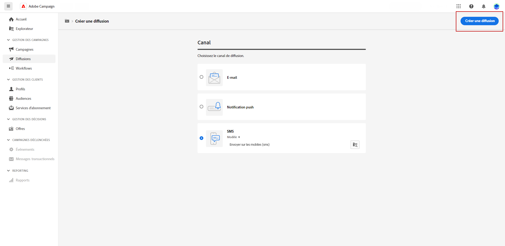
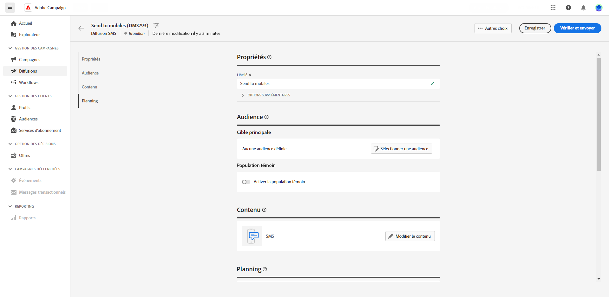
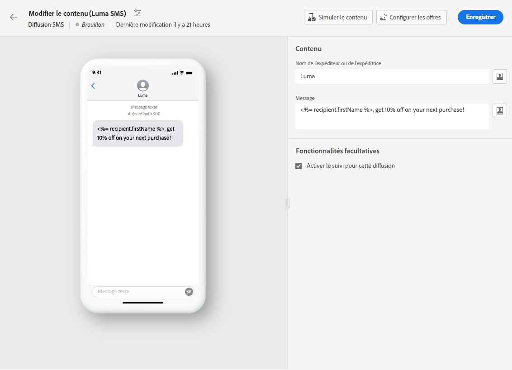
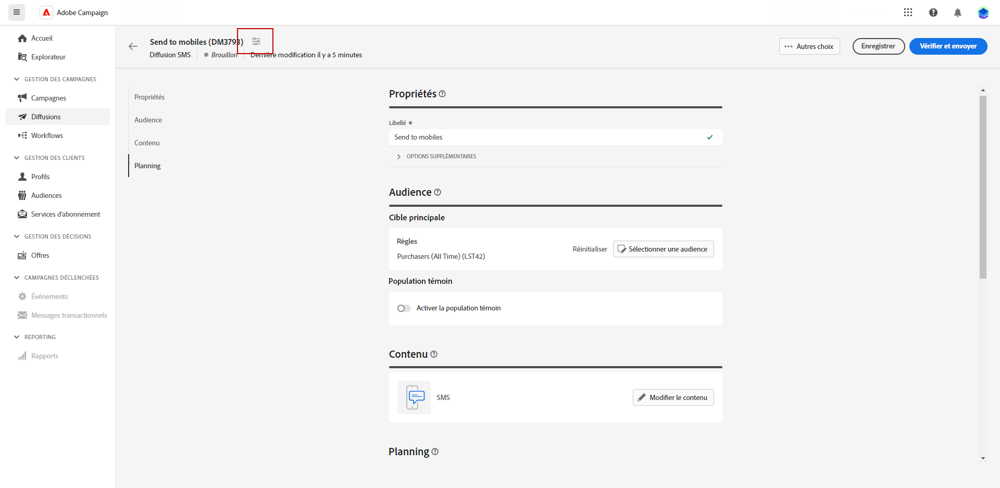

# Créer une diffusion SMS {#create-sms}

>[!CONTEXTUALHELP]
>id="acw_deliveries_sms_properties"
>title="Propriétés de la diffusion SMS"
>abstract="Les propriétés englobent les paramètres de diffusion courants qui vous aident à nommer et à classer votre diffusion. Si votre diffusion est basée sur un schéma étendu, des champs d’options personnalisées spécifiques sont disponibles."

>[!CONTEXTUALHELP]
>id="acw_deliveries_sms_audience"
>title="Définissez l’audience du SMS."
>abstract="Sélectionnez l’audience la plus appropriée pour votre SMS."

>[!CONTEXTUALHELP]
>id="acw_deliveries_sms_template_selection"
>title="Sélection du modèle de SMS"
>abstract="Sélectionnez un modèle prédéfini pour démarrer votre diffusion par SMS."

1. Dans la page d’accueil **[!UICONTROL Diffusions]**, cliquez sur **[!UICONTROL Créer une diffusion]**.

1. Sous la section **[!UICONTROL Canal]**, choisissez SMS comme canal et sélectionnez un modèle. [En savoir plus sur les modèles](../msg/delivery-template.md)

1. Cliquez sur le bouton **[!UICONTROL Créer une diffusion]** pour confirmer.

   

1. Saisissez un **[!UICONTROL Libellé]** pour la diffusion et accédez au menu déroulant **[!UICONTROL Options supplémentaires]**.

   +++Configurez les paramètres suivants en fonction de vos besoins.
   * **[!UICONTROL Nom interne]** : attribuez un identifiant unique à la diffusion.
   * **[!UICONTROL Dossier]** : stockez la diffusion dans un dossier spécifique.
   * **[!UICONTROL Code de diffusion]** : organisez vos diffusions à l’aide de votre propre convention de nommage.
   * **[!UICONTROL Description]** : spécifiez une description pour la diffusion.
   * **[!UICONTROL Nature]** : indiquez la nature de l’e-mail à des fins de classification.
+++

1. Cliquez sur le bouton **[!UICONTROL Sélectionner une audience]** pour cibler une audience existante ou créer la vôtre. [En savoir plus](../audience/about-audiences.md).

   

1. Activez l’option **[!UICONTROL Activer la population témoin]** permettant de définir une population témoin afin de mesurer l’impact de votre diffusion. Vous pouvez ainsi comparer le comportement de la population qui a reçu le message à celui des contacts qui ne l’ont pas reçu. [En savoir plus](../audience/control-group.md)

1. Cliquez sur **[!UICONTROL Modifier le contenu]** pour commencer à concevoir le contenu de votre SMS. [En savoir plus](content-sms.md).

   

   Dans cet écran, vous pouvez également [simuler votre contenu](../preview-test/preview-test.md) et [configurer des offres](../content/offers.md).

1. Pour planifier votre diffusion à une date et une heure spécifiques, activez l’option **[!UICONTROL Activer la planification]**. Une fois la diffusion lancée, le message est automatiquement envoyé à la date et à l’heure exactes que vous avez définies pour le ou la destinataire.

1. Cliquez sur **[!UICONTROL Configurer les paramètres de diffusion]** pour accéder aux options avancées liées à votre modèle de diffusion. [En savoir plus](../advanced-settings/delivery-settings.md)

   
