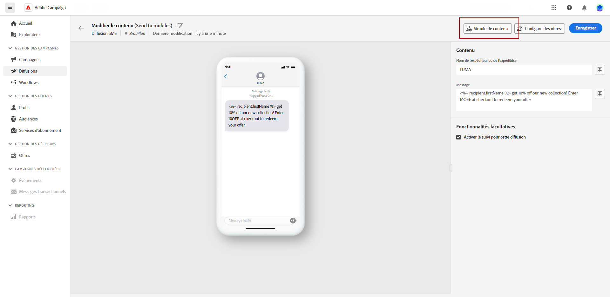
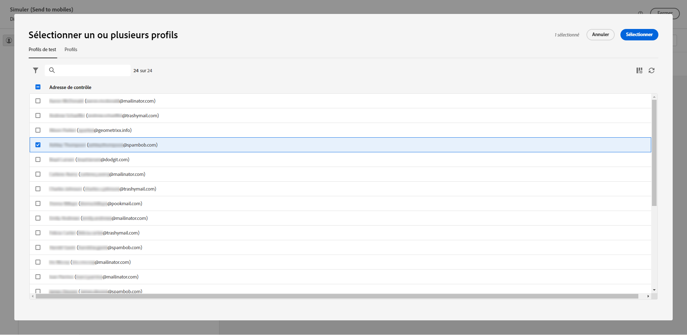
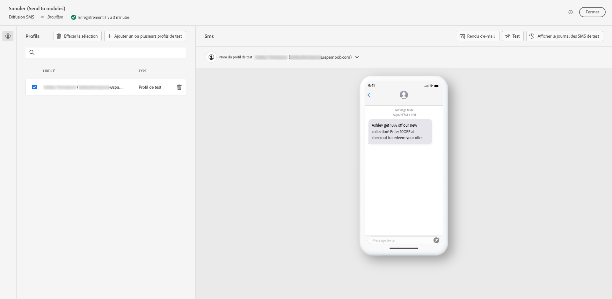
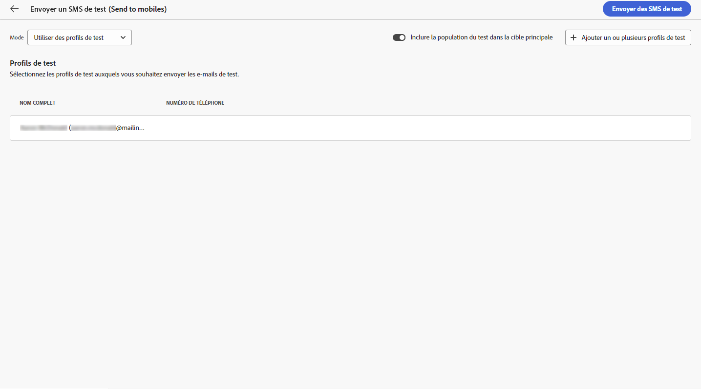
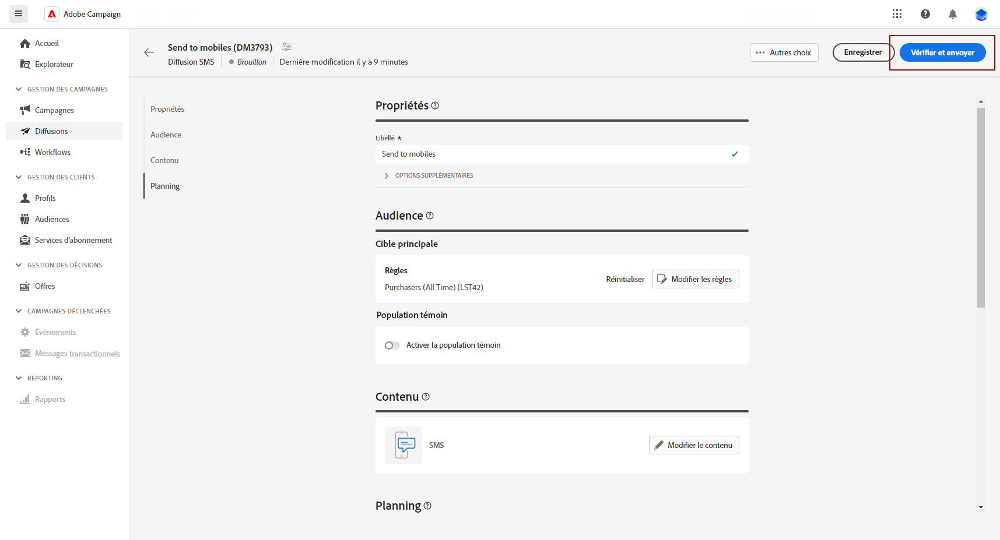
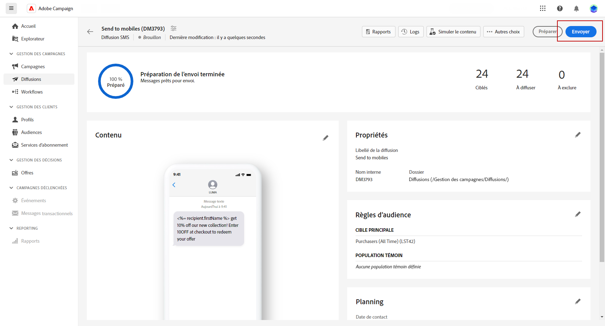

# Prévisualiser et envoyer une diffusion SMS {#send-sms-delivery}

## Prévisualiser votre diffusion SMS{#preview-sms}

Une fois que vous avez défini le contenu de votre message, vous pouvez utiliser des profils de test pour le prévisualiser et le tester. Si vous avez inclus du contenu personnalisé, vous pouvez examiner l&#39;affichage de ce contenu dans le message à l&#39;aide des données de profil de test. Vous pouvez ainsi vous assurer que le message s’affiche comme prévu et que toute information personnalisée est correctement présentée.

Les principales étapes pour prévisualiser votre diffusion SMS sont les suivantes. Pour plus d’informations sur la prévisualisation des diffusions, reportez-vous à la section [cette section](../preview-test/preview-content.md).

1. Dans la page de contenu de votre diffusion, utilisez **[!UICONTROL Simulation du contenu]** pour prévisualiser votre contenu personnalisé.

   

1. Cliquez sur **[!UICONTROL Ajouter un ou plusieurs profils de test]** pour sélectionner un ou plusieurs profils de test.

   <!--
    Once your test profiles are selected, click **[!UICONTROL Select]**.
    
    -->

1. Dans le volet de droite, vous trouverez un aperçu de la diffusion SMS, où les éléments personnalisés sont remplacés dynamiquement par les données du profil sélectionné.

   

Vous pouvez maintenant vérifier et envoyer votre SMS à votre audience.

## Tester votre diffusion SMS {#test-sms}

Avec **Adobe Campaign**, vous avez la possibilité de tester un message avant de l’envoyer à l’audience principale, ce qui est une étape essentielle pour valider votre campagne par e-mail et identifier les problèmes potentiels.

L’envoi de SMS de test est une étape importante pour assurer la qualité et l’efficacité de votre diffusion. Les destinataires du test peuvent consulter divers éléments tels que des liens, des liens d&#39;opt-out et des images, et identifier les erreurs de rendu, de contenu, de paramètres de personnalisation et de configuration des SMS. Ce processus vous aide à évaluer et à optimiser minutieusement votre SMS avant d’atteindre votre audience principale.

 Découvrez comment envoyer des SMS de test dans [cette section](../preview-test/proofs.md).

## Envoyer votre diffusion SMS {#send-sms}

1. Après avoir personnalisé le contenu de votre SMS, cliquez sur **[!UICONTROL Réviser et envoyer]** de votre **[!UICONTROL Diffusion]** page.

   

1. Cliquez sur **[!UICONTROL Préparer]** et suivre les progrès et les statistiques fournis.

   En cas d&#39;erreur, reportez-vous au menu Journaux pour obtenir des informations détaillées sur l&#39;échec.

1. Envoyer les messages en cliquant sur **[!UICONTROL Envoyer]** pour poursuivre le processus d’envoi final.

   

1. Confirmez l&#39;action d&#39;envoi en cliquant sur le bouton **[!UICONTROL Envoyer]** bouton .

Une fois votre diffusion envoyée, vous pouvez effectuer le suivi de vos données IPC (Indicateur de performance clé) provenant de votre page de diffusion et des données issues de la variable **[!UICONTROL Journaux]** .

Vous pouvez maintenant commencer à mesurer l’impact de votre message à l’aide de rapports intégrés. [En savoir plus](../reporting/sms-report.md)

