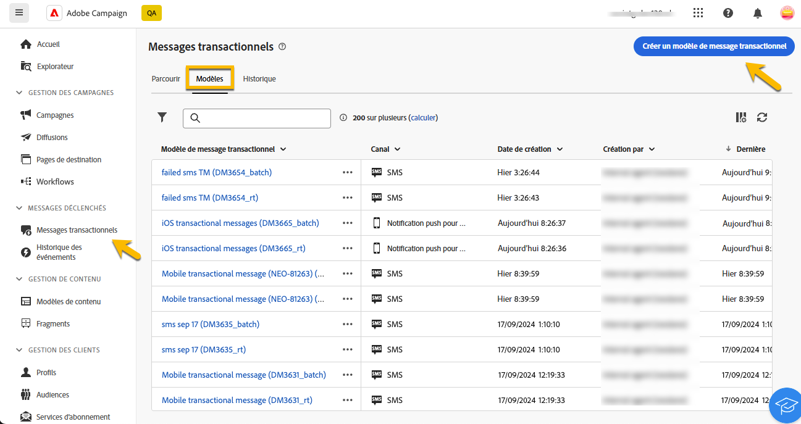
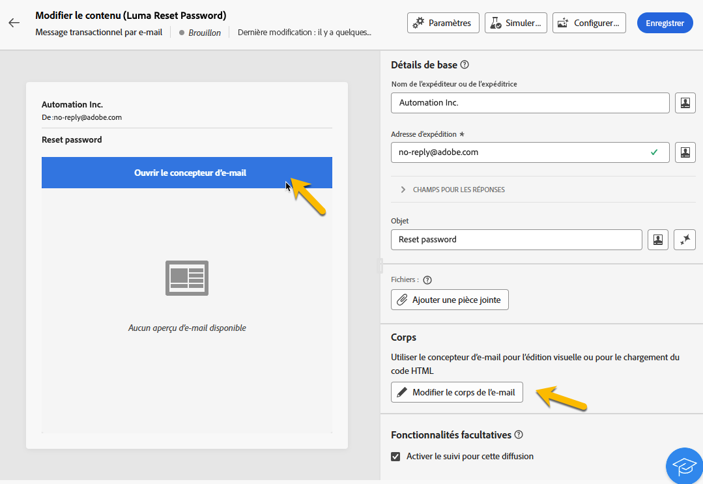
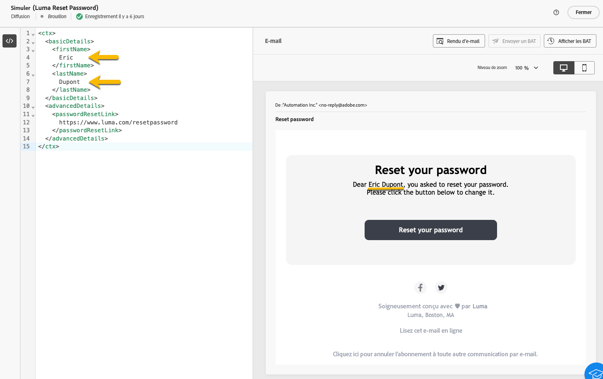
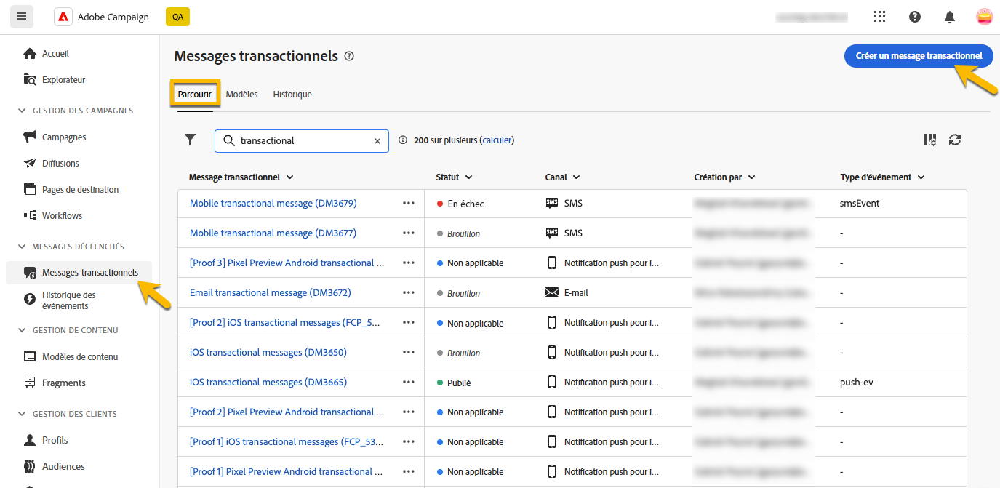
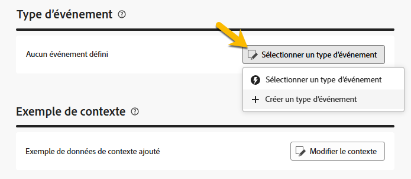
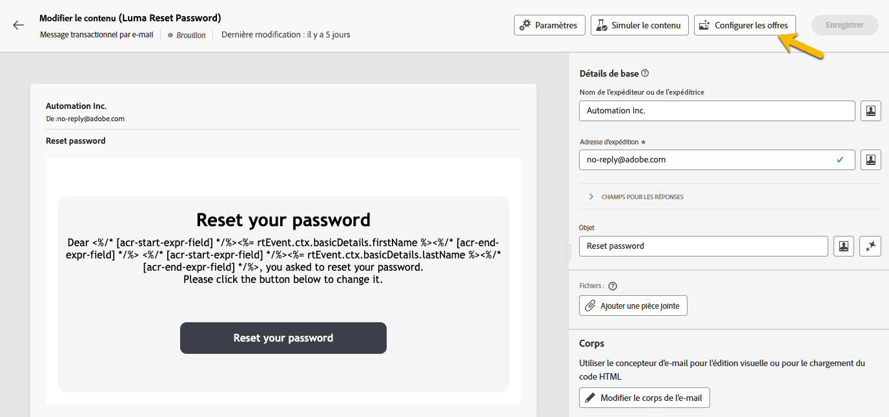

# Création de messages transactionnels

Dans les messages transactionnels, un événement déclenche l’envoi d’un message personnalisé.
Pour activer cette fonctionnalité, vous devez créer un modèle de message pour chaque type d’événement. Ces modèles contiennent toutes les informations nécessaires pour personnaliser le message transactionnel.

## Créer un modèle de message transactionnel {#transactional-template}

Dans l&#39;interface utilisateur web de Campaign, la première étape de la configuration des messages transactionnels est la création du modèle ou la création directe du message. Ceci diffère de [la configuration des messages transactionnels sur la console cliente](https://experienceleague.adobe.com/fr/docs/campaign/campaign-v8/send/real-time/transactional).

Un modèle de message transactionnel peut être utilisé pour prévisualiser le contenu de la diffusion reçu par le profil avant d&#39;atteindre l&#39;audience finale. Par exemple, un administrateur peut configurer et configurer les modèles, ce qui les rend prêts à être utilisés par les utilisateurs marketing.

Pour créer un modèle de message transactionnel, procédez comme suit :

* Dans la section **[!UICONTROL Messages déclenchés]**, accédez à **[!UICONTROL Messages transactionnels]**. Dans l’onglet **[!UICONTROL Modèles]**, vous pouvez voir tous les modèles de diffusion pour les messages transactionnels. Cliquez sur le bouton **[!UICONTROL Créer un modèle de message transactionnel]** pour commencer la création de votre modèle.

  {zoomable="yes"}

* Dans la nouvelle page affichée, choisissez le canal de votre modèle. Dans notre exemple, nous sélectionnons le canal **[!UICONTROL Email]**. Vous pouvez également utiliser un autre modèle de message et le sélectionner dans la liste des modèles.

  {zoomable="yes"}

  Cliquez de nouveau sur le bouton **[!UICONTROL Créer un message transactionnel]** pour valider la création de votre modèle sur le canal sélectionné.

* Vous avez désormais accès à la configuration de votre modèle de messages transactionnels.

  {zoomable="yes"}

### Propriétés des messages transactionnels {#transactional-properties}

>[!CONTEXTUALHELP]
>id="acw_transacmessages_properties"
>title="Propriétés des messages transactionnels"
>abstract="Renseignez ce formulaire pour configurer les propriétés des messages transactionnels."

>[!CONTEXTUALHELP]
>id="acw_transacmessages_email_properties"
>title="Propriétés des emails de messagerie transactionnelle"
>abstract="Renseignez ce formulaire pour configurer les propriétés des emails de messagerie transactionnelle."

>[!CONTEXTUALHELP]
>id="acw_transacmessages_sms_properties"
>title="Propriétés SMS des messages transactionnels"
>abstract="Renseignez ce formulaire pour configurer les propriétés SMS des messages transactionnels."

>[!CONTEXTUALHELP]
>id="acw_transacmessages_push_properties"
>title="Propriétés push des messages transactionnels"
>abstract="Renseignez ce formulaire pour configurer les propriétés push des messages transactionnels."

La section **[!UICONTROL Propriétés]** d&#39;un message transactionnel vous aidera à configurer :

* **[!UICONTROL Libellé]** est le nom qui s’affiche dans la liste des messages transactionnels. Soyez clair pour la recherche et l&#39;utilisation future.
* **[!UICONTROL Nom interne]** est un nom unique qui différencie votre message des autres messages créés.
* Le **[!UICONTROL Dossier]** est l’emplacement où le modèle de message transactionnel est créé.
* Le **[!UICONTROL dossier d&#39;exécution]** est l&#39;emplacement où le message est stocké après exécution.
* Le **[!UICONTROL code de diffusion]** : code qui aide à reconnaître le message pour la création de rapports, si nécessaire.
* **[!UICONTROL Description]**
* La **[!UICONTROL Nature]** est la nature de votre diffusion, comme indiqué dans l’énumération *deliveryNature*. [En savoir plus sur les énumérations](https://experienceleague.adobe.com/en/docs/campaign/campaign-v8/config/configuration/ui-settings#enumerations)

{zoomable="yes"}

### Application mobile {#mobile-app}

>[!CONTEXTUALHELP]
>id="acw_transacmessages_mobileapp"
>title="Application mobile de messagerie transactionnelle"
>abstract="Dans cette section, vous pouvez sélectionner l&#39;application dans laquelle vous souhaitez envoyer votre message."

Dans cette section, vous pouvez sélectionner l&#39;application dans laquelle vous souhaitez envoyer votre message.

En cliquant sur l’icône de recherche, vous accédez à l’application mobile répertoriée dans votre instance Adobe Campaign.

{zoomable="yes"}

### Exemple de contexte {#context-sample}

>[!CONTEXTUALHELP]
>id="acw_transacmessages_context"
>title="Contexte de la messagerie transactionnelle"
>abstract="L’exemple de contexte vous permet de créer un événement de test pour prévisualiser le message transactionnel reçu avec la personnalisation du profil."

>[!CONTEXTUALHELP]
>id="acw_transacmessages_addcontext"
>title="Contexte de la messagerie transactionnelle"
>abstract="L’exemple de contexte vous permet de créer un événement de test pour prévisualiser le message transactionnel reçu avec la personnalisation du profil. "

L’exemple de contexte vous permet de créer un événement de test pour prévisualiser le message transactionnel reçu avec la personnalisation du profil.

Cette étape est facultative. Vous pouvez utiliser le modèle sans l’exemple de contexte, mais l’inconvénient est que vous ne pouvez pas prévisualiser le contenu personnalisé.

Dans notre exemple de définition du mot de passe, l’événement enverra le prénom, le nom et un lien personnalisé à l’utilisateur pour réinitialiser son mot de passe. Le contexte peut être configuré comme illustré ci-dessous.

Le contenu du contexte dépend de la personnalisation dont vous avez besoin.

{zoomable="yes"}

### Contenu du modèle de message transactionnel {#transactional-content}

>[!CONTEXTUALHELP]
>id="acw_transacmessages_content"
>title="Contenu des messages transactionnels"
>abstract="Découvrez comment créer le contenu des messages transactionnels"

>[!CONTEXTUALHELP]
>id="acw_transacmessages_personalization"
>title="Personnalisation des messages transactionnels"
>abstract="Découvrez comment personnaliser le contenu des messages transactionnels"

Travailler sur le contenu d&#39;un message transactionnel est comme la création de contenu d&#39;une diffusion. Cliquez sur **[!UICONTROL Ouvrir le concepteur d&#39;email]** ou **[!UICONTROL Editer le corps d&#39;email]** et sélectionnez un contenu de modèle ou importez votre code d&#39;HTML.

{zoomable="yes"}

Pour ajouter la personnalisation dans le contenu, cliquez sur la section où vous souhaitez l&#39;ajouter et choisissez l&#39;icône **[!UICONTROL Ajouter Personalization]** .

{zoomable="yes"}

Vous aurez accès à la fenêtre **[!UICONTROL Modifier la personnalisation]**.
Pour ajouter les variables de l’événement déclencheur, cliquez sur l’icône **[!UICONTROL Contexte de l’événement]** . Vous pouvez parcourir le contexte que vous avez défini pour votre modèle ([en savoir plus sur le contexte](#context-sample)), puis cliquer sur le bouton **[!UICONTROL +]** pour insérer la variable nécessaire.

Vous pouvez voir sur l’image ci-dessous comment ajouter la personnalisation du prénom.

{zoomable="yes"}

Dans notre exemple, nous ajoutons le prénom, puis le nom, et nous personnalisons le lien du bouton **[!UICONTROL Réinitialiser votre mot de passe]** .

{zoomable="yes"}

### Prévisualiser le modèle

A ce stade de la création du modèle, vous pouvez prévisualiser le contenu du modèle et vérifier la personnalisation.

Pour ce faire, remplissez l’ [exemple de contexte](#context-sample), puis cliquez sur le bouton **[!UICONTROL Simuler le contenu]** .

{zoomable="yes"}

## Créer un message transactionnel {#transactional-message}

Vous pouvez créer un message transactionnel directement ou à l&#39;aide d&#39;un modèle de message transactionnel. [Découvrez comment créer un modèle de message transactionnel](#transactional-template).

Pour créer un message transactionnel, procédez comme suit :

* Dans la section **[!UICONTROL Messages déclenchés]**, accédez à **[!UICONTROL Messages transactionnels]**. Dans l’onglet **[!UICONTROL Parcourir]**, vous pouvez voir tous les messages transactionnels créés. Cliquez sur le bouton **[!UICONTROL Créer un message transactionnel]** pour commencer la création de votre message.

  {zoomable="yes"}

* Dans la nouvelle page affichée, choisissez le canal de votre message et choisissez le modèle que vous souhaitez utiliser. Dans notre exemple, nous choisissons [le modèle que nous avons créé ici](#transactional-template).

  {zoomable="yes"}

  Cliquez de nouveau sur le bouton **[!UICONTROL Créer un message transactionnel]** pour valider la création de votre message sur le canal sélectionné.

* Vous avez désormais accès à la configuration de votre message transactionnel. Votre message hérite de la configuration du modèle. Cette page est presque identique à la page de configuration du modèle de message transactionnel, sauf qu’elle inclut également la configuration du type d’événement.

  {zoomable="yes"}

  Renseignez la configuration de votre message comme pour un modèle :
   * [Propriétés des messages transactionnels](#transactional-properties)
   * [Exemple de contexte](#context-sample)
   * [Le contenu du message](#transactional-content)
et [configurez event-type](#event-type) comme décrit ci-dessous.

* Après [validation de votre message transactionnel](validate-transactional.md), cliquez sur le bouton **[!UICONTROL Réviser et publier]** pour créer et publier votre message.
Les déclencheurs peuvent désormais envoyer l’envoi de votre message transactionnel.

### À propos du type d’événement {#event-type}

>[!CONTEXTUALHELP]
>id="acw_transacmessages_event"
>title="Événement de message transactionnel"
>abstract="La configuration du type d’événement lie le message à l’événement déclencheur."

La configuration du type d’événement lie le message à l’événement déclencheur.

Dans l&#39;interface utilisateur web de Campaign, vous pouvez sélectionner un type d&#39;événement déjà créé ou créer directement votre type d&#39;événement dans cette page de configuration.

{zoomable="yes"}

>[!CAUTION]
>
>Si vous sélectionnez un type d’événement actuellement utilisé par un autre message transactionnel, les deux messages seront déclenchés. Pour les bonnes pratiques, **il est vivement recommandé de lier UN type d&#39;événement à UN seul message transactionnel.**

## Ajout d’offres à vos messages transactionnels {#transactional-offers}

Vous avez la possibilité d’inclure des offres dans vos messages transactionnels, ce qui vous permet de présenter des propositions pertinentes à vos utilisateurs finaux, même lorsque le message est déclenché par un événement.

Cette fonctionnalité est accessible pendant la phase d’édition du contenu de votre message transactionnel. Cliquez simplement sur le bouton **[!UICONTROL Configurer les offres]** pour la configurer.

Le processus de configuration est identique à la configuration des offres pour les diffusions standard. [Découvrez comment ajouter des offres à votre message](../msg/offers.md).

{zoomable="yes"}
