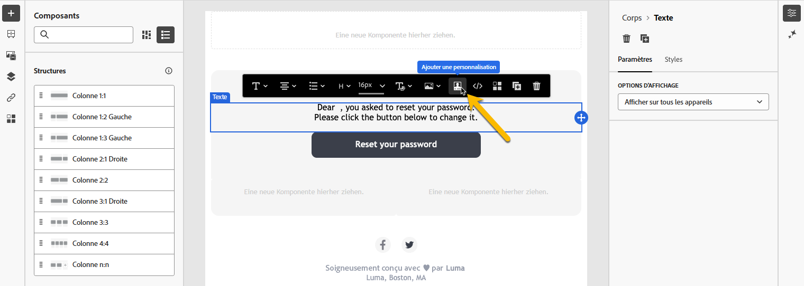
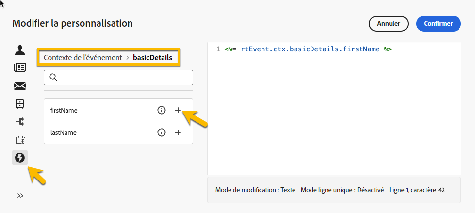
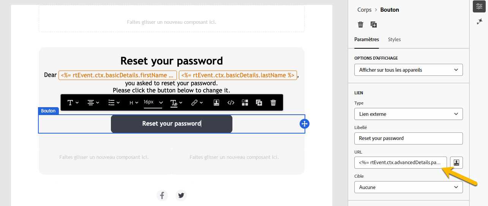

# Créer des messages transactionnels

Dans les messages transactionnels, un événement déclenche l’envoi d’un message personnalisé. Pour activer cette fonctionnalité, créez un modèle de message pour chaque type d’événement. Ces modèles contiennent toutes les informations nécessaires à la personnalisation du message transactionnel.

## Créer un modèle de message transactionnel {#transactional-template}

Dans l’interface d’utilisation de Campaign Web, la première étape de la configuration des messages transactionnels correspond à la création du modèle ou à la création directe du message. Ceci diffère de [la configuration des messages transactionnels sur la console cliente](https://experienceleague.adobe.com/fr/docs/campaign/campaign-v8/send/real-time/transactional).

Un modèle de message transactionnel peut être utilisé pour prévisualiser le contenu de la diffusion reçu par le profil avant d’atteindre l’audience finale. Par exemple, un administrateur ou une administratrice peut configurer les modèles, ce qui les rend prêts à l’emploi par les utilisateurs et utilisatrices marketing.

Pour créer un modèle de message transactionnel, procédez comme suit :

* Dans la section **[!UICONTROL Messages déclenchés]**, accédez à **[!UICONTROL Messages transactionnels]**. Dans l’onglet **[!UICONTROL Modèles]**, vous pouvez voir tous les modèles de diffusion des messages transactionnels. Cliquez sur le bouton **[!UICONTROL Créer un modèle de message transactionnel]** pour commencer la création de votre modèle.

  {zoomable="yes"}

* Dans la nouvelle page qui s’affiche, choisissez le canal de votre modèle. Pour cet exemple, sélectionnez le canal **[!UICONTROL E-mail]**. Vous pouvez également utiliser un autre modèle de message et le sélectionner dans la liste des modèles.

  {zoomable="yes"}

  Cliquez de nouveau sur le bouton **[!UICONTROL Créer un message transactionnel]** pour valider la création de votre modèle sur le canal sélectionné.

* Accédez à la configuration de votre modèle de message transactionnel.

  {zoomable="yes"}

### Propriétés du message transactionnel {#transactional-properties}

>[!CONTEXTUALHELP]
>id="acw_transacmessages_properties"
>title="Propriétés des messages transactionnels"
>abstract="Renseignez ce formulaire pour configurer les propriétés des messages transactionnels."

>[!CONTEXTUALHELP]
>id="acw_transacmessages_email_properties"
>title="Propriétés d’e-mail des messages transactionnels"
>abstract="Renseignez ce formulaire pour configurer les propriétés d’e-mail des messages transactionnels."

>[!CONTEXTUALHELP]
>id="acw_transacmessages_sms_properties"
>title="Propriétés SMS des messages transactionnels"
>abstract="Renseignez ce formulaire pour configurer les propriétés des SMS de messages transactionnels."

>[!CONTEXTUALHELP]
>id="acw_transacmessages_push_properties"
>title="Propriétés de notification push des messages transactionnels"
>abstract="Renseignez ce formulaire pour configurer les propriétés des notifications push pour les messages transactionnels."

La section **[!UICONTROL Propriétés]** d’un message transactionnel vous aidera à configurer les éléments suivants :

* Le **[!UICONTROL libellé]**, qui est le nom affiché dans la liste des messages transactionnels. Faites en sorte qu’il soit clair pour la recherche et l’utilisation ultérieure.
* Le **[!UICONTROL Nom interne]**, qui est un nom unique qui différencie votre message des autres messages créés.
* Le **[!UICONTROL Dossier]**, où le modèle de message transactionnel est créé.
* Le **[!UICONTROL Dossier d’exécution]**, où le message est stocké après l’exécution.
* Le **[!UICONTROL Code de diffusion]**, qui est un code qui aide à reconnaître le message pour le reporting, si nécessaire.
* La **[!UICONTROL Description]**.
* La **[!UICONTROL Nature]**, qui est la nature de votre diffusion, comme indiqué dans l’énumération *deliveryNature*. [En savoir plus sur les énumérations](https://experienceleague.adobe.com/fr/docs/campaign/campaign-v8/config/configuration/ui-settings#enumerations).

{zoomable="yes"}

### Application mobile {#mobile-app}

>[!CONTEXTUALHELP]
>id="acw_transacmessages_mobileapp"
>title="Application mobile de messages transactionnels"
>abstract="Dans cette section, vous pouvez sélectionner l’application dans laquelle vous souhaitez envoyer votre message."

Dans cette section, sélectionnez l’application avec laquelle vous souhaitez envoyer votre message.

En cliquant sur l’icône de recherche, accédez à la liste des applications mobiles de votre instance Adobe Campaign.

{zoomable="yes"}

### Exemple de contexte {#context-sample}

>[!CONTEXTUALHELP]
>id="acw_transacmessages_context"
>title="Contexte des messages transactionnels"
>abstract="L’exemple de contexte vous permet de créer un événement de test pour prévisualiser le message transactionnel reçu avec la personnalisation du profil."

>[!CONTEXTUALHELP]
>id="acw_transacmessages_addcontext"
>title="Contexte des messages transactionnels"
>abstract="L’exemple de contexte vous permet de créer un événement de test pour prévisualiser le message transactionnel reçu avec la personnalisation du profil."

L’exemple de contexte vous permet de créer un événement de test pour prévisualiser le message transactionnel reçu avec la personnalisation du profil.

Cette étape est facultative. Vous pouvez utiliser le modèle sans l’exemple de contexte. Notez toutefois que vous ne pourrez pas prévisualiser le contenu personnalisé.

Dans notre exemple de définition du mot de passe, l’événement envoie le prénom et le nom de la personne, ainsi qu’un lien personnalisé pour la réinitialisation du mot de passe. Le contexte peut être configuré comme illustré ci-dessous.

Le contenu du contexte dépend de la personnalisation dont vous avez besoin.

{zoomable="yes"}

### Contenu du modèle de message transactionnel {#transactional-content}

>[!CONTEXTUALHELP]
>id="acw_transacmessages_content"
>title="Contenu des messages transactionnels"
>abstract="Découvrez comment créer le contenu de messages transactionnels."

>[!CONTEXTUALHELP]
>id="acw_transacmessages_personalization"
>title="Personnalisation des messages transactionnels"
>abstract="Découvrez comment personnaliser le contenu des messages transactionnels."

>[!CONTEXTUALHELP]
>id="acw_personalization_editor_event_context"
>title="Event context"
>abstract="Ce menu fournit des variables de l’événement déclencheur que vous pouvez exploiter pour personnaliser le contenu de votre message transactionnel."

Le travail sur le contenu d’un message transactionnel est comparable à la création de contenu d’une diffusion. Cliquez sur **[!UICONTROL Ouvrir le concepteur d’e-mail]** ou **[!UICONTROL Modifier le corps de l’e-mail]** et sélectionnez un contenu de modèle ou importez votre code HTML.

{zoomable="yes"}

Pour ajouter la personnalisation au contenu, cliquez sur la section où vous souhaitez l’ajouter et choisissez l’icône **[!UICONTROL Ajouter la personnalisation]**.

{zoomable="yes"}

Accédez à la fenêtre **[!UICONTROL Modifier la personnalisation]**. Pour ajouter les variables de l’événement déclencheur, cliquez sur l’icône **[!UICONTROL Contexte de l’événement]**. Vous pouvez parcourir le contexte que vous avez défini pour votre modèle ([en savoir plus sur le contexte](#context-sample)), puis cliquer sur le bouton **[!UICONTROL +]** pour insérer la variable nécessaire.

L’image ci-dessous montre comment ajouter une personnalisation pour le prénom.

{zoomable="yes"}

Dans cet exemple, nous ajoutons le prénom et le nom, puis nous personnalisons le lien du bouton **[!UICONTROL Réinitialiser votre mot de passe]**.

{zoomable="yes"}

### Prévisualiser votre modèle

À ce stade de la création du modèle, vous pouvez prévisualiser le contenu du modèle et vérifier la personnalisation.

Pour ce faire, remplissez l’[exemple de contexte](#context-sample), puis cliquez sur le bouton **[!UICONTROL Simuler le contenu]**.

{zoomable="yes"}

## Créer un message transactionnel {#transactional-message}

Vous pouvez créer un message transactionnel directement ou à l’aide d’un modèle de message transactionnel. [Découvrez comment créer un modèle de message transactionnel](#transactional-template).

Pour créer un message transactionnel, procédez comme suit :

* Dans la section **[!UICONTROL Messages déclenchés]**, accédez à **[!UICONTROL Messages transactionnels]**. Dans l’onglet **[!UICONTROL Parcourir]**, vous pouvez voir tous les messages transactionnels créés. Cliquez sur le bouton **[!UICONTROL Créer un message transactionnel]** pour commencer la création de votre message.

  {zoomable="yes"}

* Dans la nouvelle page affichée, choisissez le canal de votre message et le modèle à utiliser. Dans cet exemple, choisissez [le modèle créé précédemment](#transactional-template).

  {zoomable="yes"}

  Cliquez de nouveau sur le bouton **[!UICONTROL Créer un message transactionnel]** pour valider la création de votre message sur le canal sélectionné.

* Accédez à la configuration de votre message transactionnel. Votre message hérite de la configuration du modèle. Cette page est presque identique à la page de configuration du modèle de message transactionnel, sauf qu’elle inclut également la configuration du type d’événement.

  {zoomable="yes"}

  Renseignez la configuration de votre message comme pour un modèle :
   * [Propriétés du message transactionnel](#transactional-properties)
   * [Exemple de contexte](#context-sample)
   * [Contenu du message](#transactional-content)
et [configurez le type d’événement](#event-type) comme décrit ci-dessous.

* Après [validation de votre message transactionnel](validate-transactional.md), cliquez sur le bouton **[!UICONTROL Réviser et publier]** pour créer et publier votre message. Les déclencheurs peuvent désormais envoyer une notification push de votre message transactionnel.

### À propos du type d’événement {#event-type}

>[!CONTEXTUALHELP]
>id="acw_transacmessages_event"
>title="Événement des messages transactionnels"
>abstract="La configuration du type d’événement lie le message à l’événement déclencheur."

La configuration du type d’événement lie le message à l’événement déclencheur.

Dans l’interface d’utilisation web de Campaign, sélectionnez un type d’événement déjà créé ou créez votre type d’événement directement dans cette page de configuration.

{zoomable="yes"}

>[!CAUTION]
>
>Si vous sélectionnez un type d’événement actuellement utilisé par un autre message transactionnel, les deux messages seront déclenchés. Pour de bonnes pratiques, **il est vivement recommandé de lier UN type d’événement à UN seul message transactionnel.**

## Ajouter des offres à vos messages transactionnels {#transactional-offers}

Vous avez la possibilité d’inclure des offres dans vos messages transactionnels, ce qui vous permet de présenter des propositions pertinentes à vos utilisateurs et utilisatrices finaux, même lorsque le message est déclenché par un événement.

Cette fonctionnalité est accessible pendant la phase d’édition du contenu de votre message transactionnel. Cliquez simplement sur le bouton **[!UICONTROL Configurer les offres]** pour réaliser la configuration.

Le processus de configuration est identique à la configuration des offres pour les diffusions standard. [Découvrez comment ajouter des offres à votre message](../msg/offers.md).

{zoomable="yes"}