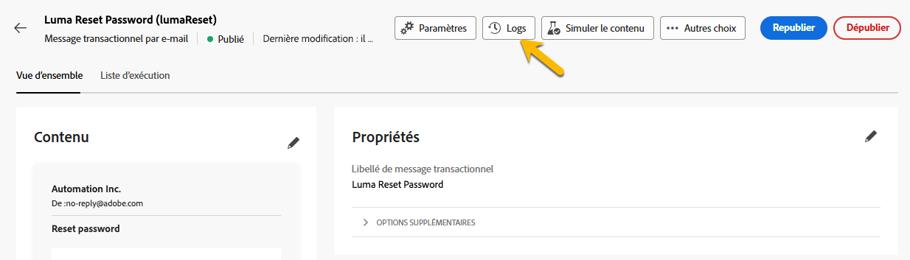

# Surveiller des messages transactionnels

Après avoir publié et envoyé votre message transactionnel, vous pouvez accéder aux rapports et aux journaux associés.

## Journaux de message transactionnel {#transactional-logs}

Une fois votre message publié, vérifiez son exécution en cliquant sur le bouton **[!UICONTROL Journaux]**.

{zoomable="yes"}

Vous pouvez ainsi accéder à des journaux détaillés sur la publication du message dans l’onglet **[!UICONTROL journaux]**.

{zoomable="yes"}

Vous pouvez également consulter la liste des **[!UICONTROL BAT]** envoyés avec leurs journaux dans l’onglet correspondant.

## Historique des messages transactionnels {#transactional-history}

Dans la section **[!UICONTROL Messages déclenchés]**, affichez les détails de tous les messages transactionnels exécutés. Pour y accéder, accédez à **[!UICONTROL Messages transactionnels]**. Dans l’onglet **[!UICONTROL Historique]**, consultez la liste des messages transactionnels exécutés avec leur statut et des informations supplémentaires.

{zoomable="yes"}

Recherchez votre message et cliquez dessus pour en afficher les détails.

{zoomable="yes"}

## Historique des événements {#event-history}

>[!CONTEXTUALHELP]
>id="acw_transacmessages_eventhistory"
>title="Historique des événements des messages transactionnels"
>abstract="Vous pouvez afficher les événements qui déclenchent votre message transactionnel."

>[!CONTEXTUALHELP]
>id="acw_transacmessages_eventhistory_preview"
>title="Prévisualisation de l’historique des événements des messages transactionnels"
>abstract="Vous pouvez afficher les événements qui déclenchent votre message transactionnel."

Vous pouvez afficher les événements qui déclenchent votre message transactionnel. Pour y accéder, accédez à la section **[!UICONTROL Historique des événements]**.

Les événements s’affichent avec leur nom de type d’événement.

{zoomable="yes"}

Cliquez sur l’identifiant **[!UICONTROL Événement]** pour plus d’informations, notamment :

* Coordonnées
* Informations sur les dates de traitement

Prévisualisez le message envoyé à l’aide du bouton **[!UICONTROL Prévisualisation]** et visualisez les données reçues qui ont déclenché le message à l’aide du bouton **[!UICONTROL Afficher les données]**.

{zoomable="yes"}

Le bouton **[!UICONTROL Plus]** vous permet de supprimer l’historique des événements.