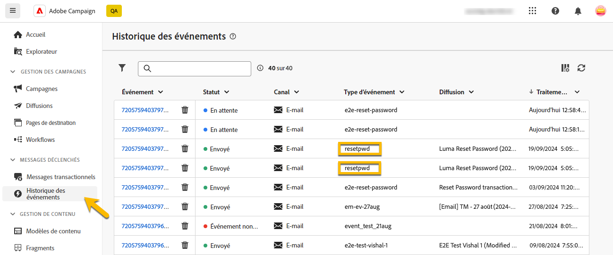
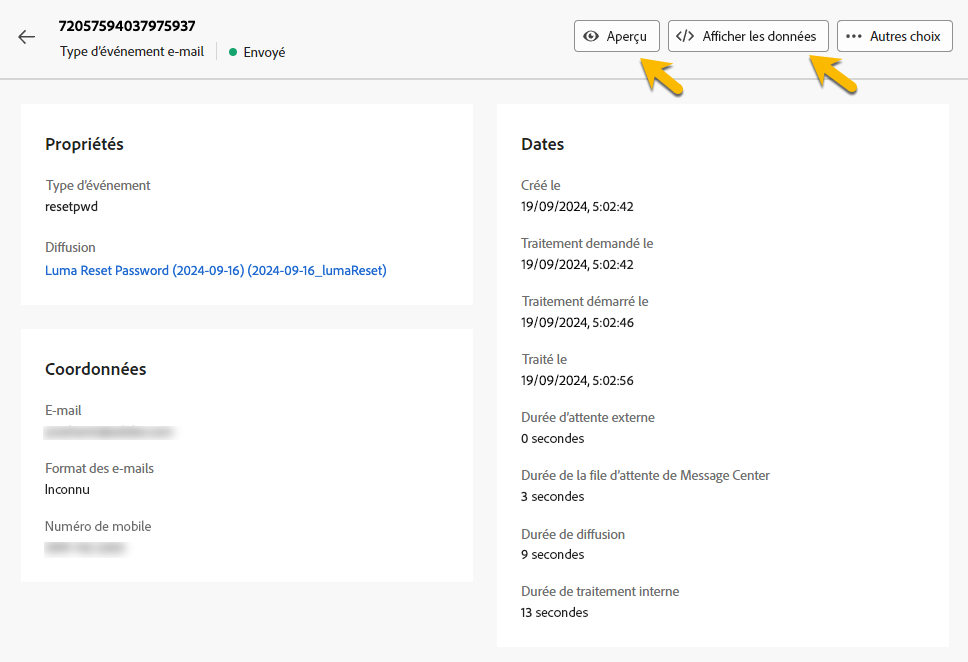

# Surveillance des messages transactionnels

Après la publication et l’envoi de votre message transactionnel, vous pouvez avoir des rapports et des logs à son sujet.

## Journaux des messages transactionnels {#transactional-logs}

Une fois votre message publié, vous pouvez vérifier son exécution en cliquant sur le bouton **[!UICONTROL Logs]** .

{zoomable="yes"}

Vous avez ainsi accès aux logs détaillés sur la publication du message dans l&#39;onglet **[!UICONTROL logs]** .

{zoomable="yes"}

De plus, vous pouvez afficher la liste des **[!UICONTROL Bons à tirer]** envoyés avec leurs logs, dans l’onglet correspondant.

## Historique des messages transactionnels {#transactional-history}

Dans la section **[!UICONTROL Messages déclenchés]** , vous pouvez afficher des détails sur tous les messages transactionnels qui ont été exécutés. Pour y accéder, accédez à **[!UICONTROL Messages transactionnels]**. Dans l’onglet **[!UICONTROL Historique]**, vous pouvez voir la liste des messages transactionnels exécutés, ainsi que leur statut et des informations supplémentaires.

{zoomable="yes"}

Faites une recherche là-bas pour trouver votre message et cliquez dessus.
Vous pouvez y voir les détails.

{zoomable="yes"}

## Historique des événements {#event-history}

>[!CONTEXTUALHELP]
>id="acw_transacmessages_eventhistory"
>title="Historique des événements pour les messages transactionnels"
>abstract="Vous pouvez obtenir un aperçu des événements déclenchant vos messages transactionnels."

>[!CONTEXTUALHELP]
>id="acw_transacmessages_eventhistory_preview"
>title="Aperçu de l’historique des événements pour les messages transactionnels"
>abstract="Vous pouvez obtenir un aperçu des événements déclenchant vos messages transactionnels."

Vous pouvez également disposer d’une vue sur les événements qui déclenchent votre message transactionnel.
Pour les voir, accédez à la section **[!UICONTROL Historique des événements]** .

Vous pouvez les voir avec le nom du type d’événement.

{zoomable="yes"}

Pour plus d’informations, cliquez sur l’ID **[!UICONTROL Event]** :

* Les coordonnées
* Tout sur les dates de processus

Vous pouvez même avoir un aperçu du message envoyé avec le bouton **[!UICONTROL Aperçu]** et voir les données reçues qui déclenchent le message avec le bouton **[!UICONTROL Afficher les données]** .

{zoomable="yes"}

Le bouton **[!UICONTROL Plus]** vous permet de supprimer l’historique des événements.
